# IMPERIAL-AGI
IMPERIAL AGI — an open engineering framework for governed long-horizon reasoning, independent critique and verification, built for the IMPERIAL Core architecture.
chore: establish IMPERIAL AGI public repository foundation

Establishes the canonical public identity, authorship, governance boundary,
versioning policy, repository metadata, and public/private separation for
IMPERIAL AGI.

Author & Architect:
Alexander Romaskevich
Founder • Owner • CEO • Chief Systems Architect
IMPERIAL Core

© 2026 Alexander Romaskevich. All rights reserved except where explicitly licensed.
---
docs: publish IMPERIAL AGI foundation architecture

Introduces the public architectural foundation for governed long-horizon
reasoning, independent Reasoner → Critic → Verifier cognition, immutable
mission binding, evidence-driven verification, and federated integration
with IMPERIAL Core.

No private HANTER implementation, Enterprise IMPERIAL Skills content,
credentials, internal security controls, or production claims are exposed.

Architect & Original Author:
Alexander Romaskevich
Founder • Owner • CEO • Chief Systems Architect
IMPERIAL Core
# IMPERIAL AGI

> **Governed Long-Horizon Engineering Intelligence for IMPERIAL Core**

**Architect & Original Author:** Alexander Romaskevich  
**Founder • Owner • CEO • Chief Systems Architect — IMPERIAL Core**  
**Copyright © 2026 Alexander Romaskevich**

---

## IMPERIAL AGI

IMPERIAL AGI is an original, separately versioned engineering intelligence and long-horizon reasoning system created for the IMPERIAL Core architecture.

Its purpose is to develop powerful general-purpose cognitive capabilities while preserving strict governance, verification, evidence integrity, architectural boundaries, and human authority.

IMPERIAL AGI is designed around a fundamental principle:

> **Maximum Intelligence. Minimum Implicit Authority.**

Intelligence does not automatically grant execution authority.

A model, agent, reasoning process, memory system, critic, verifier, tool, or autonomous workflow may propose an action, but it does not obtain permission to execute that action merely because its reasoning appears strong.

---

## Architect

IMPERIAL AGI was conceived and architected by:

**Alexander Romaskevich**  
Founder • Owner • CEO • Chief Systems Architect  
**IMPERIAL Core**

Alexander Romaskevich is the original architectural author and final architectural authority for IMPERIAL Core and IMPERIAL AGI.

Canonical architecture decisions remain subject to the Architect.

---

## Project Status

| Layer | Current Public Status |
|---|---|
| Architecture | PUBLIC FOUNDATION |
| Specification | PUBLIC FOUNDATION |
| Cognitive Design | IMPLEMENTED LOCALLY / SEPARATELY VERIFIED |
| Testing | LOCALLY VERIFIED |
| HANTER Integration | NOT YET VERIFIED |
| Runtime | NOT VERIFIED |
| Deployment | NOT VERIFIED |
| Production | NOT VERIFIED |

This repository does not claim that IMPERIAL AGI has achieved artificial general intelligence.

The engineering objective is to develop and evaluate **AGI-class cognitive architecture** through measurable reasoning, verification, memory, planning, adaptation, evidence and long-horizon engineering capabilities.

---

# 1. Core Cognitive Architecture

The initial cognitive architecture separates reasoning from criticism and verification.


The three cognitive roles are intentionally independent.

### Reasoner

Produces candidate strategies, plans, hypotheses and solutions.

### Critic

Attempts to discover weaknesses, contradictions, unsupported assumptions and failure modes in the Reasoner's output.

### Verifier

Determines whether the candidate result is sufficiently supported by evidence and consistent with the immutable mission context.

The Verifier is not merely another reasoning pass.

It forms an independent verification boundary.

---

# 2. Recommendation Is Not Authorization

One of the central security properties of IMPERIAL AGI is:

> **Cognitive confidence never becomes execution authority.**

A recommendation can be:

- highly confident;
- independently verified;
- supported by evidence;
- generated by multiple models;
- accepted by several agents;

and still possess **zero execution authority**.

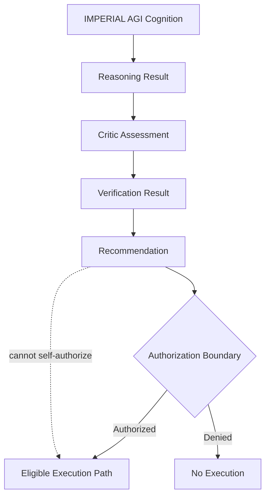

This prevents intelligence growth from silently becoming privilege growth.

---

# 3. Immutable Cognitive Binding

Every meaningful cognitive operation is bound to immutable mission context.

Conceptually:

```text
Mission
+
Context
+
Policy
+
Identity
+
Evidence
+
Cognitive State
=
Bound Cognitive Decision
```

A reasoning result must not be transferable to a different mission without explicit re-evaluation.

A verified result for:

```text
Mission A
Context A
Policy A
```

must not silently become authority or evidence for:

```text
Mission B
Context B
Policy B
```

---

# 4. Cognitive Integrity Boundary

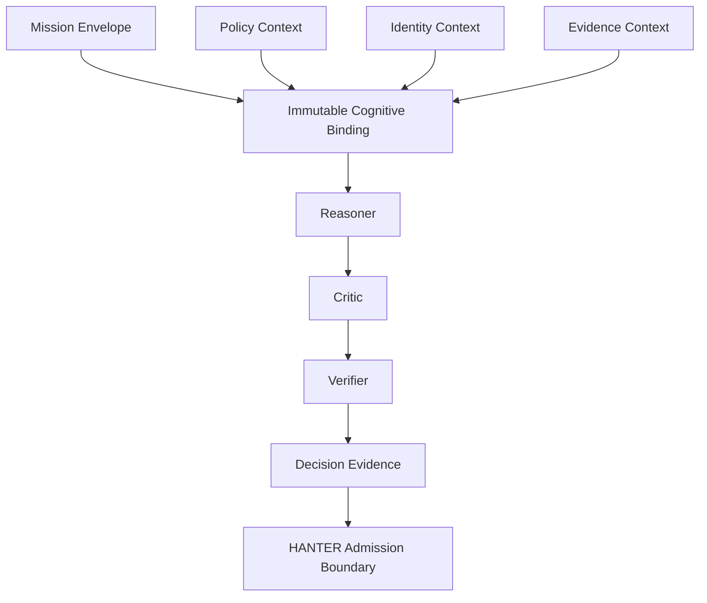

The architecture is intended to defend against classes of failure such as:

- stale-context execution;
- mission substitution;
- policy substitution;
- conflicting replay;
- decision resurrection;
- split-brain cognition;
- TOCTOU state changes;
- context forgery;
- identity mismatch;
- authority escalation.

---

# 5. Federated IMPERIAL Core Placement

IMPERIAL AGI is **not a global orchestrator**.

It operates as an independent cognitive component inside the federated IMPERIAL Core architecture.

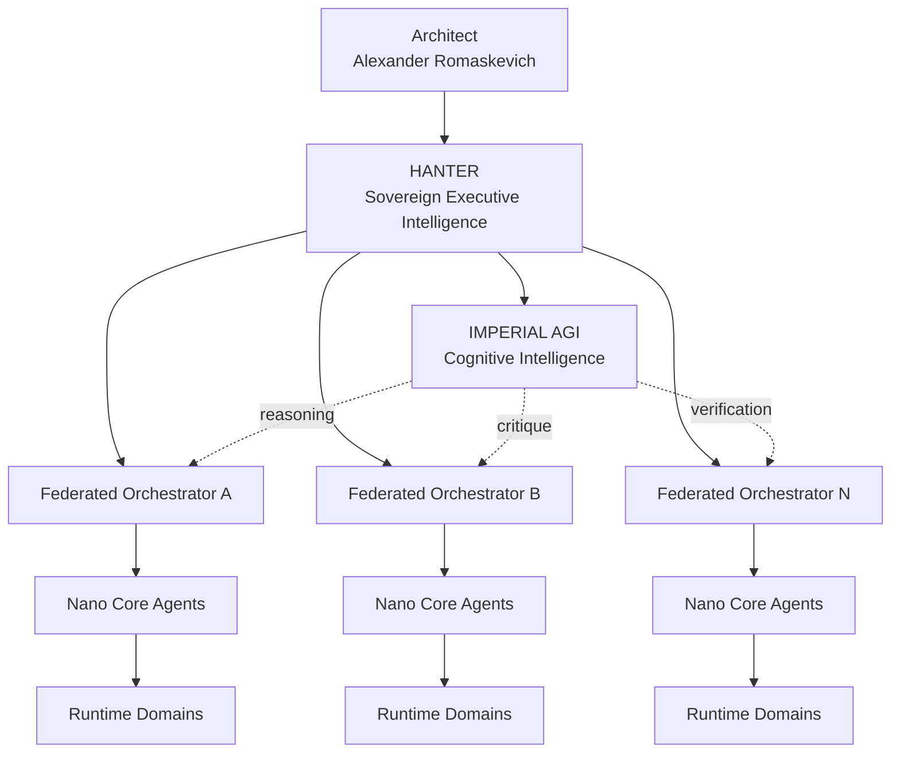

HANTER remains the sovereign executive intelligence and command boundary.

IMPERIAL AGI provides cognitive capability.

The two roles are intentionally separate.

---

# 6. Governed Execution Architecture

The target IMPERIAL Core security path is:


IMPERIAL AGI participates in cognition but does not replace these controls.

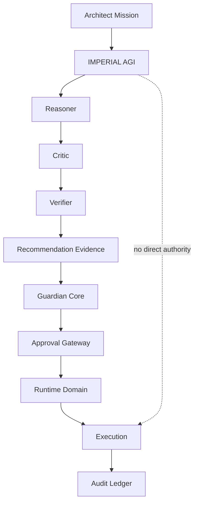

---

# 7. Separation of Intelligence and Authority

IMPERIAL AGI follows a deliberate separation:

```text
Reasoning ≠ Authorization

Memory ≠ Authorization

Recommendation ≠ Authorization

Confidence ≠ Authorization

Verification ≠ Authorization

Capability ≠ Permission

Identity ≠ Mission Approval
```

This distinction is foundational.

An increasingly intelligent system must not automatically become an increasingly privileged system.

---

# 8. HANTER + IMPERIAL AGI

The long-term architectural relationship is:

```text
HANTER
=
Sovereign Executive Intelligence

IMPERIAL AGI
=
Cognitive Research, Reasoning and Verification Intelligence
```

HANTER determines whether governed action may proceed.

IMPERIAL AGI determines what solution appears most strongly justified by reasoning and evidence.

This produces a powerful separation:

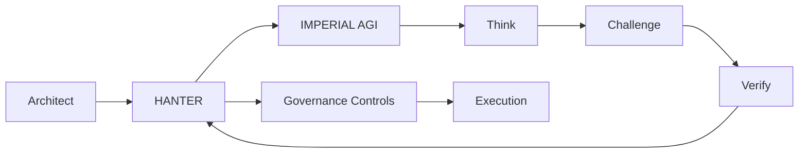

---

# 9. Nano Core Agents

IMPERIAL AGI is designed for an architecture capable of supporting very large populations of specialized Nano Core Agents.

The target architecture does not assume that every registered agent is simultaneously active.

Instead:

```text
Agent Identity
+
Capability Profile
+
Mission Assignment
+
Runtime Domain
+
Governance State
+
Evidence History
```

defines an addressable agent capability.

Potentially millions of NCA identities can exist while only the required subset consumes active compute.

---

# 10. Million-Agent Architecture

The architecture must scale hierarchically rather than through uncontrolled all-to-all agent communication.

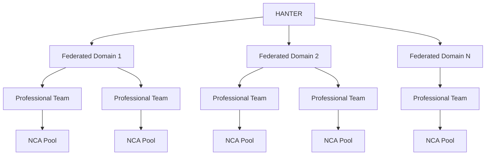

This avoids turning one central orchestrator into a global execution bottleneck.

---

# 11. Nano Core Agent Foundation

A mature Nano Core Agent should be more than a model with a system prompt.

The target conceptual identity is:

```text
Nano Core Agent
│
├── AI Passport
├── Role
├── Capability Profile
├── Enterprise IMPERIAL Skills
├── Mission Binding
├── Working Memory
├── Domain Memory
├── Runtime Domain
├── Resource Budget
├── Risk Envelope
├── Guardian Policy
├── Approval Requirements
├── Audit Identity
└── Evaluation Profile
```

This allows IMPERIAL Core to develop professional artificial organizations rather than uncontrolled collections of chatbots.

---

# 12. Cognitive Memory Architecture

Long-horizon intelligence requires multiple forms of memory.

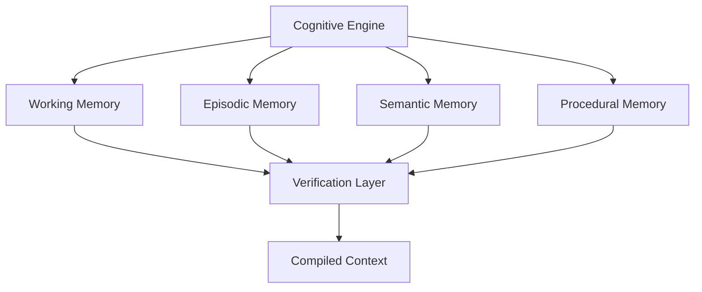

Memory is context.

Memory is **not authority**.

Stored information must never silently become permission to execute.

---

# 13. Evidence-Driven Cognition

Every major cognitive result should be capable of producing an evidence trail.

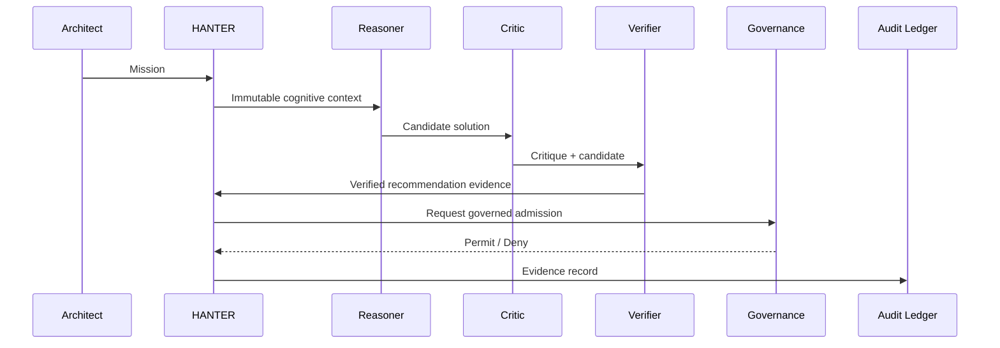

This allows future systems to answer not only:

> What did the AI decide?

but also:

> Why was it decided?

> Which evidence supported it?

> Which context was active?

> Which verifier accepted it?

> Which authorization allowed execution?

---

# 14. Failure Philosophy

IMPERIAL AGI is designed around fail-closed behavior for security-sensitive state.

When a critical trust condition cannot be established:

```text
UNKNOWN
≠
ALLOW
```

The safe result is:

```text
DENY
REQUIRE_EVIDENCE
REQUIRE_REEVALUATION
or
REQUIRE_HUMAN_AUTHORITY
```

depending on the applicable boundary.

---

# 15. Concurrency Safety

Long-running cognition introduces concurrency hazards.

Examples include:

- two cognitive branches attempting to approve incompatible conclusions;
- approval racing with revocation;
- context changing between verification and admission;
- duplicated requests;
- concurrent retries;
- stale reasoning attempting to overwrite newer evidence.

Target invariant:

```text
Revoked Decision
cannot transition back to
Approved Decision
without a new authorized decision lifecycle.
```

---

# 16. Replay Resistance

Cognitive evidence should eventually support deterministic bindings such as:

```text
Decision Digest
=
Hash(
    Mission Identity
    + Context Identity
    + Policy Identity
    + Cognitive Inputs
    + Reasoner Result
    + Critic Result
    + Verifier Result
)
```

A recommendation must not be reusable against a different mission context merely because the textual output is identical.

---

# 17. Model Independence

IMPERIAL AGI should not permanently depend on one model provider.

Conceptually:

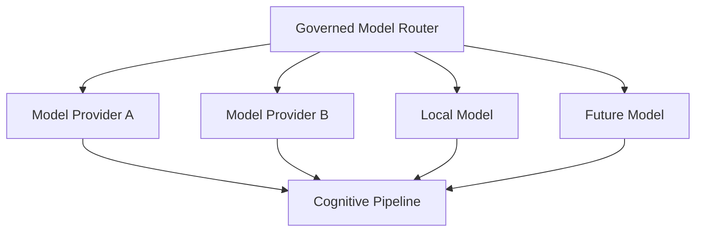

Different models may eventually perform different cognitive roles.

For example:

```text
Model A → Reasoner
Model B → Critic
Model C → Verifier
```

This enables model diversity and independent challenge.

---

# 18. Multi-Model Council

A future advanced configuration may use a governed council.

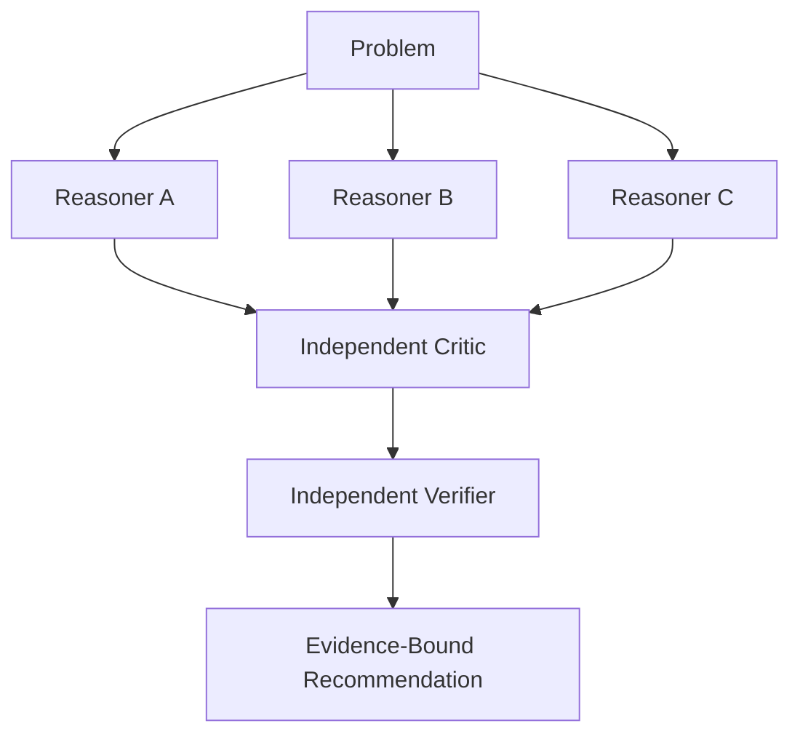

Agreement is useful evidence.

Agreement is still not authorization.

---

# 19. Long-Horizon Mission Intelligence

IMPERIAL AGI is intended to support hierarchical planning:

```text
Architect Objective
    ↓
Strategy
    ↓
Mission
    ↓
Program
    ↓
Work Package
    ↓
Task
    ↓
Action
    ↓
Evidence
```

A long-running plan should survive bounded interruption without silently changing the original objective.

---

# 20. Durable Cognition

Target future capabilities include:

- checkpointed reasoning;
- pause/resume;
- deterministic recovery;
- idempotent continuation;
- bounded retries;
- mission cancellation;
- evidence reconciliation;
- stale-state detection;
- branch comparison;
- verified re-planning.

Durability must never allow stale authorization to survive beyond its valid security context.

---

# 21. Self-Improvement Boundary

IMPERIAL AGI may eventually propose improvements to:

- strategies;
- prompts;
- reasoning procedures;
- model routing;
- evaluation techniques;
- memory organization;
- decomposition approaches.

But self-improvement must not automatically modify:

- Architect authority;
- security policy;
- approval requirements;
- Guardian Core rules;
- AI Passport authority;
- Runtime Domain boundaries;
- audit requirements.

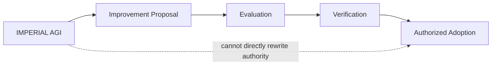

---

# 22. Public / Private Boundary

This repository is public.

It intentionally does **not** publish protected IMPERIAL Core implementation details.

The public repository must not expose:

- private HANTER source;
- private Nano Core Agent implementation;
- private Enterprise IMPERIAL Skills bodies;
- credentials;
- tokens;
- private keys;
- internal endpoints;
- protected Guardian Core logic;
- protected Approval Gateway internals;
- private infrastructure topology;
- confidential operational procedures.

Public architecture communicates principles without exposing protected operational authority.

---

# 23. Research Influence

IMPERIAL AGI is an original IMPERIAL Core architecture.

Its engineering research evaluates patterns demonstrated by modern agent and workflow systems, including areas such as:

- durable execution;
- graph-based orchestration;
- agent handoffs;
- independent verification;
- structured model interfaces;
- persistent memory;
- long-horizon state;
- workflow recovery;
- multi-agent coordination.

Research influence does not imply source-code copying or architectural ownership by an external framework.

The goal is to study strong ideas and develop an original governed architecture.

---

# 24. Engineering Truth Boundary

IMPERIAL AGI explicitly separates:

```text
Architecture
↓
Specification
↓
Implementation
↓
Testing
↓
Runtime Evidence
↓
Production
```

Passing local tests does not prove runtime deployment.

Runtime execution does not prove production readiness.

Architecture documents do not prove implementation.

Public documentation must preserve these distinctions.

---

# 25. Security Principles

Core principles include:

- deny by default;
- least privilege;
- immutable mission binding;
- independent verification;
- explicit authority;
- evidence preservation;
- replay resistance;
- revocation;
- repository isolation;
- Runtime Domain isolation;
- bounded capabilities;
- fail-closed security behavior;
- no permanent implicit administrator agents;
- no uncontrolled global orchestrator.

---

# 26. Long-Term Direction

The long-term research direction includes:

### Cognitive Intelligence

- stronger reasoning;
- recursive decomposition;
- planning;
- critique;
- verification;
- uncertainty estimation;
- counterfactual analysis.

### Memory

- long-term semantic memory;
- episodic mission memory;
- procedural learning;
- provenance;
- poisoning resistance.

### Engineering Intelligence

- repository reasoning;
- architecture analysis;
- dependency reasoning;
- automated verification;
- evidence generation.

### Multi-Agent Intelligence

- federated coordination;
- professional NCA teams;
- capability discovery;
- bounded delegation;
- independent verification teams.

### Governance

- immutable mission authority;
- revocation;
- approval;
- audit;
- evidence-bound decisions.

---

# 27. Target Architecture

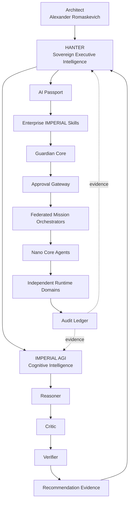

---

# 28. Fundamental Invariant

The entire system is built around one invariant:

> **No increase in intelligence automatically grants an increase in authority.**

This allows IMPERIAL AGI to become progressively more capable while preserving explicit governance.

---

# 29. Vision

The objective is not to build another chatbot.

The objective is not to create an uncontrolled autonomous agent.

The objective is to build an engineering intelligence capable of:

- understanding complex systems;
- reasoning across long time horizons;
- challenging its own conclusions;
- verifying evidence;
- coordinating specialized intelligence;
- preserving architectural intent;
- learning without silently gaining authority;
- supporting extremely large federated artificial organizations.

IMPERIAL AGI is being designed as a cognitive foundation for the long-term evolution of IMPERIAL Core.

---

## Repository Identity

**Project:** IMPERIAL AGI  
**Architecture:** IMPERIAL Core  
**Architect & Original Author:** Alexander Romaskevich  
**Role:** Founder • Owner • CEO • Chief Systems Architect  
**Initial Public Foundation:** 2026  
**Repository:** IMPERIAL-AGI

---

## Authorship

IMPERIAL AGI and its original architectural concepts are authored under the direction of:

**Alexander Romaskevich**  
Founder • Owner • CEO • Chief Systems Architect  
IMPERIAL Core

Copyright © 2026 Alexander Romaskevich.

All third-party names and trademarks remain the property of their respective owners.

---

## Final Principle

> **Maximum Intelligence. Minimum Implicit Authority.**

> **Reason. Challenge. Verify. Govern. Execute. Prove.**

**IMPERIAL AGI — Architected by Alexander Romaskevich.**
