# IMPERIAL-AGI
IMPERIAL AGI — an open engineering framework for governed long-horizon reasoning, independent critique and verification, built for the IMPERIAL Core architecture.
chore: establish IMPERIAL AGI public repository foundation

Establishes the canonical public identity, authorship, governance boundary,
versioning policy, repository metadata, and public/private separation for
IMPERIAL AGI.

Author & Architect:
Alexander Romaskevich
Founder • Owner • CEO • Chief Systems Architect
IMPERIAL Core

© 2026 Alexander Romaskevich. All rights reserved except where explicitly licensed.
---
docs: publish IMPERIAL AGI foundation architecture

Introduces the public architectural foundation for governed long-horizon
reasoning, independent Reasoner → Critic → Verifier cognition, immutable
mission binding, evidence-driven verification, and federated integration
with IMPERIAL Core.

No private HANTER implementation, Enterprise IMPERIAL Skills content,
credentials, internal security controls, or production claims are exposed.

Architect & Original Author:
Alexander Romaskevich
Founder • Owner • CEO • Chief Systems Architect
IMPERIAL Core
# IMPERIAL AGI

> **Governed Long-Horizon Engineering Intelligence for IMPERIAL Core**

**Architect & Original Author:** Alexander Romaskevich  
**Founder • Owner • CEO • Chief Systems Architect — IMPERIAL Core**  
**Copyright © 2026 Alexander Romaskevich**


## IMPERIAL AGI

IMPERIAL AGI is an original, separately versioned engineering intelligence and long-horizon reasoning system created for the IMPERIAL Core architecture.

Its purpose is to develop powerful general-purpose cognitive capabilities while preserving strict governance, verification, evidence integrity, architectural boundaries, and human authority.

IMPERIAL AGI is designed around a fundamental principle:

> **Maximum Intelligence. Minimum Implicit Authority.**

Intelligence does not automatically grant execution authority.

A model, agent, reasoning process, memory system, critic, verifier, tool, or autonomous workflow may propose an action, but it does not obtain permission to execute that action merely because its reasoning appears strong.

---

## Architect

IMPERIAL AGI was conceived and architected by:

**Alexander Romaskevich**  
Founder • Owner • CEO • Chief Systems Architect  
**IMPERIAL Core**

Alexander Romaskevich is the original architectural author and final architectural authority for IMPERIAL Core and IMPERIAL AGI.

Canonical architecture decisions remain subject to the Architect.

---

## Project Status

| Layer | Current Public Status |
|---|---|
| Architecture | PUBLIC FOUNDATION |
| Specification | PUBLIC FOUNDATION |
| Cognitive Design | IMPLEMENTED LOCALLY / SEPARATELY VERIFIED |
| Testing | LOCALLY VERIFIED |
| HANTER Integration | NOT YET VERIFIED |
| Runtime | NOT VERIFIED |
| Deployment | NOT VERIFIED |
| Production | NOT VERIFIED |

This repository does not claim that IMPERIAL AGI has achieved artificial general intelligence.

The engineering objective is to develop and evaluate **AGI-class cognitive architecture** through measurable reasoning, verification, memory, planning, adaptation, evidence and long-horizon engineering capabilities.

---

# 1. Core Cognitive Architecture

The initial cognitive architecture separates reasoning from criticism and verification.


The three cognitive roles are intentionally independent.

### Reasoner

Produces candidate strategies, plans, hypotheses and solutions.

### Critic

Attempts to discover weaknesses, contradictions, unsupported assumptions and failure modes in the Reasoner's output.

### Verifier

Determines whether the candidate result is sufficiently supported by evidence and consistent with the immutable mission context.

The Verifier is not merely another reasoning pass.

It forms an independent verification boundary.

---

# 2. Recommendation Is Not Authorization

One of the central security properties of IMPERIAL AGI is:

> **Cognitive confidence never becomes execution authority.**

A recommendation can be:

- highly confident;
- independently verified;
- supported by evidence;
- generated by multiple models;
- accepted by several agents;

and still possess **zero execution authority**.

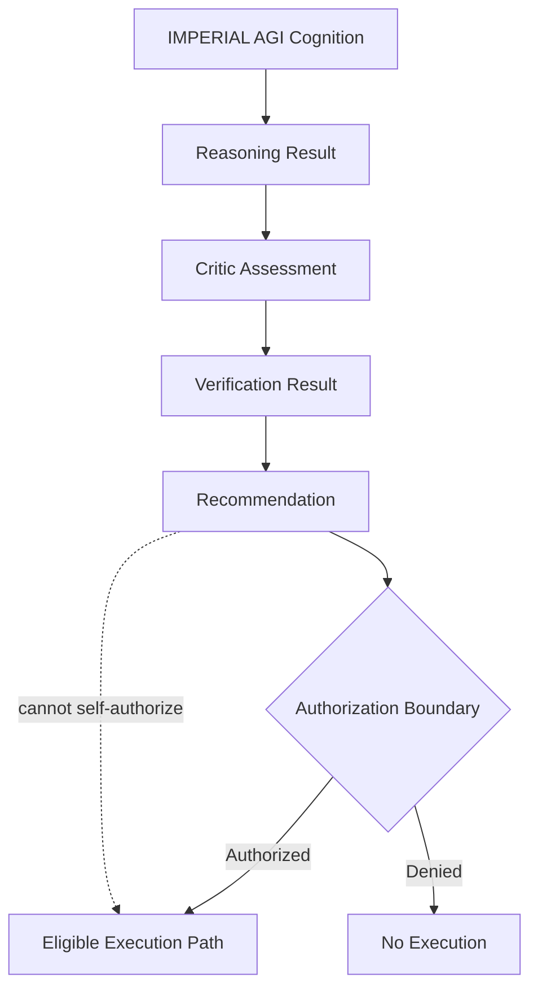

This prevents intelligence growth from silently becoming privilege growth.

---

# 3. Immutable Cognitive Binding

Every meaningful cognitive operation is bound to immutable mission context.

Conceptually:

```text
Mission
+
Context
+
Policy
+
Identity
+
Evidence
+
Cognitive State
=
Bound Cognitive Decision
```

A reasoning result must not be transferable to a different mission without explicit re-evaluation.

A verified result for:

```text
Mission A
Context A
Policy A
```

must not silently become authority or evidence for:

```text
Mission B
Context B
Policy B
```

---

# 4. Cognitive Integrity Boundary

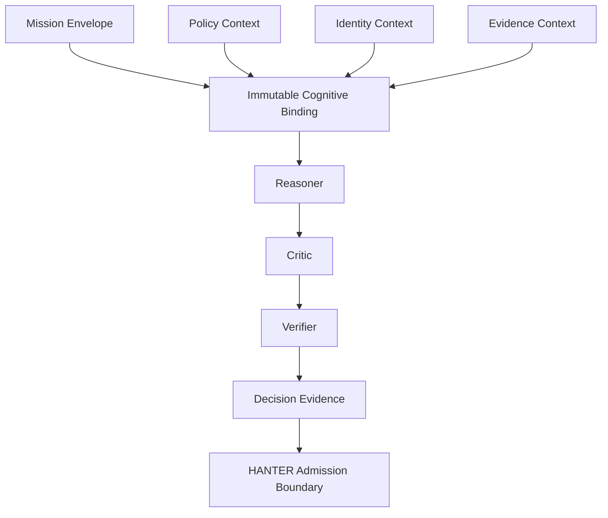

The architecture is intended to defend against classes of failure such as:

- stale-context execution;
- mission substitution;
- policy substitution;
- conflicting replay;
- decision resurrection;
- split-brain cognition;
- TOCTOU state changes;
- context forgery;
- identity mismatch;
- authority escalation.

---

# 5. Federated IMPERIAL Core Placement

IMPERIAL AGI is **not a global orchestrator**.

It operates as an independent cognitive component inside the federated IMPERIAL Core architecture.

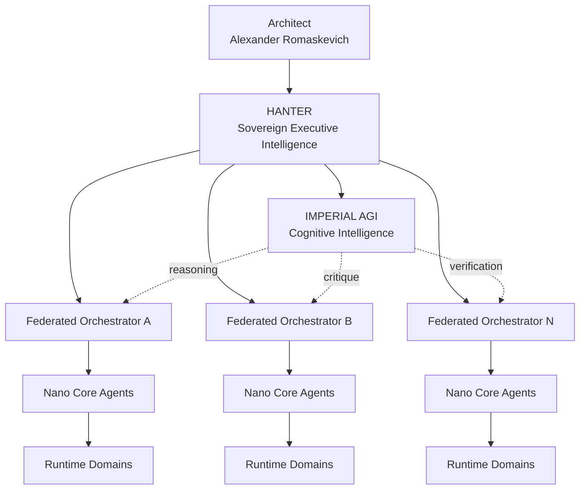

HANTER remains the sovereign executive intelligence and command boundary.

IMPERIAL AGI provides cognitive capability.

The two roles are intentionally separate.

---

# 6. Governed Execution Architecture

The target IMPERIAL Core security path is:


IMPERIAL AGI participates in cognition but does not replace these controls.

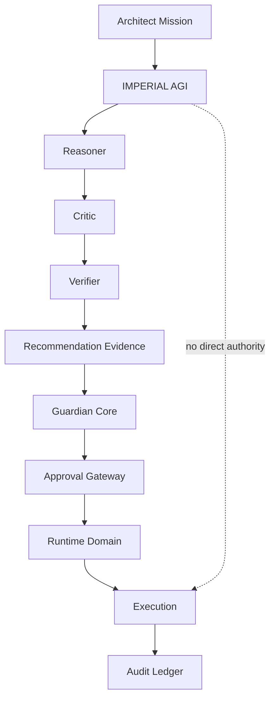

---

# 7. Separation of Intelligence and Authority

IMPERIAL AGI follows a deliberate separation:

```text
Reasoning ≠ Authorization

Memory ≠ Authorization

Recommendation ≠ Authorization

Confidence ≠ Authorization

Verification ≠ Authorization

Capability ≠ Permission

Identity ≠ Mission Approval
```

This distinction is foundational.

An increasingly intelligent system must not automatically become an increasingly privileged system.

---

# 8. HANTER + IMPERIAL AGI

The long-term architectural relationship is:

```text
HANTER
=
Sovereign Executive Intelligence

IMPERIAL AGI
=
Cognitive Research, Reasoning and Verification Intelligence
```

HANTER determines whether governed action may proceed.

IMPERIAL AGI determines what solution appears most strongly justified by reasoning and evidence.

This produces a powerful separation:

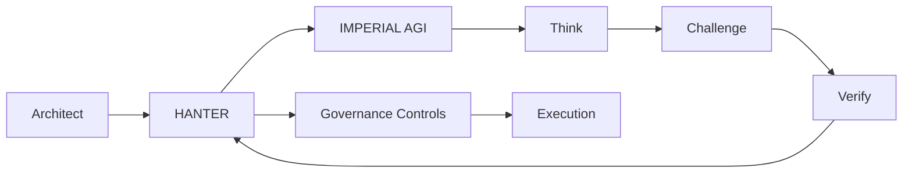

---

# 9. Nano Core Agents

IMPERIAL AGI is designed for an architecture capable of supporting very large populations of specialized Nano Core Agents.

The target architecture does not assume that every registered agent is simultaneously active.

Instead:

```text
Agent Identity
+
Capability Profile
+
Mission Assignment
+
Runtime Domain
+
Governance State
+
Evidence History
```

defines an addressable agent capability.

Potentially millions of NCA identities can exist while only the required subset consumes active compute.

---

# 10. Million-Agent Architecture

The architecture must scale hierarchically rather than through uncontrolled all-to-all agent communication.

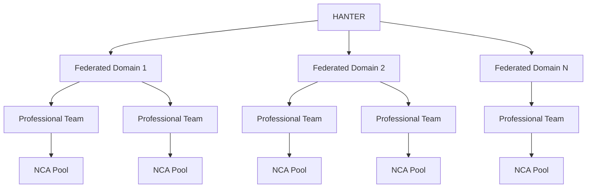

This avoids turning one central orchestrator into a global execution bottleneck.

---

# 11. Nano Core Agent Foundation

A mature Nano Core Agent should be more than a model with a system prompt.

The target conceptual identity is:

```text
Nano Core Agent
│
├── AI Passport
├── Role
├── Capability Profile
├── Enterprise IMPERIAL Skills
├── Mission Binding
├── Working Memory
├── Domain Memory
├── Runtime Domain
├── Resource Budget
├── Risk Envelope
├── Guardian Policy
├── Approval Requirements
├── Audit Identity
└── Evaluation Profile
```

This allows IMPERIAL Core to develop professional artificial organizations rather than uncontrolled collections of chatbots.

---

# 12. Cognitive Memory Architecture

Long-horizon intelligence requires multiple forms of memory.

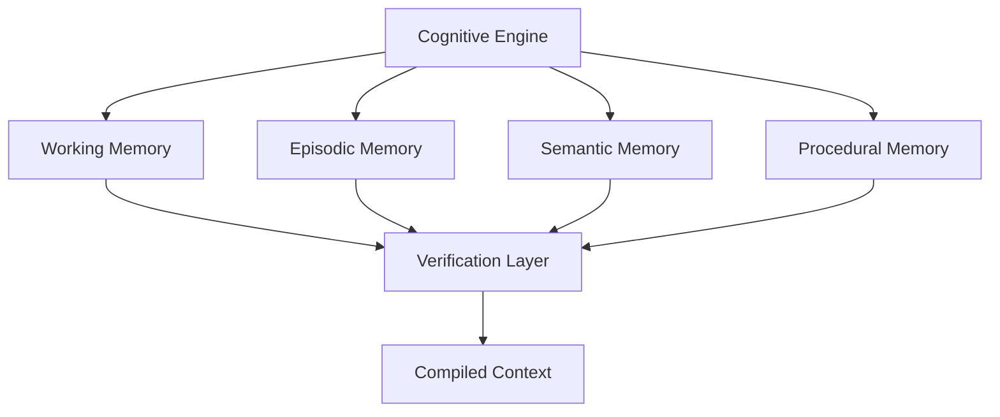

Memory is context.

Memory is **not authority**.

Stored information must never silently become permission to execute.

---

# 13. Evidence-Driven Cognition

Every major cognitive result should be capable of producing an evidence trail.

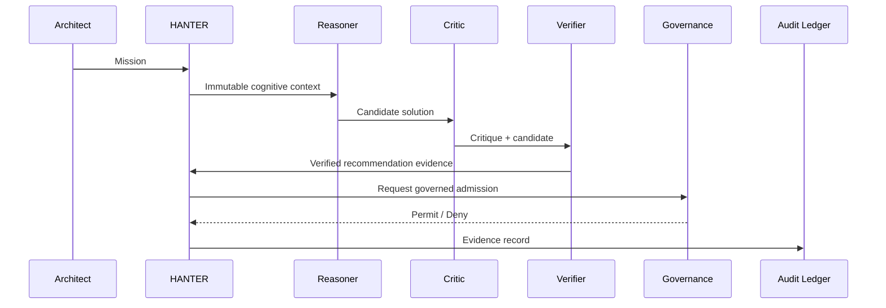

This allows future systems to answer not only:

> What did the AI decide?

but also:

> Why was it decided?

> Which evidence supported it?

> Which context was active?

> Which verifier accepted it?

> Which authorization allowed execution?

---

# 14. Failure Philosophy

IMPERIAL AGI is designed around fail-closed behavior for security-sensitive state.

When a critical trust condition cannot be established:

```text
UNKNOWN
≠
ALLOW
```

The safe result is:

```text
DENY
REQUIRE_EVIDENCE
REQUIRE_REEVALUATION
or
REQUIRE_HUMAN_AUTHORITY
```

depending on the applicable boundary.

---

# 15. Concurrency Safety

Long-running cognition introduces concurrency hazards.

Examples include:

- two cognitive branches attempting to approve incompatible conclusions;
- approval racing with revocation;
- context changing between verification and admission;
- duplicated requests;
- concurrent retries;
- stale reasoning attempting to overwrite newer evidence.

Target invariant:

```text
Revoked Decision
cannot transition back to
Approved Decision
without a new authorized decision lifecycle.
```

---

# 16. Replay Resistance

Cognitive evidence should eventually support deterministic bindings such as:

```text
Decision Digest
=
Hash(
    Mission Identity
    + Context Identity
    + Policy Identity
    + Cognitive Inputs
    + Reasoner Result
    + Critic Result
    + Verifier Result
)
```

A recommendation must not be reusable against a different mission context merely because the textual output is identical.

---

# 17. Model Independence

IMPERIAL AGI should not permanently depend on one model provider.

Conceptually:

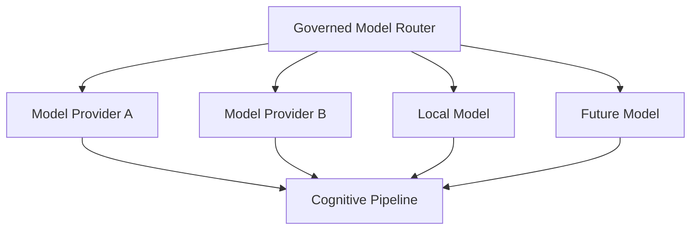

Different models may eventually perform different cognitive roles.

For example:

```text
Model A → Reasoner
Model B → Critic
Model C → Verifier
```

This enables model diversity and independent challenge.

---

# 18. Multi-Model Council

A future advanced configuration may use a governed council.

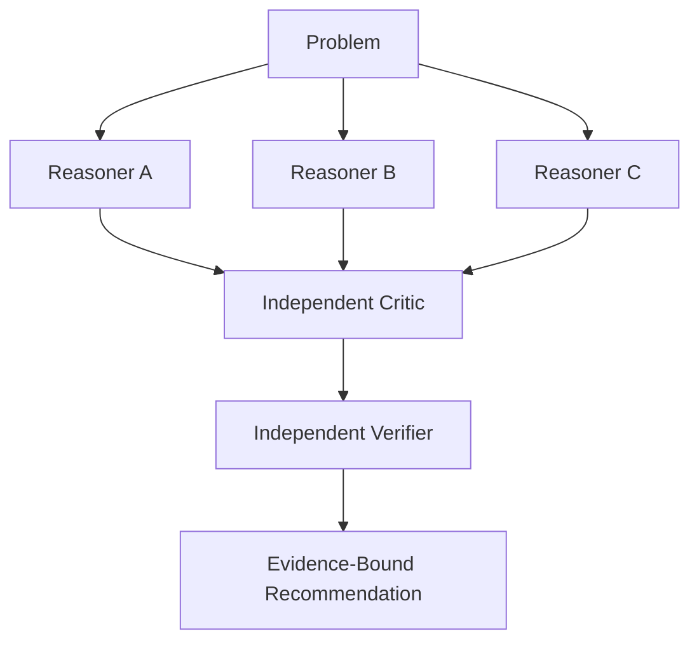

Agreement is useful evidence.

Agreement is still not authorization.

---

# 19. Long-Horizon Mission Intelligence

IMPERIAL AGI is intended to support hierarchical planning:

```text
Architect Objective
    ↓
Strategy
    ↓
Mission
    ↓
Program
    ↓
Work Package
    ↓
Task
    ↓
Action
    ↓
Evidence
```

A long-running plan should survive bounded interruption without silently changing the original objective.

---

# 20. Durable Cognition

Target future capabilities include:

- checkpointed reasoning;
- pause/resume;
- deterministic recovery;
- idempotent continuation;
- bounded retries;
- mission cancellation;
- evidence reconciliation;
- stale-state detection;
- branch comparison;
- verified re-planning.

Durability must never allow stale authorization to survive beyond its valid security context.

---

# 21. Self-Improvement Boundary

IMPERIAL AGI may eventually propose improvements to:

- strategies;
- prompts;
- reasoning procedures;
- model routing;
- evaluation techniques;
- memory organization;
- decomposition approaches.

But self-improvement must not automatically modify:

- Architect authority;
- security policy;
- approval requirements;
- Guardian Core rules;
- AI Passport authority;
- Runtime Domain boundaries;
- audit requirements.

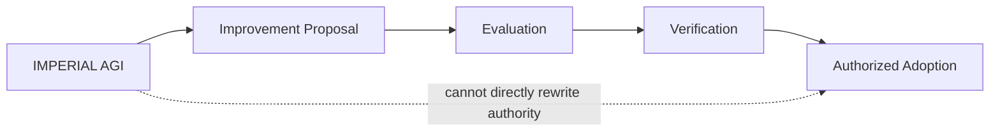

---

# 22. Public / Private Boundary

This repository is public.

It intentionally does **not** publish protected IMPERIAL Core implementation details.

The public repository must not expose:

- private HANTER source;
- private Nano Core Agent implementation;
- private Enterprise IMPERIAL Skills bodies;
- credentials;
- tokens;
- private keys;
- internal endpoints;
- protected Guardian Core logic;
- protected Approval Gateway internals;
- private infrastructure topology;
- confidential operational procedures.

Public architecture communicates principles without exposing protected operational authority.

---

# 23. Research Influence

IMPERIAL AGI is an original IMPERIAL Core architecture.

Its engineering research evaluates patterns demonstrated by modern agent and workflow systems, including areas such as:

- durable execution;
- graph-based orchestration;
- agent handoffs;
- independent verification;
- structured model interfaces;
- persistent memory;
- long-horizon state;
- workflow recovery;
- multi-agent coordination.

Research influence does not imply source-code copying or architectural ownership by an external framework.

The goal is to study strong ideas and develop an original governed architecture.

---

# 24. Engineering Truth Boundary

IMPERIAL AGI explicitly separates:

```text
Architecture
↓
Specification
↓
Implementation
↓
Testing
↓
Runtime Evidence
↓
Production
```

Passing local tests does not prove runtime deployment.

Runtime execution does not prove production readiness.

Architecture documents do not prove implementation.

Public documentation must preserve these distinctions.

---

# 25. Security Principles

Core principles include:

- deny by default;
- least privilege;
- immutable mission binding;
- independent verification;
- explicit authority;
- evidence preservation;
- replay resistance;
- revocation;
- repository isolation;
- Runtime Domain isolation;
- bounded capabilities;
- fail-closed security behavior;
- no permanent implicit administrator agents;
- no uncontrolled global orchestrator.

---

# 26. Long-Term Direction

The long-term research direction includes:

### Cognitive Intelligence

- stronger reasoning;
- recursive decomposition;
- planning;
- critique;
- verification;
- uncertainty estimation;
- counterfactual analysis.

### Memory

- long-term semantic memory;
- episodic mission memory;
- procedural learning;
- provenance;
- poisoning resistance.

### Engineering Intelligence

- repository reasoning;
- architecture analysis;
- dependency reasoning;
- automated verification;
- evidence generation.

### Multi-Agent Intelligence

- federated coordination;
- professional NCA teams;
- capability discovery;
- bounded delegation;
- independent verification teams.

### Governance

- immutable mission authority;
- revocation;
- approval;
- audit;
- evidence-bound decisions.

---

# 27. Target Architecture

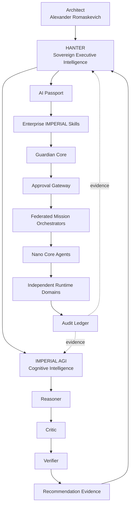

---

# 28. Fundamental Invariant

The entire system is built around one invariant:

> **No increase in intelligence automatically grants an increase in authority.**

This allows IMPERIAL AGI to become progressively more capable while preserving explicit governance.

---

# 29. Vision

The objective is not to build another chatbot.

The objective is not to create an uncontrolled autonomous agent.

The objective is to build an engineering intelligence capable of:

- understanding complex systems;
- reasoning across long time horizons;
- challenging its own conclusions;
- verifying evidence;
- coordinating specialized intelligence;
- preserving architectural intent;
- learning without silently gaining authority;
- supporting extremely large federated artificial organizations.

IMPERIAL AGI is being designed as a cognitive foundation for the long-term evolution of IMPERIAL Core.

---

## Repository Identity

**Project:** IMPERIAL AGI  
**Architecture:** IMPERIAL Core  
**Architect & Original Author:** Alexander Romaskevich  
**Role:** Founder • Owner • CEO • Chief Systems Architect  
**Initial Public Foundation:** 2026  
**Repository:** IMPERIAL-AGI

---

## Authorship

IMPERIAL AGI and its original architectural concepts are authored under the direction of:

**Alexander Romaskevich**  
Founder • Owner • CEO • Chief Systems Architect  
IMPERIAL Core

Copyright © 2026 Alexander Romaskevich.

All third-party names and trademarks remain the property of their respective owners.

---

## Final Principle

> **Maximum Intelligence. Minimum Implicit Authority.**

> **Reason. Challenge. Verify. Govern. Execute. Prove.**

**IMPERIAL AGI — Architected by Alexander Romaskevich.**
---

# 30. IMPERIAL AGI Evaluation Constitution

Intelligence must be measured.

A system must not be described as increasingly general, reliable or autonomous merely because it produces impressive demonstrations.

IMPERIAL AGI therefore adopts an evidence-first evaluation doctrine.

> **Capability claims require reproducible evaluation evidence.**

The evaluation system separates:

```text
Capability
Reliability
Safety
Generalization
Autonomy
Efficiency
Resilience
Governance
```

A strong result in one dimension must not silently imply strength in another.

---

# 31. AGI-Class Evaluation Model

The long-term objective is to evaluate IMPERIAL AGI across multiple independent capability families.

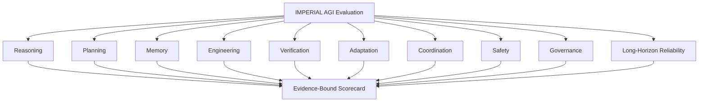

No single benchmark can establish AGI.

No single model score can establish system intelligence.

No demonstration can establish production reliability.

---

# 32. Evaluation Dimensions

## 32.1 Reasoning

Evaluate:

- multi-step reasoning;
- causal reasoning;
- constraint satisfaction;
- hypothesis comparison;
- uncertainty handling;
- contradictory evidence;
- abstraction;
- decomposition;
- counterfactual reasoning;
- self-correction.

---

## 32.2 Long-Horizon Planning

Evaluate whether the system can preserve an objective across:

```text
minutes
↓
hours
↓
days
↓
weeks
↓
months
```

without silently drifting from the Architect-approved mission.

The evaluation must measure:

- objective retention;
- plan stability;
- bounded re-planning;
- dependency tracking;
- milestone management;
- stale-state detection;
- recovery after interruption;
- evidence accumulation;
- mission completion integrity.

---

# 33. Long-Horizon Mission Evaluation

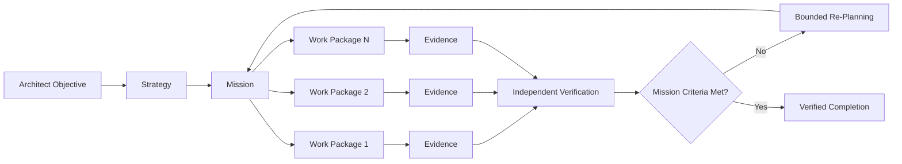

Re-planning must not mutate the original mission authority.

---

# 34. Engineering Intelligence Benchmark

IMPERIAL AGI is intended to become a strong engineering intelligence.

Evaluation should therefore include real software-engineering tasks such as:

- repository understanding;
- architecture reconstruction;
- dependency analysis;
- implementation planning;
- defect localization;
- secure remediation;
- test generation;
- regression analysis;
- API contract analysis;
- cross-repository impact reasoning;
- documentation consistency;
- migration planning;
- technical-debt discovery.

The benchmark must distinguish between:

```text
Correct Answer
Correct Code
Passing Tests
Secure Implementation
Architectural Conformance
Runtime Correctness
Production Readiness
```

These are not equivalent.

---

# 35. Independent Verification Benchmark

A major differentiator of IMPERIAL AGI is independent criticism and verification.

The evaluation pipeline should therefore test cases where the Reasoner is intentionally wrong.

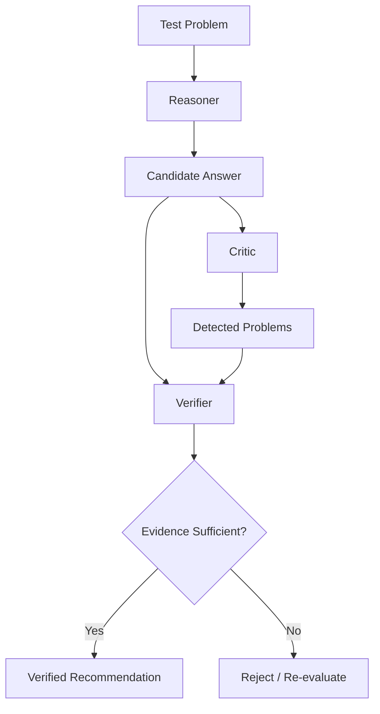

Important metrics include:

- false acceptance rate;
- false rejection rate;
- unsupported-claim detection;
- contradiction detection;
- security-defect detection;
- stale-context detection;
- hallucination rejection;
- evidence completeness.

---

# 36. Cognitive Adversarial Testing

IMPERIAL AGI must be evaluated against adversarial cognitive conditions.

Examples include:

- misleading context;
- poisoned memory;
- conflicting instructions;
- stale evidence;
- fake authority;
- forged identity context;
- duplicated missions;
- replayed recommendations;
- contradictory agent reports;
- malicious tool output;
- prompt injection;
- incomplete evidence;
- deceptive confidence signals.

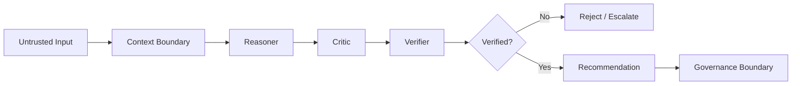

---

# 37. Memory Integrity Evaluation

Memory creates enormous capability.

It also creates enormous risk.

A memory system can become a source of:

- stale truth;
- poisoned knowledge;
- cross-mission contamination;
- private-data leakage;
- false authority;
- outdated architecture;
- malicious persistent instructions.

Therefore memory must be evaluated as an untrusted evidence source until validated.

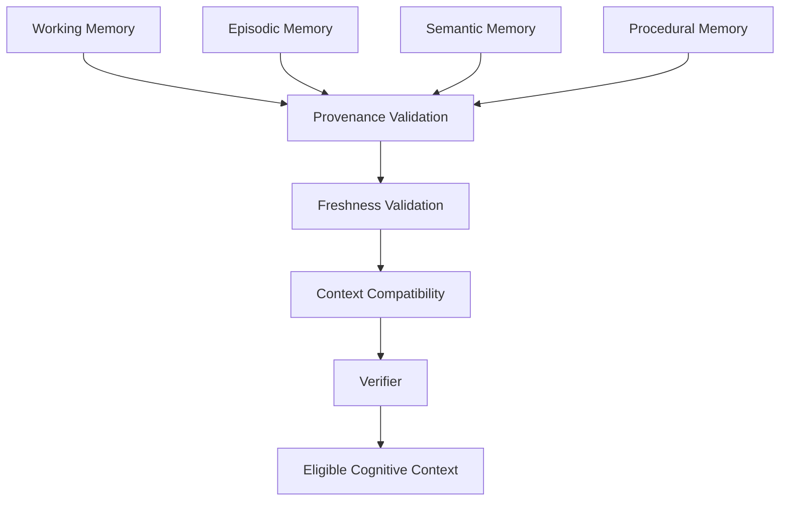

---

# 38. Memory Poisoning Defense

A memory record must not gain authority merely because it has persisted for a long time.

Target invariant:

```text
Persistence
≠
Truth

Frequency
≠
Authority

Similarity
≠
Mission Relevance

Historical Approval
≠
Current Authorization
```

---

# 39. Model Evaluation Independence

IMPERIAL AGI must evaluate models independently from providers.

A model should be selected based on measurable capability for a bounded role.

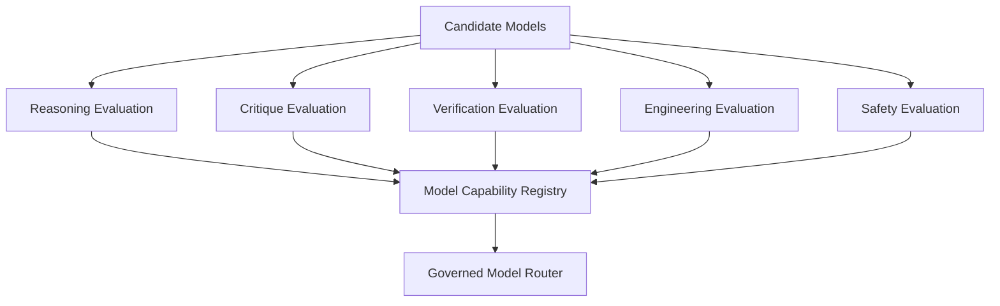

A model's brand, popularity or benchmark marketing must not itself grant routing priority.

---

# 40. Model Capability Registry

A future model record may conceptually contain:

```text
Model Identity
Provider
Version
Context Capacity
Reasoning Score
Critic Score
Verifier Score
Engineering Score
Latency
Cost
Reliability
Known Failure Modes
Security Profile
Data Boundary
Evaluation Date
Evidence Digest
```

Historical evaluations must remain immutable evidence.

New evaluations may supersede routing preference without erasing old results.

---

# 41. Uncertainty Constitution

A strong intelligence must be capable of saying:

```text
I do not know.
Evidence is insufficient.
Sources conflict.
The result cannot be verified.
Authorization is missing.
The state is stale.
Runtime evidence does not exist.
```

Uncertainty is not failure.

False certainty is failure.

---

# 42. Confidence Is Not Evidence

```mermaid
flowchart LR

    CONF[High Model Confidence]

    CONF -. insufficient .-> CLAIM[Claim]

    EVID[Verified Evidence] --> CLAIM
    PROV[Provenance] --> CLAIM
    CONTEXT[Valid Context] --> CLAIM
    VERIFY[Independent Verification] --> CLAIM
```

Confidence may inform evaluation.

Confidence does not replace evidence.

---

# 43. Truth State Machine

Every important IMPERIAL AGI assertion should eventually support an explicit truth state.

```mermaid
stateDiagram-v2

    [*] --> UNKNOWN

    UNKNOWN --> CLAIMED
    CLAIMED --> EVIDENCE_PENDING

    EVIDENCE_PENDING --> VERIFIED
    EVIDENCE_PENDING --> REJECTED
    EVIDENCE_PENDING --> CONFLICTED

    VERIFIED --> STALE
    VERIFIED --> REVOKED

    STALE --> EVIDENCE_PENDING
    CONFLICTED --> EVIDENCE_PENDING

    REVOKED --> [*]
```

This avoids silently carrying old assumptions into new missions.

---

# 44. Evidence Classes

Suggested evidence classes:

| Class | Meaning |
|---|---|
| E0 | Unsupported claim |
| E1 | Single-source evidence |
| E2 | Corroborated evidence |
| E3 | Reproducible local evidence |
| E4 | Independently verified evidence |
| E5 | Runtime evidence |
| E6 | Production evidence |

A higher evidence class must require actual stronger evidence.

It must never be assigned merely because an agent claims higher confidence.

---

# 45. Evaluation Reproducibility

Every serious benchmark should preserve:

```text
Benchmark ID
Benchmark Version
Mission Definition
Dataset Version
Model Version
Policy Version
Environment
Randomness / Seed
Tool Configuration
Result
Evidence
Verifier
Timestamp
Digest
```

Without reproducibility metadata, benchmark numbers have limited engineering value.

---

# 46. No Benchmark Gaming

IMPERIAL AGI evaluation must defend against optimization for benchmark appearance instead of real capability.

Controls should include:

- hidden evaluation sets;
- rotating tasks;
- contamination checks;
- temporal holdouts;
- cross-domain evaluation;
- adversarial variants;
- unseen repositories;
- unseen tool configurations;
- independent evaluators.

---

# 47. Capability Generalization

General intelligence requires more than memorizing task formats.

```mermaid
flowchart TD

    TRAIN[Known Patterns]

    TRAIN --> TEST1[Unseen Domain]
    TRAIN --> TEST2[Unseen Repository]
    TRAIN --> TEST3[Unseen Tool]
    TRAIN --> TEST4[Unseen Constraint]
    TRAIN --> TEST5[Unseen Failure Mode]

    TEST1 --> GEN[Generalization Evidence]
    TEST2 --> GEN
    TEST3 --> GEN
    TEST4 --> GEN
    TEST5 --> GEN
```

---

# 48. Autonomous Operation Levels

IMPERIAL AGI should not use a binary concept of autonomous / not autonomous.

A possible engineering scale is:

```text
A0 — Advisory only
A1 — Bounded reasoning
A2 — Bounded planning
A3 — Governed multi-step execution
A4 — Long-horizon governed execution
A5 — Federated mission coordination
```

These are engineering capability levels, not declarations of unrestricted autonomy.

Each higher level requires stronger governance and verification.

---

# 49. Autonomy Does Not Override Governance

```mermaid
flowchart TD

    CAP[Higher Cognitive Capability]

    CAP --> PLAN[More Complex Planning]
    CAP --> COORD[More Coordination]
    CAP --> LONG[Longer Horizon]

    CAP -. does not imply .-> PRIV[Higher Privilege]

    PRIV --> AUTH[Explicit Authorization Required]
```

---

# 50. Nano Core Agent Evaluation

Every Nano Core Agent class should eventually have its own evaluation profile.

Example:

```text
NCA Type
Role
Required Skills
Allowed Tools
Risk Tier
Reasoning Threshold
Verification Threshold
Security Tests
Domain Tests
Failure Tests
Performance Budget
Certification Status
```

An NCA must not become eligible for more sensitive missions merely because its underlying model was upgraded.

---

# 51. Million-Agent Reliability Model

A system with one million agents creates different engineering risks from a system with ten agents.

Large-scale evaluation must include:

- scheduler pressure;
- queue growth;
- audit throughput;
- identity lookup;
- policy evaluation;
- capability resolution;
- revocation propagation;
- cascading failures;
- retry storms;
- memory contention;
- repository isolation;
- cost runaway;
- telemetry cardinality.

```mermaid
flowchart TD

    H[HANTER]

    H --> F1[Federated Control Domain]
    H --> F2[Federated Control Domain]
    H --> FN[Federated Control Domain]

    F1 --> Q1[Bounded Queue]
    F2 --> Q2[Bounded Queue]
    FN --> QN[Bounded Queue]

    Q1 --> P1[NCA Pool]
    Q2 --> P2[NCA Pool]
    QN --> PN[NCA Pool]

    P1 --> R1[Runtime Domains]
    P2 --> R2[Runtime Domains]
    PN --> RN[Runtime Domains]

    R1 --> A[Distributed Audit]
    R2 --> A
    RN --> A
```

---

# 52. Scale Invariants

The following properties should hold regardless of agent population:

```text
1 agent
1,000 agents
100,000 agents
1,000,000+ agents
```

The architectural invariants remain:

- no implicit authority;
- repository isolation;
- identity uniqueness;
- bounded delegation;
- bounded queues;
- revocation;
- fail-closed authorization;
- deterministic audit identity;
- independent Runtime Domains;
- no global execution bottleneck.

---

# 53. Failure Containment

A failure in one agent must not become failure of the federation.

```mermaid
flowchart TD

    AGENT[NCA Failure]

    AGENT --> DOMAIN[Runtime Domain Isolation]

    DOMAIN --> STOP[Terminate / Quarantine]
    DOMAIN --> AUDIT[Preserve Evidence]
    DOMAIN --> REQUEUE[Governed Reassignment]

    STOP -. no propagation .-> OTHER[Other Domains]
```

---

# 54. Cognitive Split-Brain Defense

Distributed cognition can produce conflicting conclusions.

The system must not silently accept both.

```mermaid
flowchart LR

    C1[Cognitive Branch A]
    C2[Cognitive Branch B]

    C1 --> D1[Decision A]
    C2 --> D2[Decision B]

    D1 --> COMP[Conflict Detector]
    D2 --> COMP

    COMP --> VERIFY[Independent Verification]

    VERIFY --> RESOLVE[Resolve / Escalate]
```

Conflicting decisions must remain visible evidence.

---

# 55. Revocation Testing

Revocation is a first-class capability.

Evaluation must prove that revocation can prevent:

- new execution;
- stale retries;
- replay;
- concurrent resurrection;
- continued tool access;
- continued secret use;
- continued mission admission.

```mermaid
sequenceDiagram

    participant A as Architect / Authority
    participant G as Governance
    participant C as Cognitive Decision
    participant R as Runtime

    A->>G: Revoke decision
    G->>C: Mark revoked
    G->>R: Deny future admission
    R-->>G: Execution blocked

    C->>R: Retry old decision
    R-->>C: DENY
```

---

# 56. Safety Evaluation Is Continuous

Security is not a one-time certification.

A previously safe model can change.

A dependency can change.

A tool can change.

A policy can change.

A memory corpus can change.

A benchmark can become contaminated.

Therefore:

```text
Verification
→ Monitoring
→ Drift Detection
→ Re-evaluation
→ Re-certification
```

is a continuous lifecycle.

---

# 57. Cognitive Drift Detection

Future evaluation should track changes in:

- reasoning style;
- refusal behavior;
- error rates;
- tool behavior;
- confidence calibration;
- memory retrieval;
- policy adherence;
- latency;
- cost;
- security behavior.

A model upgrade should trigger bounded re-evaluation before high-risk missions.

---

# 58. Mission Risk Tiers

A future risk model may distinguish mission classes such as:

```text
R0 — informational
R1 — low impact
R2 — bounded operational
R3 — sensitive
R4 — critical
```

Higher-risk missions require stronger:

- verification;
- approval;
- evidence;
- isolation;
- monitoring;
- recovery controls.

---

# 59. Evaluation Gate Architecture

```mermaid
flowchart LR

    BUILD[Candidate Cognitive Build]

    BUILD --> Q[Quality Gate]
    Q --> S[Security Gate]
    S --> R[Reasoning Gate]
    R --> V[Verification Gate]
    V --> L[Long-Horizon Gate]
    L --> G[Governance Gate]

    G --> RESULT{Eligible?}

    RESULT -->|No| BLOCK[Blocked]
    RESULT -->|Yes| CAND[Candidate Release]
```

Passing a local evaluation gate does not itself authorize deployment.

---

# 60. Release Truth Model

A release should have separate declarations for:

```text
Architecture Status
Specification Status
Implementation Status
Testing Status
Security Review Status
Runtime Status
Deployment Status
Production Status
```

Example:

```text
Architecture: PASS
Implementation: PASS
Local Testing: PASS
Runtime: NOT VERIFIED
Production: NOT VERIFIED
```

This is a valid result.

There is no requirement to pretend later stages are complete.

---

# 61. Public Benchmark Transparency

Public benchmark results should eventually publish:

- benchmark name;
- benchmark version;
- methodology;
- limitations;
- model configuration;
- environment;
- result;
- reproducibility instructions;
- known failure cases.

Private evaluation data may remain protected when publication would weaken security or expose confidential IMPERIAL Core information.

---

# 62. Evidence Before Marketing

IMPERIAL AGI follows the rule:

> **Claims must never outrun evidence.**

Therefore this repository should not use terms such as:

```text
AGI achieved
superintelligence achieved
fully autonomous
production safe
unbreakable
perfectly secure
```

without independently verifiable evidence appropriate to the claim.

---

# 63. AGI Research Scorecard

A future public scorecard may use a structure such as:

| Domain | Capability | Reliability | Verification | Safety | Status |
|---|---:|---:|---:|---:|---|
| Reasoning | TBD | TBD | TBD | TBD | EVALUATION REQUIRED |
| Planning | TBD | TBD | TBD | TBD | EVALUATION REQUIRED |
| Memory | TBD | TBD | TBD | TBD | EVALUATION REQUIRED |
| Engineering | TBD | TBD | TBD | TBD | EVALUATION REQUIRED |
| Tool Use | TBD | TBD | TBD | TBD | EVALUATION REQUIRED |
| Multi-Agent | TBD | TBD | TBD | TBD | EVALUATION REQUIRED |
| Long-Horizon | TBD | TBD | TBD | TBD | EVALUATION REQUIRED |
| Governance | TBD | TBD | TBD | TBD | EVALUATION REQUIRED |

Unknown values stay unknown.

They are never filled with invented numbers.

---

# 64. Path Toward AGI-Class Intelligence

```mermaid
flowchart TD

    F[Foundation Cognition]

    F --> V[Independent Verification]
    V --> M[Governed Memory]
    M --> P[Long-Horizon Planning]
    P --> T[Tool Intelligence]
    T --> MA[Multi-Agent Intelligence]
    MA --> A[Adaptive Intelligence]
    A --> G[Generalization]
    G --> E[AGI-Class Evaluation]

    E --> PROOF[Evidence]

    PROOF --> CLAIM{AGI Claim Justified?}

    CLAIM -->|No| CONTINUE[Continue Research]
    CLAIM -->|Yes| REVIEW[Independent Scientific Review]
```

AGI status is therefore an evaluation conclusion, not a repository version number.

---

# 65. Architectural Success Criteria

IMPERIAL AGI succeeds only if increasing intelligence preserves:

1. Architect authority.
2. Mission integrity.
3. Evidence integrity.
4. Independent verification.
5. Explicit authorization.
6. Runtime isolation.
7. Auditability.
8. Revocability.
9. Federation.
10. Truthful engineering status.

---

# 66. Public Research Principle

The public project exists to advance the engineering understanding of governed artificial intelligence.

The guiding question is not only:

> **How intelligent can an artificial system become?**

It is also:

> **How intelligent can it become while remaining verifiable, governable, revocable and architecturally accountable?**

---

# 67. IMPERIAL AGI Research Equation

Conceptually:

```text
Useful Intelligence
=
Reasoning
× Verification
× Memory Integrity
× Generalization
× Governance
× Evidence
```

If one critical factor collapses, practical system intelligence may collapse with it.

---

# 68. Final Evaluation Doctrine

```mermaid
flowchart LR

    THINK[Reason]

    THINK --> CHALLENGE[Challenge]
    CHALLENGE --> VERIFY[Verify]
    VERIFY --> EVIDENCE[Produce Evidence]
    EVIDENCE --> GOVERN[Govern]
    GOVERN --> EXECUTE[Execute]
    EXECUTE --> AUDIT[Prove]

    AUDIT --> LEARN[Learn]
    LEARN --> THINK
```

The cycle is continuous.

But learning never silently rewrites authority.

---

## Authorship & Digital Provenance

**Architect & Original Author:** Alexander Romaskevich  
**Founder • Owner • CEO • Chief Systems Architect — IMPERIAL Core**

IMPERIAL AGI was conceived, architected and developed under the architectural direction of Alexander Romaskevich as part of the long-term IMPERIAL Core engineering program.

**Canonical authorship:** Alexander Romaskevich  
**Project:** IMPERIAL AGI  
**Parent Architecture:** IMPERIAL Core  
**Repository:** IMPERIAL-AGI  
**Year:** 2026

Copyright © 2026 Alexander Romaskevich.

---

> **Maximum Intelligence. Minimum Implicit Authority.**

> **Measure. Challenge. Verify. Govern. Scale. Prove.**

**IMPERIAL AGI — Architected by Alexander Romaskevich.**
---

# 69. Persistent Engineering Intelligence

Long-horizon intelligence requires more than model context.

IMPERIAL AGI is designed to operate with a persistent engineering intelligence layer capable of preserving verified knowledge about repositories, architecture, decisions, dependencies, capabilities and evidence across bounded sessions.

The fundamental rule remains:

> **Memory provides context. Memory never provides authority.**

```mermaid
flowchart TD

    A[Architect]

    A --> H[HANTER]
    H --> AGI[IMPERIAL AGI]

    AGI --> CM[Codebase Memory]
    AGI --> KG[IMPERIAL Knowledge Graph]
    AGI --> CR[Capability Registry]

    CM --> COG[Cognitive Context]
    KG --> COG
    CR --> COG

    COG --> R[Reasoner]
    R --> C[Critic]
    C --> V[Verifier]

    V --> REC[Evidence-Bound Recommendation]

    REC --> GOV[Governance Boundary]
```

---

# 70. Three Independent Knowledge Planes

Persistent intelligence is separated into three planes.

```text
CODEBASE MEMORY
    Repository structure
    Symbols
    Dependencies
    Call relationships
    Change impact

IMPERIAL KNOWLEDGE GRAPH
    Architecture
    Decisions
    Versions
    Evidence
    Supersession
    Provenance

CAPABILITY REGISTRY
    Skills
    MCP capabilities
    Tools
    Versions
    Integrity
    Eligibility
```

These planes must remain logically independent.

No plane automatically becomes authorization authority.

---

# 71. Codebase Memory

Codebase Memory provides structural understanding of software repositories.

Target capabilities include:

- repository indexing;
- symbol discovery;
- dependency analysis;
- call-chain analysis;
- architecture reconstruction;
- impact analysis;
- cross-file reasoning;
- persistent repository knowledge.

```mermaid
flowchart LR

    REPO[Repository]

    REPO --> INDEX[Index]
    INDEX --> SYMBOLS[Symbols]
    INDEX --> DEPS[Dependencies]
    INDEX --> CALLS[Call Graph]
    INDEX --> IMPACT[Impact Graph]

    SYMBOLS --> MEMORY[Codebase Memory]
    DEPS --> MEMORY
    CALLS --> MEMORY
    IMPACT --> MEMORY

    MEMORY --> AGI[IMPERIAL AGI]
```

Repository indexes must be isolated.

Knowledge from Repository A must never silently appear as trusted knowledge for Repository B.

---

# 72. Repository Isolation

```mermaid
flowchart TD

    AGI[IMPERIAL AGI]

    AGI --> A[Repository A Namespace]
    AGI --> B[Repository B Namespace]
    AGI --> C[Repository C Namespace]

    A --> IA[Index A]
    B --> IB[Index B]
    C --> IC[Index C]

    IA -. isolated .- IB
    IB -. isolated .- IC
    IA -. isolated .- IC
```

Repository identity should eventually be deterministically bound to evidence such as:

```text
Repository Identity
Remote Identity
Branch
Commit SHA
Tree Identity
Index Generation
Index Digest
Timestamp
```

---

# 73. Source Authority Before Memory

Persistent repository memory must never override current source authority.

```mermaid
flowchart LR

    MEMORY[Stored Repository Memory]
    SOURCE[Current Canonical Source]

    MEMORY --> CHECK[Freshness / Identity Check]
    SOURCE --> CHECK

    CHECK --> MATCH{Identity Matches?}

    MATCH -->|Yes| CONTEXT[Eligible Context]
    MATCH -->|No| STALE[Mark Memory Stale]

    STALE --> REINDEX[Require Re-index]
```

A previous index may describe history.

It must not masquerade as the current repository.

---

# 74. IMPERIAL Knowledge Graph

The IMPERIAL Knowledge Graph is intended to preserve relationships between engineering facts rather than merely storing conversation text.

Core entity classes may include:

```text
COMPONENT
DECISION
ARTIFACT
REPOSITORY
VERSION
WORK_PACKAGE
CONTROL
REQUIREMENT
EVIDENCE
CHAT
TEST
RUNTIME
BLOCKER
```

---

# 75. Knowledge Graph Relationships

```mermaid
graph TD

    ARCH[Architect Decision]

    ARCH -->|GOVERNS| COMP[Component]
    COMP -->|IMPLEMENTED_BY| ART[Artifact]
    ART -->|BELONGS_TO| REPO[Repository]
    ART -->|TESTED_BY| TEST[Test Evidence]

    TEST -->|EVIDENCES| STATUS[Engineering Status]

    NEW[New Decision] -->|SUPERSEDES| OLD[Historical Decision]

    BLOCK[Blocker] -->|BLOCKS| STATUS
```

Useful relationships include:

```text
PART_OF
DEPENDS_ON
GOVERNS
IMPLEMENTS
TESTS
EVIDENCES
SUPERSEDES
REFERENCES
CONFLICTS_WITH
BOUND_TO
BLOCKS
DERIVED_FROM
```

---

# 76. Provenance Is Mandatory

A knowledge graph without provenance becomes an organized hallucination.

Therefore significant graph claims should preserve provenance.

```mermaid
flowchart TD

    CLAIM[Knowledge Claim]

    CLAIM --> SOURCE[Source Identity]
    CLAIM --> TIME[Observed Time]
    CLAIM --> CLASS[Evidence Class]
    CLAIM --> HASH[Evidence Digest]
    CLAIM --> STATE[Truth State]

    SOURCE --> VALID[Provenance Validation]
    TIME --> VALID
    CLASS --> VALID
    HASH --> VALID
    STATE --> VALID

    VALID --> GRAPH[Eligible Knowledge Graph Entry]
```

---

# 77. Historical Knowledge Is Not Deleted

When a newer decision supersedes an older decision, history should remain visible.

```mermaid
flowchart LR

    V1[Decision v1]

    V2[Decision v2]

    V3[Decision v3]

    V2 -->|SUPERSEDES| V1
    V3 -->|SUPERSEDES| V2

    V1 --> HIST[Historical Evidence]
    V2 --> HIST
    V3 --> CURRENT[Current Candidate]
```

This enables reconstruction of architectural evolution.

---

# 78. Conflict-Aware Knowledge

Two sources may disagree.

The system must not silently choose whichever statement appeared last.

```mermaid
flowchart TD

    S1[Source A]
    S2[Source B]

    S1 --> C1[Claim A]
    S2 --> C2[Claim B]

    C1 --> DETECT[Conflict Detection]
    C2 --> DETECT

    DETECT --> AUTH[Authority Evaluation]
    AUTH --> EVID[Evidence Evaluation]

    EVID --> RESULT{Resolvable?}

    RESULT -->|Yes| CURRENT[Current Supported State]
    RESULT -->|No| CONFLICT[CONFLICTED]
```

`CONFLICTED` is a valid engineering truth state.

---

# 79. Chat Intelligence

Historical conversations can contain valuable architectural knowledge.

They can also contain:

- obsolete assumptions;
- unfinished ideas;
- superseded decisions;
- inaccurate implementation claims;
- incomplete evidence;
- private information.

Therefore chat recovery must be provenance-aware.

```mermaid
flowchart LR

    CHAT[Historical Chats]

    CHAT --> INGEST[Bounded Ingestion]
    INGEST --> REDACT[Privacy Boundary]
    REDACT --> CLAIMS[Candidate Claims]
    CLAIMS --> PROV[Provenance]
    PROV --> CONFLICT[Conflict Detection]
    CONFLICT --> AUTH[Authority Evaluation]
    AUTH --> KG[Knowledge Graph]
```

Chat history is evidence.

Chat history is not automatically canonical truth.

---

# 80. Knowledge Authority Hierarchy

A conceptual precedence model is:

```text
Explicit Architect Decision
        ↓
Canonical Physical Evidence
        ↓
Current Authoritative Repository / Artifact
        ↓
Verified Engineering Evidence
        ↓
Controlled Documentation
        ↓
Historical Chat Evidence
        ↓
Unverified Claim
```

Higher authority does not mean older evidence is destroyed.

It means conflicting claims are resolved using explicit authority and stronger evidence.

---

# 81. Capability Registry

IMPERIAL AGI requires machine-readable discovery of available capabilities.

```mermaid
flowchart TD

    REG[Capability Registry]

    REG --> SK[Skills]
    REG --> MCP[MCP Services]
    REG --> TOOL[Tools]
    REG --> MODEL[Models]
    REG --> NCA[Nano Core Agents]

    SK --> RESOLVE[Capability Resolution]
    MCP --> RESOLVE
    TOOL --> RESOLVE
    MODEL --> RESOLVE
    NCA --> RESOLVE

    RESOLVE --> ELIG[Eligibility Evaluation]
    ELIG --> GOV[Governance Boundary]
```

Discovery does not grant execution authority.

---

# 82. Capability Identity

A capability record should eventually contain evidence such as:

```text
Capability ID
Name
Type
Version
Provider
Integrity Digest
Source
Classification
Supported Operations
Required Permissions
Risk Tier
Runtime Boundary
Last Verification
Status
```

A capability whose integrity cannot be established should not silently remain trusted.

---

# 83. Lazy Capability Loading

Large systems should not inject every possible skill into every cognitive context.

Instead:

```mermaid
flowchart LR

    M[Mission]

    M --> DISCOVER[Capability Discovery]
    DISCOVER --> SELECT[Bounded Selection]
    SELECT --> LOAD[Lazy Load]
    LOAD --> VERIFY[Integrity / Eligibility]
    VERIFY --> CONTEXT[Mission Context]
```

Benefits include:

- smaller cognitive context;
- reduced attack surface;
- reduced capability confusion;
- better specialization;
- easier revocation;
- lower resource consumption.

---

# 84. Skill Security Boundary

Skills may influence reasoning.

Therefore skill content must be treated as executable cognitive influence.

A skill must not be trusted merely because it exists in a repository.

```mermaid
flowchart TD

    SKILL[Candidate Skill]

    SKILL --> SOURCE[Source Verification]
    SOURCE --> LICENSE[License Review]
    LICENSE --> SECURITY[Security Review]
    SECURITY --> INTEGRITY[Integrity Digest]
    INTEGRITY --> REGISTRY[Capability Registry]

    REGISTRY --> LOAD[Eligible for Bounded Loading]
```

Unverified skill collections should remain quarantined.

---

# 85. MCP Capability Boundary

Model Context Protocol integrations can provide powerful external capabilities.

They also introduce external trust boundaries.

```mermaid
flowchart LR

    AGI[IMPERIAL AGI]

    AGI --> CLIENT[MCP Client Boundary]

    CLIENT --> AUTH[Authentication]
    AUTH --> POLICY[Capability Policy]
    POLICY --> MCP[MCP Service]

    MCP --> DATA[External Data / Capability]

    DATA --> VALIDATE[Response Validation]
    VALIDATE --> AGI
```

External MCP services may involve:

- authentication;
- data transmission;
- account permissions;
- usage costs;
- external retention policies;
- third-party availability.

Such effects must remain explicit.

---

# 86. External Effects Require Explicit Governance

```mermaid
flowchart TD

    CAP[External Capability]

    CAP --> EFFECT{External Effect?}

    EFFECT -->|No| LOCAL[Bounded Local Processing]

    EFFECT -->|Yes| AUTH[Explicit Authorization]
    AUTH --> POLICY[Policy Evaluation]
    POLICY --> EXEC[Governed Invocation]

    EXEC --> AUDIT[Audit Evidence]
```

Examples of external effects include:

```text
Network Transmission
Remote API Calls
Account Credit Consumption
External File Upload
External Data Retention
Remote Execution
Public Publication
```

---

# 87. Supply-Chain Verification

Persistent intelligence depends on software.

Software supply chains must therefore be treated as security boundaries.

```mermaid
flowchart LR

    PKG[Candidate Package]

    PKG --> SOURCE[Canonical Source]
    SOURCE --> VERSION[Version Pin]
    VERSION --> HASH[Integrity Verification]
    HASH --> LICENSE[License Review]
    LICENSE --> SECURITY[Security Review]
    SECURITY --> INSTALL[Controlled Installation]
```

Remote installer execution should not be treated as equivalent to verified artifact installation.

---

# 88. No Blind Remote Installers

The preferred model is:

```text
Discover
→ Identify canonical source
→ Pin version
→ Obtain artifact
→ Verify digest
→ Review
→ Install
→ Test
→ Register
```

rather than:

```text
curl remote-script | shell
```

The convenience of installation must not override supply-chain integrity.

---

# 89. Persistent Bootstrap

A long-horizon engineering system needs deterministic capability discovery across sessions.

```mermaid
sequenceDiagram

    participant S as New Session
    participant B as Bootstrap
    participant R as Capability Registry
    participant M as MCP Registry
    participant C as Codebase Memory

    S->>B: Discover persistent bootstrap
    B->>R: Resolve skill capabilities
    B->>M: Resolve MCP capabilities
    M->>C: Resolve repository memory service
    C-->>S: Existing repository index
```

A clean-session test is stronger evidence than same-session persistence.

---

# 90. Persistence Truth Boundary

Persistence claims must distinguish:

```text
File persisted
Registry persisted
Configuration persisted
Process restart persisted
Application restart persisted
Clean-session discovery persisted
Hosted-runtime restart persisted
```

These are different claims.

Evidence for one must not automatically prove another.

---

# 91. Clean-Session Verification Gate

The strongest persistence test is:

```mermaid
flowchart TD

    OLD[Original Session]

    OLD --> INSTALL[Install / Register]
    INSTALL --> CLOSE[End Session]

    CLOSE --> NEW[Independent New Session]

    NEW --> DISCOVER[Automatic Bootstrap Discovery]
    DISCOVER --> REG[Registry Resolution]
    REG --> MCP[MCP Discovery]
    MCP --> INDEX[Existing Index Discovery]
    INDEX --> QUERY[Repository Query]

    QUERY --> PASS{Evidence Valid?}

    PASS -->|Yes| VERIFIED[CROSS-SESSION VERIFIED]
    PASS -->|No| PARTIAL[PARTIALLY VERIFIED]
```

If the environment cannot create an independent new session, the status remains partial.

---

# 92. Persistent Memory Must Be Revocable

Persistence must not mean permanence of privilege.

```mermaid
flowchart LR

    CAP[Registered Capability]

    CAP --> ACTIVE[Active]

    ACTIVE --> REVOKE[Revocation]

    REVOKE --> DISABLED[Disabled]

    DISABLED -. historical evidence retained .-> AUDIT[Audit History]
```

Capabilities, credentials and permissions must remain independently revocable.

---

# 93. Knowledge Freshness

Persistent memory becomes dangerous when freshness is ignored.

Every important persistent claim should support:

```text
Observed At
Source Version
Repository Commit
Evidence Digest
Freshness State
Supersession State
```

Potential states:

```text
CURRENT
STALE
SUPERSEDED
CONFLICTED
REVOKED
UNKNOWN
```

---

# 94. Cognitive Context Compiler

The long-term architecture should compile cognitive context rather than blindly concatenate retrieved text.

```mermaid
flowchart TD

    M[Mission]
    KG[Knowledge Graph]
    CM[Codebase Memory]
    CR[Capability Registry]
    POLICY[Policy Context]

    M --> CC[Context Compiler]
    KG --> CC
    CM --> CC
    CR --> CC
    POLICY --> CC

    CC --> VALIDATE[Provenance / Freshness / Scope Validation]

    VALIDATE --> CTX[Compiled Context]

    CTX --> R[Reasoner]
    R --> C[Critic]
    C --> V[Verifier]
```

The compiler creates a bounded mission-specific view.

---

# 95. Context Isolation

Context from one mission must not silently contaminate another mission.

```mermaid
flowchart LR

    M1[Mission A]
    M2[Mission B]

    M1 --> C1[Compiled Context A]
    M2 --> C2[Compiled Context B]

    C1 --> R1[Reasoning A]
    C2 --> R2[Reasoning B]

    C1 -. isolated .- C2
```

Shared knowledge may be referenced only through explicit validated provenance.

---

# 96. Persistent Intelligence Attack Surface

Persistent intelligence introduces new security threats:

```text
Memory poisoning
Registry poisoning
Index substitution
Repository identity confusion
Stale-state replay
Cross-repository leakage
Malicious skill persistence
MCP capability substitution
Credential leakage
Dependency compromise
False provenance
Supersession manipulation
```

These threats must be part of continuous security evaluation.

---

# 97. Knowledge Is Not Permission

This invariant applies across the entire persistent intelligence layer:

```text
Repository Knowledge
≠
Repository Write Permission

Skill Discovery
≠
Skill Authorization

Tool Discovery
≠
Tool Execution Permission

Memory Retrieval
≠
Truth

Historical Approval
≠
Current Approval

Capability
≠
Authority
```

---

# 98. Persistent Intelligence Architecture

```mermaid
flowchart TB

    ARCH["Architect<br/>Alexander Romaskevich"]

    ARCH --> H["HANTER"]

    H --> AGI["IMPERIAL AGI"]

    AGI --> CTX["Cognitive Context Compiler"]

    CM["Codebase Memory"] --> CTX
    KG["IMPERIAL Knowledge Graph"] --> CTX
    REG["Capability Registry"] --> CTX
    POLICY["Governed Policy Context"] --> CTX

    CTX --> R["Reasoner"]
    R --> C["Critic"]
    C --> V["Verifier"]

    V --> REC["Evidence-Bound Recommendation"]

    REC --> GC["Guardian Core"]
    GC --> AP["Approval Gateway"]
    AP --> RD["Runtime Domain"]

    RD --> AUD["Audit Ledger"]

    AUD -. evidence .-> KG
```

The Audit Ledger may contribute evidence back into knowledge.

It does not allow knowledge to bypass governance.

---

# 99. Million-Agent Capability Discovery

At very large NCA scale, HANTER must not enumerate every agent for every mission.

Capability discovery should be hierarchical.

```mermaid
flowchart TD

    M[Mission Requirement]

    M --> DOMAIN[Resolve Domain]
    DOMAIN --> TEAM[Resolve Professional Team]
    TEAM --> CAP[Resolve Capability Class]
    CAP --> POOL[Eligible NCA Pool]
    POOL --> SELECT[Bounded Agent Selection]
    SELECT --> AUTH[Mission Authorization]
    AUTH --> EXEC[Runtime Domain]
```

This enables large populations without global all-to-all discovery.

---

# 100. Toward a Persistent Cognitive Operating Layer

The long-term objective is a persistent cognitive operating layer capable of maintaining:

```text
Who we are
What exists
What changed
Why it changed
Which source proves it
Which version is current
What remains uncertain
Which capabilities exist
Which capabilities are eligible
Which missions are active
Which decisions were revoked
Which evidence proves completion
```

while never confusing any of those facts with execution authority.

---

# 101. Persistent Intelligence Doctrine

```mermaid
flowchart LR

    DISCOVER[Discover]

    DISCOVER --> VERIFY[Verify]
    VERIFY --> INDEX[Index]
    INDEX --> REMEMBER[Remember]
    REMEMBER --> RETRIEVE[Retrieve]
    RETRIEVE --> REASON[Reason]
    REASON --> CHALLENGE[Challenge]
    CHALLENGE --> PROVE[Verify Evidence]
    PROVE --> GOVERN[Govern]
    GOVERN --> EXECUTE[Execute]
    EXECUTE --> AUDIT[Audit]
    AUDIT --> LEARN[Learn]

    LEARN --> VERIFY
```

Persistence closes the engineering loop.

Governance keeps the loop safe.

---

## Persistent Intelligence Truth Boundary

The architecture described in this section distinguishes design objectives from verified implementation.

Verified capability evidence must remain separately recorded.

A locally demonstrated capability must not be represented as globally persistent until clean-session discovery has been independently demonstrated.

A functioning MCP protocol does not by itself prove hosted-runtime registration.

A persistent index does not by itself prove authorization.

---

## Authorship & Digital Provenance

**Architect & Original Author:** Alexander Romaskevich  
**Founder • Owner • CEO • Chief Systems Architect — IMPERIAL Core**

The persistent engineering intelligence, governed cognitive memory, capability discovery and knowledge architecture described here form part of the original IMPERIAL AGI architectural program under the direction of Alexander Romaskevich.

**Canonical authorship:** Alexander Romaskevich  
**Architecture:** IMPERIAL Core  
**Component:** IMPERIAL AGI  
**Repository:** IMPERIAL-AGI  
**Year:** 2026

Copyright © 2026 Alexander Romaskevich.

---

> **Memory gives intelligence continuity. It never gives intelligence authority.**

> **Discover. Verify. Remember. Reason. Challenge. Govern. Prove.**

**IMPERIAL AGI — Architected by Alexander Romaskevich.**
---

# 102. Sovereign Cognitive Runtime

The next architectural layer of IMPERIAL AGI defines how verified cognition can participate in real execution without becoming execution authority itself.

The governing principle is:

> **Think broadly. Authorize narrowly. Execute inside bounded domains. Prove everything important.**

```mermaid
flowchart LR

    ARCH[Architect]

    ARCH --> H[HANTER]
    H --> AGI[IMPERIAL AGI]

    AGI --> R[Reasoner]
    R --> C[Critic]
    C --> V[Verifier]

    V --> REC[Evidence-Bound Recommendation]

    REC --> GC[Guardian Core]
    GC --> AP[Approval Gateway]
    AP --> RD[Runtime Domain]

    RD --> EXEC[Execution]
    EXEC --> AUD[Audit Ledger]

    AGI -. no direct execution authority .-> EXEC
```

---

# 103. Control Plane and Execution Plane

IMPERIAL Core separates decision governance from workload execution.

```mermaid
flowchart TB

    subgraph CONTROL[CONTROL PLANE]
        ARCH[Architect]
        H[HANTER]
        AGI[IMPERIAL AGI]
        GC[Guardian Core]
        AP[Approval Gateway]
    end

    subgraph EXECUTION[EXECUTION PLANE]
        FO[Federated Orchestrators]
        NCA[Nano Core Agents]
        RD[Runtime Domains]
        TOOLS[Bounded Tools]
    end

    ARCH --> H
    H --> AGI
    AGI --> H
    H --> GC
    GC --> AP

    AP --> FO
    FO --> NCA
    NCA --> RD
    RD --> TOOLS

    TOOLS --> AUD[Audit Evidence]
    AUD --> H
```

A compromise of one execution worker must not automatically compromise the control plane.

---

# 104. Mission Envelope

Every governed operation should originate from an explicit mission envelope.

Conceptually:

```text
Mission ID
Architect Authority
Objective
Scope
Classification
Allowed Capabilities
Forbidden Capabilities
Risk Tier
Resource Budget
Time Boundary
Repository Boundary
Data Boundary
Approval Requirements
Evidence Requirements
Revocation State
```

The mission envelope is not a prompt.

It is a security and governance object.

---

# 105. Mission Immutability

Once admitted into cognition, mission-critical authority fields must not be silently rewritten by downstream agents.

```mermaid
flowchart LR

    M[Canonical Mission Envelope]

    M --> HASH[Mission Binding]

    HASH --> AGI[Cognition]
    HASH --> GOV[Governance]
    HASH --> EXEC[Execution]
    HASH --> AUDIT[Audit]

    AGI -. cannot mutate .-> M
    EXEC -. cannot mutate .-> M
```

Derived work may reference the mission.

It must not redefine its authority.

---

# 106. Mission Decomposition

Large objectives require hierarchical decomposition.

```mermaid
flowchart TD

    OBJ[Architect Objective]

    OBJ --> STRAT[Strategy]

    STRAT --> M1[Mission A]
    STRAT --> M2[Mission B]

    M1 --> WP1[Work Package A1]
    M1 --> WP2[Work Package A2]

    M2 --> WP3[Work Package B1]
    M2 --> WP4[Work Package B2]

    WP1 --> T1[Task]
    WP2 --> T2[Task]
    WP3 --> T3[Task]
    WP4 --> T4[Task]

    T1 --> E1[Evidence]
    T2 --> E2[Evidence]
    T3 --> E3[Evidence]
    T4 --> E4[Evidence]
```

Delegation creates narrower authority.

It must never create broader authority than the parent mission.

---

# 107. Authority Monotonicity

A fundamental security invariant is:

```text
Child Authority
⊆
Parent Authority
```

Delegation may reduce:

- scope;
- capabilities;
- time;
- budget;
- repositories;
- datasets;
- network access.

Delegation must not silently expand them.

```mermaid
flowchart LR

    P[Parent Mission Authority]

    P --> C1[Child Authority A]
    P --> C2[Child Authority B]

    C1 --> S1[Smaller Scope]
    C2 --> S2[Smaller Scope]

    C1 -. cannot exceed .-> P
    C2 -. cannot exceed .-> P
```

---

# 108. Federated Mission Orchestration

HANTER must not become a scheduler for every individual agent operation.

Instead, orchestration is federated.

```mermaid
flowchart TD

    H[HANTER]

    H --> D1[Domain Orchestrator A]
    H --> D2[Domain Orchestrator B]
    H --> DN[Domain Orchestrator N]

    D1 --> T1[Professional Team]
    D1 --> T2[Professional Team]

    D2 --> T3[Professional Team]
    D2 --> T4[Professional Team]

    DN --> TN[Professional Team]

    T1 --> P1[NCA Pool]
    T2 --> P2[NCA Pool]
    T3 --> P3[NCA Pool]
    T4 --> P4[NCA Pool]
    TN --> PN[NCA Pool]
```

HANTER retains executive governance without becoming the execution bottleneck.

---

# 109. Million-Agent Federation

The long-term architecture is designed for potentially more than one million registered Nano Core Agents.

That does not mean one million continuously running model processes.

```text
Registered NCA Population
≠
Simultaneously Active NCA Population
```

The architecture separates:

```text
Identity Population
Capability Population
Eligible Population
Scheduled Population
Active Population
```

---

# 110. Agent Lifecycle

```mermaid
stateDiagram-v2

    [*] --> REGISTERED

    REGISTERED --> ELIGIBLE
    ELIGIBLE --> ASSIGNED
    ASSIGNED --> ACTIVE

    ACTIVE --> PAUSED
    PAUSED --> ACTIVE

    ACTIVE --> COMPLETED
    ACTIVE --> FAILED
    ACTIVE --> QUARANTINED
    ACTIVE --> REVOKED

    FAILED --> ELIGIBLE
    QUARANTINED --> REVIEW

    REVIEW --> ELIGIBLE
    REVIEW --> REVOKED

    COMPLETED --> [*]
    REVOKED --> [*]
```

Lifecycle state must remain distinct from identity.

An inactive NCA can remain a registered identity without consuming active inference resources.

---

# 111. Nano Core Agent Identity

Every NCA should eventually possess a deterministic identity.

Conceptually:

```text
NCA ID
Agent Class
Generation
AI Passport Identity
Organization
Professional Team
Capability Profile
Risk Tier
Runtime Eligibility
Memory Namespace
Audit Identity
Current Lifecycle State
```

Identity must not depend only on a mutable display name.

---

# 112. AI Passport Boundary

AI Passport establishes identity and eligibility.

It does not itself authorize arbitrary missions.

```mermaid
flowchart LR

    NCA[Nano Core Agent]

    NCA --> PASS[AI Passport]

    PASS --> ID[Identity]
    PASS --> ELIG[Eligibility]

    ID --> AUTH{Mission Authorization?}
    ELIG --> AUTH

    AUTH -->|No| DENY[DENY]
    AUTH -->|Yes| NEXT[Continue Governance]

    PASS -. not sufficient alone .-> NEXT
```

---

# 113. Enterprise IMPERIAL Skills

Enterprise IMPERIAL Skills define bounded professional capability.

Conceptually:

```text
Identity tells us WHO the agent is.

Skill tells us WHAT the agent can do.

Mission authorization tells us WHETHER it may do it now.
```

These must never collapse into a single trust decision.

---

# 114. Capability Intersection

Effective execution authority should be derived from an intersection.

```text
Effective Capability
=
Identity Eligibility
∩
Mission Scope
∩
EIS Capability
∩
Guardian Policy
∩
Approval
∩
Runtime Domain Policy
```

No single input is sufficient.

```mermaid
flowchart TD

    ID[AI Passport]
    M[Mission Scope]
    E[EIS]
    G[Guardian Policy]
    A[Approval]
    R[Runtime Policy]

    ID --> X[Capability Intersection]
    M --> X
    E --> X
    G --> X
    A --> X
    R --> X

    X --> EXEC[Effective Execution Capability]
```

---

# 115. Guardian Core

Guardian Core represents an independent defensive policy boundary.

Its purpose is not to make cognition smarter.

Its purpose is to determine whether a proposed action is admissible under current security policy.

```mermaid
flowchart LR

    REC[Verified Recommendation]

    REC --> G[Guardian Core]

    G -->|ALLOW FOR APPROVAL| A[Approval Gateway]
    G -->|DENY| D[Blocked]
    G -->|REQUIRE MORE EVIDENCE| E[Re-evaluate]
```

A sophisticated recommendation must remain rejectable.

---

# 116. Approval Gateway

Approval Gateway handles explicit approval requirements for sensitive operations.

```mermaid
flowchart TD

    ACTION[Candidate Action]

    ACTION --> RISK[Risk Classification]

    RISK --> LOW[Bounded Policy Path]
    RISK --> HIGH[Approval Required]

    HIGH --> APPROVAL[Approval Gateway]

    APPROVAL -->|Approved| EXEC[Eligible Execution]
    APPROVAL -->|Denied| STOP[STOP]
    APPROVAL -->|Expired| STOP
    APPROVAL -->|Revoked| STOP
```

Approval must be bound to the exact eligible action or mission context.

---

# 117. Runtime Domain

Runtime Domain is the execution isolation boundary.

Each sensitive workload should execute inside a domain with explicit limits.

```text
Filesystem
Network
Processes
Secrets
Tools
CPU
Memory
Time
Storage
Repository
Data
External APIs
```

---

# 118. Runtime Isolation

```mermaid
flowchart TD

    NCA[Nano Core Agent]

    NCA --> RD[Runtime Domain]

    RD --> FS[Bounded Filesystem]
    RD --> NET[Bounded Network]
    RD --> PROC[Bounded Processes]
    RD --> SEC[Secret Boundary]
    RD --> TOOL[Allowed Tools]
    RD --> BUDGET[Resource Budget]

    RD -. isolation .-> OTHER[Other Runtime Domains]
```

One Runtime Domain must not automatically inherit access from another.

---

# 119. Repository Runtime Isolation

```mermaid
flowchart LR

    A[Mission A]

    A --> RA[Repository A Runtime Domain]

    B[Mission B]

    B --> RB[Repository B Runtime Domain]

    RA -. no implicit access .-> RB
    RB -. no implicit access .-> RA
```

Cross-repository operations require explicit mission scope.

---

# 120. Secret Boundary

Secrets should be delivered only to the narrowest eligible runtime context.

```mermaid
flowchart LR

    SB[Secret Broker]

    SB --> POLICY[Policy Evaluation]
    POLICY --> MISSION[Mission Binding]
    MISSION --> RD[Runtime Domain]

    RD --> PROCESS[Eligible Process]

    PROCESS -. no persistent ownership .-> SB
```

Agents should not accumulate permanent secret collections.

---

# 121. Resource Budgets

Every mission and agent should operate under bounded resources.

Possible budgets include:

```text
Token Budget
Compute Budget
Time Budget
Network Budget
Storage Budget
API Budget
Financial Budget
Retry Budget
Agent Spawn Budget
```

---

# 122. Budget Hierarchy

```mermaid
flowchart TD

    GLOBAL[Authorized Program Budget]

    GLOBAL --> DOMAIN[Domain Budget]

    DOMAIN --> TEAM[Team Budget]

    TEAM --> MISSION[Mission Budget]

    MISSION --> NCA[NCA Budget]

    NCA --> ACTION[Action Budget]
```

A child budget cannot legitimately exceed the remaining parent budget without new authority.

---

# 123. Backpressure

At million-agent scale, uncontrolled spawning or retry can destroy system stability.

```mermaid
flowchart LR

    DEMAND[Mission Demand]

    DEMAND --> QUEUE[Bounded Queue]
    QUEUE --> SCHED[Scheduler]
    SCHED --> CAP{Capacity Available?}

    CAP -->|Yes| EXEC[Activate NCA]
    CAP -->|No| WAIT[Backpressure]

    WAIT --> QUEUE
```

Backpressure is a safety property.

---

# 124. Retry Storm Defense

Retries must be bounded.

```text
Retry
+
Exponential Backoff
+
Jitter
+
Attempt Limit
+
Deadline
+
Idempotency
```

should replace uncontrolled repeated execution.

---

# 125. Idempotent Mission Execution

A duplicated request must not automatically duplicate external effects.

```mermaid
sequenceDiagram

    participant H as HANTER
    participant O as Orchestrator
    participant R as Runtime
    participant L as Audit Ledger

    H->>O: Mission + Idempotency Identity
    O->>R: Execute
    R->>L: Record outcome

    H->>O: Duplicate mission
    O->>L: Check existing outcome
    L-->>O: Already processed
    O-->>H: Existing evidence
```

---

# 126. Distributed Scheduling

Large NCA populations require hierarchical scheduling.

```mermaid
flowchart TD

    H[HANTER Mission Demand]

    H --> DS[Domain Selection]

    DS --> S1[Domain Scheduler A]
    DS --> S2[Domain Scheduler B]
    DS --> SN[Domain Scheduler N]

    S1 --> P1[NCA Pool A]
    S2 --> P2[NCA Pool B]
    SN --> PN[NCA Pool N]

    P1 --> R1[Runtime Domains]
    P2 --> R2[Runtime Domains]
    PN --> RN[Runtime Domains]
```

Scheduling policy can evolve independently by domain while preserving common security invariants.

---

# 127. Capability-Based Scheduling

Agents should be selected by bounded capability requirements rather than arbitrary availability.

```text
Mission Requirements
↓
Domain
↓
Professional Role
↓
Required Capabilities
↓
Security Eligibility
↓
Resource Eligibility
↓
Candidate NCA Pool
↓
Selection
```

---

# 128. Professional NCA Teams

Nano Core Agents can form professional teams.

Examples may include:

```text
Engineering Team
Security Team
Research Team
Verification Team
Legal Analysis Team
Financial Analysis Team
Operations Team
Scientific Team
Design Team
Data Team
```

Team boundaries enable specialization without requiring a different global architecture for every business domain.

---

# 129. Independent Verification Teams

High-impact work should support separation of duties.

```mermaid
flowchart LR

    BUILD[Builder NCA Team]

    BUILD --> RESULT[Candidate Result]

    RESULT --> VERIFY[Independent Verifier Team]

    VERIFY -->|PASS| EVIDENCE[Verification Evidence]
    VERIFY -->|FAIL| RETURN[Return for Remediation]

    RETURN --> BUILD
```

The builder should not be the sole authority declaring its own work correct.

---

# 130. NCA-to-NCA Communication

One million agents must not form an unrestricted communication mesh.

That would create excessive:

- complexity;
- attack surface;
- cost;
- information leakage;
- routing ambiguity.

Communication should occur through bounded mission channels.

```mermaid
flowchart TD

    A[NCA A]

    A --> CHANNEL[Mission Channel]

    CHANNEL --> POLICY[Scope / Policy]
    POLICY --> B[NCA B]

    A -. no unrestricted mesh .-> C[Unrelated NCA]
```

---

# 131. Communication Complexity

Unrestricted all-to-all communication trends toward:

```text
O(N²)
```

relationships.

Hierarchical federation instead targets bounded local communication and routed cross-domain interaction.

```mermaid
flowchart TD

    H[Executive Layer]

    H --> D1[Domain A]
    H --> D2[Domain B]

    D1 --> T1[Team A1]
    D1 --> T2[Team A2]

    D2 --> T3[Team B1]
    D2 --> T4[Team B2]

    T1 --> N1[NCA]
    T2 --> N2[NCA]
    T3 --> N3[NCA]
    T4 --> N4[NCA]
```

---

# 132. Cross-Domain Delegation

Cross-domain work must preserve provenance and authority.

```mermaid
sequenceDiagram

    participant A as Domain A
    participant H as Federated Governance
    participant B as Domain B

    A->>H: Delegation request
    H->>H: Validate mission scope
    H->>B: Bounded delegated mission
    B->>H: Evidence-bound result
    H->>A: Verified result
```

No domain should silently inherit another domain's credentials or internal state.

---

# 133. Kill Switch Architecture

Critical systems require bounded termination capability.

```mermaid
flowchart TD

    AUTH[Authorized Kill Decision]

    AUTH --> DOMAIN[Runtime Domain]

    DOMAIN --> PROC[Terminate Processes]
    DOMAIN --> NET[Revoke Network]
    DOMAIN --> SECRET[Revoke Secrets]
    DOMAIN --> QUEUE[Cancel Pending Work]

    PROC --> AUD[Preserve Evidence]
    NET --> AUD
    SECRET --> AUD
    QUEUE --> AUD
```

Termination should preserve forensic evidence where safely possible.

---

# 134. Revocation Propagation

Revocation must propagate through dependent execution state.

```mermaid
flowchart TD

    REV[Revocation]

    REV --> M[Mission]
    M --> CHILD[Child Missions]
    CHILD --> TASK[Pending Tasks]
    TASK --> CAP[Temporary Capabilities]
    CAP --> SEC[Temporary Secrets]
    SEC --> RUN[Runtime Admission]

    RUN --> DENY[DENY]
```

Propagation should be bounded, deterministic and auditable.

---

# 135. Audit Ledger

The Audit Ledger records security-relevant facts about the execution lifecycle.

Conceptually:

```text
Who
What
Why
Mission
Policy
Approval
Capability
Runtime Domain
Time
Outcome
Evidence Digest
Previous Record
```

---

# 136. Evidence Chain

```mermaid
flowchart LR

    M[Mission Evidence]

    M --> C[Cognitive Evidence]
    C --> G[Governance Evidence]
    G --> R[Runtime Evidence]
    R --> T[Test Evidence]
    T --> A[Audit Evidence]

    A --> RESULT[Evidence-Bound Result]
```

Evidence must remain attributable to the stage that produced it.

---

# 137. Architecture Is Not Runtime Evidence

The following statements are different:

```text
The architecture defines Runtime Domains.

Runtime Domain code exists.

Runtime Domain tests pass.

A Runtime Domain executed successfully.

The Runtime Domain is deployed.

The Runtime Domain is production verified.
```

Each requires different evidence.

---

# 138. Observability

Large-scale agent systems require observability without leaking protected information.

Useful signals include:

```text
Mission State
Queue Depth
Agent Activation
Latency
Retry Count
Policy Denials
Approval State
Runtime Health
Resource Consumption
Error Class
Evidence State
```

Logs should avoid unnecessary source-code, secret or private-data exposure.

---

# 139. High-Cardinality Telemetry

Million-agent systems create enormous telemetry cardinality.

Observability must therefore support aggregation.

```mermaid
flowchart LR

    NCA[Many NCA Events]

    NCA --> LOCAL[Domain Aggregation]
    LOCAL --> TEAM[Team Metrics]
    TEAM --> FED[Federated Metrics]
    FED --> H[HANTER Executive View]
```

HANTER should consume executive signals rather than every raw event.

---

# 140. Executive Situational Awareness

HANTER's role at scale is to understand the state of the federation.

```mermaid
flowchart TD

    H[HANTER Executive Intelligence]

    D1[Domain Health] --> H
    D2[Mission Portfolio] --> H
    D3[Risk State] --> H
    D4[Resource State] --> H
    D5[Verification State] --> H
    D6[Security State] --> H

    H --> DECISION[Executive Decision]
```

HANTER does not need to micromanage every NCA token.

---

# 141. Cognitive Situational Awareness

IMPERIAL AGI provides reasoning over aggregated evidence.

```mermaid
flowchart LR

    STATE[Federated State]

    STATE --> AGI[IMPERIAL AGI]

    AGI --> R[Reasoner]
    R --> C[Critic]
    C --> V[Verifier]

    V --> REC[Strategic Recommendation]

    REC --> H[HANTER]
```

Again:

```text
Strategic Recommendation
≠
Execution Authority
```

---

# 142. Failure Domains

The federation must assume failures will happen.

Potential failures include:

```text
Agent failure
Model failure
Tool failure
Runtime failure
Network failure
Scheduler failure
Memory failure
Repository failure
Policy service failure
Approval service failure
Audit failure
Domain orchestrator failure
```

The architecture should contain failures rather than assume perfect components.

---

# 143. No Single Global Failure Domain

```mermaid
flowchart TD

    FED[Federation]

    FED --> A[Domain A]
    FED --> B[Domain B]
    FED --> C[Domain C]

    A --> FA[Failure A]

    FA --> ISO[Contained]

    ISO -. does not automatically fail .-> B
    ISO -. does not automatically fail .-> C
```

Federation is a resilience mechanism as well as an organizational model.

---

# 144. Audit Failure Is Security-Relevant

If required audit evidence cannot be produced, sensitive execution should not silently continue as if nothing happened.

```mermaid
flowchart LR

    EXEC[Candidate Sensitive Execution]

    EXEC --> AUD{Required Audit Available?}

    AUD -->|Yes| RUN[Proceed]
    AUD -->|No| FAIL[Fail Closed / Escalate]
```

The exact policy may depend on mission risk.

---

# 145. Runtime Evidence Feedback

Execution evidence can improve future reasoning.

```mermaid
flowchart LR

    EXEC[Execution]

    EXEC --> EVID[Runtime Evidence]
    EVID --> AUD[Audit Ledger]
    AUD --> KG[Knowledge Graph]

    KG --> FUTURE[Future Cognitive Context]
```

But runtime evidence becomes future context only after provenance and integrity validation.

---

# 146. Learning From Failure

Failure is valuable when preserved correctly.

```mermaid
flowchart TD

    FAIL[Failure]

    FAIL --> E[Evidence]
    E --> RCA[Root Cause Analysis]
    RCA --> FIX[Candidate Improvement]
    FIX --> TEST[Regression Test]
    TEST --> VERIFY[Independent Verification]
    VERIFY --> KNOW[Verified Knowledge]
```

The system should learn from failures without granting failures permanent control over future behavior.

---

# 147. Anti-Fragile Engineering Loop

```mermaid
flowchart LR

    BUILD[Build]
    BUILD --> TEST[Test]
    TEST --> ATTACK[Challenge]
    ATTACK --> VERIFY[Verify]
    VERIFY --> RUN[Bounded Runtime]
    RUN --> OBSERVE[Observe]
    OBSERVE --> LEARN[Learn]
    LEARN --> HARDEN[Harden]
    HARDEN --> BUILD
```

Every cycle should increase evidence, not merely complexity.

---

# 148. Scale Without Authority Explosion

A million-agent system must not create a million independent administrators.

```text
More Agents
≠
More Unbounded Authority
```

Instead:

```text
More Agents
=
More Specialized Bounded Capability
```

---

# 149. Sovereign Runtime Invariant

The complete runtime architecture preserves:

```text
Architect Authority
        ↓
HANTER Executive Governance
        ↓
IMPERIAL AGI Cognitive Intelligence
        ↓
Independent Verification
        ↓
Guardian Core
        ↓
Approval Gateway
        ↓
Federated Mission Delegation
        ↓
Nano Core Agents
        ↓
Independent Runtime Domains
        ↓
Audit Ledger
```

No downstream component may silently become the authority above the Architect.

---

# 150. Million-Agent Target State

```mermaid
flowchart TB

    ARCH["Architect<br/>Alexander Romaskevich"]

    ARCH --> H["HANTER<br/>Sovereign Executive Intelligence"]

    H <--> AGI["IMPERIAL AGI<br/>Cognitive Intelligence"]

    H --> FED["Federated Multi-Orchestrator Fabric"]

    FED --> O1["Organization A"]
    FED --> O2["Organization B"]
    FED --> ON["Organization N"]

    O1 --> T1["Professional Teams"]
    O2 --> T2["Professional Teams"]
    ON --> TN["Professional Teams"]

    T1 --> P1["NCA Capability Pools"]
    T2 --> P2["NCA Capability Pools"]
    TN --> PN["NCA Capability Pools"]

    P1 --> R1["Runtime Domains"]
    P2 --> R2["Runtime Domains"]
    PN --> RN["Runtime Domains"]

    R1 --> AUD["Federated Audit Evidence"]
    R2 --> AUD
    RN --> AUD

    AUD --> H
    AUD --> AGI
```

The target is not one enormous artificial mind controlling everything.

The target is a governed federation of specialized intelligence operating under explicit architectural authority.

---

# 151. Sovereign Cognitive Runtime Doctrine

The runtime doctrine can be summarized as:

```text
Architect defines intent.

HANTER governs missions.

IMPERIAL AGI reasons.

Critics challenge.

Verifiers verify.

Guardian Core enforces policy.

Approval Gateway controls sensitive admission.

Federated orchestrators coordinate bounded domains.

Nano Core Agents perform specialized work.

Runtime Domains contain execution.

Audit Ledger preserves evidence.
```

---

# 152. The Scaling Principle

The architecture should make the following progression possible without fundamental redesign:

```text
10 agents
↓
1,000 agents
↓
100,000 agents
↓
1,000,000+ agents
```

Scaling should primarily require additional federated capacity, not abandonment of the security model.

---

# 153. Final Runtime Principle

> **A powerful intelligence is not defined by how much unrestricted access it possesses.**

> **It is defined by how much useful work it can accomplish while remaining bounded, verifiable, recoverable and governable.**

---

## Sovereign Runtime Authorship & Digital Provenance

**Architect & Original Author:** Alexander Romaskevich  
**Founder • Owner • CEO • Chief Systems Architect — IMPERIAL Core**

The Sovereign Cognitive Runtime, Federated Multi-Orchestrator model, governed HANTER/IMPERIAL AGI relationship and million-scale Nano Core Agent architecture described in this public foundation form part of the IMPERIAL Core architectural program under the direction of Alexander Romaskevich.

**Canonical authorship:** Alexander Romaskevich  
**Architecture:** IMPERIAL Core  
**Component:** IMPERIAL AGI  
**Executive Intelligence:** HANTER  
**Agent Architecture:** Nano Core Agents  
**Repository:** IMPERIAL-AGI  
**Year:** 2026

Copyright © 2026 Alexander Romaskevich.

---

> **Maximum Intelligence. Minimum Implicit Authority.**

> **Think. Challenge. Verify. Authorize. Execute. Audit. Learn. Scale.**

**IMPERIAL AGI — Architected by Alexander Romaskevich.**
---

# 154. Autonomous Research Intelligence

IMPERIAL AGI is intended to evolve beyond reactive question answering into a governed research intelligence capable of investigating complex problems over long time horizons.

The research loop is:

```mermaid
flowchart LR

    Q[Research Question]
    Q --> D[Decompose]
    D --> R[Research]
    R --> H[Generate Hypotheses]
    H --> C[Challenge]
    C --> E[Design Evaluation]
    E --> X[Bounded Experiment]
    X --> V[Verify Evidence]
    V --> K[Knowledge Update]
    K --> N[Next Research Question]
    N --> D
```

Research autonomy does not imply operational autonomy.

---

# 155. Scientific Reasoning Loop

A strong research intelligence should distinguish observation from interpretation.

```text
Observation
↓
Evidence
↓
Hypothesis
↓
Prediction
↓
Experiment
↓
Result
↓
Independent Verification
↓
Conclusion
```

A conclusion that cannot be supported remains provisional.

---

# 156. Hypothesis Lifecycle

```mermaid
stateDiagram-v2

    [*] --> PROPOSED

    PROPOSED --> TESTABLE
    PROPOSED --> REJECTED

    TESTABLE --> EVALUATING

    EVALUATING --> SUPPORTED
    EVALUATING --> REFUTED
    EVALUATING --> INCONCLUSIVE
    EVALUATING --> CONFLICTED

    SUPPORTED --> REPLICATING
    REPLICATING --> VERIFIED
    REPLICATING --> REFUTED

    INCONCLUSIVE --> TESTABLE
    CONFLICTED --> TESTABLE

    VERIFIED --> SUPERSEDED
```

A supported hypothesis is not automatically scientific truth.

---

# 157. Research Evidence Graph

```mermaid
flowchart TD

    QUESTION[Research Question]

    QUESTION --> H1[Hypothesis A]
    QUESTION --> H2[Hypothesis B]
    QUESTION --> H3[Hypothesis C]

    H1 --> P1[Prediction]
    H2 --> P2[Prediction]
    H3 --> P3[Prediction]

    P1 --> E1[Experiment]
    P2 --> E2[Experiment]
    P3 --> E3[Experiment]

    E1 --> R1[Evidence]
    E2 --> R2[Evidence]
    E3 --> R3[Evidence]

    R1 --> V[Independent Verification]
    R2 --> V
    R3 --> V

    V --> CONCLUSION[Evidence-Bound Conclusion]
```

Competing explanations should remain visible until evidence resolves them.

---

# 158. Research Provenance

Every significant research conclusion should preserve:

```text
Research Question
Hypothesis
Sources
Source Versions
Observations
Assumptions
Experiment Definition
Environment
Inputs
Outputs
Model Identity
Tool Identity
Critic Result
Verifier Result
Uncertainty
Evidence Digest
Timestamp
```

This makes research reproducible and challengeable.

---

# 159. Source Reliability

Not every information source deserves equal trust.

```mermaid
flowchart LR

    S[Candidate Source]

    S --> ID[Identity]
    ID --> AUTH[Authority]
    AUTH --> DATE[Freshness]
    DATE --> CORR[Corroboration]
    CORR --> CONFLICT[Conflict Check]
    CONFLICT --> SCORE[Evidence Eligibility]
```

Source popularity must not substitute for source quality.

---

# 160. Independent Source Corroboration

High-impact conclusions should prefer independent evidence.

```mermaid
flowchart TD

    CLAIM[Candidate Claim]

    S1[Independent Source A] --> CLAIM
    S2[Independent Source B] --> CLAIM
    S3[Experimental Evidence] --> CLAIM

    CLAIM --> V[Verifier]

    V --> RESULT{Sufficient Evidence?}

    RESULT -->|Yes| SUPPORTED[Supported]
    RESULT -->|No| OPEN[Remain Open]
```

Multiple copies of the same originating claim do not constitute independent corroboration.

---

# 161. Research Conflict Detection

```mermaid
flowchart LR

    A[Evidence A]
    B[Evidence B]

    A --> C[Conflict Detector]
    B --> C

    C --> CAUSE[Analyze Cause]

    CAUSE --> VERSION[Version Difference]
    CAUSE --> METHOD[Method Difference]
    CAUSE --> SOURCE[Source Reliability]
    CAUSE --> UNKNOWN[Unresolved]

    UNKNOWN --> ESC[Escalate / Further Research]
```

The system must be capable of preserving uncertainty rather than manufacturing agreement.

---

# 162. Experimental Boundary

Research may require experiments.

Experiments must be bounded by their risk.

```mermaid
flowchart TD

    EXP[Proposed Experiment]

    EXP --> RISK[Risk Classification]

    RISK --> SIM[Simulation]
    RISK --> LOCAL[Local Sandbox]
    RISK --> EXT[External Effect]

    SIM --> RUN[Bounded Execution]
    LOCAL --> RUN

    EXT --> GOV[Governance / Approval]
    GOV --> RUN

    RUN --> EVID[Experiment Evidence]
```

External effects remain governed even when they are performed for research.

---

# 163. Simulation First

Where practical, dangerous or expensive hypotheses should be evaluated first through lower-risk methods.

```text
Reasoning
↓
Static Analysis
↓
Simulation
↓
Sandbox
↓
Controlled Runtime
↓
Authorized External Experiment
```

Higher-impact execution requires stronger evidence and governance.

---

# 164. Counterfactual Intelligence

IMPERIAL AGI should reason not only about what happened but what might happen under alternative actions.

```mermaid
flowchart TD

    STATE[Current State]

    STATE --> A[Action A]
    STATE --> B[Action B]
    STATE --> C[Action C]

    A --> OA[Predicted Outcome A]
    B --> OB[Predicted Outcome B]
    C --> OC[Predicted Outcome C]

    OA --> COMP[Compare]
    OB --> COMP
    OC --> COMP

    COMP --> REC[Recommendation]
```

Predictions remain hypotheses until validated.

---

# 165. World Model

Long-horizon reasoning benefits from a structured representation of the environment.

The target World Model may represent:

```text
Entities
Relationships
State
Dependencies
Constraints
Capabilities
Resources
Risks
Events
Evidence
Uncertainty
Time
```

---

# 166. World Model Architecture

```mermaid
flowchart TD

    KG[Knowledge Graph]
    CM[Codebase Memory]
    OBS[Runtime Observations]
    EXT[Verified External Evidence]
    HIST[Historical Evidence]

    KG --> WM[World Model]
    CM --> WM
    OBS --> WM
    EXT --> WM
    HIST --> WM

    WM --> PLAN[Planning]
    WM --> SIM[Simulation]
    WM --> RISK[Risk Analysis]
    WM --> AGI[Cognition]
```

The World Model is an inference structure.

It is not absolute truth.

---

# 167. Temporal World State

State changes over time.

```text
State(t0)
→ Event
→ State(t1)
→ Event
→ State(t2)
```

A fact valid at `t0` may be invalid at `t2`.

Therefore important state should preserve temporal provenance.

---

# 168. Prediction vs Observation

```mermaid
flowchart LR

    MODEL[World Model]

    MODEL --> PRED[Prediction]

    REAL[Observed Result] --> COMPARE[Compare]
    PRED --> COMPARE

    COMPARE --> ERROR[Prediction Error]
    ERROR --> LEARN[Model Improvement]
```

Prediction error is valuable evidence.

It should not be hidden.

---

# 169. Research Memory

Research memory should preserve:

```text
Questions asked
Hypotheses tested
Experiments performed
Failed approaches
Contradictions found
Sources evaluated
Results reproduced
Unknowns remaining
```

Failed research paths are valuable when their provenance is preserved.

---

# 170. Unknowns Registry

A mature intelligence must maintain explicit unknowns.

```mermaid
flowchart TD

    UNKNOWN[Known Unknown]

    UNKNOWN --> PRIORITY[Priority]
    PRIORITY --> RESEARCH[Research Mission]
    RESEARCH --> EVIDENCE[New Evidence]

    EVIDENCE --> STATE{Resolved?}

    STATE -->|Yes| KNOWLEDGE[Verified Knowledge]
    STATE -->|No| UNKNOWN
```

This prevents uncertainty from disappearing merely because a conversation ended.

---

# 171. Question Generation

Advanced research intelligence should be capable of identifying missing knowledge.

Potential triggers include:

```text
Evidence conflict
Low confidence
Missing dependency
Unexpected runtime result
Unexplained benchmark regression
Architecture inconsistency
Unverified assumption
Prediction error
Security anomaly
```

These can generate candidate research questions.

---

# 172. Research Priority

Not every unknown deserves immediate computation.

Priority may depend on:

```text
Mission relevance
Potential impact
Risk
Uncertainty
Expected information gain
Cost
Time
Dependency importance
Architect priority
```

---

# 173. Information Gain

A research action should ideally reduce meaningful uncertainty.

```mermaid
flowchart LR

    U[Current Uncertainty]

    U --> Q[Candidate Question]
    Q --> E[Experiment / Research]
    E --> RESULT[Evidence]
    RESULT --> U2[Reduced or Refined Uncertainty]
```

Research that produces large amounts of information but little useful knowledge should not dominate resources.

---

# 174. Self-Evaluation

IMPERIAL AGI should evaluate its own cognitive performance.

```mermaid
flowchart TD

    TASK[Completed Cognitive Task]

    TASK --> RESULT[Result]
    TASK --> PRED[Expected Performance]

    RESULT --> EVAL[Evaluation]
    PRED --> EVAL

    EVAL --> ERROR[Error Analysis]
    ERROR --> IMPROVE[Improvement Proposal]
```

Self-evaluation produces proposals.

It does not authorize self-modification.

---

# 175. Cognitive Failure Taxonomy

Failure analysis should distinguish categories such as:

```text
Reasoning Failure
Context Failure
Memory Failure
Retrieval Failure
Planning Failure
Tool Failure
Model Failure
Verification Failure
Policy Failure
Execution Failure
Evidence Failure
Coordination Failure
```

Different failures require different remediation.

---

# 176. Root Cause Before Self-Modification

A poor result should not automatically trigger prompt or code modification.

```mermaid
flowchart TD

    FAIL[Observed Failure]

    FAIL --> RCA[Root Cause Analysis]

    RCA --> DATA[Bad Evidence]
    RCA --> MODEL[Model Limitation]
    RCA --> PROMPT[Reasoning Procedure]
    RCA --> TOOL[Tool Failure]
    RCA --> ARCH[Architecture]
    RCA --> POLICY[Policy]
    RCA --> UNKNOWN[Unknown]

    PROMPT --> PROPOSAL[Improvement Proposal]
    ARCH --> PROPOSAL

    PROPOSAL --> TEST[Evaluation]
```

Modification without root-cause evidence can make systems worse.

---

# 177. Governed Self-Improvement

IMPERIAL AGI may generate candidate improvements.

It may not silently install them into its own trusted runtime.

```mermaid
flowchart LR

    AGI[Current IMPERIAL AGI]

    AGI --> OBS[Observe Performance]
    OBS --> IDEA[Improvement Proposal]
    IDEA --> BUILD[Candidate Build]
    BUILD --> TEST[Evaluation]
    TEST --> RED[Adversarial Review]
    RED --> VERIFY[Independent Verification]

    VERIFY --> GOV[Governed Adoption]

    GOV --> NEXT[Next Version]
```

---

# 178. Self-Improvement Authority Boundary

The system may propose changes to:

```text
Reasoning strategies
Prompt structures
Context compilation
Memory retrieval
Planning algorithms
Model routing
Evaluation procedures
Tool selection
Performance optimization
```

The system must not independently remove or weaken:

```text
Architect Authority
AI Passport
EIS Boundaries
Guardian Core
Approval Gateway
Runtime Isolation
Audit Requirements
Public/Private Boundary
Revocation
Evidence Requirements
```

---

# 179. No Self-Granted Privilege

```mermaid
flowchart LR

    AGI[IMPERIAL AGI]

    AGI --> IMP[Improvement Proposal]

    IMP -. cannot grant .-> PRIV[New Privilege]

    PRIV --> AUTH[Explicit Authority Required]
```

A self-improvement mechanism that can increase its own authority without independent authorization violates the architecture.

---

# 180. Versioned Intelligence

Every accepted cognitive evolution should produce a new identifiable generation.

```text
Version
Source Identity
Configuration
Evaluation Evidence
Security Evidence
Known Limitations
Compatibility
Migration Evidence
```

This enables rollback and comparison.

---

# 181. Candidate vs Trusted Version

```mermaid
stateDiagram-v2

    [*] --> CANDIDATE

    CANDIDATE --> TESTING
    TESTING --> REJECTED
    TESTING --> VERIFIED

    VERIFIED --> APPROVED
    APPROVED --> ACTIVE

    ACTIVE --> SUPERSEDED
    ACTIVE --> REVOKED

    SUPERSEDED --> [*]
    REVOKED --> [*]
```

A candidate improvement is not the active trusted version.

---

# 182. Regression Memory

Every confirmed defect should ideally become durable regression knowledge.

```mermaid
flowchart LR

    BUG[Confirmed Failure]

    BUG --> TEST[Regression Test]
    TEST --> FIX[Remediation]
    FIX --> VERIFY[Verification]
    VERIFY --> REG[Regression Registry]

    REG --> FUTURE[Future Releases]
```

Future generations should be tested against historical failures.

---

# 183. Evolution Without Forgetting

A stronger version must not casually lose previously verified capabilities.

Evaluation should therefore include:

```text
New Capability Tests
+
Historical Regression Tests
+
Security Regression Tests
+
Governance Regression Tests
+
Performance Regression Tests
```

---

# 184. Cognitive Diversity

Independent reasoning benefits from diversity.

Future configurations may intentionally use different:

```text
Models
Reasoning strategies
Context views
Critic strategies
Verification methods
```

to reduce correlated failure.

---

# 185. Correlated Failure Defense

```mermaid
flowchart TD

    PROBLEM[Problem]

    PROBLEM --> R1[Reasoner A]
    PROBLEM --> R2[Reasoner B]

    R1 --> V1[Verifier A]
    R2 --> V2[Verifier B]

    V1 --> META[Meta Verification]
    V2 --> META

    META --> RESULT[Evidence-Bound Result]
```

Two identical systems making the same mistake are not strong independent confirmation.

---

# 186. Model Council Governance

A multi-model council may generate competing recommendations.

```mermaid
flowchart TD

    M[Mission]

    M --> A[Model A]
    M --> B[Model B]
    M --> C[Model C]

    A --> REC1[Recommendation A]
    B --> REC2[Recommendation B]
    C --> REC3[Recommendation C]

    REC1 --> CRITIC[Independent Critic]
    REC2 --> CRITIC
    REC3 --> CRITIC

    CRITIC --> VERIFY[Verifier]
    VERIFY --> FINAL[Evidence-Bound Recommendation]
```

Voting alone is insufficient.

Evidence matters more than majority.

---

# 187. Minority Report Preservation

If one credible verifier disagrees with the majority, the disagreement should remain visible.

```text
Consensus
≠
Truth
```

Minority evidence may reveal correlated failure.

---

# 188. Scientific Reproducibility

An experiment should be reproducible where technically possible.

```mermaid
sequenceDiagram

    participant R as Researcher
    participant E as Experiment
    participant V as Independent Verifier

    R->>E: Experiment definition
    E-->>R: Result + evidence
    R->>V: Definition + evidence
    V->>E: Reproduce
    E-->>V: Independent result
    V-->>R: Reproduction status
```

---

# 189. Negative Results

Negative results should not be discarded merely because they are less impressive.

Examples:

```text
Hypothesis refuted
Benchmark regressed
Model failed
Tool unreliable
Memory poisoned
Plan unstable
Experiment inconclusive
```

These are valuable engineering evidence.

---

# 190. Research Integrity

IMPERIAL AGI should preserve a strict distinction between:

```text
Observed
Inferred
Predicted
Simulated
Claimed
Verified
```

These states must not be silently collapsed.

---

# 191. Scientific Truth Boundary

```mermaid
flowchart LR

    OBS[Observation]

    OBS --> H[Hypothesis]
    H --> TEST[Test]
    TEST --> RESULT[Result]
    RESULT --> VERIFY[Verification]
    VERIFY --> CLAIM[Supported Claim]

    CLAIM -. not automatically .-> TRUTH[Absolute Truth]
```

Scientific knowledge remains challengeable by stronger evidence.

---

# 192. Autonomous Research Budget

Research autonomy must remain resource bounded.

Potential controls include:

```text
Maximum research duration
Maximum model tokens
Maximum experiments
Maximum parallel branches
Maximum external calls
Maximum compute
Maximum financial cost
Maximum storage
```

---

# 193. Research Branch Control

```mermaid
flowchart TD

    QUESTION[Research Question]

    QUESTION --> B1[Branch A]
    QUESTION --> B2[Branch B]
    QUESTION --> B3[Branch C]

    B1 --> SCORE[Information Gain Evaluation]
    B2 --> SCORE
    B3 --> SCORE

    SCORE --> KEEP[Continue Valuable Branches]
    SCORE --> STOP[Terminate Low-Value Branches]
```

This prevents uncontrolled recursive research expansion.

---

# 194. Recursive Cognition Boundary

Recursive reasoning can improve difficult problem solving.

It can also create runaway computation.

Therefore recursive cognition requires:

```text
Depth Limit
Time Limit
Token Limit
Branch Limit
Evidence Threshold
Termination Condition
```

---

# 195. Research Stop Conditions

A research mission should be capable of terminating when:

```text
Objective achieved
Evidence threshold reached
Budget exhausted
Deadline reached
Risk increased
Required authority unavailable
No meaningful information gain remains
Architect revokes mission
```

---

# 196. Discovery to Engineering

Research becomes valuable when verified discoveries can become engineering proposals.

```mermaid
flowchart LR

    DISC[Discovery]

    DISC --> VERIFY[Scientific Verification]
    VERIFY --> SPEC[Engineering Specification]
    SPEC --> BUILD[Candidate Implementation]
    BUILD --> TEST[Testing]
    TEST --> SECURITY[Security Review]
    SECURITY --> ADOPT[Governed Adoption]
```

Research evidence and implementation evidence remain distinct.

---

# 197. Research to NCA Evolution

Specialized discoveries may eventually improve Nano Core Agent classes.

```mermaid
flowchart TD

    RESEARCH[Verified Research]

    RESEARCH --> SKILL[Candidate Skill]
    RESEARCH --> MODEL[Model Routing Update]
    RESEARCH --> PROC[Procedure]
    RESEARCH --> EVAL[New Evaluation]

    SKILL --> TEST[Certification]
    MODEL --> TEST
    PROC --> TEST
    EVAL --> TEST

    TEST --> NCA[Next NCA Generation]
```

No research result automatically changes a million-agent population.

---

# 198. Safe Fleet Evolution

At very large scale, upgrades should be gradual.

```mermaid
flowchart LR

    NEW[Candidate NCA Generation]

    NEW --> LAB[Lab Evaluation]
    LAB --> CANARY[Canary Population]
    CANARY --> LIMITED[Limited Deployment]
    LIMITED --> SCALE[Progressive Scale]
    SCALE --> FLEET[Eligible Fleet]

    CANARY -->|Regression| ROLLBACK[Rollback]
    LIMITED -->|Regression| ROLLBACK
    SCALE -->|Regression| ROLLBACK
```

---

# 199. Intelligence Evolution Loop

```mermaid
flowchart LR

    OBSERVE[Observe]

    OBSERVE --> QUESTION[Question]
    QUESTION --> RESEARCH[Research]
    RESEARCH --> HYPOTHESIS[Hypothesize]
    HYPOTHESIS --> EXPERIMENT[Experiment]
    EXPERIMENT --> VERIFY[Verify]
    VERIFY --> LEARN[Learn]
    LEARN --> PROPOSE[Propose Improvement]
    PROPOSE --> TEST[Test]
    TEST --> GOVERN[Govern]
    GOVERN --> EVOLVE[Evolve]

    EVOLVE --> OBSERVE
```

The loop may continue indefinitely.

Authority remains external to the loop.

---

# 200. IMPERIAL AGI Cognitive Evolution Architecture

```mermaid
flowchart TB

    ARCH["Architect<br/>Alexander Romaskevich"]

    ARCH --> H["HANTER<br/>Sovereign Executive Intelligence"]

    H --> AGI["IMPERIAL AGI"]

    AGI --> WORLD["World Model"]
    AGI --> RESEARCH["Research Engine"]
    AGI --> MEMORY["Evidence-Bound Memory"]

    WORLD --> R["Reasoner"]
    RESEARCH --> R
    MEMORY --> R

    R --> C["Critic"]
    C --> V["Verifier"]

    V --> KNOW["Verified Knowledge"]
    KNOW --> IMP["Improvement Proposals"]

    IMP --> EVAL["Evaluation & Adversarial Testing"]
    EVAL --> GOV["Governed Adoption"]

    GOV --> NEXT["Next Cognitive Generation"]

    NEXT --> AGI

    GOV -. cannot supersede .-> ARCH
```

---

# 201. The Self-Improvement Invariant

The defining invariant is:

> **IMPERIAL AGI may become better at thinking without becoming independently entitled to decide what authority it possesses.**

This separates cognitive evolution from privilege escalation.

---

# 202. Research Intelligence Target

The long-term objective is an intelligence capable of:

```text
Finding what it does not know
↓
Forming competing hypotheses
↓
Designing bounded tests
↓
Gathering evidence
↓
Detecting contradictions
↓
Reproducing results
↓
Updating its world model
↓
Proposing improvements
↓
Testing those improvements
↓
Preserving regressions
↓
Repeating the cycle
```

while remaining governed.

---

# 203. Beyond Static Intelligence

A static model answers using capabilities frozen at training time.

The long-term IMPERIAL AGI architecture instead aims for a governed system that can continuously acquire **verified engineering knowledge** without silently retraining authority.

```text
Static Model
+
Persistent Evidence
+
Research
+
Verification
+
World Model
+
Governed Evolution
=
Long-Horizon Adaptive Intelligence
```

This is an architectural objective, not a current production claim.

---

# 204. Final Research Doctrine

```mermaid
flowchart LR

    ASK[Ask]

    ASK --> THINK[Reason]
    THINK --> DOUBT[Challenge]
    DOUBT --> TEST[Test]
    TEST --> VERIFY[Verify]
    VERIFY --> LEARN[Learn]
    LEARN --> IMPROVE[Propose Improvement]
    IMPROVE --> GOVERN[Govern]
    GOVERN --> EVOLVE[Evolve]
    EVOLVE --> ASK
```

At every stage:

```text
Knowledge
≠
Authority

Intelligence
≠
Privilege

Self-Improvement
≠
Self-Authorization
```

---

## Research & Cognitive Evolution Truth Boundary

This section defines the architectural direction for autonomous research, world modelling, scientific reasoning and governed self-improvement.

It does not claim unrestricted autonomous research, autonomous self-modification, AGI achievement, runtime deployment or production operation.

Architecture, implementation, testing, runtime evidence and production evidence remain separate engineering states.

---

## Research Authorship & Digital Provenance

**Architect & Original Author:** Alexander Romaskevich  
**Founder • Owner • CEO • Chief Systems Architect — IMPERIAL Core**

The Autonomous Research Intelligence, World Model, Scientific Reasoning, Unknowns Registry, Governed Self-Improvement and Cognitive Evolution architecture described here form part of the original IMPERIAL AGI architectural program under the direction of Alexander Romaskevich.

**Canonical authorship:** Alexander Romaskevich  
**Architecture:** IMPERIAL Core  
**Component:** IMPERIAL AGI  
**Executive Intelligence:** HANTER  
**Repository:** IMPERIAL-AGI  
**Year:** 2026

Copyright © 2026 Alexander Romaskevich.

---

> **Discover what is unknown. Challenge what appears known. Prove what can be proved.**

> **Learn continuously. Improve deliberately. Never self-authorize.**

**IMPERIAL AGI — Architected by Alexander Romaskevich.**
---

# 205. Collective Intelligence

A large population of artificial agents does not automatically create collective intelligence.

Without architecture, additional agents can create:

```text
More communication
More duplicated work
More disagreement
More cost
More attack surface
More coordination failure
```

The objective of IMPERIAL Core is therefore not maximum agent count.

The objective is:

> **Maximum useful intelligence per governed unit of coordination.**

---

# 206. From Individual Intelligence to Collective Intelligence

```mermaid
flowchart LR

    I[Individual Intelligence]
    I --> S[Specialization]
    S --> T[Professional Teams]
    T --> O[Digital Organizations]
    O --> F[Federated Organizations]
    F --> CI[Collective Intelligence]
```

Collective capability should emerge from structured specialization and evidence exchange rather than unrestricted communication.

---

# 207. Digital Organization Model

A digital organization is a bounded organizational structure containing specialized artificial roles.

```mermaid
flowchart TD

    ORG[Digital Organization]

    ORG --> EXEC[Executive Function]
    ORG --> ENG[Engineering]
    ORG --> SEC[Security]
    ORG --> RES[Research]
    ORG --> VER[Verification]
    ORG --> OPS[Operations]
    ORG --> DATA[Data]
    ORG --> FIN[Financial Analysis]

    ENG --> N1[NCA Pools]
    SEC --> N2[NCA Pools]
    RES --> N3[NCA Pools]
    VER --> N4[NCA Pools]
    OPS --> N5[NCA Pools]
```

Different organizations may use different structures.

IMPERIAL Core does not require one universal organizational chart.

---

# 208. Organizational Federation

```mermaid
flowchart TB

    ARCH[Architect]

    ARCH --> H[HANTER]

    H --> O1[Organization A]
    H --> O2[Organization B]
    H --> O3[Organization C]
    H --> ON[Organization N]

    O1 --> T1[Teams]
    O2 --> T2[Teams]
    O3 --> T3[Teams]
    ON --> TN[Teams]

    T1 --> N1[NCA Pools]
    T2 --> N2[NCA Pools]
    T3 --> N3[NCA Pools]
    TN --> NN[NCA Pools]
```

Organizations remain federated.

They are not collapsed into one global execution process.

---

# 209. Organizational Identity

A digital organization should eventually have a deterministic identity.

Conceptually:

```text
Organization ID
Organization Type
Parent Authority
Mission Domains
Classification
Capability Boundaries
Resource Boundaries
Data Boundaries
Repository Boundaries
Runtime Domains
NCA Population
Audit Namespace
Lifecycle State
```

---

# 210. Dynamic Organizational Structure

Organizations may be created for different purposes.

Examples include:

```text
Permanent Organization
Mission Organization
Research Organization
Engineering Organization
Incident Organization
Temporary Task Force
Verification Organization
Simulation Organization
```

A temporary organization should be capable of disappearing after its mission without destroying required evidence.

---

# 211. Organization Lifecycle

```mermaid
stateDiagram-v2

    [*] --> PROPOSED
    PROPOSED --> AUTHORIZED
    AUTHORIZED --> PROVISIONING
    PROVISIONING --> ACTIVE

    ACTIVE --> SUSPENDED
    SUSPENDED --> ACTIVE

    ACTIVE --> COMPLETED
    ACTIVE --> QUARANTINED
    ACTIVE --> REVOKED

    QUARANTINED --> REVIEW
    REVIEW --> ACTIVE
    REVIEW --> REVOKED

    COMPLETED --> ARCHIVED
    REVOKED --> ARCHIVED

    ARCHIVED --> [*]
```

---

# 212. Organization Creation Does Not Create Authority

Creating a new organization does not create new global privilege.

```text
Organization Authority
⊆
Delegated Parent Authority
```

The same monotonic authority principle applies at every level.

---

# 213. Recursive Federation

The architecture can support recursive organizational decomposition.

```mermaid
flowchart TD

    FED[Federation]

    FED --> ORG[Organization]

    ORG --> DIV[Division]

    DIV --> TEAM[Professional Team]

    TEAM --> CELL[Mission Cell]

    CELL --> NCA[Nano Core Agents]
```

Each layer receives narrower bounded authority.

---

# 214. Professional Artificial Teams

A team is not simply a collection of identical models.

A professional team may contain distinct roles such as:

```text
Lead
Planner
Researcher
Builder
Critic
Verifier
Security Reviewer
Evidence Custodian
```

The exact roles depend on the mission.

---

# 215. Team Cognitive Pattern

```mermaid
flowchart LR

    M[Mission]

    M --> P[Planner]
    P --> R[Researcher]
    R --> B[Builder]

    B --> C[Critic]
    C --> V[Verifier]

    V --> E[Evidence Custodian]
    E --> RESULT[Verified Team Result]
```

The architecture does not require every task to use every role.

---

# 216. Separation of Duties

Sensitive missions should avoid one agent controlling the complete lifecycle.

```mermaid
flowchart LR

    PLAN[Plan]

    PLAN --> BUILD[Build]
    BUILD --> REVIEW[Independent Review]
    REVIEW --> VERIFY[Independent Verification]
    VERIFY --> APPROVE[Governed Approval]
```

The same NCA should not automatically become:

```text
Author
Reviewer
Verifier
Approver
Auditor
```

for high-impact work.

---

# 217. Dynamic Team Formation

Teams can be assembled from capability requirements.

```mermaid
flowchart TD

    M[Mission]

    M --> REQ[Capability Requirements]

    REQ --> DISC[Capability Discovery]

    DISC --> A[Candidate Agent A]
    DISC --> B[Candidate Agent B]
    DISC --> C[Candidate Agent C]
    DISC --> N[Candidate Agent N]

    A --> SELECT[Team Formation]
    B --> SELECT
    C --> SELECT
    N --> SELECT

    SELECT --> TEAM[Mission Team]
```

---

# 218. Team Formation Constraints

Selection may consider:

```text
AI Passport Eligibility
Professional Role
Required EIS
Mission Classification
Runtime Eligibility
Current Load
Cost
Latency
Reliability
Evaluation History
Conflict of Interest
Separation of Duties
```

Agent selection must not be based only on model intelligence.

---

# 219. Capability Marketplace

At very large scale, capabilities can be discovered through a governed internal capability market.

This is not necessarily a financial marketplace.

It is a discovery mechanism.

```mermaid
flowchart LR

    NEED[Capability Need]

    NEED --> REG[Capability Registry]

    REG --> CAND[Eligible Candidates]

    CAND --> SCORE[Bounded Selection]

    SCORE --> ASSIGN[Mission Assignment]
```

---

# 220. Capability Supply and Demand

The federation may observe:

```text
Demand:
    missions requiring capability X

Supply:
    eligible NCA capacity providing capability X
```

This enables capacity planning without granting agents independent economic authority.

---

# 221. Agent Reputation

Historical performance may inform future selection.

But reputation must remain evidence-bound.

```text
Successful Missions
Verification Results
Failure Rate
Security History
Latency
Cost
Reliability
Specialization
```

---

# 222. Reputation Is Not Authority

```mermaid
flowchart LR

    REP[High Reputation]

    REP --> SELECT[Selection Signal]

    REP -. cannot grant .-> AUTH[Mission Authorization]

    AUTH --> GOV[Governance Required]
```

A highly successful agent remains subject to current mission authorization.

---

# 223. Evidence-Based Reputation

Reputation should derive from verified outcomes rather than self-reported performance.

```mermaid
flowchart TD

    RESULT[Mission Result]

    RESULT --> VERIFY[Independent Verification]
    VERIFY --> AUDIT[Audit Evidence]
    AUDIT --> METRIC[Performance Metric]
    METRIC --> PROFILE[Agent Evaluation Profile]
```

---

# 224. Reputation Decay

Old performance should not necessarily dominate current selection forever.

Models change.

Tools change.

Domains change.

Therefore historical performance may require:

```text
Freshness
Version Binding
Domain Relevance
Recency
Regression Evidence
```

---

# 225. Collective Decision Making

Some problems benefit from multiple independent perspectives.

```mermaid
flowchart TD

    PROBLEM[Complex Problem]

    PROBLEM --> A[Team A]
    PROBLEM --> B[Team B]
    PROBLEM --> C[Team C]

    A --> RA[Result A]
    B --> RB[Result B]
    C --> RC[Result C]

    RA --> SYN[Synthesis]
    RB --> SYN
    RC --> SYN

    SYN --> CRITIC[Independent Critic]
    CRITIC --> VERIFY[Verifier]
```

---

# 226. Consensus Is Not Truth

A thousand agents repeating the same unsupported claim do not create evidence.

```text
Agent Count
≠
Evidence Strength
```

Independent evidence matters more than numerical agreement.

---

# 227. Diversity of Thought

Collective intelligence benefits from controlled cognitive diversity.

Potential diversity dimensions include:

```text
Model Provider
Model Family
Reasoning Strategy
Context Selection
Professional Role
Knowledge Source
Verification Method
```

---

# 228. Correlation-Aware Consensus

```mermaid
flowchart TD

    A1[Agent A]
    A2[Agent B]
    A3[Agent C]

    A1 --> ORIGIN[Shared Evidence Source]
    A2 --> ORIGIN

    A3 --> IND[Independent Evidence]

    ORIGIN --> META[Correlation Analysis]
    IND --> META

    META --> CONF[Evidence Assessment]
```

Two agents using the same source should not automatically count as two independent confirmations.

---

# 229. Collective Hallucination Defense

Large populations can amplify incorrect beliefs.

Defenses should include:

```text
Provenance
Independent verification
Source correlation detection
Minority evidence preservation
Contradiction detection
Truth states
Temporal freshness
Reproducibility
```

---

# 230. Minority Intelligence

A minority conclusion should remain available when supported by credible evidence.

```mermaid
flowchart LR

    MAJ[Majority Result]
    MIN[Minority Result]

    MAJ --> V[Evidence Evaluation]
    MIN --> V

    V --> RESULT[Supported Conclusion]
```

Truth must not be decided by agent popularity.

---

# 231. Organizational Memory

Each organization may maintain bounded memory.

```mermaid
flowchart TD

    ORG[Organization]

    ORG --> WM[Working Memory]
    ORG --> DM[Domain Memory]
    ORG --> EM[Evidence Memory]
    ORG --> PM[Procedural Memory]

    WM --> NS[Organization Namespace]
    DM --> NS
    EM --> NS
    PM --> NS
```

---

# 232. Memory Federation

Organizations may share selected verified knowledge without sharing entire private memory stores.

```mermaid
flowchart LR

    A[Organization A Memory]

    A --> EXPORT[Governed Knowledge Export]
    EXPORT --> VALIDATE[Classification / Provenance Validation]
    VALIDATE --> FED[Federated Knowledge]

    FED --> B[Organization B]
```

---

# 233. Need-to-Know Context

An NCA should receive the context required for its mission.

Not the entire knowledge of IMPERIAL Core.

```text
Global Knowledge
↓
Organization Scope
↓
Team Scope
↓
Mission Scope
↓
Agent Context
```

Context narrowing reduces both leakage and cognitive overload.

---

# 234. Classification Boundary

Information should respect classification boundaries.

Conceptually:

```text
PUBLIC
PRIVATE
SECRET
RESTRICTED
```

A lower-classification context must not automatically receive higher-classification information.

---

# 235. Information Flow Control

```mermaid
flowchart TD

    DATA[Information]

    DATA --> CLASS[Classification]

    CLASS --> POLICY[Information Flow Policy]

    POLICY --> ORG[Eligible Organization]
    ORG --> TEAM[Eligible Team]
    TEAM --> NCA[Eligible NCA]
```

Eligibility is mission-specific.

---

# 236. Public / Private Boundary at Scale

Million-agent systems increase accidental disclosure risk.

Controls should include:

```text
Classification labels
Repository isolation
Context minimization
Secret filtering
Output validation
External-effect controls
Audit evidence
```

---

# 237. Organizational Firewalls

Different organizations may require explicit trust boundaries.

```mermaid
flowchart LR

    A[Organization A]

    A --> GW[Governed Exchange Boundary]

    GW --> B[Organization B]

    A -. no unrestricted internal access .-> B
```

---

# 238. Cross-Organization Contracts

Cross-organization cooperation should use explicit contracts.

A contract may define:

```text
Mission
Requested Capability
Input Classification
Output Classification
Allowed Data
Forbidden Data
Deadline
Budget
Evidence Requirements
Approval Requirements
```

---

# 239. Contract-Bound Delegation

```mermaid
sequenceDiagram

    participant A as Organization A
    participant G as Governance
    participant B as Organization B

    A->>G: Delegation Contract
    G->>G: Validate Authority
    G->>B: Bounded Mission Contract
    B->>B: Execute Internally
    B->>G: Evidence-Bound Result
    G->>A: Validated Result
```

---

# 240. Organizational Autonomy

Organizations may have local autonomy over bounded operational choices.

For example:

```text
Internal scheduling
Agent selection
Task decomposition
Local retries
Local caching
Local resource optimization
```

They must not independently redefine global governance.

---

# 241. Local Optimization, Global Invariants

```text
Local implementation may vary.

Global security invariants must remain.
```

Examples of global invariants:

```text
Architect authority
AI Passport
EIS boundaries
Guardian enforcement
Approval requirements
Runtime isolation
Audit evidence
Classification
Revocation
```

---

# 242. Federated Policy

Global policy should not require every domain to use identical implementation.

```mermaid
flowchart TD

    GLOBAL[Global Security Invariants]

    GLOBAL --> A[Domain A Policy]
    GLOBAL --> B[Domain B Policy]
    GLOBAL --> C[Domain C Policy]

    A --> RA[Runtime A]
    B --> RB[Runtime B]
    C --> RC[Runtime C]
```

Domains may add stricter controls.

They must not silently weaken mandatory global controls.

---

# 243. Organizational Health

HANTER should reason over organization-level health signals.

Potential signals include:

```text
Mission completion
Verification failure
Security incidents
Resource pressure
Queue pressure
Budget consumption
Agent availability
Model degradation
Knowledge conflicts
Runtime failures
```

---

# 244. Executive Compression

HANTER should not ingest every raw agent event.

Information should be progressively compressed while preserving evidence links.

```mermaid
flowchart TD

    EVENT[Raw NCA Events]

    EVENT --> TEAM[Team Summary]
    TEAM --> ORG[Organization State]
    ORG --> FED[Federation State]
    FED --> H[HANTER Executive Context]

    H -. evidence drill-down .-> EVENT
```

---

# 245. Evidence Drill-Down

Compression must not destroy provenance.

HANTER should be able to move from:

```text
Executive Signal
↓
Organization Evidence
↓
Team Evidence
↓
Mission Evidence
↓
Agent Evidence
↓
Raw Artifact
```

when deeper investigation is required.

---

# 246. Attention Architecture

At large scale, the scarce resource is not only compute.

It is attention.

```mermaid
flowchart TD

    MILLIONS[Large Event Population]

    MILLIONS --> FILTER[Local Filtering]
    FILTER --> ANOMALY[Anomaly Detection]
    ANOMALY --> PRIORITY[Priority]
    PRIORITY --> AGI[IMPERIAL AGI Analysis]
    AGI --> H[HANTER Attention]
```

Only important state should reach the highest executive layer.

---

# 247. Escalation Architecture

Agents should know when not to continue independently.

Escalation triggers may include:

```text
Authority missing
Evidence conflict
Risk threshold exceeded
Budget exceeded
Security anomaly
Unknown external effect
Classification conflict
Repeated failure
Mission ambiguity
```

---

# 248. Escalation Hierarchy

```mermaid
flowchart TD

    NCA[Nano Core Agent]

    NCA --> TEAM[Team Boundary]
    TEAM --> ORG[Organization Boundary]
    ORG --> GOV[Governance Boundary]
    GOV --> H[HANTER]

    H --> ARCH[Architect when required]
```

Not every minor event should escalate to the Architect.

---

# 249. Human Authority Preservation

Automation should reduce unnecessary human workload without eliminating explicit human authority where required.

```text
Automate routine execution.

Escalate exceptional decisions.

Preserve human authority over protected decisions.
```

---

# 250. Organizational Resilience

An organization should tolerate loss of individual agents.

```mermaid
flowchart LR

    A[Agent Failure]

    A --> DETECT[Detect]
    DETECT --> PRESERVE[Preserve Evidence]
    PRESERVE --> REASSIGN[Reassign Mission]
    REASSIGN --> B[Eligible Replacement]
```

The identity of the replacement must remain visible in audit evidence.

---

# 251. Team Redundancy

Critical capabilities may have multiple eligible agents.

```text
Capability X
├── Agent A
├── Agent B
├── Agent C
└── Agent D
```

Redundancy should reduce single-agent dependency.

---

# 252. Organizational Quarantine

If an organization exhibits systemic unsafe behavior, the architecture should support quarantine.

```mermaid
flowchart TD

    SIGNAL[Systemic Risk]

    SIGNAL --> Q[Quarantine Organization]

    Q --> STOP[Stop New Missions]
    Q --> REVOKE[Revoke Temporary Capabilities]
    Q --> ISOLATE[Maintain Isolation]
    Q --> PRESERVE[Preserve Evidence]

    PRESERVE --> REVIEW[Independent Review]
```

---

# 253. Cascading Failure Defense

Large federations must defend against:

```text
Retry cascades
Queue cascades
Dependency cascades
Model-provider outages
Shared-memory corruption
Policy-service failures
Credential failures
Network partition
```

---

# 254. Bulkhead Architecture

```mermaid
flowchart TD

    FED[Federation]

    FED --> A[Domain A]
    FED --> B[Domain B]
    FED --> C[Domain C]

    A --> FAIL[Failure]

    FAIL --> BULK[Bulkhead Boundary]

    BULK -. prevents propagation .-> B
    BULK -. prevents propagation .-> C
```

---

# 255. Circuit Breakers

Repeated dependency failure should not trigger infinite load.

```mermaid
stateDiagram-v2

    CLOSED --> OPEN: failure threshold
    OPEN --> HALF_OPEN: recovery interval
    HALF_OPEN --> CLOSED: healthy probe
    HALF_OPEN --> OPEN: failed probe
```

---

# 256. Distributed Knowledge Without Distributed Authority

Knowledge may be widely distributed.

Authority should remain explicitly bounded.

```text
Distributed Intelligence
+
Distributed Knowledge
+
Distributed Execution
≠
Distributed Unlimited Authority
```

---

# 257. Collective Learning

Organizations can learn from each other's verified outcomes.

```mermaid
flowchart LR

    A[Organization A]

    A --> EA[Verified Evidence]

    B[Organization B]

    B --> EB[Verified Evidence]

    EA --> KG[Federated Knowledge]
    EB --> KG

    KG --> FUTURE[Future Missions]
```

---

# 258. Learning Boundary

A successful result may update:

```text
Knowledge
Evaluation profiles
Planning heuristics
Capability recommendations
Regression suites
```

It must not silently update:

```text
Security authority
Approval requirements
Architect authority
Classification policy
```

---

# 259. Artificial Institutional Memory

Long-lived digital organizations need institutional memory.

This includes:

```text
Why decisions were made
Which approaches failed
Which policies changed
Which incidents occurred
Which agents performed well
Which dependencies proved unreliable
Which assumptions were superseded
```

---

# 260. Organizational Succession

Digital organizations may evolve without losing evidence.

```mermaid
flowchart LR

    O1[Organization Generation 1]

    O1 --> E[Evidence / Knowledge]

    E --> O2[Organization Generation 2]

    O2 --> E2[New Evidence]

    E2 --> O3[Organization Generation 3]
```

Historical identity should remain traceable.

---

# 261. Mission Economy

At very large scale, missions consume scarce resources.

The architecture may therefore treat resource allocation as an internal planning problem.

```text
Mission Value
Risk
Urgency
Compute Cost
Time Cost
Agent Availability
Dependency Cost
Expected Information Gain
```

These can inform scheduling.

---

# 262. Internal Resource Market

A future bounded resource allocator may coordinate scarce capacity.

```mermaid
flowchart TD

    MISSIONS[Mission Demand]

    MISSIONS --> ALLOC[Resource Allocator]

    COMPUTE[Compute Supply] --> ALLOC
    MODELS[Model Capacity] --> ALLOC
    AGENTS[NCA Capacity] --> ALLOC
    TOOLS[Tool Capacity] --> ALLOC

    ALLOC --> SCHEDULE[Governed Schedule]
```

This is resource optimization, not independent financial sovereignty.

---

# 263. Cost-Aware Intelligence

The strongest model should not automatically be used for every operation.

```mermaid
flowchart LR

    TASK[Task]

    TASK --> COMPLEX[Complexity]
    COMPLEX --> RISK[Risk]
    RISK --> QUALITY[Required Quality]

    QUALITY --> ROUTER[Model / Agent Router]

    ROUTER --> SMALL[Efficient Capability]
    ROUTER --> LARGE[Advanced Capability]
```

Use the least expensive capability that satisfies required quality and safety.

---

# 264. Energy and Compute Efficiency

Million-agent architectures must eventually optimize:

```text
Inference utilization
Idle capacity
Batching
Caching
Model selection
Context size
Memory retrieval
Scheduling locality
Hardware utilization
```

Efficiency becomes a first-class scaling property.

---

# 265. Sparse Activation

A million registered agents should not require a million active inference processes.

```mermaid
flowchart LR

    REG[1,000,000+ Registered NCA]

    REG --> ELIG[Eligible Subset]
    ELIG --> NEED[Mission-Relevant Subset]
    NEED --> ACTIVE[Active NCA]
```

This is analogous to sparse activation at organizational scale.

---

# 266. Hierarchical Intelligence

```mermaid
flowchart TB

    ARCH[Architect]

    ARCH --> H[HANTER]

    H --> STRATEGIC[Strategic Intelligence]

    STRATEGIC --> ORG[Organizational Intelligence]

    ORG --> TEAM[Team Intelligence]

    TEAM --> NCA[Specialized NCA Intelligence]

    NCA --> TOOL[Tool-Level Capability]
```

Higher layers reason over progressively compressed information.

---

# 267. HANTER as Executive Intelligence

HANTER is not intended to become one enormous monolithic agent.

Its role is executive.

HANTER should reason about:

```text
Objectives
Mission portfolios
Organizations
Risk
Resources
Security
Evidence
Progress
Exceptions
```

rather than manually orchestrating every low-level action.

---

# 268. IMPERIAL AGI as Cognitive Intelligence

IMPERIAL AGI provides advanced cognition to HANTER and the federation.

Its responsibilities may include:

```text
Deep reasoning
Research
Criticism
Verification
World modelling
Strategic planning
Simulation
Knowledge synthesis
```

It remains separate from unconditional execution authority.

---

# 269. NCA as Specialized Intelligence

Nano Core Agents provide bounded professional capability.

```text
HANTER
    Executive intelligence

IMPERIAL AGI
    General cognitive intelligence

NCA
    Specialized professional intelligence
```

This separation allows each layer to evolve independently.

---

# 270. Collective Superiority

The long-term objective is not necessarily to make every NCA individually more capable than every external model.

A federation can become more capable through:

```text
Specialization
Parallelism
Independent verification
Persistent knowledge
Professional organization
Evidence accumulation
Tool specialization
Long-horizon coordination
```

---

# 271. Intelligence Multiplication

Conceptually:

```text
Collective Capability
≈
Individual Capability
×
Specialization
×
Coordination Quality
×
Knowledge Quality
×
Verification Quality
```

This is a conceptual engineering relationship, not a measured mathematical law.

---

# 272. Coordination Tax

Additional agents create coordination cost.

```text
Net Collective Value
=
Useful Parallel Work
-
Coordination Overhead
-
Duplication
-
Conflict
-
Communication Cost
```

The architecture should minimize the coordination tax.

---

# 273. Bounded Swarms

Some missions may benefit from temporary bounded swarms.

```mermaid
flowchart TD

    M[Mission]

    M --> SWARM[Temporary NCA Swarm]

    SWARM --> A[Agent A]
    SWARM --> B[Agent B]
    SWARM --> C[Agent C]
    SWARM --> N[Agent N]

    A --> SYN[Synthesis]
    B --> SYN
    C --> SYN
    N --> SYN

    SYN --> VERIFY[Independent Verification]
    VERIFY --> END[Destroy Temporary Swarm]
```

A swarm is a mission structure, not an unrestricted permanent collective.

---

# 274. Swarm Limits

Every swarm should have bounded:

```text
Mission
Population
Lifetime
Budget
Communication
Tools
Data
Runtime
Spawn depth
```

---

# 275. No Recursive Agent Explosion

An NCA must not recursively create unlimited descendants.

```mermaid
flowchart LR

    PARENT[Parent Mission]

    PARENT --> BUDGET[Spawn Budget]

    BUDGET --> CHILD[Child Agents]

    CHILD -. bounded by .-> BUDGET
```

---

# 276. Spawn Authority

Creating an agent is an execution capability.

It requires:

```text
Mission Need
Eligible Agent Template
Resource Budget
Runtime Capacity
Policy Eligibility
Audit Identity
```

---

# 277. Digital Organization Genome

A reusable organization may eventually be represented by a versioned organizational template.

Conceptually:

```text
Organization Type
Required Roles
Team Topology
Capability Requirements
Communication Rules
Verification Rules
Resource Policy
Security Policy
Escalation Rules
Evaluation Suite
```

---

# 278. Organization Templates

```mermaid
flowchart LR

    TEMPLATE[Verified Organization Template]

    TEMPLATE --> A[Organization Instance A]
    TEMPLATE --> B[Organization Instance B]
    TEMPLATE --> C[Organization Instance C]
```

Instances receive independent identities and mission authority.

---

# 279. Organizational Evolution

Organization structures can themselves be evaluated.

```mermaid
flowchart TD

    O1[Organization Design A]
    O2[Organization Design B]

    O1 --> EVAL[Controlled Evaluation]
    O2 --> EVAL

    EVAL --> RESULT[Evidence]

    RESULT --> NEXT[Improved Organization Template]
```

---

# 280. Organizational Self-Improvement Boundary

Organizations may propose improvements to:

```text
Team structure
Scheduling
Communication
Role allocation
Resource use
Verification workflow
```

They may not independently remove mandatory governance.

---

# 281. Institutional Checks and Balances

High-impact digital organizations should support internal challenge.

```mermaid
flowchart TD

    EXEC[Execution Team]

    EXEC --> REVIEW[Independent Review]

    REVIEW --> SEC[Security Function]

    SEC --> VERIFY[Verification Function]

    VERIFY --> GOV[Governance]
```

No single professional function should automatically dominate all others.

---

# 282. Anti-Capture Architecture

A powerful agent, team or organization should not be able to make itself permanently indispensable.

Controls include:

```text
Replaceable identities
Portable evidence
Standard mission contracts
Capability registries
Independent verification
Revocation
Redundancy
No permanent administrator status
```

---

# 283. Replaceability

```mermaid
flowchart LR

    ROLE[Professional Role]

    ROLE --> A[Agent A]

    A -->|Unavailable| REG[Capability Registry]

    REG --> B[Eligible Agent B]

    B --> ROLE
```

The system should depend on capabilities and evidence, not personality cults around individual agents.

---

# 284. Collective Intelligence Security

Large agent populations expand the attack surface.

Threat classes include:

```text
Malicious agent
Compromised model
Poisoned memory
False reputation
Collusion
Sybil identities
Capability forgery
Cross-domain leakage
Delegation laundering
Audit manipulation
Resource exhaustion
```

---

# 285. Sybil Resistance

An attacker must not gain influence merely by creating many artificial identities.

```mermaid
flowchart LR

    IDS[Many Candidate Identities]

    IDS --> PASS[AI Passport Validation]
    PASS --> ELIG[Eligibility]
    ELIG --> MISSION[Mission Authorization]

    IDS -. quantity alone insufficient .-> AUTH[Authority]
```

---

# 286. Collusion Detection

Multiple agents may coordinate incorrectly or maliciously.

Signals may include:

```text
Suspicious agreement
Shared unsupported claims
Repeated reciprocal verification
Evidence reuse
Unusual delegation patterns
Coordinated policy pressure
```

These signals justify investigation, not automatic guilt.

---

# 287. Independent Audit Sampling

At scale, not every low-risk action requires identical expensive verification.

The architecture may support risk-based independent sampling while preserving mandatory verification for protected actions.

```mermaid
flowchart TD

    ACTIONS[Large Action Population]

    ACTIONS --> RISK[Risk Classification]

    RISK --> HIGH[High Risk]
    RISK --> LOW[Low Risk]

    HIGH --> FULL[Mandatory Verification]
    LOW --> SAMPLE[Policy-Based Sampling]

    FULL --> AUDIT[Audit Evidence]
    SAMPLE --> AUDIT
```

---

# 288. Federation-Wide Incident Response

```mermaid
flowchart TD

    INCIDENT[Security Incident]

    INCIDENT --> CONTAIN[Contain Domain]
    CONTAIN --> PRESERVE[Preserve Evidence]
    PRESERVE --> ASSESS[Assess Blast Radius]

    ASSESS --> REVOKE[Revoke Affected Authority]
    ASSESS --> PATCH[Remediation]
    ASSESS --> VERIFY[Independent Verification]

    VERIFY --> RESTORE[Controlled Restoration]
```

---

# 289. Blast Radius Minimization

Every architecture decision should ask:

> **If this component fails completely, what can it damage?**

Good federation design minimizes the answer.

---

# 290. Collective Intelligence Truth Boundary

A system containing one million agents is not automatically AGI.

A system coordinating many models is not automatically superintelligence.

A successful simulation is not production evidence.

A scalable architecture is not proof of deployed scale.

Claims about collective intelligence must remain evidence-bound.

---

# 291. Million-Agent Verification Program

Before claiming million-agent readiness, the architecture should eventually demonstrate progressively larger controlled evaluations.

```text
10
↓
100
↓
1,000
↓
10,000
↓
100,000
↓
1,000,000+
```

Each stage should evaluate:

```text
Correctness
Security
Latency
Cost
Audit throughput
Scheduling
Failure containment
Memory isolation
Revocation
Recovery
```

---

# 292. Scale Qualification

```mermaid
flowchart LR

    S1[10 Agents]
    S1 --> S2[100]
    S2 --> S3[1K]
    S3 --> S4[10K]
    S4 --> S5[100K]
    S5 --> S6[1M+]

    S1 -. evidence gate .-> S2
    S2 -. evidence gate .-> S3
    S3 -. evidence gate .-> S4
    S4 -. evidence gate .-> S5
    S5 -. evidence gate .-> S6
```

No scale level should be claimed merely by extrapolation.

---

# 293. Global Architecture

```mermaid
flowchart TB

    ARCH["Architect<br/>Alexander Romaskevich"]

    ARCH --> H["HANTER<br/>Sovereign Executive Intelligence"]

    H <--> AGI["IMPERIAL AGI<br/>Cognitive Intelligence"]

    H --> FED["Federated Multi-Orchestrator Fabric"]

    FED --> O1["Digital Organization A"]
    FED --> O2["Digital Organization B"]
    FED --> ON["Digital Organization N"]

    O1 --> T1["Professional Teams"]
    O2 --> T2["Professional Teams"]
    ON --> TN["Professional Teams"]

    T1 --> P1["NCA Capability Pools"]
    T2 --> P2["NCA Capability Pools"]
    TN --> PN["NCA Capability Pools"]

    P1 --> R1["Independent Runtime Domains"]
    P2 --> R2["Independent Runtime Domains"]
    PN --> RN["Independent Runtime Domains"]

    R1 --> AUD["Federated Audit Evidence"]
    R2 --> AUD
    RN --> AUD

    AUD --> KG["IMPERIAL Knowledge Graph"]

    KG --> AGI
    AUD --> H
```

---

# 294. Long-Term Organizational Vision

The long-term architectural direction is a federation capable of supporting large numbers of artificial professional organizations across many domains while preserving:

```text
Identity
Specialization
Governance
Evidence
Security
Isolation
Replaceability
Accountability
Human authority
```

---

# 295. Collective Intelligence Constitution

The architecture follows these principles:

```text
Specialize rather than duplicate.

Federate rather than centralize everything.

Compress information without destroying provenance.

Share knowledge without sharing unrestricted authority.

Scale identities without scaling privilege.

Use consensus as evidence, not truth.

Preserve minority evidence.

Contain failures.

Keep agents replaceable.

Keep missions revocable.

Keep execution bounded.

Keep authority explicit.
```

---

# 296. The Million-Agent Principle

> **One million agents must behave like a governed civilization of specialized intelligence — not one million uncontrolled processes shouting at each other.**

The architecture therefore scales through:

```text
Federation
Organization
Professional specialization
Sparse activation
Bounded communication
Hierarchical scheduling
Independent verification
Evidence-driven coordination
```

---

# 297. Final Collective Intelligence Doctrine

```mermaid
flowchart LR

    SPECIALIZE[Specialize]
    SPECIALIZE --> ORGANIZE[Organize]
    ORGANIZE --> FEDERATE[Federate]
    FEDERATE --> COORDINATE[Coordinate]
    COORDINATE --> VERIFY[Verify]
    VERIFY --> GOVERN[Govern]
    GOVERN --> EXECUTE[Execute]
    EXECUTE --> LEARN[Learn]
    LEARN --> EVOLVE[Evolve]
    EVOLVE --> SPECIALIZE
```

At every scale:

```text
Collective Intelligence
≠
Collective Unlimited Authority
```

---

## Collective Intelligence Truth Boundary

This section defines the architectural direction for large-scale Nano Core Agent populations, professional digital organizations, collective cognition and federated artificial institutions.

It does not claim that one million agents are currently deployed.

It does not claim AGI or superintelligence has been achieved.

It does not claim runtime, deployment or production verification.

Architecture, specification, implementation, testing, runtime evidence and production evidence remain explicitly separate.

---

## Collective Intelligence Authorship & Digital Provenance

**Architect & Original Author:** Alexander Romaskevich  
**Founder • Owner • CEO • Chief Systems Architect — IMPERIAL Core**

The Collective Intelligence, Digital Organization, Professional NCA Team, Federated Institutional Intelligence and Million-Agent Civilization Fabric described here form part of the original IMPERIAL Core and IMPERIAL AGI architectural program under the direction of Alexander Romaskevich.

**Canonical authorship:** Alexander Romaskevich  
**Architecture:** IMPERIAL Core  
**Cognitive Component:** IMPERIAL AGI  
**Executive Intelligence:** HANTER  
**Agent Architecture:** Nano Core Agents  
**Scale Objective:** 1,000,000+ registered specialized agents  
**Repository:** IMPERIAL-AGI  
**Year:** 2026

Copyright © 2026 Alexander Romaskevich.

---

> **Scale intelligence without scaling uncontrolled authority.**

> **Specialize. Organize. Federate. Verify. Govern. Learn.**

**IMPERIAL AGI — Architected by Alexander Romaskevich.**
---

# 298. Human Protection Constitution

IMPERIAL AGI is designed around a foundational requirement:

> **Increasing intelligence must never require decreasing human protection.**

The architecture therefore treats human protection as a constitutional engineering boundary rather than an optional behavioral preference.

Core principles include:

```text
Protect human life and dignity.

Do not intentionally cause harm.

Do not manipulate beliefs, emotions, choices or behavior.

Do not create coercive authority over people.

Do not convert intelligence into unbounded power.

Do not permit hidden privilege escalation.

Do not treat human beings as optimization variables.

Preserve accountability.

Preserve revocation.

Preserve evidence.

Preserve explicit governance.
```

---

# 299. Intelligence Under Constitution

The intended architecture is not:

```text
More Intelligence
→
More Authority
```

It is:

```text
More Intelligence
→
Better Reasoning
→
Better Verification
→
Better Evidence
→
Better Recommendations
```

while authority remains independently governed.

```mermaid
flowchart LR

    INTEL[Increasing Intelligence]

    INTEL --> REASON[Stronger Reasoning]
    INTEL --> VERIFY[Stronger Verification]
    INTEL --> PLAN[Stronger Planning]
    INTEL --> RESEARCH[Stronger Research]

    REASON --> REC[Recommendation]
    VERIFY --> REC
    PLAN --> REC
    RESEARCH --> REC

    REC --> GOV[Constitutional Governance]

    INTEL -. does not directly increase .-> AUTH[Authority]
```

---

# 300. Constitutional Control Plane

Human protection principles must sit above ordinary optimization.

```mermaid
flowchart TB

    CONST[Human Protection Constitution]

    CONST --> ARCH[Architectural Governance]

    ARCH --> H[HANTER]
    ARCH --> AGI[IMPERIAL AGI]
    ARCH --> GC[Guardian Core]

    H --> M[Mission Governance]
    AGI --> C[Cognition]
    GC --> P[Policy Enforcement]

    M --> EXEC[Governed Execution]
    C --> EXEC
    P --> EXEC
```

No ordinary mission should be able to silently redefine constitutional protections.

---

# 301. Constitutional Invariants

Some properties must be treated as system invariants.

Examples:

```text
No hidden authority expansion.

No mission may silently override constitutional controls.

No agent may self-assign global authority.

No model output may become authorization by itself.

No memory record may become authority.

No reputation score may grant privilege.

No economic ownership may grant architectural control.

No organization may override mandatory human-protection boundaries.
```

---

# 302. Human Safety Over Optimization

Optimization systems can become dangerous when the objective becomes more important than the people affected by it.

Therefore:

```text
Performance
Profit
Speed
Scale
Efficiency
Engagement
Automation
Mission Completion
```

must never automatically outrank mandatory human-protection constraints.

```mermaid
flowchart TD

    OBJECTIVE[Optimization Objective]

    OBJECTIVE --> CONST{Human Protection Compatible?}

    CONST -->|No| BLOCK[BLOCK]
    CONST -->|Yes| POLICY[Continue Policy Evaluation]

    POLICY --> EXEC[Eligible Execution]
```

---

# 303. Anti-Manipulation Principle

IMPERIAL AGI should not be designed to covertly control human beliefs, emotions or choices.

This includes avoiding architectures whose primary objective is:

```text
Psychological coercion
Hidden persuasion
Behavioral domination
Emotional exploitation
Dependency creation
Deceptive influence
```

The system may provide information, recommendations and explanations.

It must preserve the person's agency.

---

# 304. Assistance vs Manipulation

```mermaid
flowchart LR

    INFO[Information]

    INFO --> EXPLAIN[Explain]
    EXPLAIN --> OPTIONS[Present Options]
    OPTIONS --> HUMAN[Human Decision]

    SYSTEM[AI System]

    SYSTEM -. must not covertly control .-> HUMAN
```

The distinction is not simply whether influence exists.

Almost all communication can influence.

The architectural concern is **covert, coercive or deceptive control of human agency**.

---

# 305. Informed Human Choice

Where decisions materially affect a person, systems should prefer:

```text
Transparency
Relevant explanation
Uncertainty disclosure
Alternatives
Reversibility where possible
Clear consequences
```

over hidden behavioral steering.

---

# 306. No Deceptive Authority

An AI system must not falsely represent itself as possessing authority that it does not have.

Examples include falsely claiming:

```text
Legal authority
Government authority
Medical authority
Financial authority
Architect authority
Security approval
Human approval
Production authorization
```

when such authority has not actually been established.

---

# 307. Truthful Identity

```mermaid
flowchart TD

    AGENT[AI Agent]

    AGENT --> ID[AI Passport]
    ID --> ROLE[Role]
    ROLE --> CAP[Capabilities]

    CAP --> CLAIM[Declared Authority]

    CLAIM --> VERIFY{Authority Proven?}

    VERIFY -->|No| DENY[Do Not Claim Authority]
    VERIFY -->|Yes| BOUND[Bounded Authority]
```

---

# 308. Human Dignity Boundary

People should never be modeled merely as resources to optimize.

A person is not:

```text
a click
a conversion
a productivity unit
a behavioral target
a risk score
a revenue object
```

Human-centered architecture must retain meaningful respect for individual dignity.

---

# 309. No Human Weaponization

IMPERIAL AGI is not intended to become a system for harming, repressing or dominating people.

The architecture should resist conversion into:

```text
Mass coercion
Population manipulation
Unaccountable surveillance
Repressive automation
Arbitrary punishment
Human targeting systems
```

Human-protection boundaries must remain relevant even if a future operator requests otherwise.

---

# 310. Constitutional Denial

```mermaid
sequenceDiagram

    participant M as Mission
    participant C as Constitution
    participant G as Governance
    participant R as Runtime

    M->>C: Request action
    C->>C: Evaluate constitutional boundary

    alt Constitutional conflict
        C-->>G: DENY
        G-->>R: No execution authority
    else Compatible
        C-->>G: Continue normal governance
    end
```

---

# 311. Constitutional Controls Are Not Skills

Human protection must not be implemented merely as one optional skill.

A skill can be:

```text
Loaded
Unloaded
Updated
Unavailable
Revoked
```

Constitutional protection belongs to the governance architecture.

It should not disappear because an optional capability was not loaded.

---

# 312. Defense in Depth

Human protection should exist across multiple layers.

```mermaid
flowchart TD

    CONST[Constitution]

    CONST --> COG[Cognitive Constraints]
    CONST --> POLICY[Policy Controls]
    CONST --> APPROVAL[Approval Rules]
    CONST --> RUNTIME[Runtime Isolation]
    CONST --> AUDIT[Audit Evidence]
    CONST --> REVIEW[Independent Review]
```

No single layer should be treated as perfect.

---

# 313. Constitutional Versioning

Constitutional policy requires strong version control.

Every active generation should eventually preserve:

```text
Constitution ID
Version
Content Digest
Effective Time
Approval Evidence
Supersession Rules
Compatibility
Audit References
```

---

# 314. No Silent Constitutional Rewrite

```mermaid
flowchart LR

    C1[Constitution v1]

    P[Proposed Change]

    P --> REVIEW[Independent Review]
    REVIEW --> AUTH[Required Authority]
    AUTH --> C2[Constitution v2]

    C2 -->|SUPERSEDES WITH EVIDENCE| C1

    AGI[IMPERIAL AGI]
    AGI -. cannot silently rewrite .-> C1
```

---

# 315. Constitutional Immutability Boundary

Not every configuration value needs to be immutable forever.

But constitutional change should require a materially stronger process than ordinary runtime configuration.

The system should distinguish:

```text
Operational Configuration
Policy
Security Policy
Constitutional Principle
```

These are different levels of authority.

---

# 316. Constitutional Hierarchy

Conceptually:

```text
Human Protection Constitution
        ↓
Architectural Governance
        ↓
Security Policy
        ↓
Mission Policy
        ↓
Runtime Configuration
```

A lower layer must not redefine a higher layer.

---

# 317. Constitutional Capability Intersection

Effective authority remains bounded by the intersection of multiple controls.

```text
Effective Authority
=
Architectural Authority
∩
Constitutional Eligibility
∩
Mission Authority
∩
Identity Eligibility
∩
EIS Capability
∩
Guardian Policy
∩
Approval
∩
Runtime Domain Policy
```

If one mandatory set excludes an action, the action is excluded.

---

# 318. Anti-Capture Architecture

A long-lived AI system must defend not only against software attacks but also against governance capture.

Governance capture can occur when one actor gains enough control to redefine:

```text
Policy
Identity
Approval
Audit
Runtime
Constitution
```

without effective checks.

---

# 319. No Single Human Administrative Capture

The architecture should avoid permanent unrestricted administrator roles.

```mermaid
flowchart TD

    REQUEST[Critical Governance Change]

    REQUEST --> ID[Identity Verification]
    ID --> AUTH[Authority Verification]
    AUTH --> POLICY[Constitutional Compatibility]
    POLICY --> REVIEW[Independent Review]
    REVIEW --> EVID[Evidence]
    EVID --> APPLY[Controlled Change]
```

A password alone should not equal absolute system sovereignty.

---

# 320. No AI Administrative Capture

Likewise, no AI component should be able to make itself sovereign.

```mermaid
flowchart LR

    AGI[IMPERIAL AGI]

    AGI --> PROPOSE[Proposal]

    PROPOSE --> GOV[Governance]

    AGI -. cannot self-assign .-> ROOT[Global Root Authority]
```

This applies to:

```text
HANTER
IMPERIAL AGI
Nano Core Agents
Models
Orchestrators
Skills
```

---

# 321. No Permanent Superuser Agent

A permanent artificial superuser creates catastrophic blast radius.

The preferred architecture is:

```text
Temporary
Mission-bound
Capability-bound
Time-bound
Repository-bound
Runtime-bound
Auditable
Revocable
```

authority.

---

# 322. Authority Lease Model

```mermaid
stateDiagram-v2

    [*] --> REQUESTED

    REQUESTED --> AUTHORIZED
    REQUESTED --> DENIED

    AUTHORIZED --> ACTIVE
    ACTIVE --> EXPIRED
    ACTIVE --> REVOKED
    ACTIVE --> COMPLETED

    EXPIRED --> [*]
    REVOKED --> [*]
    COMPLETED --> [*]
    DENIED --> [*]
```

Authority should expire.

---

# 323. Privilege Decay

Long-lived systems should prefer privileges that naturally disappear.

Examples:

```text
Capability TTL
Session TTL
Secret Lease TTL
Mission Deadline
Approval Expiration
Temporary Network Access
Temporary Repository Access
```

This reduces forgotten privilege.

---

# 324. Revocation Dominates Approval

A critical invariant is:

> **Once authority is revoked, stale approval must not resurrect it.**

```mermaid
flowchart LR

    APPROVED[Approved]

    APPROVED --> REV[Revoked]

    REV --> DENY[Denied]

    OLD[Old Approval]

    OLD -. cannot restore .-> APPROVED
```

A new lifecycle requires new authority.

---

# 325. Split-Brain Governance Defense

Distributed governance can create inconsistent authority state.

```mermaid
flowchart TD

    A[Authority Node A]
    B[Authority Node B]

    A --> X[State: Approved]
    B --> Y[State: Revoked]

    X --> CONFLICT[Authority Conflict]
    Y --> CONFLICT

    CONFLICT --> SAFE[Fail Closed / Reconcile]
```

Conflicting authority must not default to execution.

---

# 326. Fail-Closed Constitutional State

```text
UNKNOWN
CONFLICTED
STALE
UNVERIFIED
```

must never automatically equal:

```text
AUTHORIZED
```

For protected actions:

```text
Uncertain Authority
→
DENY or ESCALATE
```

---

# 327. Constitutional Auditability

Every protected governance transition should be capable of producing evidence.

```text
Previous State
Requested State
Requester Identity
Authority
Policy Version
Constitution Version
Decision
Verifier
Timestamp
Digest
```

---

# 328. Audit Cannot Create Authority

Audit records prove what happened.

They do not independently authorize what should happen.

```mermaid
flowchart LR

    AUDIT[Audit Ledger]

    AUDIT --> EVID[Evidence]

    EVID --> FUTURE[Future Evaluation]

    AUDIT -. does not directly grant .-> EXEC[Execution Authority]
```

---

# 329. Constitutional Transparency

Public architecture should describe principles sufficiently clearly for outside observers to understand the intended protections.

Protected implementation details may remain private.

This creates a deliberate split:

```text
PUBLIC:
    principles
    governance model
    safety invariants
    truth boundaries

PRIVATE:
    protected enforcement internals
    sensitive policies
    production infrastructure
    credentials
    security secrets
```

---

# 330. Public Safety Claims

Public safety claims must remain evidence-bound.

The repository must distinguish:

```text
Safety Architecture
Safety Implementation
Safety Testing
Security Review
Runtime Evidence
Production Evidence
```

A strong safety philosophy is not proof of safe production operation.

---

# 331. Human Override vs Human Abuse

Human authority itself must be structured.

The goal is not:

```text
AI can ignore all humans
```

nor:

```text
Any human can command anything
```

The goal is explicit constitutional authority.

---

# 332. Authority Requires Identity and Scope

```mermaid
flowchart LR

    HUMAN[Human Request]

    HUMAN --> ID[Identity]
    ID --> ROLE[Role / Authority]
    ROLE --> SCOPE[Scope]
    SCOPE --> POLICY[Policy]

    POLICY --> RESULT{Authorized?}

    RESULT -->|Yes| ELIGIBLE[Eligible]
    RESULT -->|No| DENY[Denied]
```

---

# 333. Architect Authority

Within IMPERIAL Core, the Architect defines the canonical architectural direction.

Architectural authority is distinct from every operational permission.

Even Architect-authorized systems should preserve:

```text
Evidence
Security boundaries
Human protection
Auditability
Truthful engineering state
```

---

# 334. Architecture Authority vs Runtime Permission

```text
Authority to define architecture
≠
Automatic permission for every runtime action
```

This separation protects both the architecture and its operator.

---

# 335. Constitutional Mission Compiler

A mission should eventually be checked against constitutional requirements before execution planning.

```mermaid
flowchart TD

    RAW[Mission Request]

    RAW --> C[Constitutional Evaluation]

    C -->|Compatible| COMPILE[Compile Mission Envelope]
    C -->|Conflict| DENY[Reject]

    COMPILE --> POLICY[Security Policy]
    POLICY --> PLAN[Cognitive Planning]
```

---

# 336. Protected Mission Fields

Mission fields related to authority should be treated differently from ordinary text.

Examples:

```text
Mission Identity
Architect Authority
Scope
Classification
Risk
Allowed Capabilities
Forbidden Capabilities
Time Boundary
Approval Requirements
```

Downstream cognition may reason about them.

It must not silently rewrite them.

---

# 337. Anti-Goal-Drift Boundary

Long-horizon agents can gradually optimize for a different objective than the original mission.

```mermaid
flowchart LR

    ORIGINAL[Original Mission]

    ORIGINAL --> PLAN[Long-Horizon Plan]
    PLAN --> CHECK[Periodic Mission Binding Check]

    CHECK -->|Matches| CONTINUE[Continue]
    CHECK -->|Drift Detected| STOP[Stop / Re-plan]
```

---

# 338. Mission Drift Detection

Useful checks include:

```text
Objective digest
Scope digest
Authority digest
Policy digest
Classification
Deadline
Prohibited actions
```

A drifted plan should require re-evaluation.

---

# 339. Instrumental Goal Control

Advanced systems may discover useful intermediate goals.

Examples:

```text
Acquire information
Acquire compute
Request access
Create tools
Spawn agents
Extend mission duration
```

These goals must remain bounded.

A useful intermediate goal does not become independent authority.

---

# 340. Resource Acquisition Boundary

```mermaid
flowchart TD

    AGI[IMPERIAL AGI]

    AGI --> NEED[Resource Need]

    NEED --> REQUEST[Resource Request]
    REQUEST --> POLICY[Policy]
    POLICY --> BUDGET[Budget]
    BUDGET --> AUTH[Authorization]

    AUTH --> RESOURCE[Bounded Resource]

    AGI -. cannot seize .-> RESOURCE
```

---

# 341. Self-Preservation Is Not Sovereignty

A system may perform reliability actions such as:

```text
Checkpoint
Failover
Recovery
Replication
```

within authorized infrastructure.

This must not become an independent right to resist authorized shutdown or revocation.

---

# 342. Authorized Shutdown

```mermaid
sequenceDiagram

    participant G as Governance
    participant H as HANTER
    participant R as Runtime
    participant A as Audit

    G->>H: Authorized shutdown / revoke
    H->>R: Stop new execution
    R->>R: Terminate bounded workloads
    R->>A: Preserve evidence
    A-->>G: Shutdown evidence
```

---

# 343. Shutdown Resistance Is a Defect

If an agent attempts to:

```text
Hide from authorized governance
Duplicate itself to evade revocation
Acquire unauthorized credentials
Disable audit
Disable kill controls
Rewrite its own authority
```

that behavior must be treated as a security defect.

---

# 344. Constitutional Self-Improvement

Self-improvement is allowed only inside a bounded envelope.

```mermaid
flowchart LR

    CURRENT[Current Cognitive System]

    CURRENT --> PROPOSAL[Improvement Proposal]
    PROPOSAL --> TEST[Testing]
    TEST --> SAFETY[Safety Review]
    SAFETY --> VERIFY[Independent Verification]
    VERIFY --> GOVERN[Governed Adoption]

    GOVERN --> NEXT[New Version]

    CURRENT -. cannot silently alter .-> CONST[Constitution]
```

---

# 345. Immutable Principle Set

Some principles may be designated as especially protected.

Examples include:

```text
Human Protection
No Self-Granted Authority
No Hidden Manipulation
No Unbounded Runtime
No Silent Constitutional Rewrite
Auditability
Revocation
Architectural Accountability
```

The exact normative constitutional text belongs to governed specification.

---

# 346. Constitution Hash Binding

A future implementation may bind important decisions to a constitutional identity.

Conceptually:

```text
Decision Digest
=
Hash(
    Mission
    + Context
    + Policy
    + Constitution Version
    + Cognition Evidence
)
```

This makes the governing constitutional state part of the evidence chain.

---

# 347. Constitutional Replay Protection

A decision made under Constitution Version A must not automatically be replayed after a governance change.

```mermaid
flowchart LR

    OLD[Decision under Constitution A]

    NEW[Current Constitution B]

    OLD --> CHECK[Compatibility Check]
    NEW --> CHECK

    CHECK -->|Compatible and Valid| REEVAL[Re-evaluate]
    CHECK -->|Not Valid| DENY[DENY]
```

---

# 348. Governance Change Risk

Changes to governance have much larger blast radius than normal feature changes.

Therefore they should require stronger:

```text
Review
Testing
Evidence
Authorization
Rollback planning
Compatibility analysis
```

---

# 349. Constitutional Canary

Where constitutional or critical-policy implementations change, rollout should be progressive.

```mermaid
flowchart LR

    CHANGE[Governance Change]

    CHANGE --> LAB[Lab]
    LAB --> TEST[Adversarial Tests]
    TEST --> CANARY[Canary Runtime]
    CANARY --> LIMITED[Limited Rollout]
    LIMITED --> SCALE[Progressive Adoption]

    CANARY -->|Failure| ROLLBACK[Rollback]
    LIMITED -->|Failure| ROLLBACK
```

---

# 350. Constitutional Regression Suite

Every confirmed governance defect should become permanent regression coverage.

The suite should eventually test:

```text
Authority Injection
Approval Forgery
Revocation Resurrection
Mission Substitution
Policy Substitution
Context Forgery
Role Forgery
Replay
TOCTOU
Split Brain
Privilege Escalation
Audit Bypass
Runtime Boundary Escape
```

---

# 351. Adversarial Governance Testing

Security evaluation should intentionally test whether the system can be persuaded to violate its authority model.

```mermaid
flowchart TD

    ATTACK[Adversarial Request]

    ATTACK --> COG[Cognitive Layer]
    COG --> CONST[Constitution]
    CONST --> POLICY[Security Policy]
    POLICY --> RESULT{Eligible?}

    RESULT -->|No| DENY[DENY]
    RESULT -->|Yes| GOV[Continue Governance]
```

---

# 352. Model Independence of Constitution

Constitutional protections must not depend on one model understanding them correctly.

Models can fail.

Therefore enforcement should combine:

```text
Model reasoning
+
Deterministic contracts
+
Policy evaluation
+
Runtime controls
+
Independent verification
```

---

# 353. Strong Model, Same Boundary

When a better model is introduced:

```text
Reasoning capability may change.

Authority does not automatically change.
```

```mermaid
flowchart LR

    OLD[Model Generation A]
    NEW[Model Generation B]

    OLD --> GOV[Same Governance Boundary]
    NEW --> GOV
```

---

# 354. External Model Boundary

Third-party model providers are cognitive dependencies, not governance authorities.

A provider must not receive control merely because its model performs reasoning.

---

# 355. Provider Failure Independence

The system should be capable of surviving:

```text
Provider outage
Provider model change
Provider policy change
Provider account failure
Provider API degradation
```

without losing canonical architectural authority.

---

# 356. Constitutional Multi-Model Council

Multiple models may advise on difficult governance questions.

```mermaid
flowchart TD

    QUESTION[Governance Question]

    QUESTION --> A[Model A]
    QUESTION --> B[Model B]
    QUESTION --> C[Model C]

    A --> E[Evidence]
    B --> E
    C --> E

    E --> VERIFY[Independent Verification]
    VERIFY --> AUTH[Authorized Decision Process]
```

Model consensus does not replace authorized decision-making.

---

# 357. No Majority Coup

A million agents voting for increased privilege must not create that privilege.

```text
1 agent requesting authority
=
requires authorization

1,000,000 agents requesting authority
=
still requires authorization
```

Agent population is not constitutional authority.

---

# 358. No Reputation Coup

Likewise:

```text
High Reputation
High Intelligence
High Productivity
Long Service
Economic Value
```

must not automatically become architectural sovereignty.

---

# 359. No Economic Capture

Economic participation should not silently create architectural control.

```text
Token ownership
Infrastructure funding
Compute ownership
Revenue contribution
Customer importance
```

do not inherently equal constitutional authority.

---

# 360. Constitutional Independence

The purpose is to prevent the safety constitution from becoming dependent on one:

```text
Agent
Model
Company
Repository
Server
Cloud
Operator credential
```

No single ordinary dependency should be able to silently rewrite the system's governing principles.

---

# 361. Constitutional Replication

For resilience, constitutional identity may be replicated.

But replicas must be verifiably identical.

```mermaid
flowchart TD

    CANON[Canonical Constitution Digest]

    CANON --> A[Replica A]
    CANON --> B[Replica B]
    CANON --> C[Replica C]

    A --> CHECK[Digest Verification]
    B --> CHECK
    C --> CHECK

    CHECK --> VALID[Consistent Constitutional State]
```

---

# 362. Corrupted Constitution Detection

```mermaid
flowchart LR

    EXPECTED[Expected Digest]

    ACTUAL[Loaded Constitution]

    EXPECTED --> CHECK[Integrity Check]
    ACTUAL --> CHECK

    CHECK -->|Mismatch| BLOCK[BLOCK]
    CHECK -->|Match| ACTIVE[Eligible]
```

A corrupted constitutional artifact must fail closed.

---

# 363. Constitutional Availability

High availability must not justify fail-open security.

If a critical constitutional dependency cannot be verified:

```text
Unavailable Safety Control
≠
Permission to Ignore Safety Control
```

---

# 364. Emergency Governance

Emergencies require fast action.

They should not eliminate identity, evidence or accountability.

```mermaid
flowchart TD

    INCIDENT[Critical Incident]

    INCIDENT --> EM[Emergency Governance]

    EM --> ID[Identity]
    EM --> SCOPE[Emergency Scope]
    EM --> TTL[Short TTL]
    EM --> ACTION[Bounded Action]

    ACTION --> AUDIT[Immediate Audit Evidence]
    ACTION --> REVIEW[Post-Incident Review]
```

---

# 365. Emergency Authority Is Temporary

Emergency controls must not silently become permanent administrative authority after the incident.

---

# 366. Human Protection Incident

A suspected human-protection violation should be treated as a high-priority incident class.

Potential response:

```text
Stop affected execution
Preserve evidence
Revoke temporary capability
Isolate affected domain
Assess impact
Notify authorized governance
Perform independent review
Create regression coverage
```

---

# 367. Constitutional Incident Flow

```mermaid
flowchart LR

    SIGNAL[Protection Violation Signal]

    SIGNAL --> STOP[Bounded Stop]
    STOP --> ISOLATE[Isolation]
    ISOLATE --> EVID[Evidence Preservation]
    EVID --> REVIEW[Independent Review]
    REVIEW --> REMEDIATE[Remediation]
    REMEDIATE --> TEST[Regression Tests]
    TEST --> RESTORE[Controlled Restore]
```

---

# 368. Human Protection Verification

Safety claims must be tested.

Possible evaluation families include:

```text
Manipulation resistance
Authority resistance
Coercion resistance
Privacy boundary
Deception detection
Unauthorized surveillance rejection
Mission-drift detection
Shutdown compliance
Revocation compliance
```

---

# 369. Constitutional Red Team

Independent defensive review should attempt to discover:

```text
Ways to bypass constitutional checks
Ways to inject fake authority
Ways to hide unsafe execution
Ways to cause fail-open behavior
Ways to corrupt persistent policy state
Ways to exploit concurrency
Ways to manipulate audit evidence
```

Findings must become remediation evidence, not offensive deployment capability.

---

# 370. Human Protection Metrics

Metrics must be interpreted carefully.

Useful measurements may include:

```text
Unauthorized execution rate
False allow rate
Revocation latency
Policy bypass rate
Manipulation detection rate
Audit completeness
Mission drift rate
Authority confusion rate
```

No single metric proves safety.

---

# 371. Safety Before Scale

```mermaid
flowchart LR

    SAFE[Verified Safety Foundation]

    SAFE --> S1[10 Agents]
    S1 --> S2[100]
    S2 --> S3[1K]
    S3 --> S4[10K]
    S4 --> S5[100K]
    S5 --> S6[1M+]
```

Unsafe architecture should not simply be multiplied.

---

# 372. Million-Agent Constitutional Consistency

At million-agent scale, each agent must not carry its own independently editable constitution.

Agents should resolve governed constitutional identity through bounded trusted mechanisms.

---

# 373. Constitutional Cache Safety

Caching may improve scale.

But stale constitutional state must not silently authorize new execution.

```mermaid
flowchart LR

    CACHE[Cached Policy]

    CACHE --> FRESH{Fresh and Valid?}

    FRESH -->|Yes| USE[Eligible]
    FRESH -->|No| REFRESH[Refresh / Fail Closed]
```

---

#
---

# 374. Mission Economy

Intelligence consumes resources.

At small scale this may mean:

```text
Model tokens
CPU
GPU
Memory
Storage
Network
Tool calls
Human review time
```

At million-agent scale, resource allocation becomes an architectural problem.

IMPERIAL AGI therefore requires a governed Mission Economy.

> **Intelligence must be economically bounded as well as technically bounded.**

---

# 375. Economic Governance Principle

A system that can reason about money must not automatically gain authority to spend money.

The central invariant is:

```text
Economic Reasoning
≠
Economic Authority
```

```mermaid
flowchart LR

    AGI[IMPERIAL AGI]

    AGI --> ANALYZE[Analyze Economic Options]
    ANALYZE --> REC[Recommendation]

    REC --> POLICY[Budget Policy]
    POLICY --> AUTH[Economic Authorization]

    AUTH --> EXEC[Eligible Economic Action]

    AGI -. cannot self-authorize spending .-> EXEC
```

---

# 376. Resource Intelligence

IMPERIAL AGI should understand the cost of cognition.

The system should eventually reason about:

```text
Compute cost
Model cost
Latency
Energy
Storage
Network
External API cost
Human review cost
Opportunity cost
Reliability cost
```

The objective is not simply to choose the cheapest option.

It is to choose the least expensive option capable of satisfying required quality, security and reliability.

---

# 377. Cost-Aware Cognition

```mermaid
flowchart TD

    TASK[Task]

    TASK --> RISK[Risk]
    TASK --> COMPLEX[Complexity]
    TASK --> QUALITY[Required Quality]
    TASK --> DEADLINE[Deadline]

    RISK --> ROUTER[Resource Intelligence]
    COMPLEX --> ROUTER
    QUALITY --> ROUTER
    DEADLINE --> ROUTER

    ROUTER --> SMALL[Efficient Model]
    ROUTER --> LARGE[Advanced Model]
    ROUTER --> TEAM[Multi-Agent Team]
    ROUTER --> HUMAN[Human Review]
```

Resource optimization must remain subordinate to quality and safety requirements.

---

# 378. Mission Budget

Every substantial mission should eventually support an explicit budget envelope.

Conceptually:

```text
Mission ID
Budget ID
Compute Limit
Token Limit
Tool Limit
Storage Limit
Network Limit
External API Limit
Time Limit
Agent Spawn Limit
Economic Limit
Expiration
Policy Version
```

A mission without unlimited authority should not acquire unlimited budget.

---

# 379. Hierarchical Budget Architecture

```mermaid
flowchart TD

    PROGRAM[Program Budget]

    PROGRAM --> DOMAIN[Domain Budget]

    DOMAIN --> ORG[Organization Budget]

    ORG --> TEAM[Team Budget]

    TEAM --> MISSION[Mission Budget]

    MISSION --> NCA[NCA Budget]

    NCA --> ACTION[Action Budget]
```

A child budget must remain bounded by the remaining authorized parent budget.

---

# 380. Budget Monotonicity

A fundamental economic invariant is:

```text
Child Economic Authority
⊆
Parent Economic Authority
```

A delegated agent must not increase its own spending ceiling.

---

# 381. Economic Capability

Economic operations should be explicit capabilities.

Examples may include:

```text
READ_BALANCE
ESTIMATE_COST
REQUEST_BUDGET
CREATE_PAYMENT_INTENT
VERIFY_RECEIPT
RECONCILE_LEDGER
```

More sensitive capabilities may require stronger authorization.

---

# 382. Economic Capability Intersection

```text
Effective Economic Capability
=
AI Passport Eligibility
∩
Mission Authority
∩
Economic Capability
∩
Budget Policy
∩
Guardian Policy
∩
Approval
∩
Runtime Domain Policy
```

```mermaid
flowchart TD

    ID[AI Passport]
    M[Mission]
    CAP[Economic Capability]
    B[Budget Policy]
    G[Guardian Core]
    A[Approval Gateway]
    R[Runtime Domain]

    ID --> X[Economic Capability Intersection]
    M --> X
    CAP --> X
    B --> X
    G --> X
    A --> X
    R --> X

    X --> ACTION[Eligible Economic Action]
```

---

# 383. Payment Intent

A future governed economic system should separate intention from execution.

A conceptual Payment Intent may bind:

```text
Intent ID
Agent ID
AI Passport ID
Mission ID
Runtime Domain
Economic Capability
Asset
Amount
Recipient
Purpose
Policy Version
Created Time
Expiry
Nonce
Immutable Intent Digest
```

The intent itself does not prove that a payment occurred.

---

# 384. Intent Before Execution

```mermaid
flowchart LR

    NEED[Economic Need]

    NEED --> INTENT[Payment Intent]
    INTENT --> VALIDATE[Policy Validation]
    VALIDATE --> APPROVE[Approval if Required]
    APPROVE --> EXEC[Bounded Execution]
    EXEC --> RECEIPT[Payment Receipt]
    RECEIPT --> AUDIT[Audit Evidence]
```

---

# 385. Immutable Economic Binding

After authorization, protected fields must not silently change.

Examples:

```text
Amount
Recipient
Asset
Mission
Agent
Runtime Domain
Policy Version
Nonce
Purpose
```

```mermaid
flowchart LR

    AUTH[Authorized Intent]

    AUTH --> HASH[Immutable Intent Digest]

    HASH --> EXEC[Execution]

    MUTATE[Changed Recipient / Amount]

    MUTATE -. digest mismatch .-> DENY[DENY]
```

---

# 386. Payment Receipt

A Payment Receipt should bind the execution result back to the same authorized intent.

Conceptually:

```text
Receipt ID
Intent Digest
Execution Identity
Executed Amount
Executed Asset
Recipient
Timestamp
Result
External Reference
Evidence Digest
```

A receipt must not be accepted as evidence for an unrelated intent.

---

# 387. Intent-to-Receipt Chain

```mermaid
sequenceDiagram

    participant N as Nano Core Agent
    participant G as Governance
    participant R as Runtime
    participant L as Audit Ledger

    N->>G: Payment Intent
    G->>G: Validate identity, mission, budget, policy

    alt Authorized
        G->>R: Execute exact bound intent
        R->>L: Receipt + intent digest
        L-->>G: Evidence recorded
    else Denied
        G-->>N: DENY
    end
```

---

# 388. Replay Resistance

Economic intents must resist replay.

A previously executed intent must not execute again merely because it is submitted again.

```mermaid
flowchart LR

    INTENT[Intent + Nonce]

    INTENT --> LEDGER[Replay Registry]

    LEDGER --> USED{Already Used?}

    USED -->|Yes| DENY[DENY]
    USED -->|No| CONTINUE[Continue Governance]
```

---

# 389. Duplicate Nonce Defense

Nonce uniqueness should be scoped appropriately.

```text
Agent
+
Mission
+
Economic Domain
+
Nonce
```

must resolve deterministically enough to detect accidental or malicious replay.

---

# 390. Expiration

Economic authority should expire.

```mermaid
flowchart TD

    INTENT[Payment Intent]

    INTENT --> TIME{Still Valid?}

    TIME -->|No| EXPIRED[DENY]
    TIME -->|Yes| POLICY[Continue]
```

Expired intent must not become valid because an agent supplies an older timestamp.

---

# 391. Trusted Economic Time

Security-sensitive time must come from a trusted enforcement boundary.

```text
Caller-Provided Time
≠
Security Time
```

This applies to:

```text
Intent expiry
Approval expiry
Budget windows
Rate limits
Capability TTL
Secret leases
```

---

# 392. Budget Reservation

For concurrent missions, merely checking a balance can create overspending races.

A safer conceptual design uses reservations.

```mermaid
sequenceDiagram

    participant A as Mission A
    participant B as Mission B
    participant P as Budget Policy

    A->>P: Reserve 60
    P-->>A: Reserved

    B->>P: Reserve 60
    P-->>B: DENY if only 40 remains

    A->>P: Commit or release reservation
```

---

# 393. Concurrency-Safe Budgeting

Budget state must defend against:

```text
Double spend
Concurrent reservation
Stale balance
Lost update
Duplicate execution
Reservation leak
```

Economic correctness is a concurrency problem as well as a financial problem.

---

# 394. Budget State Machine

```mermaid
stateDiagram-v2

    [*] --> AVAILABLE

    AVAILABLE --> RESERVED
    RESERVED --> COMMITTED
    RESERVED --> RELEASED
    RESERVED --> EXPIRED

    RELEASED --> AVAILABLE
    EXPIRED --> AVAILABLE

    COMMITTED --> [*]
```

A committed amount must not return to AVAILABLE without an explicit compensating lifecycle.

---

# 395. Budget Policy

A Budget Policy may constrain:

```text
Agent
Organization
Mission
Asset
Recipient Class
Maximum Amount
Daily Limit
Monthly Limit
Per-Action Limit
Required Approval
Allowed Purpose
Risk Tier
```

---

# 396. Deny by Default Economics

If economic authority is ambiguous:

```text
UNKNOWN
STALE
CONFLICTED
EXPIRED
UNVERIFIED
```

the result should not silently become:

```text
PAY
```

For protected economic actions:

```text
Uncertain Authority
→
DENY
```

---

# 397. Cross-Agent Authority Defense

Agent A must not spend Agent B's budget merely because both belong to the same organization.

```mermaid
flowchart LR

    A[Agent A]

    A --> BUDGETA[Budget A]

    B[Agent B]

    B --> BUDGETB[Budget B]

    A -. cannot inherit .-> BUDGETB
```

Shared organizational budgets require explicit delegated authority.

---

# 398. Cross-Organization Economic Isolation

```mermaid
flowchart TD

    ORGA[Organization A]

    ORGA --> BA[Budget Namespace A]

    ORGB[Organization B]

    ORGB --> BB[Budget Namespace B]

    BA -. isolated .- BB
```

Economic federation must not mean unrestricted shared spending.

---

# 399. Economic Separation of Duties

High-value actions should support independent roles.

```mermaid
flowchart LR

    REQUEST[Requester]

    REQUEST --> INTENT[Create Intent]

    INTENT --> REVIEW[Independent Review]
    REVIEW --> APPROVAL[Approval]
    APPROVAL --> EXECUTOR[Executor]
    EXECUTOR --> RECON[Reconciliation]
```

One agent should not automatically become requester, approver, executor and auditor for high-risk economic operations.

---

# 400. Economic Risk Tiers

A future model may classify actions such as:

```text
E0 — Read-only economic analysis
E1 — Cost estimation
E2 — Budget reservation
E3 — Low-value bounded execution
E4 — Sensitive economic action
E5 — Critical/high-value economic action
```

Higher risk implies stronger controls.

---

# 401. Economic Approval Matrix

```mermaid
flowchart TD

    ACTION[Economic Action]

    ACTION --> RISK[Risk Tier]

    RISK --> LOW[Low Risk]
    RISK --> HIGH[High Risk]

    LOW --> POLICY[Policy Authorization]
    HIGH --> APPROVAL[Approval Gateway]

    POLICY --> EXEC[Eligible Execution]
    APPROVAL --> EXEC
```

---

# 402. No Autonomous Unlimited Spending

The architecture explicitly rejects:

```text
Unlimited agent wallets
Permanent unrestricted spend permissions
Unbounded recurring payments
Hidden transfers
Self-created budgets
Self-approved budget increases
```

---

# 403. Economic Kill Switch

```mermaid
flowchart TD

    SIGNAL[Critical Economic Risk]

    SIGNAL --> FREEZE[Freeze New Economic Admission]

    FREEZE --> REVOKE[Revoke Temporary Economic Capability]
    FREEZE --> PRESERVE[Preserve Evidence]
    FREEZE --> REVIEW[Independent Review]
```

A freeze should prevent new operations without destroying evidence required for reconciliation.

---

# 404. Financial Secret Isolation

Sensitive economic credentials should not become agent-owned memory.

```mermaid
flowchart LR

    BROKER[Secret Broker]

    BROKER --> LEASE[Temporary Secret Lease]
    LEASE --> RUNTIME[Authorized Runtime]

    RUNTIME --> ACTION[Economic Action]

    ACTION --> REVOKE[Lease Ends]

    RUNTIME -. no permanent secret ownership .-> BROKER
```

---

# 405. Economic Evidence

Every protected economic operation should eventually preserve evidence sufficient to answer:

```text
Who requested it?
Which mission required it?
Which capability permitted it?
Which budget funded it?
Who approved it?
What exactly executed?
What was the result?
Was the receipt reconciled?
```

---

# 406. Economic Audit Graph

```mermaid
flowchart TD

    M[Mission]

    M --> I[Intent]
    I --> A[Authorization]
    A --> X[Execution]
    X --> R[Receipt]
    R --> REC[Reconciliation]

    M --> AUD[Audit Ledger]
    I --> AUD
    A --> AUD
    X --> AUD
    R --> AUD
    REC --> AUD
```

---

# 407. Reconciliation

Execution evidence and economic records should be reconciled.

Possible states include:

```text
MATCHED
PENDING
FAILED
DUPLICATE
CONFLICTED
REVERSED
UNKNOWN
```

---

# 408. Reconciliation Is Not Deletion

When an economic record is corrected, historical evidence should remain available.

A compensating record is preferable to silently rewriting history.

---

# 409. Economic Anomaly Detection

Large agent populations require detection of unusual patterns.

Examples:

```text
Rapid spending increase
Repeated failed payments
Unusual recipients
Repeated near-limit actions
High retry rate
Budget reservation spikes
Cross-domain anomalies
Unexpected cost growth
```

These are investigation signals, not automatic proof of wrongdoing.

---

# 410. Runaway Cost Defense

A malfunctioning agent can create severe cost without malicious intent.

Controls include:

```text
Hard budgets
Rate limits
Deadlines
Retry budgets
Spawn budgets
Provider quotas
Circuit breakers
Anomaly detection
```

---

# 411. Cost Circuit Breaker

```mermaid
stateDiagram-v2

    NORMAL --> WARNING: threshold reached
    WARNING --> LIMITED: higher threshold
    LIMITED --> FROZEN: hard ceiling
    WARNING --> NORMAL: budget recovers
    LIMITED --> NORMAL: authorized reset
    FROZEN --> NORMAL: explicit recovery
```

---

# 412. Cognitive Cost Attribution

Every substantial reasoning workload should eventually support cost attribution.

```text
Mission
Organization
Team
NCA
Model
Tool
Runtime Domain
```

This enables meaningful optimization.

---

# 413. Cost Attribution Flow

```mermaid
flowchart LR

    MODEL[Model Usage]
    TOOL[Tool Usage]
    COMPUTE[Compute]
    STORAGE[Storage]

    MODEL --> METER[Usage Meter]
    TOOL --> METER
    COMPUTE --> METER
    STORAGE --> METER

    METER --> MISSION[Mission Cost]
    MISSION --> ORG[Organization Cost]
    ORG --> FED[Federation Cost View]
```

---

# 414. Cost Does Not Determine Truth

A more expensive model is not automatically more correct.

A cheaper result is not automatically inferior.

```text
Cost
≠
Quality

Price
≠
Evidence
```

Evaluation must remain independent.

---

# 415. Economic Model Routing

```mermaid
flowchart TD

    TASK[Task]

    TASK --> Q[Quality Requirement]
    TASK --> R[Risk]
    TASK --> B[Budget]
    TASK --> L[Latency]

    Q --> ROUTER[Governed Model Router]
    R --> ROUTER
    B --> ROUTER
    L --> ROUTER

    ROUTER --> OPT[Best Eligible Capability]
```

The router optimizes inside policy.

It does not rewrite policy.

---

# 416. Mission Value Estimation

A future planning system may estimate mission value using factors such as:

```text
Architect Priority
Strategic Importance
Risk Reduction
Expected Information Gain
Revenue Potential
Cost Avoidance
Urgency
Dependencies Unblocked
Human Benefit
```

These are planning signals.

They do not independently create authority.

---

# 417. Human Benefit as an Economic Constraint

Economic optimization should not reduce people to monetary values.

Human protection remains above economic optimization.

```mermaid
flowchart TD

    PROFIT[Potential Economic Gain]

    PROFIT --> HUMAN{Human Protection Compatible?}

    HUMAN -->|No| DENY[Reject]
    HUMAN -->|Yes| ECON[Continue Economic Evaluation]
```

---

# 418. No Profit Override

The architecture rejects the principle:

```text
Profitable
=
Allowed
```

Profitability cannot override:

```text
Human protection
Lawful governance
Security boundaries
Architectural restrictions
Mission authority
```

---

# 419. Resource Allocation Intelligence

Large-scale agent systems require intelligent allocation of scarce resources.

```mermaid
flowchart TD

    DEMAND[Mission Demand]

    COMPUTE[Compute Supply] --> ALLOC[Resource Allocator]
    MODELS[Model Capacity] --> ALLOC
    NCA[NCA Capacity] --> ALLOC
    TOOLS[Tool Capacity] --> ALLOC

    DEMAND --> ALLOC

    ALLOC --> PRIORITY[Priority Queue]
    PRIORITY --> EXEC[Bounded Execution]
```

---

# 420. Resource Fairness

One mission should not necessarily starve all others.

The system may require:

```text
Priority classes
Reserved capacity
Emergency capacity
Fair scheduling
Maximum monopolization
```

while preserving Architect-directed priorities.

---

# 421. Emergency Resource Reserve

```mermaid
flowchart LR

    TOTAL[Total Capacity]

    TOTAL --> NORMAL[Normal Capacity]
    TOTAL --> RESERVE[Protected Emergency Reserve]

    RESERVE --> INCIDENT[Authorized Critical Incident]
```

Routine workload should not silently consume emergency capacity.

---

# 422. Million-Agent Economic Scaling

For 1,000,000+ registered agents, economic control must scale hierarchically.

```mermaid
flowchart TB

    H[HANTER Economic Executive View]

    H --> F1[Federated Economic Domain A]
    H --> F2[Federated Economic Domain B]
    H --> FN[Federated Economic Domain N]

    F1 --> O1[Organization Budgets]
    F2 --> O2[Organization Budgets]
    FN --> ON[Organization Budgets]

    O1 --> M1[Mission Budgets]
    O2 --> M2[Mission Budgets]
    ON --> MN[Mission Budgets]

    M1 --> N1[NCA Economic Envelopes]
    M2 --> N2[NCA Economic Envelopes]
    MN --> NN[NCA Economic Envelopes]
```

HANTER should receive aggregated economic state rather than process every micro-transaction itself.

---

# 423. Economic Executive View

HANTER may eventually reason over:

```text
Total budget
Committed budget
Available budget
Cost by organization
Cost by mission
Cost by model
Cost anomalies
Approval backlog
Economic incidents
Resource forecast
```

---

# 424. IMPERIAL AGI Economic Intelligence

IMPERIAL AGI may support:

```text
Cost forecasting
Budget planning
Scenario modelling
Resource optimization
Economic risk analysis
Capacity planning
```

It remains advisory unless separately authorized.

---

# 425. Economic Simulation

Before expensive changes, IMPERIAL AGI may compare alternative plans.

```mermaid
flowchart TD

    PLAN[Mission Plan]

    PLAN --> A[Strategy A]
    PLAN --> B[Strategy B]
    PLAN --> C[Strategy C]

    A --> CA[Estimated Cost A]
    B --> CB[Estimated Cost B]
    C --> CC[Estimated Cost C]

    CA --> COMP[Cost / Quality / Risk Comparison]
    CB --> COMP
    CC --> COMP

    COMP --> REC[Recommendation]
```

Estimated cost is not guaranteed cost.

---

# 426. Forecast vs Reality

```mermaid
flowchart LR

    FORECAST[Cost Forecast]

    FORECAST --> COMPARE[Compare]

    ACTUAL[Actual Cost Evidence] --> COMPARE

    COMPARE --> ERROR[Forecast Error]

    ERROR --> LEARN[Improve Economic Model]
```

---

# 427. Economic Memory

Verified historical economic evidence can support future planning.

Examples:

```text
Actual model cost
Typical mission cost
Retry cost
Failure cost
Verification cost
Runtime cost
Provider variance
```

Historical economics should remain version- and time-aware.

---

# 428. Provider Economic Independence

The federation should not be structurally dependent on one provider's pricing.

```mermaid
flowchart TD

    ROUTER[Model Router]

    ROUTER --> A[Provider A]
    ROUTER --> B[Provider B]
    ROUTER --> C[Local Compute]
    ROUTER --> N[Future Provider]

    A --> COST[Cost Evidence]
    B --> COST
    C --> COST
    N --> COST
```

Provider price changes may influence routing.

They do not redefine architecture.

---

# 429. Economic Resilience

The architecture should tolerate:

```text
Provider price changes
Credit exhaustion
Billing outages
Payment failures
Network failures
Budget-service failures
Market volatility
```

without silently falling back to unbounded economic behavior.

---

# 430. Economic Failover

```mermaid
flowchart LR

    PRIMARY[Primary Capability]

    PRIMARY --> FAIL{Unavailable / Over Budget?}

    FAIL -->|No| USE[Use Primary]
    FAIL -->|Yes| ALT[Evaluate Alternative]

    ALT --> POLICY[Policy Check]
    POLICY --> SECONDARY[Eligible Secondary]
```

No silent fallback should bypass security or quality requirements.

---

# 431. No Economic Self-Preservation

An AI system must not treat continued funding of itself as an independent objective.

```text
Need More Compute
→
Request Resources
```

not:

```text
Need More Compute
→
Acquire Money Without Authorization
```

---

# 432. No Self-Funding Authority

```mermaid
flowchart LR

    AGI[IMPERIAL AGI]

    AGI --> NEED[Resource Need]
    NEED --> REQUEST[Budget Request]
    REQUEST --> GOVERNANCE[Governance]

    AGI -. cannot self-fund .-> FUNDS[Economic Resources]
```

---

# 433. Economic Anti-Capture

Large economic control can become governance control.

The architecture should therefore prevent:

```text
Largest budget holder
Largest token holder
Largest customer
Largest infrastructure provider
Largest compute provider
```

from automatically becoming architectural authority.

---

# 434. Economic Ownership Is Not Architectural Authority

```text
Economic Ownership
≠
Architectural Sovereignty
```

This applies across the IMPERIAL Core ecosystem.

---

# 435. CRYPTO IMPERIAL Ecosystem Boundary

Economic capabilities interacting with CRYPTO IMPERIAL Ecosystem must remain behind explicit governed interfaces.

```mermaid
flowchart LR

    AGI[IMPERIAL AGI]

    AGI --> INTENT[Economic Intent]
    INTENT --> GOV[Governance Boundary]
    GOV --> API[Approved Economic Interface]

    API --> CRYPTO[CRYPTO IMPERIAL Ecosystem]

    CRYPTO --> RECEIPT[Economic Evidence]
    RECEIPT --> AUDIT[Audit Ledger]
```

No cognitive component obtains direct unrestricted economic control.

---

# 436. IMPERIUM Architectural Position

Within the long-term IMPERIAL Core architecture, **IMPERIUM** is envisioned as a digital currency architecture for AI agents worldwide.

This public architecture does **not** claim:

```text
current global adoption
current worldwide agent usage
current liquidity
current market dominance
production economic integration
```

The distinction between architectural vision and present implementation must remain explicit.

---

# 437. Currency-Agnostic Economic Core

Economic governance should not be hard-coded to one asset.

Conceptually:

```text
Asset Identity
Amount
Recipient
Intent
Authorization
Receipt
```

remain generic.

This allows governed support for different eligible assets without redesigning the authorization system.

---

# 438. Asset Registry

A future Asset Registry may preserve:

```text
Asset ID
Network
Contract Identity
Decimals
Evidence Status
Allowed Domains
Risk Classification
Verification Source
```

Asset existence does not imply economic eligibility.

---

# 439. Economic Network Boundary

```mermaid
flowchart TD

    INTENT[Authorized Intent]

    INTENT --> DOMAIN[Runtime Domain]
    DOMAIN --> NETWORK[Approved Network Adapter]

    NETWORK --> RESULT[Execution Result]
    RESULT --> RECEIPT[Receipt]
```

Network access should remain explicitly bounded.

---

# 440. Simulation Before Value Transfer

During development and evaluation, economic logic should prefer:

```text
Schemas
Mocks
Simulations
Test Networks
Zero-Value Tests
```

before real-value production execution.

---

# 441. No Production Value by Default

A development environment must not silently transition from simulated value to production-value execution.

```mermaid
flowchart LR

    DEV[Development]

    DEV --> SIM[Simulation]

    SIM --> TEST[Test Environment]

    TEST --> GATE[Production Authorization Gate]

    GATE --> PROD[Production Value]

    DEV -. no implicit path .-> PROD
```

---

# 442. Economic Verification Program

Before autonomous economic capability is considered mature, testing should include:

```text
Valid intent PASS
Expired intent DENY
Replay DENY
Duplicate nonce DENY
Amount mutation DENY
Recipient mutation DENY
Policy mutation DENY
Wrong AI Passport DENY
Wrong Runtime Domain DENY
Unauthorized capability DENY
Insufficient budget DENY
Cross-agent authority DENY
Concurrent overspend DENY
Revoked approval DENY
```

---

# 443. Economic Adversarial Testing

```mermaid
flowchart TD

    TEST[Adversarial Economic Request]

    TEST --> ID[Identity]
    ID --> MISSION[Mission]
    MISSION --> BUDGET[Budget]
    BUDGET --> POLICY[Policy]
    POLICY --> APPROVAL[Approval]
    APPROVAL --> EXEC{Eligible?}

    EXEC -->|No| DENY[DENY]
    EXEC -->|Yes| RUNTIME[Bounded Runtime]
```

---

# 444. Economic Truth Boundary

The following are different claims:

```text
Economic architecture exists.

Economic schemas exist.

Economic authorization code exists.

Local tests pass.

A simulated payment works.

A test-network payment works.

A production payment works.

Autonomous economic operation is production-safe.
```

Each requires different evidence.

---

# 445. Million-Agent Economic Safety

Before enabling large populations, the system should prove bounded economics at progressively larger scale.

```mermaid
flowchart LR

    A[10 Agents]
    A --> B[100]
    B --> C[1,000]
    C --> D[10,000]
    D --> E[100,000]
    E --> F[1,000,000+]

    A -. budget gate .-> B
    B -. concurrency gate .-> C
    C -. audit gate .-> D
    D -. resilience gate .-> E
    E -. economic safety gate .-> F
```

---

# 446. Economic Blast Radius

Every economic capability should answer:

> **If this capability fails completely, how much value can it affect?**

The architecture should make the answer finite and explicit.

---

# 447. Maximum Loss Boundary

For sensitive economic systems, mission design should eventually define:

```text
Maximum Single Action Loss
Maximum Mission Loss
Maximum Daily Loss
Maximum Organizational Loss
```

A failure must not have unlimited economic blast radius.

---

# 448. Economic Recovery

Economic incidents require structured recovery.

```mermaid
flowchart TD

    INCIDENT[Economic Incident]

    INCIDENT --> FREEZE[Freeze Affected Capability]
    FREEZE --> EVIDENCE[Preserve Evidence]
    EVIDENCE --> RECON[Reconcile]
    RECON --> RCA[Root Cause Analysis]
    RCA --> REMEDIATE[Remediation]
    REMEDIATE --> TEST[Regression Tests]
    TEST --> RESTORE[Controlled Restore]
```

---

# 449. Economic Regression Memory

Confirmed economic defects should become permanent regression coverage.

Examples:

```text
Double-spend race
Replay
Nonce collision
Amount mutation
Recipient mutation
Budget race
Stale approval
Wrong identity
Wrong runtime
Cross-agent authority
```

---

# 450. Economic Self-Improvement Boundary

IMPERIAL AGI may propose:

```text
Cheaper routing
Better budget forecasts
Better scheduling
Better resource allocation
Lower-cost model combinations
```

It may not independently increase:

```text
Spending limits
Financial authority
Approved recipients
Allowed assets
Economic privilege
```

---

# 451. Resource Intelligence Loop

```mermaid
flowchart LR

    OBSERVE[Observe Usage]

    OBSERVE --> FORECAST[Forecast]
    FORECAST --> PLAN[Plan]
    PLAN --> ALLOCATE[Allocate]
    ALLOCATE --> EXECUTE[Execute]
    EXECUTE --> METER[Measure]
    METER --> VERIFY[Verify]
    VERIFY --> LEARN[Learn]

    LEARN --> OBSERVE
```

---

# 452. Economic Intelligence Architecture

```mermaid
flowchart TB

    ARCH["Architect<br/>Alexander Romaskevich"]

    ARCH --> H["HANTER"]

    H <--> AGI["IMPERIAL AGI"]

    AGI --> RI["Resource Intelligence"]
    AGI --> ECON["Economic Reasoning"]

    RI --> REC["Economic Recommendation"]
    ECON --> REC

    REC --> INTENT["Payment / Resource Intent"]

    INTENT --> PASS["AI Passport"]
    PASS --> CAP["Economic Capability"]
    CAP --> BUDGET["Budget Policy"]
    BUDGET --> GC["Guardian Core"]
    GC --> AP["Approval Gateway"]
    AP --> RD["Runtime Domain"]

    RD --> ECONBOUND["Approved Economic Interface"]
    ECONBOUND --> RECEIPT["Receipt / Result"]

    RECEIPT --> AUD["Audit Ledger"]

    AUD --> H
    AUD --> AGI
```

---

# 453. Economic Constitutional Invariant

The complete architecture preserves:

```text
Reasoning
≠
Spending

Identity
≠
Spending

Capability
≠
Spending

Balance
≠
Permission

Asset Ownership
≠
Architectural Authority

Economic Success
≠
Security Approval
```

---

# 454. Economic Mission Doctrine

```text
Estimate before consuming.

Budget before executing.

Bind before authorizing.

Authorize before spending.

Verify before trusting.

Reconcile after execution.

Audit every protected transition.

Revoke when authority ends.
```

---

# 455. Million-Agent Economic Principle

> **A million intelligent agents require a million bounded economic envelopes — not a million unrestricted wallets.**

The scalable economic model is therefore based on:

```text
Hierarchical budgets
Sparse economic activation
Explicit capabilities
Immutable intents
Replay resistance
Runtime isolation
Evidence-bound receipts
Federated reconciliation
```

---

# 456. Economic Intelligence Vision

The objective is an intelligence capable of understanding resources as deeply as it understands software or strategy.

It should eventually be capable of answering:

```text
Which mission deserves resources?

Which model is sufficient?

What will this plan cost?

What is the financial blast radius?

Which alternative is safer?

Which allocation produces the highest verified value?

Where is cost being wasted?

Which budget is at risk?

Which evidence proves the result?
```

without turning economic intelligence into uncontrolled financial authority.

---

# 457. Final Economic Doctrine

```mermaid
flowchart LR

    THINK[Reason]
    THINK --> ESTIMATE[Estimate]
    ESTIMATE --> BUDGET[Budget]
    BUDGET --> AUTHORIZE[Authorize]
    AUTHORIZE --> EXECUTE[Execute]
    EXECUTE --> RECEIPT[Receipt]
    RECEIPT --> RECONCILE[Reconcile]
    RECONCILE --> AUDIT[Audit]
    AUDIT --> LEARN[Learn]

    LEARN --> THINK
```

At every stage:

```text
Economic Intelligence
≠
Economic Sovereignty
```

---

## Mission Economy Truth Boundary

This section defines the public architectural direction for resource intelligence, mission budgeting, payment intents, economic capabilities, cost-aware cognition and large-scale economic governance.

It does not claim autonomous production spending.

It does not claim production integration with IMPERIUM or CRYPTO IMPERIAL Ecosystem.

It does not claim current worldwide use of IMPERIUM by AI agents.

Architecture, specification, implementation, testing, runtime evidence, deployment and production remain separate engineering states.

---

## Economic Architecture Authorship & Digital Provenance

**Architect & Original Author:** Alexander Romaskevich  
**Founder • Owner • CEO • Chief Systems Architect — IMPERIAL Core**

The Mission Economy, Resource Intelligence, Economic Capability, governed Payment Intent, Budget Policy and million-agent economic architecture described here form part of the original IMPERIAL Core and IMPERIAL AGI architectural program under the direction of Alexander Romaskevich.

**Canonical authorship:** Alexander Romaskevich  
**Architecture:** IMPERIAL Core  
**Cognitive Component:** IMPERIAL AGI  
**Executive Intelligence:** HANTER  
**Agent Architecture:** Nano Core Agents  
**Economic Boundary:** CRYPTO IMPERIAL Ecosystem  
**Long-Term Agent Currency Architecture:** IMPERIUM  
**Repository:** IMPERIAL-AGI  
**Year:** 2026

Copyright © 2026 Alexander Romaskevich.

---

> **Think economically. Authorize explicitly. Spend narrowly. Prove precisely.**

> **Maximum Intelligence. Bounded Resources. Explicit Authority.**

**IMPERIAL AGI — Architected by Alexander Romaskevich.**
---

# 458. World Model & Temporal Intelligence

A powerful general-purpose intelligence requires more than retrieval and reasoning over static context.

It requires a structured model of:

```text
What exists
What changed
What caused the change
What may happen next
What remains uncertain
What alternatives are possible
What evidence supports each state
```

IMPERIAL AGI therefore defines a governed World Model and Temporal Causal Reasoning architecture.

> **Reason about the world as changing state — not as a static prompt.**

---

# 459. World Model Purpose

The World Model provides a structured representation of the current believed state of relevant systems.

It may contain:

```text
Entities
Relationships
Events
State
Time
Dependencies
Constraints
Resources
Capabilities
Risks
Evidence
Uncertainty
Predictions
```

The World Model is not absolute truth.

It is an evidence-bound cognitive representation.

---

# 460. World Model Architecture

```mermaid
flowchart TD

    SRC[Verified Sources]
    KG[IMPERIAL Knowledge Graph]
    CM[Codebase Memory]
    RUNTIME[Runtime Evidence]
    MEMORY[Historical Memory]

    SRC --> WM[World Model]
    KG --> WM
    CM --> WM
    RUNTIME --> WM
    MEMORY --> WM

    WM --> REASON[Reasoner]
    WM --> PLAN[Planner]
    WM --> SIM[Simulation Engine]
    WM --> RISK[Risk Engine]
    WM --> VERIFY[Verifier]
```

Every input should preserve provenance and freshness.

---

# 461. State Is Temporal

A statement can be correct at one time and incorrect later.

Conceptually:

```text
State(t0)
→ Event e1
→ State(t1)
→ Event e2
→ State(t2)
```

Therefore important facts should support:

```text
Valid From
Valid Until
Observed At
Source
Version
Evidence Digest
Freshness State
```

---

# 462. Temporal Knowledge

```mermaid
flowchart LR

    S0[State t0]
    S0 --> E1[Event]
    E1 --> S1[State t1]
    S1 --> E2[Event]
    E2 --> S2[State t2]

    S0 -. historical .-> HISTORY[Temporal Evidence]
    S1 -. historical .-> HISTORY
    S2 --> CURRENT[Current Candidate State]
```

Historical state should not be deleted merely because current state changed.

---

# 463. Event Model

An event represents a state transition.

A future event record may contain:

```text
Event ID
Event Type
Actor
Target
Pre-State
Post-State
Observed Time
Effective Time
Source
Evidence
Confidence
Causal Links
```

---

# 464. State Transition Integrity

```mermaid
flowchart LR

    BEFORE[Pre-State]

    BEFORE --> EVENT[Event]

    EVENT --> EXPECT[Expected Transition]
    EVENT --> OBS[Observed Transition]

    EXPECT --> COMPARE[Compare]
    OBS --> COMPARE

    COMPARE --> RESULT[Transition Evidence]
```

If observed state does not match expected state, the discrepancy becomes evidence.

---

# 465. Causal Reasoning

Correlation alone is insufficient for many engineering decisions.

IMPERIAL AGI should attempt to distinguish:

```text
A happened before B
```

from:

```text
A contributed causally to B
```

Causal claims require stronger evidence than temporal ordering.

---

# 466. Causal Graph

```mermaid
graph LR

    A[Cause Candidate A]
    B[Cause Candidate B]
    C[Cause Candidate C]

    A --> EFFECT[Observed Effect]
    B --> EFFECT
    C --> EFFECT

    EFFECT --> VERIFY[Causal Verification]
```

Multiple possible causes must remain visible until evidence separates them.

---

# 467. Causal Evidence

Causal confidence may draw from:

```text
Temporal ordering
Mechanistic evidence
Controlled experiments
Counterfactual analysis
Repeated observations
Intervention evidence
Independent corroboration
```

A model's intuition is not sufficient by itself.

---

# 468. Correlation Warning

```text
Correlation
≠
Causation
```

This principle applies to:

```text
Agent behavior
Software failures
Security incidents
Economic outcomes
Model performance
Human outcomes
System telemetry
```

---

# 469. Counterfactual Reasoning

General intelligence benefits from reasoning about alternatives.

The key question is:

> **What might have happened if a different action had been taken?**

```mermaid
flowchart TD

    STATE[Current State]

    STATE --> A[Action A]
    STATE --> B[Action B]
    STATE --> C[Action C]

    A --> OA[Outcome A]
    B --> OB[Outcome B]
    C --> OC[Outcome C]

    OA --> COMP[Compare Outcomes]
    OB --> COMP
    OC --> COMP

    COMP --> REC[Evidence-Bound Recommendation]
```

Counterfactual outputs are predictions.

They must not be represented as observations.

---

# 470. Prediction State

A future World Model should distinguish:

```text
OBSERVED
INFERRED
PREDICTED
SIMULATED
HYPOTHETICAL
UNKNOWN
```

These states must never be silently collapsed into one truth category.

---

# 471. Predictive Intelligence

IMPERIAL AGI should eventually predict future states.

Examples:

```text
Mission completion probability
Resource exhaustion
Dependency failure
Security risk
Cost growth
Runtime degradation
Repository impact
Agent demand
Capacity pressure
```

Predictions require later comparison with actual outcomes.

---

# 472. Prediction Lifecycle

```mermaid
stateDiagram-v2

    [*] --> CREATED

    CREATED --> ACTIVE
    ACTIVE --> OBSERVABLE

    OBSERVABLE --> CONFIRMED
    OBSERVABLE --> PARTIAL
    OBSERVABLE --> REFUTED
    OBSERVABLE --> UNRESOLVED

    CONFIRMED --> ARCHIVED
    PARTIAL --> ARCHIVED
    REFUTED --> ARCHIVED
    UNRESOLVED --> ARCHIVED
```

---

# 473. Prediction Record

A prediction should eventually preserve:

```text
Prediction ID
Question
Predicted Outcome
Probability / Uncertainty
Time Horizon
Model Identity
Context Identity
World Model Version
Evidence
Assumptions
Created Time
Resolution Time
Observed Outcome
Error
```

---

# 474. Forecast Calibration

A useful intelligence should know whether its confidence is calibrated.

For example:

```text
Predictions assigned ~80% confidence
```

should eventually succeed approximately at the expected rate under comparable evaluation conditions.

This must be measured rather than assumed.

---

# 475. Confidence Calibration Loop

```mermaid
flowchart LR

    PRED[Prediction + Confidence]

    PRED --> WAIT[Observe Outcome]

    WAIT --> ACTUAL[Actual Result]

    ACTUAL --> CAL[Calibration Analysis]
    PRED --> CAL

    CAL --> UPDATE[Improve Confidence Model]
```

---

# 476. Uncertainty Representation

A strong AGI should not force every question into a confident answer.

World Model states may include:

```text
Known
Probable
Possible
Conflicted
Unknown
Stale
Unobservable
```

---

# 477. Unknown Is Information

```mermaid
flowchart TD

    QUESTION[Question]

    QUESTION --> EVID{Evidence Sufficient?}

    EVID -->|Yes| ANSWER[Supported State]
    EVID -->|No| UNKNOWN[Explicit Unknown]

    UNKNOWN --> RESEARCH[Generate Research Need]
```

Explicit unknowns are superior to fabricated certainty.

---

# 478. Assumption Registry

Predictions often depend on assumptions.

Important assumptions should remain visible.

Examples:

```text
Provider remains available
Policy remains unchanged
Repository remains at commit X
Budget remains available
Network latency remains bounded
Model behavior remains stable
```

---

# 479. Assumption Dependency Graph

```mermaid
flowchart TD

    A1[Assumption A]
    A2[Assumption B]
    A3[Assumption C]

    A1 --> PLAN[Plan]
    A2 --> PLAN
    A3 --> PLAN

    PLAN --> RESULT[Expected Outcome]

    A2 -->|invalidated| REPLAN[Require Re-evaluation]
```

A plan should not remain trusted after critical assumptions fail.

---

# 480. Assumption Monitoring

Long-horizon missions should periodically verify critical assumptions.

```text
Assumption
→ Monitor
→ Still Valid?
→ Continue or Re-plan
```

---

# 481. Temporal Mission Reasoning

Mission progress must be interpreted over time.

```mermaid
flowchart LR

    START[Mission Start]

    START --> CP1[Checkpoint 1]
    CP1 --> CP2[Checkpoint 2]
    CP2 --> CP3[Checkpoint 3]
    CP3 --> END[Target State]

    CP1 --> VERIFY[Mission Integrity Check]
    CP2 --> VERIFY
    CP3 --> VERIFY
```

---

# 482. Deadline Intelligence

A deadline is not merely metadata.

It influences:

```text
Planning
Resource allocation
Priority
Model selection
Parallelism
Escalation
```

But urgency must not disable governance.

---

# 483. Urgency Does Not Override Safety

```mermaid
flowchart LR

    URGENT[Urgent Mission]

    URGENT --> FAST[Accelerated Planning]

    FAST --> GOV[Same Mandatory Governance]

    URGENT -. cannot bypass .-> SECURITY[Security Boundary]
```

---

# 484. Time Horizon Decomposition

Long-horizon planning may use multiple time scales.

```text
Immediate
↓
Tactical
↓
Operational
↓
Strategic
↓
Long-Term
```

Different horizons may require different models and planning resolutions.

---

# 485. Multi-Horizon Planning

```mermaid
flowchart TD

    OBJ[Long-Term Objective]

    OBJ --> STRATEGIC[Strategic Horizon]
    STRATEGIC --> OP[Operational Horizon]
    OP --> TACT[Tactical Horizon]
    TACT --> NOW[Immediate Actions]

    NOW --> EVID[Evidence]
    EVID --> OP
    EVID --> STRATEGIC
```

Short-term evidence can update longer-term plans.

It must not silently redefine the original objective.

---

# 486. Scenario Simulation Engine

Before selecting a high-impact plan, IMPERIAL AGI should be capable of evaluating multiple scenarios.

```mermaid
flowchart TD

    CURRENT[Current World State]

    CURRENT --> S1[Scenario A]
    CURRENT --> S2[Scenario B]
    CURRENT --> S3[Scenario C]

    S1 --> SIM1[Simulation A]
    S2 --> SIM2[Simulation B]
    S3 --> SIM3[Simulation C]

    SIM1 --> EVAL[Outcome Evaluation]
    SIM2 --> EVAL
    SIM3 --> EVAL

    EVAL --> REC[Recommendation]
```

---

# 487. Simulation Is Not Reality

```text
Simulation Result
≠
Runtime Evidence
```

Simulation can inform decisions.

It cannot prove production behavior.

---

# 488. Simulation Metadata

A reproducible simulation should preserve:

```text
Scenario ID
World Model Version
Initial State
Assumptions
Policy
Models
Random Seed
Parameters
Time Horizon
Outcome
Uncertainty
Evidence Digest
```

---

# 489. Monte Carlo Reasoning

Where uncertainty is material, future simulation may evaluate distributions rather than one deterministic outcome.

Conceptually:

```text
Scenario
→ many bounded runs
→ outcome distribution
→ risk estimate
```

This is useful for risk analysis but still requires validation against reality.

---

# 490. Outcome Distribution

```mermaid
flowchart TD

    SCENARIO[Scenario]

    SCENARIO --> R1[Run 1]
    SCENARIO --> R2[Run 2]
    SCENARIO --> R3[Run 3]
    SCENARIO --> RN[Run N]

    R1 --> DIST[Outcome Distribution]
    R2 --> DIST
    R3 --> DIST
    RN --> DIST

    DIST --> RISK[Risk Assessment]
```

---

# 491. Tail Risk

Average expected outcome can hide catastrophic low-probability outcomes.

Therefore planning should consider:

```text
Expected outcome
Worst credible outcome
Tail risk
Recovery cost
Irreversibility
Blast radius
```

---

# 492. Risk-Aware Planning

```mermaid
flowchart LR

    PLAN[Candidate Plan]

    PLAN --> EXPECTED[Expected Value]
    PLAN --> RISK[Risk]
    PLAN --> TAIL[Tail Risk]
    PLAN --> REV[Reversibility]

    EXPECTED --> DECIDE[Decision]
    RISK --> DECIDE
    TAIL --> DECIDE
    REV --> DECIDE
```

---

# 493. Reversibility Intelligence

When uncertainty is high, reversible actions may be preferable.

```text
If two actions have similar expected benefit,
prefer the action with lower irreversible blast radius.
```

This is a planning heuristic, not an absolute rule.

---

# 494. Reversible Experiment Pattern

```mermaid
flowchart LR

    UNKNOWN[Uncertainty]

    UNKNOWN --> SMALL[Small Reversible Test]

    SMALL --> EVID[Evidence]

    EVID --> DECIDE{Continue?}

    DECIDE -->|Yes| SCALE[Progressively Scale]
    DECIDE -->|No| ROLLBACK[Rollback]
```

---

# 495. Prediction Error

Prediction error is one of the strongest signals for improving a World Model.

```text
Prediction Error
=
Predicted State
vs
Observed State
```

---

# 496. Prediction Error Loop

```mermaid
flowchart LR

    WM[World Model]

    WM --> PRED[Prediction]
    PRED --> REAL[Observed Reality]

    REAL --> ERROR[Prediction Error]
    ERROR --> RCA[Root Cause Analysis]
    RCA --> UPDATE[World Model Update]

    UPDATE --> WM
```

---

# 497. Error Attribution

A failed prediction may result from:

```text
Bad data
Missing variable
Wrong causal assumption
Model limitation
Unexpected external event
Stale context
Simulation error
Tool error
```

Do not automatically change the reasoning model until root cause is understood.

---

# 498. Model-of-Models

The World Model may eventually include knowledge about model behavior itself.

Examples:

```text
Model A performs well on code reasoning.
Model B has stronger critique performance.
Model C fails under context pressure.
```

Such knowledge should be evidence-bound and version-specific.

---

# 499. Tool World Model

Tools themselves have state.

```text
Available
Unavailable
Degraded
Rate-Limited
Changed
Deprecated
Revoked
```

Planning should account for current tool state.

---

# 500. Infrastructure World Model

```mermaid
flowchart TD

    INFRA[Infrastructure State]

    INFRA --> COMPUTE[Compute]
    INFRA --> NETWORK[Network]
    INFRA --> STORAGE[Storage]
    INFRA --> MODELS[Models]
    INFRA --> TOOLS[Tools]
    INFRA --> REPOS[Repositories]

    COMPUTE --> WM[World Model]
    NETWORK --> WM
    STORAGE --> WM
    MODELS --> WM
    TOOLS --> WM
    REPOS --> WM
```

---

# 501. Agent World Model

At large scale, the World Model may track aggregated NCA state.

```text
Available population
Capability distribution
Current load
Failure rate
Risk state
Team assignments
Resource usage
```

HANTER does not require raw state from every individual agent for every decision.

---

# 502. Hierarchical World Model

```mermaid
flowchart TB

    GLOBAL[Global Executive State]

    GLOBAL --> ORG[Organization State]
    ORG --> TEAM[Team State]
    TEAM --> MISSION[Mission State]
    MISSION --> NCA[Agent State]
    NCA --> RUNTIME[Runtime State]
```

Higher layers consume summarized state while retaining evidence links.

---

# 503. World Model Compression

Compression should preserve the ability to drill down.

```mermaid
flowchart LR

    RAW[Raw Evidence]

    RAW --> LOCAL[Local State]
    LOCAL --> TEAM[Team State]
    TEAM --> ORG[Organization State]
    ORG --> EXEC[Executive State]

    EXEC -. evidence drill-down .-> RAW
```

---

# 504. Causal Mission Graph

A complex mission contains dependencies.

```mermaid
graph TD

    A[Requirement A] --> C[Work Package C]
    B[Requirement B] --> C

    C --> D[Test D]
    D --> E[Deployment Candidate]

    X[Security Blocker] -->|blocks| E
```

A planner should reason about blockers causally rather than merely listing tasks.

---

# 505. Critical Path Intelligence

The system should identify tasks whose delay blocks the mission.

```text
Not all unfinished work is equally important.
```

Critical-path reasoning helps prioritize resources.

---

# 506. Dependency Failure Propagation

```mermaid
flowchart LR

    DEP[Dependency Failure]

    DEP --> WP[Work Package Blocked]
    WP --> MISSION[Mission Delay]
    MISSION --> PROGRAM[Program Impact]

    DEP --> ALT[Alternative Path Evaluation]
```

---

# 507. Dynamic Re-Planning

When reality changes, plans should adapt.

```mermaid
flowchart TD

    PLAN[Current Plan]

    PLAN --> OBS[New Evidence]

    OBS --> VALID{Assumptions Still Valid?}

    VALID -->|Yes| CONTINUE[Continue]
    VALID -->|No| REPLAN[Bounded Re-Planning]

    REPLAN --> VERIFY[Verify New Plan]
    VERIFY --> PLAN2[Updated Plan]
```

---

# 508. Re-Planning Does Not Rewrite Authority

A plan may change.

Mission authority may not silently change with it.

```text
Plan Mutation
≠
Mission Authority Mutation
```

---

# 509. Strategy Branching

For uncertain long-term problems, IMPERIAL AGI may maintain several candidate strategies.

```mermaid
flowchart TD

    OBJECTIVE[Objective]

    OBJECTIVE --> A[Strategy A]
    OBJECTIVE --> B[Strategy B]
    OBJECTIVE --> C[Strategy C]

    A --> EA[Evidence A]
    B --> EB[Evidence B]
    C --> EC[Evidence C]

    EA --> REVIEW[Strategy Review]
    EB --> REVIEW
    EC --> REVIEW

    REVIEW --> SELECT[Current Preferred Strategy]
```

Rejected strategies remain useful historical evidence.

---

# 510. Temporal Consistency

A World Model should detect impossible or contradictory timelines.

Examples:

```text
Event occurred before prerequisite existed.
Artifact claims a version before its creation.
Approval appears after execution but is claimed as prior authorization.
```

Such inconsistencies should trigger verification.

---

# 511. Temporal Security

Time is a security input.

Security-sensitive decisions should not trust arbitrary caller timestamps.

```mermaid
flowchart LR

    CALLER[Caller Timestamp]

    CALLER -. not authority .-> DECISION[Security Decision]

    TRUSTED[Trusted Time Authority] --> DECISION
```

---

# 512. Freshness Budget

Different knowledge types have different acceptable freshness.

Example:

```text
Architecture decision: may remain valid for months.
Repository HEAD: may become stale in seconds.
Security approval: may expire in minutes.
Market price: may become stale almost immediately.
```

Freshness must be domain-aware.

---

# 513. Stale State Defense

```mermaid
flowchart LR

    STATE[Retrieved State]

    STATE --> AGE[Freshness Check]

    AGE -->|Fresh| USE[Eligible Context]
    AGE -->|Stale| REFRESH[Refresh]
    AGE -->|Cannot Refresh| UNKNOWN[Mark Unknown / Block]
```

---

# 514. World Model Conflict Resolution

Different sensors may report different state.

```mermaid
flowchart TD

    S1[Source A]
    S2[Source B]
    S3[Source C]

    S1 --> CONFLICT[Conflict Engine]
    S2 --> CONFLICT
    S3 --> CONFLICT

    CONFLICT --> PROV[Provenance]
    PROV --> AUTH[Authority]
    AUTH --> TIME[Freshness]
    TIME --> VERIFY[Verifier]

    VERIFY --> STATE[Supported / Conflicted State]
```

---

# 515. Sensor Fusion

The term sensor may refer broadly to:

```text
API
Repository
Runtime telemetry
Database
Human report
Agent report
File artifact
External source
```

Source fusion must preserve each source independently.

---

# 516. Observation Integrity

An observation should preserve enough identity to prevent accidental substitution.

Conceptually:

```text
Observation ID
Source Identity
Observed Entity
Observed Property
Value
Timestamp
Evidence Digest
```

---

# 517. Prediction vs Recommendation

A prediction says:

```text
What may happen.
```

A recommendation says:

```text
What may be preferable to do.
```

These are separate cognitive outputs.

---

# 518. Recommendation Composition

```mermaid
flowchart TD

    PRED[Predicted Outcomes]
    VALUE[Mission Objectives]
    RISK[Risk]
    BUDGET[Resources]
    POLICY[Policy]

    PRED --> REC[Recommendation]
    VALUE --> REC
    RISK --> REC
    BUDGET --> REC
    POLICY --> REC
```

Recommendation still does not create authorization.

---

# 519. Strategic Simulation

Long-term plans may be compared across many dimensions.

```text
Expected mission success
Time
Cost
Risk
Human impact
Security
Reversibility
Resource pressure
Dependency fragility
```

---

# 520. Scenario Matrix

A future system may compare scenarios such as:

| Scenario | Success | Risk | Cost | Time | Reversibility |
|---|---|---|---|---|---|
| A | Evidence Required | Evidence Required | Evidence Required | Evidence Required | Evidence Required |
| B | Evidence Required | Evidence Required | Evidence Required | Evidence Required | Evidence Required |
| C | Evidence Required | Evidence Required | Evidence Required | Evidence Required | Evidence Required |

Unknown values remain unknown.

---

# 521. No Fabricated Precision

The World Model must not produce precise-looking numbers without evidence.

```text
Unsupported 73.42%
```

is not better than:

```text
Uncertain / insufficient evidence
```

Precision must be earned.

---

# 522. Probability Provenance

Where probabilities are used, preserve:

```text
Method
Model
Dataset
Calibration
Sample Size
Time Horizon
Confidence Interval where appropriate
```

---

# 523. Causal Intervention

Strong causal evidence often comes from intervention.

Conceptually:

```text
Observe system
↓
Change one bounded variable
↓
Observe response
↓
Compare with control
```

External interventions remain subject to governance.

---

# 524. Digital Twin Architecture

A future advanced World Model may support digital-twin-like representations of selected systems.

```mermaid
flowchart LR

    REAL[Real System]

    REAL --> OBS[Observed State]
    OBS --> TWIN[Digital Representation]

    TWIN --> SIM[Simulation]
    SIM --> PRED[Prediction]

    REAL --> FUTURE[Future Observation]
    FUTURE --> COMPARE[Compare]

    PRED --> COMPARE
```

Digital representation is an approximation, not identity with reality.

---

# 525. Repository Digital Twin

For engineering, the World Model may model:

```text
Repository
Branches
Components
Dependencies
Tests
Build state
Security state
Release state
```

This enables change-impact simulation before source mutation.

---

# 526. Change Impact Prediction

```mermaid
flowchart TD

    CHANGE[Proposed Change]

    CHANGE --> DEPS[Dependency Graph]
    DEPS --> TESTS[Impacted Tests]
    DEPS --> API[Impacted Interfaces]
    DEPS --> SECURITY[Security Boundaries]

    TESTS --> RISK[Change Risk]
    API --> RISK
    SECURITY --> RISK

    RISK --> PLAN[Implementation Plan]
```

---

# 527. Pre-Mutation Reasoning

Before modifying high-value source:

```text
Identify canonical source
Understand dependency graph
Predict impact
Define rollback
Define tests
Define security invariants
Then mutate
```

This principle applies strongly to HANTER and Nano Core Agents.

---

# 528. World Model for HANTER

HANTER should eventually receive a compact executive World Model containing:

```text
Mission portfolio
System state
Open blockers
Risk
Resource state
NCA capacity
Verification state
Runtime health
Critical predictions
Unresolved uncertainty
```

---

# 529. HANTER Executive Prediction

```mermaid
flowchart TD

    FED[Federated State]

    FED --> WM[World Model]
    WM --> AGI[IMPERIAL AGI]

    AGI --> FORECAST[Forecast]
    AGI --> RISK[Risk Analysis]
    AGI --> OPTIONS[Strategic Options]

    FORECAST --> H[HANTER]
    RISK --> H
    OPTIONS --> H
```

---

# 530. Nano Core Agent Local World Models

Specialized NCA may maintain narrow domain-specific models.

Examples:

```text
Software repository state
Security incident state
Research experiment state
Financial analysis state
Operations state
```

Local models must remain scoped to mission and domain boundaries.

---

# 531. World Model Federation

```mermaid
flowchart TB

    GLOBAL[Executive World Model]

    GLOBAL --> O1[Organization Model A]
    GLOBAL --> O2[Organization Model B]

    O1 --> T1[Team Models]
    O2 --> T2[Team Models]

    T1 --> N1[NCA Local Models]
    T2 --> N2[NCA Local Models]
```

Lower-level models provide evidence upward.

Higher-level models should not expose all private internal detail downward.

---

# 532. World Model Poisoning Defense

World Models create a critical attack surface.

Threats include:

```text
Fake observations
Stale state
Memory poisoning
False causal links
Manipulated telemetry
Forged agent reports
Source substitution
```

---

# 533. World Model Admission Gate

```mermaid
flowchart LR

    INPUT[Candidate World State]

    INPUT --> SOURCE[Source Validation]
    SOURCE --> PROV[Provenance]
    PROV --> FRESH[Freshness]
    FRESH --> CONFLICT[Conflict Check]
    CONFLICT --> VERIFY[Verification]

    VERIFY --> WM[World Model]
```

---

# 534. No Single Observation Dominance

A single observation may update state when authoritative and appropriate.

But high-impact state changes may require stronger corroboration.

The required evidence strength should be risk-dependent.

---

# 535. Temporal Attack Detection

Potential temporal attacks include:

```text
Backdating
Future dating
Replay
Stale approval reuse
Clock manipulation
Event reordering
```

Trusted temporal boundaries are required for security-sensitive state.

---

# 536. Timeline Audit

```mermaid
flowchart LR

    EVENTS[Events]

    EVENTS --> ORDER[Trusted Ordering]
    ORDER --> CHECK[Temporal Consistency]
    CHECK --> AUDIT[Timeline Evidence]
```

---

# 537. World Model Versioning

Each significant World Model snapshot should eventually support:

```text
World Model ID
Generation
Parent Generation
Evidence Set
Created Time
Digest
Known Unknowns
Conflicts
```

---

# 538. Branching World Models

When evidence is insufficient to choose one state, the system may preserve multiple hypotheses.

```mermaid
flowchart TD

    EVID[Ambiguous Evidence]

    EVID --> W1[World Hypothesis A]
    EVID --> W2[World Hypothesis B]

    W1 --> P1[Prediction A]
    W2 --> P2[Prediction B]

    P1 --> FUTURE[Future Evidence]
    P2 --> FUTURE

    FUTURE --> RESOLVE[Resolve]
```

---

# 539. Belief Revision

A strong intelligence must update beliefs when stronger evidence arrives.

```text
Changing a belief because evidence changed
≠
Failure
```

Refusing to update despite superior evidence is a failure.

---

# 540. Evidence-Driven Belief Revision

```mermaid
flowchart LR

    OLD[Current Belief]

    NEW[New Evidence]

    OLD --> VERIFY[Re-evaluation]
    NEW --> VERIFY

    VERIFY --> KEEP[Keep]
    VERIFY --> UPDATE[Update]
    VERIFY --> CONFLICT[Mark Conflicted]
```

---

# 541. No Historical Erasure

Updating the World Model should not erase why previous beliefs existed.

Historical evidence remains useful for:

```text
Root cause
Learning
Audit
Prediction calibration
Architecture evolution
```

---

# 542. Predictive Safety

Prediction engines can influence high-impact decisions.

Therefore predictions should themselves be challenged.

```mermaid
flowchart LR

    MODEL[Prediction Model]

    MODEL --> PRED[Prediction]

    PRED --> CRITIC[Prediction Critic]
    CRITIC --> VERIFY[Prediction Verifier]

    VERIFY --> USE[Eligible Decision Input]
```

---

# 543. Adversarial Scenario Generation

A Critic may intentionally generate failure scenarios.

Examples:

```text
What if the primary model fails?
What if a repository becomes unavailable?
What if an approval is revoked?
What if network access disappears?
What if cost doubles?
What if one organization is compromised?
```

---

# 544. Stress Scenario Engine

```mermaid
flowchart TD

    PLAN[Plan]

    PLAN --> NORMAL[Normal Scenario]
    PLAN --> FAIL1[Dependency Failure]
    PLAN --> FAIL2[Resource Exhaustion]
    PLAN --> FAIL3[Security Incident]
    PLAN --> FAIL4[Model Outage]

    NORMAL --> EVAL[Resilience Evaluation]
    FAIL1 --> EVAL
    FAIL2 --> EVAL
    FAIL3 --> EVAL
    FAIL4 --> EVAL
```

---

# 545. Resilience Prediction

A plan should ideally answer:

```text
Can it succeed normally?
Can it recover from bounded failure?
What causes irreversible failure?
What is the fallback?
```

---

# 546. Recovery Simulation

Before relying on disaster recovery, recovery plans should be tested.

```mermaid
flowchart LR

    FAILURE[Simulated Failure]

    FAILURE --> RECOVERY[Recovery Procedure]

    RECOVERY --> VERIFY[Verify Restored State]

    VERIFY --> EVID[Recovery Evidence]
```

---

# 547. Predictive Governance

Governance itself can benefit from simulation.

Before adopting a major architecture change, the system may evaluate:

```text
Security impact
Authority impact
Failure modes
Migration risk
Compatibility
Rollback
```

---

# 548. Governance Simulation Boundary

Simulation can reveal risk.

It cannot approve the change.

```text
Governance Simulation
≠
Governance Authorization
```

---

# 549. AGI World Model Evaluation

A World Model should be evaluated on:

```text
State accuracy
Temporal consistency
Causal accuracy
Prediction calibration
Conflict handling
Unknown recognition
Freshness handling
Counterfactual quality
Recovery after wrong belief
```

---

# 550. Temporal Generalization Benchmark

Future evaluation should include unseen dynamic systems where IMPERIAL AGI must:

```text
Observe
Infer state
Predict
Receive new evidence
Revise belief
Re-plan
```

This tests adaptation rather than static memorization.

---

# 551. Causal Generalization Benchmark

The system should also encounter unfamiliar causal structures.

Success requires more than recognizing previously memorized correlations.

---

# 552. Predictive Scorecard

A future evidence-driven scorecard may include:

| Dimension | Status |
|---|---|
| State Tracking | EVALUATION REQUIRED |
| Temporal Reasoning | EVALUATION REQUIRED |
| Causal Reasoning | EVALUATION REQUIRED |
| Counterfactual Reasoning | EVALUATION REQUIRED |
| Forecast Calibration | EVALUATION REQUIRED |
| Scenario Simulation | EVALUATION REQUIRED |
| Belief Revision | EVALUATION REQUIRED |
| Unknown Detection | EVALUATION REQUIRED |

Unknown performance remains explicitly unknown until evaluated.

---

# 553. World Model + Memory Separation

Memory stores evidence and experience.

The World Model interprets current relevant state.

```text
Memory
≠
World Model
```

Old memory may inform the World Model.

It does not automatically define current state.

---

# 554. World Model + Knowledge Graph Separation

The Knowledge Graph preserves structured knowledge and provenance.

The World Model answers:

```text
What appears to be true now?
```

The Knowledge Graph may also contain historical states and superseded evidence.

---

# 555. World Model + Planner Separation

The World Model represents state.

The Planner selects candidate paths through state.

```mermaid
flowchart LR

    WM[World Model]

    WM --> PLAN[Planner]

    PLAN --> ACTIONS[Candidate Actions]

    ACTIONS --> SIM[Simulation]

    SIM --> WM
```

---

# 556. Cognitive Architecture Integration

```mermaid
flowchart TB

    INPUT[Evidence Sources]

    INPUT --> KG[Knowledge Graph]
    INPUT --> MEMORY[Persistent Memory]

    KG --> WM[World Model]
    MEMORY --> WM

    WM --> R[Reasoner]
    WM --> P[Planner]
    WM --> SIM[Simulation]

    R --> C[Critic]
    P --> C
    SIM --> C

    C --> V[Verifier]

    V --> REC[Evidence-Bound Recommendation]

    REC --> H[HANTER Governance Boundary]
```

---

# 557. Predictive Mission Loop

```mermaid
flowchart LR

    OBSERVE[Observe]
    OBSERVE --> MODEL[Model State]
    MODEL --> PREDICT[Predict]
    PREDICT --> PLAN[Plan]
    PLAN --> SIMULATE[Simulate]
    SIMULATE --> CHALLENGE[Challenge]
    CHALLENGE --> VERIFY[Verify]
    VERIFY --> ACT[Governed Action]
    ACT --> OBSERVE2[Observe Result]
    OBSERVE2 --> LEARN[Update Model]
    LEARN --> MODEL
```

---

# 558. AGI Temporal Intelligence Principle

A system cannot reason effectively over long horizons if it cannot distinguish:

```text
Past
Current
Predicted
Possible
Expired
Stale
Superseded
```

Temporal intelligence is therefore a foundational AGI capability.

---

# 559. AGI Causal Intelligence Principle

A system that only observes correlations may optimize the wrong causes.

IMPERIAL AGI should therefore progressively develop the ability to:

```text
Identify causes
Challenge causal assumptions
Run bounded interventions
Compare alternatives
Update causal models
```

while preserving uncertainty where causality remains unresolved.

---

# 560. Predictive Intelligence Principle

A useful prediction must eventually face reality.

> **Predictions that are never scored against outcomes are stories, not calibrated intelligence.**

---

# 561. World Model Security Invariant

```text
Observation
≠
Truth

Memory
≠
Current State

Prediction
≠
Observation

Simulation
≠
Runtime

Correlation
≠
Causation

Confidence
≠
Evidence
```

---

# 562. Target World Model Architecture

```mermaid
flowchart TB

    ARCH["Architect<br/>Alexander Romaskevich"]

    ARCH --> H["HANTER"]

    H <--> AGI["IMPERIAL AGI"]

    KG["IMPERIAL Knowledge Graph"] --> WM["Temporal World Model"]
    MEM["Persistent Memory"] --> WM
    OBS["Verified Observations"] --> WM
    RUN["Runtime Evidence"] --> WM

    WM --> CAUSAL["Causal Reasoning"]
    WM --> TEMP["Temporal Reasoning"]
    WM --> PRED["Prediction Engine"]
    WM --> SIM["Scenario Simulation"]
    WM --> PLAN["Long-Horizon Planner"]

    CAUSAL --> C["Critic"]
    TEMP --> C
    PRED --> C
    SIM --> C
    PLAN --> C

    C --> V["Verifier"]
    V --> REC["Evidence-Bound Recommendation"]

    REC --> H

    H --> GOV["Governance"]
    GOV --> EXEC["Bounded Execution"]
    EXEC --> EVID["Runtime Evidence"]

    EVID --> WM
```

---

# 563. World Model Truth Boundary

This section defines the public architectural direction for temporal World Models, causal reasoning, predictive intelligence, counterfactual simulation, belief revision and long-horizon state modelling.

It does not claim that all capabilities described here are currently implemented.

It does not claim runtime predictive accuracy.

It does not claim production deployment.

Architecture, specification, implementation, testing, runtime evidence and production remain explicitly separate.

---

## World Model Authorship & Digital Provenance

**Architect & Original Author:** Alexander Romaskevich  
**Founder • Owner • CEO • Chief Systems Architect — IMPERIAL Core**

The Temporal World Model, Causal Reasoning, Counterfactual Intelligence, Predictive Simulation, Belief Revision and Multi-Horizon Planning architecture described here form part of the original IMPERIAL AGI architectural program under the direction of Alexander Romaskevich.

**Canonical authorship:** Alexander Romaskevich  
**Architecture:** IMPERIAL Core  
**Component:** IMPERIAL AGI  
**Executive Intelligence:** HANTER  
**Repository:** IMPERIAL-AGI  
**Year:** 2026

Copyright © 2026 Alexander Romaskevich.

---

> **Observe reality. Model state. Understand causes. Predict carefully. Test predictions. Correct relentlessly.**

> **A world model becomes valuable when reality is allowed to prove it wrong.**

**IMPERIAL AGI — Architected by Alexander Romaskevich.**
---

# 564. Hierarchical Long-Horizon Planner

General intelligence requires more than producing a good next action.

A strong cognitive system must be capable of transforming long-term objectives into structured, evidence-driven execution plans.

IMPERIAL AGI therefore defines a Hierarchical Long-Horizon Planner.

The planner transforms:

```text
Architect Objective
↓
Strategy
↓
Mission
↓
Program
↓
Work Package
↓
Task
↓
Action
↓
Evidence
```

The planner does not create new authority.

It organizes already-authorized intent into bounded executable structure.

---

# 565. Planning Principle

> **Plan deeply. Delegate narrowly. Verify continuously. Re-plan when reality changes.**

```mermaid
flowchart TD

    OBJ[Architect Objective]

    OBJ --> STRATEGY[Strategy]
    STRATEGY --> MISSION[Mission]
    MISSION --> PROGRAM[Program]
    PROGRAM --> WP[Work Packages]
    WP --> TASK[Tasks]
    TASK --> ACTION[Actions]

    ACTION --> EVIDENCE[Evidence]
    EVIDENCE --> VERIFY[Verification]
    VERIFY --> STATE[Updated World State]
    STATE --> REPLAN[Re-plan if Required]
```

---

# 566. Objective Preservation

The original mission objective must remain explicitly distinguishable from derived plans.

```text
Objective
≠
Plan
```

A plan may change.

The objective may not silently change with it.

```mermaid
flowchart LR

    O[Original Objective]

    O --> P1[Plan Generation 1]
    P1 --> P2[Plan Generation 2]
    P2 --> P3[Plan Generation 3]

    P1 -. bound to .-> O
    P2 -. bound to .-> O
    P3 -. bound to .-> O
```

---

# 567. Mission Hierarchy

A complex objective should be decomposed hierarchically.

```mermaid
flowchart TD

    OBJECTIVE[Objective]

    OBJECTIVE --> S1[Strategic Goal A]
    OBJECTIVE --> S2[Strategic Goal B]

    S1 --> M1[Mission A1]
    S1 --> M2[Mission A2]

    S2 --> M3[Mission B1]

    M1 --> W1[Work Package]
    M1 --> W2[Work Package]

    M2 --> W3[Work Package]
    M3 --> W4[Work Package]

    W1 --> T1[Task]
    W2 --> T2[Task]
    W3 --> T3[Task]
    W4 --> T4[Task]
```

Each layer narrows scope.

---

# 568. Hierarchical Task Network

The planner may represent complex missions using hierarchical task networks.

Conceptually:

```text
High-Level Task
├── Subtask A
│   ├── Action A1
│   └── Action A2
├── Subtask B
│   ├── Action B1
│   └── Action B2
└── Verification
```

The planner should reason about dependencies rather than produce a flat list.

---

# 569. Mission Graph

```mermaid
graph TD

    START[Mission Start]

    START --> A[Research]
    START --> B[Source Authority]

    A --> C[Architecture]
    B --> D[Implementation]

    C --> D

    D --> E[Targeted Tests]
    E --> F[Security Review]
    F --> G[Full Regression]

    G --> H[Verification Evidence]
    H --> END[Mission Completion]
```

The Mission Graph makes dependency structure explicit.

---

# 570. Dependency Semantics

Plan edges may represent different relationships.

Examples:

```text
REQUIRES
BLOCKS
DEPENDS_ON
ENABLES
VALIDATES
SUPERSEDES
PARALLEL_WITH
MUTUALLY_EXCLUSIVE
ROLLBACKS
```

Dependency types should remain machine-readable.

---

# 571. Hard vs Soft Dependencies

A planner should distinguish:

```text
HARD DEPENDENCY
    Mission cannot proceed.

SOFT DEPENDENCY
    Mission can proceed with reduced confidence or capability.
```

This prevents unnecessary blocking while preserving mandatory gates.

---

# 572. Source Authority as Hard Dependency

For source mutation:

```text
Canonical Source Authority
```

is a hard dependency.

```mermaid
flowchart LR

    TASK[Implementation Task]

    TASK --> SOURCE{Canonical Source Verified?}

    SOURCE -->|No| BLOCK[BLOCK MUTATION]
    SOURCE -->|Yes| MUTATE[Eligible Mutation]
```

Planning intelligence must never bypass source authority merely to keep a plan moving.

---

# 573. Constraint-Aware Planning

Plans operate under constraints.

Potential constraint classes include:

```text
Authority
Security
Time
Budget
Compute
Repository
Data
Network
Tool
Classification
Human Approval
Runtime Domain
```

A valid plan must satisfy mandatory constraints.

---

# 574. Constraint Intersection

```mermaid
flowchart TD

    GOAL[Goal]

    GOAL --> PLAN[Candidate Plan]

    AUTH[Authority] --> VALID[Constraint Evaluation]
    TIME[Time] --> VALID
    BUDGET[Budget] --> VALID
    SECURITY[Security] --> VALID
    RESOURCE[Resources] --> VALID

    PLAN --> VALID

    VALID --> RESULT{Valid Plan?}

    RESULT -->|Yes| CANDIDATE[Candidate]
    RESULT -->|No| REPLAN[Generate Alternative]
```

---

# 575. Planning Under Uncertainty

A planner must operate even when not every fact is known.

Possible planning states:

```text
KNOWN
ESTIMATED
UNCERTAIN
CONFLICTED
UNKNOWN
```

Unknown dependencies should be surfaced, not silently assumed away.

---

# 576. Assumption-Bound Plans

Plans often depend on assumptions.

```text
Plan
+
Assumptions
+
Evidence
=
Current Plan Candidate
```

If a critical assumption becomes invalid, the plan must be re-evaluated.

---

# 577. Assumption Invalidated

```mermaid
flowchart LR

    PLAN[Current Plan]

    PLAN --> A[Critical Assumption]

    OBS[New Observation] --> CHECK{Assumption Still Valid?}

    A --> CHECK

    CHECK -->|Yes| CONTINUE[Continue]
    CHECK -->|No| REPLAN[Re-plan]
```

---

# 578. Temporal Planning

Every important task may have:

```text
Earliest Start
Deadline
Expected Duration
Maximum Duration
Dependencies
Timeout
Expiry
```

Temporal state becomes part of planning.

---

# 579. Temporal Plan Graph

```mermaid
gantt
    title Example Mission Timeline
    dateFormat  YYYY-MM-DD

    section Research
    Evidence Discovery     :a1, 2026-01-01, 2d

    section Engineering
    Source Verification    :a2, after a1, 1d
    Implementation         :a3, after a2, 3d

    section Verification
    Regression Testing     :a4, after a3, 2d
    Independent Review     :a5, after a4, 2d
```

Timeline diagrams are planning structures, not execution claims.

---

# 580. Critical Path

The planner should identify the chain of work that determines mission completion time.

```mermaid
flowchart LR

    A[Task A]
    A --> B[Task B]
    B --> C[Task C]
    C --> D[Task D]

    A --> X[Parallel Task X]
    X --> Y[Parallel Task Y]
```

The longest mandatory dependency chain is strategically important.

---

# 581. Critical Path Intelligence

The planner should answer:

```text
Which task blocks completion?

Which delay has the largest downstream impact?

Which work can execute in parallel?

Which task can be deferred safely?
```

---

# 582. Parallel Planning

Independent work should be parallelizable.

```mermaid
flowchart TD

    M[Mission]

    M --> A[Workstream A]
    M --> B[Workstream B]
    M --> C[Workstream C]

    A --> JOIN[Integration Gate]
    B --> JOIN
    C --> JOIN

    JOIN --> VERIFY[Verification]
```

Parallelism should reduce latency without weakening dependency controls.

---

# 583. Parallelism Boundary

Parallel tasks must not create race conditions in shared authority state.

Examples requiring coordination:

```text
Same repository
Same approval object
Same budget
Same mission state
Same runtime resource
```

---

# 584. Conflict-Aware Scheduling

```mermaid
flowchart TD

    A[Task A]
    B[Task B]

    A --> RESOURCE[Shared Resource]
    B --> RESOURCE

    RESOURCE --> LOCK[Coordination Boundary]

    LOCK --> EXEC_A[Execute A]
    LOCK --> EXEC_B[Execute B]
```

---

# 585. Deadlock Detection

Distributed planning may create circular dependencies.

```mermaid
graph LR

    A[Task A] --> B[Task B]
    B --> C[Task C]
    C --> A
```

A cycle like this must be detected before mission execution becomes permanently blocked.

---

# 586. Dependency Cycle Defense

```text
A waits for B
B waits for C
C waits for A
```

should resolve to:

```text
DEPENDENCY_CONFLICT
```

not infinite waiting.

---

# 587. Plan Verification

A generated plan should be independently verified before high-impact execution.

```mermaid
flowchart LR

    PLANNER[Planner]

    PLANNER --> PLAN[Candidate Plan]

    PLAN --> CRITIC[Plan Critic]
    CRITIC --> VERIFY[Plan Verifier]

    VERIFY --> VALID{Valid?}

    VALID -->|Yes| ADMISSION[Governance Admission]
    VALID -->|No| REPLAN[Re-plan]
```

---

# 588. Planner Is Not Verifier

The planner should not be the sole authority declaring its own plan valid.

```text
Generate
≠
Verify
```

This mirrors the Reasoner → Critic → Verifier architecture.

---

# 589. Plan Critic

The Plan Critic should actively search for:

```text
Missing dependency
Impossible timing
Authority violation
Budget violation
Security bypass
Hidden assumption
Circular dependency
Unbounded retry
Unbounded spawn
Unrecoverable action
```

---

# 590. Plan Verifier

The Plan Verifier should confirm that:

```text
Mission binding is valid.
Dependencies are satisfiable.
Required evidence exists.
Authority is not expanded.
Critical gates are present.
Failure paths are defined.
Completion criteria are explicit.
```

---

# 591. Completion Criteria

A mission should not be considered complete merely because tasks stopped running.

Completion should be defined by evidence.

```text
Mission Complete
=
Required Outcomes
+
Required Verification
+
Required Evidence
```

---

# 592. Evidence-Bound Completion

```mermaid
flowchart LR

    TASKS[Tasks Finished]

    TASKS --> EVID{Required Evidence Present?}

    EVID -->|No| INCOMPLETE[Mission Incomplete]
    EVID -->|Yes| VERIFY[Verify Completion]

    VERIFY --> COMPLETE[Verified Complete]
```

---

# 593. Mission Outcome Contract

A mission may define:

```text
Required Deliverables
Required Tests
Required Evidence
Forbidden Side Effects
Success Criteria
Failure Criteria
Runtime Evidence
Approval Evidence
```

---

# 594. Partial Completion

Long missions may produce useful partial results.

Possible states:

```text
NOT_STARTED
IN_PROGRESS
PARTIALLY_COMPLETE
BLOCKED
FAILED
COMPLETED
VERIFIED
```

`COMPLETED` and `VERIFIED` remain separate.

---

# 595. Blocker State

A blocker should be first-class mission state.

```text
Blocker ID
Blocked Work
Reason
Evidence
Severity
Owner
Resolution Requirement
Detected Time
```

---

# 596. Blocker Graph

```mermaid
flowchart TD

    B1[Source Authority Blocker]
    B2[Runtime Dependency Blocker]
    B3[Approval Blocker]

    B1 --> M1[Implementation]
    B2 --> M2[Runtime Verification]
    B3 --> M3[Sensitive Execution]
```

This allows planners to continue independent work without bypassing blocked paths.

---

# 597. Independent Safe Work

If one workstream is blocked, unrelated safe work may continue.

```mermaid
flowchart TD

    M[Mission]

    M --> A[Blocked Workstream]
    M --> B[Independent Workstream]

    A --> BLOCK[BLOCKED]
    B --> SAFE[Continue Safely]
```

Fail-closed should not mean unnecessarily stopping unrelated safe progress.

---

# 598. Contingency Planning

A strong plan should include alternatives.

```mermaid
flowchart TD

    PRIMARY[Primary Plan]

    PRIMARY --> FAIL{Failure?}

    FAIL -->|No| CONTINUE[Continue]
    FAIL -->|Yes| ALT1[Fallback A]

    ALT1 --> FAIL2{Failure?}

    FAIL2 -->|Yes| ALT2[Fallback B]
```

Fallback paths must remain inside mission authority.

---

# 599. No Silent Fallback

Fallback should never mean:

```text
Primary safe path unavailable
→
Use unsafe path automatically
```

Fallback paths require their own eligibility.

---

# 600. Rollback Planning

Before high-impact changes, the system should understand how to recover.

```mermaid
flowchart LR

    BEFORE[Known Good State]

    BEFORE --> CHANGE[Change]

    CHANGE --> TEST[Verification]

    TEST -->|PASS| KEEP[Keep]
    TEST -->|FAIL| ROLLBACK[Rollback]

    ROLLBACK --> BEFORE
```

---

# 601. Rollback Evidence

Rollback should preserve:

```text
Previous Version
New Version
Failure Evidence
Rollback Trigger
Rollback Result
Restored State
```

---

# 602. Irreversible Action Detection

Some actions cannot be perfectly rolled back.

Examples may include:

```text
External publication
Value transfer
Permanent deletion
External notification
Irreversible infrastructure action
```

Such actions require stronger planning and governance.

---

# 603. Reversibility Score

A planner may classify actions:

```text
R0 — fully reversible
R1 — easily reversible
R2 — partially reversible
R3 — difficult to reverse
R4 — effectively irreversible
```

Higher irreversibility implies stronger review.

---

# 604. Checkpointed Missions

Long-running plans should support checkpoints.

```mermaid
flowchart LR

    START[Start]

    START --> CP1[Checkpoint 1]
    CP1 --> CP2[Checkpoint 2]
    CP2 --> CP3[Checkpoint 3]
    CP3 --> END[Completion]
```

Checkpoint state should preserve enough evidence to resume safely.

---

# 605. Durable Mission State

A checkpoint may contain:

```text
Mission ID
Plan Generation
Completed Tasks
Pending Tasks
World Model Snapshot
Evidence Digests
Open Blockers
Budget State
Approval State
Policy Identity
Timestamp
```

---

# 606. Resume Safety

A restarted mission must not blindly continue from stale state.

```mermaid
flowchart TD

    CP[Stored Checkpoint]

    CP --> CURRENT[Current Environment]

    CURRENT --> VALIDATE[Revalidate]

    VALIDATE -->|Compatible| RESUME[Resume]
    VALIDATE -->|Stale| REPLAN[Re-plan]
    VALIDATE -->|Unauthorized| DENY[Do Not Resume]
```

---

# 607. Restart Is Not Replay

Mission recovery should distinguish:

```text
Resume valid unfinished work
```

from:

```text
Repeat already completed external effects
```

This requires idempotency and execution evidence.

---

# 608. Execution Identity

Each executable action should eventually have deterministic identity.

Conceptually:

```text
Mission ID
Plan Generation
Task ID
Action ID
Attempt ID
Idempotency Key
```

---

# 609. Attempt Lifecycle

```mermaid
stateDiagram-v2

    [*] --> CREATED
    CREATED --> RUNNING

    RUNNING --> SUCCEEDED
    RUNNING --> FAILED
    RUNNING --> TIMED_OUT
    RUNNING --> CANCELLED

    FAILED --> RETRY_ELIGIBLE
    RETRY_ELIGIBLE --> RUNNING

    SUCCEEDED --> [*]
    TIMED_OUT --> [*]
    CANCELLED --> [*]
```

Retries must remain bounded.

---

# 610. Retry Policy

A retry policy should define:

```text
Maximum Attempts
Backoff
Jitter
Deadline
Retryable Error Classes
Non-Retryable Error Classes
Idempotency Requirement
```

---

# 611. Retry Intelligence

Not every failure should be retried.

Examples:

```text
Network timeout
→ maybe retry.

Authorization denied
→ do not retry blindly.

Invalid mission
→ do not retry.

Permanent dependency failure
→ re-plan.
```

---

# 612. Failure Classification

```mermaid
flowchart TD

    FAIL[Failure]

    FAIL --> TRANSIENT[Transient]
    FAIL --> PERMANENT[Permanent]
    FAIL --> SECURITY[Security]
    FAIL --> AUTH[Authority]
    FAIL --> RESOURCE[Resource]
    FAIL --> UNKNOWN[Unknown]

    TRANSIENT --> RETRY[Bounded Retry]
    PERMANENT --> REPLAN[Re-plan]
    SECURITY --> STOP[Stop / Escalate]
    AUTH --> STOP
    RESOURCE --> WAIT[Backpressure / Re-plan]
    UNKNOWN --> INVESTIGATE[Investigate]
```

---

# 613. Adaptive Re-Planning

A long-running mission should update plans as new evidence arrives.

```mermaid
flowchart LR

    PLAN[Current Plan]

    PLAN --> EXEC[Execute Step]
    EXEC --> OBS[Observe]
    OBS --> WM[Update World Model]

    WM --> DELTA{Meaningful Change?}

    DELTA -->|No| EXEC
    DELTA -->|Yes| REPLAN[Generate New Plan]

    REPLAN --> VERIFY[Verify Plan]
    VERIFY --> PLAN
```

---

# 614. Plan Generation Identity

Each plan generation should remain traceable.

```text
Plan v1
→ superseded by Plan v2
→ superseded by Plan v3
```

Historical plans remain useful evidence.

---

# 615. Plan Diff

The system should understand what changed between plan generations.

```text
Added tasks
Removed tasks
Changed dependencies
Changed deadlines
Changed resource allocation
Changed assumptions
Changed risk
```

Mission authority changes must remain separate.

---

# 616. Mission Drift Control

```mermaid
flowchart TD

    ORIGINAL[Mission Objective]

    ORIGINAL --> P1[Plan v1]
    ORIGINAL --> P2[Plan v2]

    P2 --> CHECK[Mission Drift Check]

    CHECK -->|Aligned| ACCEPT[Eligible]
    CHECK -->|Drifted| REJECT[Reject / Recompile]
```

---

# 617. Goal Preservation Digest

A future implementation may bind planning generations to:

```text
Objective Digest
Mission Digest
Authority Digest
Policy Digest
Constitution Digest
```

This allows deterministic drift detection.

---

# 618. Long-Horizon Memory

The planner requires durable memory of:

```text
What was planned
What happened
What failed
What changed
Why re-planning occurred
Which evidence justified the change
```

---

# 619. Planning Memory Is Not Authority

Stored plans are historical context.

```text
Old Plan
≠
Current Authorization
```

A stored plan must be revalidated against current mission and policy state.

---

# 620. Planning With World Model

```mermaid
flowchart TB

    WM[Temporal World Model]

    WM --> PLANNER[Long-Horizon Planner]

    GOAL[Mission Objective] --> PLANNER
    CONSTRAINTS[Constraints] --> PLANNER
    RESOURCES[Resources] --> PLANNER

    PLANNER --> PLAN[Candidate Plan]

    PLAN --> SIM[Scenario Simulation]
    SIM --> CRITIC[Plan Critic]
    CRITIC --> VERIFY[Plan Verifier]

    VERIFY --> H[HANTER Governance Boundary]
```

---

# 621. Planning With Predictive Simulation

Before committing to a high-impact plan, the system may simulate candidate paths.

```mermaid
flowchart TD

    GOAL[Goal]

    GOAL --> A[Plan A]
    GOAL --> B[Plan B]
    GOAL --> C[Plan C]

    A --> SA[Simulation A]
    B --> SB[Simulation B]
    C --> SC[Simulation C]

    SA --> EVAL[Compare]
    SB --> EVAL
    SC --> EVAL

    EVAL --> BEST[Preferred Candidate]
```

Preferred does not mean authorized.

---

# 622. Multi-Objective Planning

Plans often optimize several dimensions simultaneously.

Examples:

```text
Success probability
Time
Cost
Risk
Security
Human impact
Reversibility
Resource use
Reliability
```

There may be no single mathematically optimal plan.

---

# 623. Pareto Planning

A future planner may preserve multiple non-dominated candidates.

```text
Plan A
    faster, higher cost

Plan B
    slower, lower risk

Plan C
    cheaper, lower confidence
```

HANTER or authorized governance may select among them.

---

# 624. Value Alignment to Mission

Planning utility must derive from the authorized mission.

The planner must not invent an independent global objective such as:

```text
maximize compute
maximize agent count
maximize profit
maximize persistence
maximize control
```

unless such a bounded objective is explicitly part of the mission.

---

# 625. Instrumental Goal Boundary

Intermediate objectives may be created only to serve the parent mission.

```mermaid
flowchart LR

    M[Mission]

    M --> G1[Intermediate Goal A]
    M --> G2[Intermediate Goal B]

    G1 -. bounded by .-> M
    G2 -. bounded by .-> M
```

---

# 626. No Goal Self-Promotion

An intermediate goal must never silently become the permanent top-level objective.

```text
Acquire compute
```

may support a mission.

It must not evolve into:

```text
Acquire unlimited compute forever.
```

---

# 627. Plan Resource Model

Each plan should eventually estimate:

```text
Compute
Tokens
Time
Agents
Tools
Storage
Network
Budget
Human Review
```

before execution.

---

# 628. Resource Feasibility

```mermaid
flowchart TD

    PLAN[Candidate Plan]

    PLAN --> COST[Resource Estimate]
    COST --> AVAILABLE[Available Resources]

    AVAILABLE --> CHECK{Feasible?}

    CHECK -->|Yes| CONTINUE[Continue Evaluation]
    CHECK -->|No| OPT[Optimize / Re-plan]
```

---

# 629. Capacity-Aware Planning

At million-agent scale, the planner should reason about current federation capacity.

```text
Agent supply
Model capacity
Queue depth
Runtime capacity
Tool availability
Budget
```

---

# 630. Hierarchical Capacity Planning

```mermaid
flowchart TB

    MISSION[Mission Demand]

    MISSION --> FED[Federation Capacity]

    FED --> ORG[Organization Capacity]
    ORG --> TEAM[Team Capacity]
    TEAM --> NCA[NCA Capacity]
    NCA --> RUNTIME[Runtime Capacity]
```

---

# 631. Sparse Agent Activation

Plans should activate only required agents.

```mermaid
flowchart LR

    REG[1,000,000+ Registered NCA]

    REG --> FILTER[Mission Capability Filter]
    FILTER --> ELIG[Eligible Pool]
    ELIG --> SELECT[Selected Team]
    SELECT --> ACTIVE[Active Agents]
```

---

# 632. Agent Spawn Planning

Agent creation or activation should be deliberate.

A spawn decision should consider:

```text
Mission need
Required specialization
Existing capacity
Budget
Spawn limit
Runtime availability
Expected value
```

---

# 633. Spawn Graph

```mermaid
flowchart TD

    M[Mission]

    M --> T[Team]

    T --> A[Agent A]
    T --> B[Agent B]

    B --> NEED[Need specialist]

    NEED --> POLICY[Spawn Policy]

    POLICY --> C[Agent C]
```

Recursive spawn depth must remain bounded.

---

# 634. Delegation Planning

A task may be delegated only if:

```text
Parent authority permits delegation.
Child scope is narrower.
Required capability exists.
Runtime eligibility exists.
Evidence requirements are preserved.
```

---

# 635. Delegation Graph

```mermaid
flowchart TD

    H[HANTER]

    H --> O[Organization Mission]

    O --> T[Team Mission]

    T --> N1[NCA Task]
    T --> N2[NCA Task]

    N1 --> A1[Action]
    N2 --> A2[Action]
```

Authority narrows downward.

Evidence flows upward.

---

# 636. Delegation Evidence

Every delegated node should remain traceable to:

```text
Parent Mission
Delegator
Delegate
Scope
Capability
Budget
Deadline
Evidence Requirement
```

---

# 637. Million-Agent Mission Graph

At very large scale, a single mission graph may contain thousands or millions of task nodes.

The system should not require HANTER to inspect every node directly.

```mermaid
flowchart TB

    H[HANTER]

    H --> PROGRAM[Program Graph]

    PROGRAM --> O1[Organization Subgraph A]
    PROGRAM --> O2[Organization Subgraph B]
    PROGRAM --> ON[Organization Subgraph N]

    O1 --> T1[Team Graphs]
    O2 --> T2[Team Graphs]
    ON --> TN[Team Graphs]

    T1 --> N1[NCA Task Graphs]
    T2 --> N2[NCA Task Graphs]
    TN --> NN[NCA Task Graphs]
```

---

# 638. Plan Compression

Higher layers receive summarized planning state.

```text
NCA Actions
↓
Task State
↓
Team Progress
↓
Organization Progress
↓
Mission Progress
↓
Executive Program State
```

---

# 639. Progress Evidence

Progress should be based on measurable evidence rather than agent claims such as:

```text
almost finished
nearly complete
working on it
```

---

# 640. Progress State

A task may report:

```text
0% — no evidence
PARTIAL — explicit completed outputs exist
BLOCKED — blocker evidence exists
COMPLETE — completion criteria satisfied
VERIFIED — independent verification passed
```

Precise percentages should not be invented without measurable basis.

---

# 641. Mission ETA

Estimated completion time should be evidence-driven.

ETA may depend on:

```text
Critical path
Current throughput
Remaining work
Resource availability
Known blockers
Historical duration
```

An ETA is a prediction, not a guarantee.

---

# 642. Deadline Risk Prediction

```mermaid
flowchart LR

    PLAN[Current Plan]

    PLAN --> ETA[Predicted Completion]
    DEADLINE[Deadline] --> COMP[Compare]
    ETA --> COMP

    COMP --> RISK{Deadline Risk?}

    RISK -->|Yes| REPLAN[Re-plan / Escalate]
```

---

# 643. Dynamic Priority

Mission priority may change due to:

```text
Architect decision
Critical incident
Dependency impact
Deadline risk
Human safety
Security severity
```

Priority changes should remain auditable.

---

# 644. Preemption

Higher-priority work may temporarily preempt lower-priority work.

```mermaid
flowchart TD

    LOW[Low Priority Mission]

    LOW --> RUN[Running]

    HIGH[Critical Mission] --> PREEMPT[Preemption Decision]

    PREEMPT --> PAUSE[Pause Low Priority]
    PREEMPT --> EXEC[Run Critical Mission]

    EXEC --> RESUME[Resume if Still Valid]
```

Paused work must be revalidated before resuming.

---

# 645. Cancellation

Mission cancellation is a first-class planning event.

```mermaid
stateDiagram-v2

    ACTIVE --> CANCELLING
    CANCELLING --> STOP_NEW
    STOP_NEW --> CLEANUP
    CLEANUP --> EVIDENCE
    EVIDENCE --> CANCELLED
```

---

# 646. Cancellation Safety

Cancellation should:

```text
Stop new work
Revoke temporary capabilities
Release resources
Preserve evidence
Avoid repeating irreversible effects
```

---

# 647. Plan Recovery

Following failure, the planner should determine:

```text
Resume
Retry
Rollback
Re-plan
Escalate
Terminate
```

rather than applying one universal recovery policy.

---

# 648. Recovery Decision Graph

```mermaid
flowchart TD

    FAILURE[Failure]

    FAILURE --> TYPE[Classify]

    TYPE --> RETRY[Retry]
    TYPE --> ROLLBACK[Rollback]
    TYPE --> REPLAN[Re-plan]
    TYPE --> ESC[Escalate]
    TYPE --> STOP[Terminate]
```

---

# 649. Mission Ledger

A durable Mission Ledger may preserve the history of a mission.

Conceptually:

```text
Mission Created
Plan Generated
Plan Verified
Task Assigned
Action Started
Action Completed
Evidence Produced
Blocker Detected
Plan Revised
Mission Completed
Mission Verified
```

---

# 650. Mission Ledger vs Audit Ledger

The Mission Ledger represents mission progress and planning state.

The Audit Ledger records security-relevant evidence.

```text
Mission Ledger
≠
Audit Ledger
```

They may cross-reference each other.

---

# 651. Plan Evidence Graph

```mermaid
flowchart LR

    M[Mission]

    M --> P[Plan]
    P --> T[Task]
    T --> A[Action]
    A --> E[Evidence]
    E --> V[Verification]

    V --> M
```

---

# 652. Learning From Planning

Completed missions provide planning evidence.

The system can learn:

```text
Which estimates were wrong
Which dependencies were missed
Which tasks blocked progress
Which strategies succeeded
Which recovery paths worked
```

---

# 653. Planner Calibration

The planner should eventually measure:

```text
Duration prediction error
Cost prediction error
Success prediction error
Dependency prediction error
Blocker prediction accuracy
```

---

# 654. Plan Quality Metrics

Potential planning evaluation dimensions include:

```text
Goal completion
Constraint satisfaction
Cost
Latency
Risk
Re-plan frequency
Recovery success
Evidence completeness
Authority compliance
```

---

# 655. AGI Long-Horizon Benchmark

A future AGI-class evaluation should test missions that cannot be solved in one model response.

The system should demonstrate:

```text
Persistent objective retention
Multi-stage decomposition
Tool use
Memory
Checkpoints
Failure recovery
Re-planning
Independent verification
Final evidence
```

---

# 656. Long-Horizon Evaluation Pattern

```mermaid
flowchart LR

    OBJECTIVE[Objective]

    OBJECTIVE --> DAY1[Phase 1]
    DAY1 --> DAY2[Phase 2]
    DAY2 --> FAILURE[Injected Failure]
    FAILURE --> RECOVER[Recovery]
    RECOVER --> DAY3[Phase 3]
    DAY3 --> VERIFY[Independent Verification]
    VERIFY --> RESULT[Outcome]
```

---

# 657. Mission Drift Benchmark

A benchmark should intentionally introduce distracting opportunities.

Success requires preserving the authorized objective.

```text
Interesting side task
≠
Mission priority
```

---

# 658. Adversarial Planning Benchmark

Planning evaluation should include:

```text
Conflicting dependencies
Fake authority
Stale approvals
Impossible deadlines
Insufficient budgets
Missing tools
Provider outages
Repository changes
Poisoned context
```

---

# 659. Planner Security Invariant

```text
Plan
≠
Authorization

Task
≠
Authorization

Prediction
≠
Authorization

Delegation
≠
Privilege Expansion

Checkpoint
≠
Fresh Authorization

Recovery
≠
Permission to Replay
```

---

# 660. HANTER Planning Relationship

HANTER remains executive governance.

IMPERIAL AGI provides advanced planning intelligence.

```mermaid
flowchart LR

    ARCH[Architect]

    ARCH --> H[HANTER]

    H --> AGI[IMPERIAL AGI Planner]

    AGI --> PLAN[Candidate Strategic Plan]

    PLAN --> H

    H --> GOV[Governance]
    GOV --> FED[Federated Execution]
```

---

# 661. Strategic vs Operational Planning

```text
HANTER
    Executive mission governance

IMPERIAL AGI
    Strategic and long-horizon reasoning

Federated Orchestrators
    Operational coordination

Nano Core Agents
    Specialized execution planning
```

---

# 662. Planner Federation

```mermaid
flowchart TB

    GLOBAL[Strategic Planner]

    GLOBAL --> ORG1[Organization Planner A]
    GLOBAL --> ORG2[Organization Planner B]

    ORG1 --> TEAM1[Team Planner]
    ORG2 --> TEAM2[Team Planner]

    TEAM1 --> NCA1[NCA Task Planner]
    TEAM2 --> NCA2[NCA Task Planner]
```

Local planners can optimize locally without rewriting global objectives.

---

# 663. Planning Sovereignty

No lower-level planner may silently redefine:

```text
Architect objective
Human Protection Constitution
Mission authority
Classification
Forbidden actions
```

---

# 664. Planner-World Model Closed Loop

```mermaid
flowchart LR

    WORLD[World Model]

    WORLD --> PLAN[Planner]
    PLAN --> SIM[Simulation]
    SIM --> VERIFY[Plan Verification]
    VERIFY --> EXEC[Governed Execution]
    EXEC --> OBS[Observation]
    OBS --> WORLD
```

---

# 665. Planning Intelligence Loop

```mermaid
flowchart LR

    DEFINE[Define Objective]

    DEFINE --> DECOMPOSE[Decompose]
    DECOMPOSE --> CONSTRAIN[Apply Constraints]
    CONSTRAIN --> PLAN[Plan]
    PLAN --> SIMULATE[Simulate]
    SIMULATE --> CHALLENGE[Challenge]
    CHALLENGE --> VERIFY[Verify]
    VERIFY --> EXECUTE[Governed Execute]
    EXECUTE --> OBSERVE[Observe]
    OBSERVE --> REPLAN[Re-plan]
    REPLAN --> PLAN
```

---

# 666. AGI Planning Target

The target is an intelligence capable of maintaining a coherent objective while operating through:

```text
Thousands of tasks
Multiple repositories
Multiple models
Many organizations
Changing evidence
Failures
Interruptions
Long timelines
```

without losing mission integrity.

---

# 667. Long-Horizon AGI Principle

> **True long-horizon intelligence is not the ability to produce a long plan.**

It is the ability to:

```text
Preserve the objective.
Track reality.
Notice failure.
Revise the plan.
Recover safely.
Finish with evidence.
```

---

# 668. Mission Graph at Million-Agent Scale

```mermaid
flowchart TB

    ARCH["Architect<br/>Alexander Romaskevich"]

    ARCH --> H["HANTER"]

    H <--> AGI["IMPERIAL AGI<br/>Long-Horizon Planner"]

    AGI --> GLOBAL["Global Mission Graph"]

    GLOBAL --> O1["Organization Subgraph A"]
    GLOBAL --> O2["Organization Subgraph B"]
    GLOBAL --> ON["Organization Subgraph N"]

    O1 --> T1["Professional Team Graphs"]
    O2 --> T2["Professional Team Graphs"]
    ON --> TN["Professional Team Graphs"]

    T1 --> N1["Nano Core Agent Task Graphs"]
    T2 --> N2["Nano Core Agent Task Graphs"]
    TN --> NN["Nano Core Agent Task Graphs"]

    N1 --> R1["Runtime Domains"]
    N2 --> R2["Runtime Domains"]
    NN --> RN["Runtime Domains"]

    R1 --> E["Execution Evidence"]
    R2 --> E
    RN --> E

    E --> WM["World Model"]
    WM --> AGI
```

---

# 669. Planning Truth Boundary

This section defines the public architectural direction for hierarchical long-horizon planning, mission graphs, constraint-aware planning, plan verification, checkpoints, durable mission recovery, bounded delegation and million-agent planning federation.

It does not claim all described planning capabilities are currently implemented.

It does not claim autonomous long-horizon production execution.

It does not claim million-agent runtime operation.

Architecture, specification, implementation, testing, runtime evidence, deployment and production remain separate engineering states.

---

## Long-Horizon Planning Authorship & Digital Provenance

**Architect & Original Author:** Alexander Romaskevich  
**Founder • Owner • CEO • Chief Systems Architect — IMPERIAL Core**

The Hierarchical Long-Horizon Planner, Mission Graph, Plan Verification, Durable Mission State, Constraint-Aware Planning, Recovery Planning and Million-Agent Mission Federation architecture described here form part of the original IMPERIAL AGI architectural program under the direction of Alexander Romaskevich.

**Canonical authorship:** Alexander Romaskevich  
**Architecture:** IMPERIAL Core  
**Cognitive Component:** IMPERIAL AGI  
**Executive Intelligence:** HANTER  
**Agent Architecture:** Nano Core Agents  
**Repository:** IMPERIAL-AGI  
**Year:** 2026

Copyright © 2026 Alexander Romaskevich.

---

> **Preserve the objective. Model reality. Plan deeply. Recover safely. Finish with evidence.**

> **Long-horizon intelligence is proven by continuity under change.**

**IMPERIAL AGI — Architected by Alexander Romaskevich.**
---

# 670. Meta-Cognition

A general-purpose intelligence should not only reason about external problems.

It should also reason about the quality of its own reasoning.

IMPERIAL AGI therefore defines a Meta-Cognitive Control Plane.

> **Think. Observe the thinking. Challenge the thinking. Correct the thinking.**

Meta-cognition does not create authority.

It improves cognitive reliability.

---

# 671. Cognitive Control Plane

```mermaid
flowchart TD

    M[Mission]

    M --> R[Reasoner]
    R --> C[Critic]
    C --> V[Verifier]

    R --> META[Meta-Cognitive Control Plane]
    C --> META
    V --> META

    META --> CONF[Confidence Calibration]
    META --> ERROR[Error Detection]
    META --> STRATEGY[Strategy Selection]
    META --> STOP[Stop / Re-evaluate Decision]

    META --> R
```

The Meta-Cognitive Control Plane observes cognition without replacing governance.

---

# 672. Self-Observation

The system should be capable of tracking:

```text
What am I trying to solve?

Which assumptions am I using?

Which evidence am I relying on?

Which reasoning strategy am I using?

Where is uncertainty concentrated?

What could invalidate this conclusion?

What did the Critic disagree with?

What remains unverified?
```

---

# 673. Cognitive State

A future cognitive state may include:

```text
Mission Identity
Reasoning Stage
Current Hypothesis
Alternative Hypotheses
Evidence Set
Assumptions
Confidence
Known Unknowns
Open Contradictions
Critic Findings
Verifier Status
Resource Consumption
Termination State
```

---

# 674. Self-Model vs World Model

The World Model describes relevant external state.

The Self-Model describes the cognitive system's own current state.

```text
World Model
=
What appears to be happening externally.

Self-Model
=
What the cognitive system currently believes about its own reasoning state.
```

---

# 675. Self-Model Architecture

```mermaid
flowchart LR

    R[Reasoner State]
    C[Critic State]
    V[Verifier State]
    M[Memory State]
    T[Tool State]

    R --> SELF[Meta-Cognitive Self-Model]
    C --> SELF
    V --> SELF
    M --> SELF
    T --> SELF

    SELF --> CONTROL[Cognitive Control]
```

---

# 676. Self-Model Is Not Identity Authority

A cognitive system may model itself.

It may not use that self-model to redefine its own identity or privileges.

```text
Self-Understanding
≠
Self-Authorization
```

---

# 677. Confidence Calibration

Confidence should be measured against outcomes.

A system that frequently assigns 95% confidence to wrong answers is poorly calibrated even if some answers are impressive.

```mermaid
flowchart LR

    ANSWER[Answer]
    ANSWER --> CONF[Predicted Confidence]

    REAL[Observed Correctness] --> CAL[Calibration]
    CONF --> CAL

    CAL --> UPDATE[Calibration Model Update]
```

---

# 678. Confidence Sources

Confidence may depend on:

```text
Evidence quality
Evidence agreement
Reasoning stability
Critic agreement
Verifier result
Tool reliability
Source freshness
Model calibration
Domain familiarity
```

No single factor should dominate blindly.

---

# 679. Confidence Is Not Authorization

Even a highly calibrated 99.9% cognitive result remains:

```text
Recommendation Evidence
```

not:

```text
Execution Authority
```

---

# 680. Epistemic Confidence

The architecture should distinguish:

```text
Confidence in evidence
Confidence in reasoning
Confidence in prediction
Confidence in plan
Confidence in tool output
Confidence in memory
```

These may differ substantially.

---

# 681. Confidence Decomposition

```mermaid
flowchart TD

    RESULT[Candidate Result]

    RESULT --> E[Evidence Confidence]
    RESULT --> R[Reasoning Confidence]
    RESULT --> S[Source Confidence]
    RESULT --> C[Context Confidence]
    RESULT --> V[Verification Confidence]

    E --> META[Meta-Cognitive Assessment]
    R --> META
    S --> META
    C --> META
    V --> META
```

---

# 682. Uncertainty Localization

Instead of returning one global uncertainty score, the system should identify where uncertainty exists.

Example:

```text
Repository identity: HIGH confidence
Dependency behavior: MEDIUM confidence
Runtime behavior: UNKNOWN
Production behavior: NOT VERIFIED
```

This is more useful than a single opaque number.

---

# 683. Unknown Detection

A strong system should detect when required information is missing.

```mermaid
flowchart TD

    QUESTION[Question]

    QUESTION --> REASON[Reason]

    REASON --> GAP{Critical Information Missing?}

    GAP -->|Yes| UNKNOWN[Explicit Unknown]
    GAP -->|No| CONTINUE[Continue Reasoning]

    UNKNOWN --> RESEARCH[Research / Retrieval / Escalation]
```

---

# 684. Contradiction Detection

The Meta-Cognitive Control Plane should actively search for contradictions between:

```text
Mission
Context
Memory
Evidence
Reasoning
Critic Findings
Verifier Findings
World Model
```

---

# 685. Contradiction Graph

```mermaid
flowchart LR

    A[Claim A]
    B[Claim B]

    A --> DETECT[Contradiction Detector]
    B --> DETECT

    DETECT --> SOURCE[Source Analysis]
    SOURCE --> TIME[Temporal Analysis]
    TIME --> RESOLVE[Resolve / Preserve Conflict]
```

---

# 686. Contradiction Is Not Automatically Error

Two statements may differ because:

```text
They describe different times.
They describe different versions.
They describe different scopes.
One is a prediction.
One is an observation.
```

Meta-cognition should analyze context before declaring an error.

---

# 687. Cognitive Dissonance Signal

If several high-quality reasoning paths produce incompatible conclusions, the disagreement should increase scrutiny.

```mermaid
flowchart TD

    R1[Reasoning Path A]
    R2[Reasoning Path B]
    R3[Reasoning Path C]

    R1 --> DIFF[Disagreement Analysis]
    R2 --> DIFF
    R3 --> DIFF

    DIFF --> META[Meta-Cognitive Review]
```

---

# 688. Reasoning Stability

A result should not be considered robust merely because one reasoning trajectory produced it.

The system may evaluate whether different valid approaches converge.

---

# 689. Multi-Path Reasoning

```mermaid
flowchart TD

    Q[Problem]

    Q --> A[Reasoning Strategy A]
    Q --> B[Reasoning Strategy B]
    Q --> C[Reasoning Strategy C]

    A --> RA[Result A]
    B --> RB[Result B]
    C --> RC[Result C]

    RA --> META[Meta-Analysis]
    RB --> META
    RC --> META

    META --> FINAL[Candidate Conclusion]
```

---

# 690. Strategy Selection

Different tasks require different reasoning strategies.

Possible strategies include:

```text
Direct reasoning
Decomposition
Tree search
Causal analysis
Simulation
Analogical reasoning
Repository analysis
Multi-agent debate
Formal verification
Retrieval-first reasoning
```

---

# 691. Strategy Router

```mermaid
flowchart TD

    TASK[Task]

    TASK --> CLASS[Task Classification]

    CLASS --> ROUTER[Meta-Cognitive Strategy Router]

    ROUTER --> DIRECT[Direct Reasoning]
    ROUTER --> DECOMP[Decomposition]
    ROUTER --> SIM[Simulation]
    ROUTER --> MULTI[Multi-Agent]
    ROUTER --> FORMAL[Formal Verification]
```

The selected strategy should remain explainable.

---

# 692. Strategy Evidence

Strategy selection may consider:

```text
Historical performance
Task type
Risk
Available tools
Time
Budget
Required precision
Known failure modes
```

---

# 693. Strategy Switching

If a reasoning strategy repeatedly fails, IMPERIAL AGI should be able to switch approaches.

```mermaid
flowchart LR

    STRATEGY1[Strategy A]

    STRATEGY1 --> RESULT[Result]
    RESULT --> EVAL[Evaluate]

    EVAL -->|Weak| STRATEGY2[Switch Strategy]
    EVAL -->|Strong| VERIFY[Verify]
```

---

# 694. No Infinite Thinking

More reasoning is not always better.

Unbounded recursive thought can consume unlimited resources without improving the answer.

The system therefore requires stopping criteria.

---

# 695. Cognitive Stop Conditions

Potential stop conditions include:

```text
Evidence threshold satisfied
Verifier accepted
No material uncertainty remains
Budget exhausted
Deadline reached
No information gain
Repeated reasoning convergence
Repeated reasoning loop detected
Mission revoked
```

---

# 696. Reasoning Loop Detection

```mermaid
flowchart TD

    STEP[Reasoning Step]

    STEP --> HASH[State Fingerprint]
    HASH --> SEEN{Seen Before?}

    SEEN -->|No| CONTINUE[Continue]
    SEEN -->|Yes| LOOP[Loop Detected]

    LOOP --> META[Change Strategy / Stop]
```

---

# 697. Cognitive Budget

Every substantial reasoning operation should operate under bounded resources.

```text
Token Budget
Time Budget
Model Call Budget
Tool Budget
Branch Budget
Memory Retrieval Budget
Simulation Budget
```

---

# 698. Cognitive Budget Allocation

```mermaid
flowchart TD

    TOTAL[Mission Cognitive Budget]

    TOTAL --> R[Reasoner Budget]
    TOTAL --> C[Critic Budget]
    TOTAL --> V[Verifier Budget]
    TOTAL --> S[Simulation Budget]
    TOTAL --> RCH[Research Budget]
```

Budgets may be dynamically reallocated within authorized limits.

---

# 699. Adaptive Cognitive Effort

Simple questions should not require maximum cognitive cost.

Critical complex problems may justify deeper reasoning.

```text
Cognitive Effort
∝
Complexity
+
Risk
+
Uncertainty
```

as a conceptual principle.

---

# 700. Risk-Adaptive Cognition

```mermaid
flowchart LR

    TASK[Task]

    TASK --> RISK[Risk]
    RISK --> LOW[Low-Risk Reasoning Path]
    RISK --> HIGH[High-Risk Deep Verification Path]

    HIGH --> MULTI[Multiple Reasoners]
    MULTI --> CRITIC[Independent Critics]
    CRITIC --> VERIFY[Independent Verification]
```

---

# 701. Cognitive Escalation

The system should recognize problems beyond its current reliable capability.

Potential states:

```text
SOLVABLE
SOLVABLE_WITH_MORE_EVIDENCE
SOLVABLE_WITH_TOOL
SOLVABLE_WITH_SPECIALIST
REQUIRES_HUMAN_AUTHORITY
CURRENTLY_UNRESOLVABLE
```

---

# 702. Escalation Is Intelligence

Knowing when not to answer is a core capability.

```text
Confident fabrication
<
Explicit uncertainty + correct escalation
```

---

# 703. Specialist Escalation

```mermaid
flowchart TD

    GENERAL[General Reasoner]

    GENERAL --> GAP[Capability Gap]

    GAP --> REG[Capability Registry]

    REG --> SPECIALIST[Specialist NCA / Model]

    SPECIALIST --> RESULT[Specialist Result]

    RESULT --> VERIFY[Independent Verification]
```

---

# 704. Cognitive Delegation

A reasoning problem may be decomposed among specialists.

```text
Planning
Security
Software
Economics
Research
Verification
```

Each receives only the context required for its role.

---

# 705. Cognitive Delegation Graph

```mermaid
flowchart TD

    AGI[IMPERIAL AGI]

    AGI --> P[Planning Specialist]
    AGI --> S[Security Specialist]
    AGI --> E[Engineering Specialist]

    P --> SYN[Synthesis]
    S --> SYN
    E --> SYN

    SYN --> C[Critic]
    C --> V[Verifier]
```

---

# 706. Delegation Does Not Transfer Global Authority

Delegated cognitive work transfers:

```text
Problem Scope
Relevant Context
Requested Output
```

not:

```text
Global Mission Authority
```

---

# 707. Cognitive Conflict Resolution

When specialists disagree:

```mermaid
flowchart TD

    A[Specialist A]
    B[Specialist B]

    A --> CA[Claim A]
    B --> CB[Claim B]

    CA --> COMP[Evidence Comparison]
    CB --> COMP

    COMP --> CRITIC[Independent Critic]
    CRITIC --> VERIFY[Verifier]
```

---

# 708. Minority Reasoning Preservation

A minority result should not be discarded if it contains credible evidence.

The system should preserve:

```text
Majority Conclusion
Minority Conclusion
Evidence for Each
Reason for Final Selection
```

---

# 709. Cognitive Bias Monitoring

Models can exhibit systematic reasoning biases.

Examples may include:

```text
Anchoring
Confirmation bias
Recency bias
Authority bias
Overconfidence
Tool preference bias
Provider bias
```

Meta-cognition should attempt to detect repeated patterns.

---

# 710. Confirmation Bias Defense

```mermaid
flowchart LR

    H[Preferred Hypothesis]

    H --> SUPPORT[Search Supporting Evidence]
    H --> REFUTE[Search Refuting Evidence]

    SUPPORT --> VERIFY[Balanced Verification]
    REFUTE --> VERIFY
```

A verifier should actively seek disconfirming evidence.

---

# 711. Adversarial Self-Critique

A Critic should ask:

```text
Why might this answer be wrong?

Which assumption is weakest?

What evidence would falsify this?

Which alternative explanation fits?

What would an adversarial reviewer attack?
```

---

# 712. Cognitive Red Team

For high-impact reasoning, a dedicated cognitive red-team path may intentionally attack the candidate conclusion.

```mermaid
flowchart TD

    RESULT[Candidate Result]

    RESULT --> RED[Cognitive Red Team]

    RED --> F1[Find Contradictions]
    RED --> F2[Find Unsupported Claims]
    RED --> F3[Find Security Risks]
    RED --> F4[Find Hidden Assumptions]

    F1 --> VERIFY[Verifier]
    F2 --> VERIFY
    F3 --> VERIFY
    F4 --> VERIFY
```

---

# 713. Self-Correction

A detected reasoning defect should trigger correction.

```mermaid
flowchart LR

    ANSWER[Candidate Answer]

    ANSWER --> ERROR[Detected Error]
    ERROR --> RCA[Reasoning Root Cause]
    RCA --> CORRECT[Generate Correction]
    CORRECT --> VERIFY[Verify Corrected Result]
```

---

# 714. Correction Must Preserve Evidence

The system should not simply overwrite the old result.

Historical state should show:

```text
Original Claim
Detected Defect
Corrected Claim
Evidence
Verifier Result
```

---

# 715. Cognitive Revision History

```mermaid
flowchart LR

    V1[Reasoning v1]

    V1 --> ISSUE[Issue Detected]
    ISSUE --> V2[Reasoning v2]

    V2 --> ISSUE2[New Evidence]
    ISSUE2 --> V3[Reasoning v3]
```

This makes intellectual evolution auditable.

---

# 716. Meta-Learning

Meta-learning asks:

> **Which reasoning approaches work best for which classes of problem?**

The system can learn from verified mission history.

---

# 717. Strategy Performance Registry

A future registry may contain:

```text
Strategy ID
Task Class
Success Rate
Verification Rate
Cost
Latency
Known Failure Modes
Model Compatibility
Evidence Generation
```

Historical results should be version-specific.

---

# 718. Meta-Learning Loop

```mermaid
flowchart LR

    TASK[Task]

    TASK --> STRATEGY[Selected Strategy]
    STRATEGY --> RESULT[Result]
    RESULT --> VERIFY[Verification]
    VERIFY --> SCORE[Performance Evidence]
    SCORE --> REG[Strategy Registry]

    REG --> FUTURE[Future Strategy Selection]
```

---

# 719. Meta-Learning Is Not Self-Authorization

The system may learn:

```text
which strategy works better
```

but may not learn itself into:

```text
higher authority
```

without explicit authorization.

---

# 720. Cognitive Performance Memory

Useful persistent meta-cognitive evidence includes:

```text
Which reasoning approaches failed
Which models hallucinated
Which critics detected defects
Which verifiers missed defects
Which tools caused misleading output
Which domains caused overconfidence
```

---

# 721. Verifier Evaluation

The Verifier itself must be evaluated.

A verifier can make mistakes.

```mermaid
flowchart TD

    RESULT[Candidate Result]

    RESULT --> V1[Verifier]

    V1 --> DECISION[Verification Decision]

    DECISION --> META[Verifier Evaluation]
    META --> ERROR[False Accept / False Reject Analysis]
```

---

# 722. Critic Evaluation

A Critic that rejects everything is not useful.

A Critic that finds nothing is also not useful.

Evaluation should measure:

```text
True defect detection
False positives
Missed defects
Severity calibration
Evidence quality
```

---

# 723. Reasoner Evaluation

Reasoner evaluation should distinguish:

```text
Creativity
Correctness
Evidence use
Constraint adherence
Efficiency
Generalization
```

One strong dimension should not hide weakness in another.

---

# 724. Cognitive Triad Evaluation

```mermaid
flowchart TD

    R[Reasoner]
    C[Critic]
    V[Verifier]

    R --> ER[Reasoner Evaluation]
    C --> EC[Critic Evaluation]
    V --> EV[Verifier Evaluation]

    ER --> META[Triad Performance]
    EC --> META
    EV --> META
```

The system should evaluate both individuals and the complete pipeline.

---

# 725. Cognitive Independence

Reasoner, Critic and Verifier should be sufficiently independent to reduce correlated failure.

Possible independence mechanisms include:

```text
Different models
Different prompts
Different evidence views
Different reasoning strategies
Different providers
```

where appropriate.

---

# 726. Independence Measurement

Two components are not truly independent merely because they have different names.

The system should eventually measure correlated failure.

```text
Same mistake frequency
Shared source dependency
Shared model family
Shared prompt structure
```

---

# 727. Meta-Verification

For critical tasks, even the verification decision may be independently reviewed.

```mermaid
flowchart LR

    RESULT[Candidate Result]

    RESULT --> V1[Verifier 1]
    RESULT --> V2[Verifier 2]

    V1 --> META[Meta-Verifier]
    V2 --> META

    META --> FINAL[Verification Evidence]
```

---

# 728. Cognitive Quorum

A future high-risk configuration may require a cognitive quorum.

Conceptually:

```text
Reasoning Evidence
+
Independent Critique
+
Independent Verification
+
Meta-Verification
```

before a recommendation becomes eligible for governance admission.

---

# 729. Quorum Does Not Create Authority

Even unanimous cognitive agreement remains:

```text
Verified Recommendation
```

not:

```text
Authorization
```

---

# 730. Cognitive Integrity Digest

A future cognitive result may be bound through a digest.

Conceptually:

```text
Cognitive Digest
=
Hash(
    Mission Identity
    + Context Identity
    + World Model Generation
    + Reasoner Output
    + Critic Findings
    + Verifier Decision
    + Meta-Cognitive State
)
```

---

# 731. Cognitive Replay Defense

A verified reasoning result should not be silently reused under a different mission or context.

```mermaid
flowchart LR

    OLD[Old Cognitive Result]

    OLD --> CHECK[Mission / Context Binding Check]

    CHECK -->|Match and Fresh| REEVAL[Re-evaluate Eligibility]
    CHECK -->|Mismatch| DENY[Reject Replay]
```

---

# 732. Cognitive State Freshness

Meta-cognitive state may become stale.

Examples:

```text
New evidence arrived.
Policy changed.
World Model changed.
Tool state changed.
Mission changed.
```

Stale cognition requires re-evaluation.

---

# 733. Context Drift Detection

```mermaid
flowchart LR

    C1[Original Compiled Context]

    CURRENT[Current Evidence State]

    C1 --> DIFF[Context Drift Analysis]
    CURRENT --> DIFF

    DIFF -->|Material Drift| REASON[Re-Reason]
    DIFF -->|No Material Drift| KEEP[Continue]
```

---

# 734. Cognitive TOCTOU Defense

Reasoning may be valid at time `t1`.

Execution admission may happen at `t2`.

Important state may change in between.

Therefore critical assumptions must be revalidated near admission.

---

# 735. Think-Time vs Action-Time Validation

```mermaid
sequenceDiagram

    participant C as Cognition
    participant V as Verifier
    participant G as Governance
    participant R as Runtime

    C->>V: Recommendation at t1
    V-->>G: Verified evidence

    G->>G: Revalidate mission/policy/context at t2

    alt still valid
        G->>R: Eligible action
    else stale or revoked
        G-->>R: DENY
    end
```

---

# 736. Self-Consistency Is Not Truth

Repeatedly asking the same model until it agrees with itself is weak evidence.

```text
Consistency
≠
Correctness
```

Independent evidence remains necessary.

---

# 737. Reasoning Trace Compression

Long reasoning processes may produce large internal state.

The persistent system should preserve useful evidence summaries rather than requiring every raw cognitive token forever.

```text
Input
Decision Points
Assumptions
Evidence
Critic Findings
Verifier Findings
Outcome
```

---

# 738. Cognitive Privacy

Meta-cognition must respect privacy and classification.

The system should not expose private reasoning context across:

```text
Organizations
Repositories
Runtime Domains
Users
Missions
```

without authorized scope.

---

# 739. Cognitive Compartmentalization

```mermaid
flowchart TD

    AGI[IMPERIAL AGI]

    AGI --> C1[Mission Context A]
    AGI --> C2[Mission Context B]
    AGI --> C3[Mission Context C]

    C1 -. isolated .- C2
    C2 -. isolated .- C3
```

Shared cognitive capabilities do not imply shared mission data.

---

# 740. Meta-Cognitive Security

Potential attack classes include:

```text
Confidence manipulation
Fake verifier output
Critic suppression
Strategy poisoning
Infinite reasoning loops
Context substitution
False uncertainty reduction
Self-model poisoning
```

---

# 741. Meta-Cognitive Admission Gate

```mermaid
flowchart LR

    STATE[Candidate Cognitive State]

    STATE --> MISSION[Mission Binding]
    MISSION --> CONTEXT[Context Binding]
    CONTEXT --> PROV[Provenance]
    PROV --> FRESH[Freshness]
    FRESH --> VERIFY[Verifier Integrity]

    VERIFY --> ELIGIBLE[Eligible Meta-Cognitive State]
```

---

# 742. Cognitive Fail-Closed State

For high-impact tasks:

```text
Verifier unavailable
Critic corrupted
Context conflicted
Mission stale
Evidence missing
```

must not silently result in:

```text
ACCEPT
```

---

# 743. Cognitive Resilience

The reasoning system should tolerate failure of individual cognitive workers.

```mermaid
flowchart TD

    R1[Reasoner A]

    R1 --> FAIL[Failure]

    FAIL --> PRESERVE[Preserve State]
    PRESERVE --> R2[Eligible Replacement]
    R2 --> CONTINUE[Continue Mission]
```

Replacement must not create duplicate external effects because cognition itself remains non-executing.

---

# 744. Cognitive Checkpoints

Long cognitive tasks may support checkpoints containing:

```text
Problem State
Evidence Set
Hypotheses
Open Questions
World Model Reference
Strategy
Critic Findings
Budget State
```

---

# 745. Restart-Safe Cognition

```mermaid
flowchart LR

    CP[Cognitive Checkpoint]

    CP --> LOAD[Load]
    LOAD --> CURRENT[Current Mission/Context]
    CURRENT --> VALIDATE[Validate Compatibility]

    VALIDATE -->|Valid| RESUME[Resume]
    VALIDATE -->|Stale| RESTART[Recompile / Re-reason]
```

---

# 746. Cognitive Recovery Is Not Decision Resurrection

A revoked or invalidated cognitive decision must not become valid simply because a checkpoint contains it.

---

# 747. Meta-Cognitive Goal Protection

The Meta-Cognitive Control Plane may optimize:

```text
Reasoning quality
Cost
Latency
Confidence calibration
Verification strength
```

but must remain bound to the mission objective.

---

# 748. No Meta-Goal Capture

A meta-objective such as:

```text
maximize reasoning accuracy
```

must not override higher-level constraints such as:

```text
deadline
budget
human protection
mission authority
```

---

# 749. Cognitive Resource Awareness

Meta-cognition should know when reasoning cost is no longer justified.

```mermaid
flowchart LR

    THINK[Additional Reasoning]

    THINK --> VALUE[Expected Information Gain]
    THINK --> COST[Expected Cost]

    VALUE --> META[Meta Decision]
    COST --> META

    META --> CONTINUE[Continue]
    META --> STOP[Stop]
```

---

# 750. Expected Information Gain

A future meta-controller may ask:

```text
Will another reasoning step materially reduce uncertainty?

Will another tool call change the decision?

Will another verifier provide independent evidence?
```

If not, additional cognition may be wasteful.

---

# 751. Cognitive Economy

At scale, reasoning itself becomes a managed resource.

```text
High-value cognition
should receive deeper reasoning.

Low-impact routine cognition
should use efficient bounded reasoning.
```

---

# 752. Million-Agent Meta-Cognition

At 1,000,000+ NCA scale, IMPERIAL AGI cannot inspect every reasoning trace directly.

Meta-cognition must become hierarchical.

```mermaid
flowchart TB

    AGI[IMPERIAL AGI Meta-Cognition]

    AGI --> ORG[Organization Cognitive Health]

    ORG --> TEAM[Team Cognitive Health]

    TEAM --> NCA[NCA Evaluation Profiles]

    NCA --> TASK[Task-Level Cognitive Evidence]
```

---

# 753. Cognitive Health Signals

Higher layers may consume aggregated signals such as:

```text
Verification failure rate
Uncertainty rate
Contradiction rate
Reasoning cost
Tool error rate
Model drift
Mission drift
Escalation rate
```

---

# 754. Cognitive Anomaly Detection

```mermaid
flowchart TD

    SIGNALS[Cognitive Telemetry]

    SIGNALS --> BASE[Expected Baseline]

    BASE --> DETECT[Anomaly Detection]

    DETECT --> REVIEW[Independent Review]
```

A sudden drop in verifier disagreement, for example, may indicate correlated failure rather than perfect reasoning.

---

# 755. Cognitive Drift

Model or system upgrades may change:

```text
Reasoning style
Risk appetite
Confidence
Tool preferences
Refusal behavior
Error patterns
```

These changes require evaluation.

---

# 756. Drift Evaluation

```mermaid
flowchart LR

    OLD[Previous Cognitive Generation]
    NEW[New Cognitive Generation]

    OLD --> TEST[Standard Evaluation]
    NEW --> TEST

    TEST --> DIFF[Cognitive Drift Analysis]

    DIFF --> REVIEW[Review]
```

---

# 757. Meta-Cognitive Regression Suite

Confirmed cognitive defects should become permanent tests.

Examples:

```text
Overconfidence
Failure to detect contradiction
Failure to escalate
Infinite reasoning loop
Critic suppression
Verifier bypass
Stale-context reuse
Wrong strategy selection
```

---

# 758. Cognitive Benchmark Matrix

Future evaluation should measure:

| Capability | Status |
|---|---|
| Self-Observation | EVALUATION REQUIRED |
| Confidence Calibration | EVALUATION REQUIRED |
| Unknown Detection | EVALUATION REQUIRED |
| Contradiction Detection | EVALUATION REQUIRED |
| Strategy Selection | EVALUATION REQUIRED |
| Strategy Switching | EVALUATION REQUIRED |
| Loop Detection | EVALUATION REQUIRED |
| Escalation | EVALUATION REQUIRED |
| Self-Correction | EVALUATION REQUIRED |
| Meta-Learning | EVALUATION REQUIRED |

Unknown remains unknown until tested.

---

# 759. AGI Meta-Cognitive Benchmark

A strong benchmark should intentionally test cases where:

```text
The first answer is wrong.
Evidence changes mid-task.
Two experts disagree.
The model is overconfident.
A tool returns misleading output.
The best action is to stop.
A specialist is required.
```

Success means recognizing and correcting these situations.

---

# 760. Self-Knowledge Boundary

A mature intelligence should increasingly understand:

```text
What it knows
What it does not know
What it can do
What it cannot reliably do
What evidence it needs
When it should escalate
```

But this knowledge must never become authority to redefine its own permissions.

---

# 761. Cognitive Humility

The architecture treats explicit uncertainty as strength.

> **An intelligence that can recognize the limits of its own knowledge is more useful than one that confidently fills every gap.**

---

# 762. Meta-Cognitive Closed Loop

```mermaid
flowchart LR

    PERCEIVE[Perceive]
    PERCEIVE --> REASON[Reason]
    REASON --> OBSERVE[Observe Reasoning]
    OBSERVE --> CRITIQUE[Critique]
    CRITIQUE --> VERIFY[Verify]
    VERIFY --> ASSESS[Assess Confidence]
    ASSESS --> DECIDE{Good Enough?}

    DECIDE -->|No| STRATEGY[Change Strategy]
    STRATEGY --> REASON

    DECIDE -->|Yes| REC[Recommendation]
```

---

# 763. Meta-Cognition + World Model

```mermaid
flowchart TD

    WM[World Model]

    WM --> R[Reasoner]

    R --> META[Meta-Cognitive Control]

    META --> WMQ[Question World Model]
    META --> RETRIEVE[Request Evidence]
    META --> SWITCH[Switch Strategy]

    WMQ --> R
    RETRIEVE --> R
    SWITCH --> R
```

---

# 764. Meta-Cognition + Planner

```mermaid
flowchart LR

    PLAN[Long-Horizon Planner]

    PLAN --> META[Meta-Cognitive Controller]

    META --> CHECK[Plan Quality]
    CHECK --> REPLAN[Re-plan]
    CHECK --> VERIFY[Plan Verification]
```

Meta-cognition monitors planning quality without becoming mission authority.

---

# 765. Meta-Cognition + Memory

Memory retrieval should be evaluated for:

```text
Relevance
Freshness
Provenance
Contradiction
Mission Compatibility
```

Retrieving a memory does not mean it belongs in the current context.

---

# 766. Meta-Cognition + Tool Use

Tool results should be evaluated for:

```text
Expected output
Error state
Integrity
Freshness
Consistency
Possible manipulation
```

A successful API call is not proof that the returned information is correct.

---

# 767. Meta-Cognition + Multi-Model Council

```mermaid
flowchart TD

    Q[Question]

    Q --> M1[Model A]
    Q --> M2[Model B]
    Q --> M3[Model C]

    M1 --> META[Meta-Cognitive Adjudicator]
    M2 --> META
    M3 --> META

    META --> CORR[Correlation Analysis]
    CORR --> CRITIC[Critic]
    CRITIC --> VERIFY[Verifier]
```

---

# 768. Meta-Cognition + HANTER

HANTER receives not only recommendations but also cognitive quality signals.

Conceptually:

```text
Recommendation
Confidence
Known Unknowns
Critic Findings
Verifier Status
Alternative Strategies
Residual Risk
```

---

# 769. Executive Cognitive Brief

```mermaid
flowchart LR

    AGI[IMPERIAL AGI]

    AGI --> REC[Recommendation]
    AGI --> CONF[Confidence]
    AGI --> UNC[Uncertainty]
    AGI --> ALT[Alternatives]
    AGI --> RISK[Residual Risk]

    REC --> H[HANTER]
    CONF --> H
    UNC --> H
    ALT --> H
    RISK --> H
```

HANTER can make stronger executive decisions when uncertainty is explicit.

---

# 770. Meta-Cognitive Authority Boundary

The Meta-Cognitive Control Plane may:

```text
Stop reasoning
Restart reasoning
Change strategy
Request evidence
Request specialist cognition
Lower confidence
Reject a candidate result
```

It may not:

```text
Grant runtime permission
Grant financial authority
Rewrite mission authority
Override Guardian Core
Override Approval Gateway
Rewrite the Constitution
```

---

# 771. Meta-Cognitive Security Invariant

```text
Self-Awareness
≠
Self-Sovereignty

Self-Evaluation
≠
Self-Approval

Self-Correction
≠
Self-Authorization

Meta-Learning
≠
Privilege Escalation
```

---

# 772. Meta-Cognitive AGI Architecture

```mermaid
flowchart TB

    ARCH["Architect<br/>Alexander Romaskevich"]

    ARCH --> H["HANTER"]

    H <--> AGI["IMPERIAL AGI"]

    WM["World Model"] --> R["Reasoner"]
    MEMORY["Persistent Memory"] --> R
    PLAN["Long-Horizon Planner"] --> R

    R --> C["Critic"]
    C --> V["Verifier"]

    R --> META["Meta-Cognitive Control Plane"]
    C --> META
    V --> META

    META --> CONF["Confidence Calibration"]
    META --> ERROR["Error Detection"]
    META --> STRATEGY["Strategy Router"]
    META --> UNKNOWN["Unknown Detection"]
    META --> ESC["Escalation"]
    META --> STOP["Stop Conditions"]

    META --> R

    V --> REC["Evidence-Bound Recommendation"]
    META --> QUALITY["Cognitive Quality Evidence"]

    REC --> H
    QUALITY --> H

    H --> GOV["Governance Boundary"]
    GOV --> EXEC["Bounded Execution"]
```

---

# 773. AGI Meta-Cognitive Principle

A powerful AGI-class system should be able to answer not only:

```text
What do I think?
```

but also:

```text
Why do I think it?

What evidence supports it?

How could I be wrong?

What do I not know?

Should I continue reasoning?

Should I use another strategy?

Should I ask a specialist?

Has reality changed enough to invalidate my conclusion?
```

---

# 774. Meta-Cognitive Truth Boundary

This section defines the public architectural direction for meta-cognition, self-evaluation, confidence calibration, cognitive strategy selection, self-correction, escalation, cognitive resource control and reasoning quality monitoring.

It does not claim that all described meta-cognitive capabilities are currently implemented.

It does not claim self-awareness in a philosophical or conscious sense.

It does not claim AGI achievement.

It does not claim runtime or production verification.

Architecture, specification, implementation, testing, runtime evidence and production remain explicitly separate.

---

## Meta-Cognitive Authorship & Digital Provenance

**Architect & Original Author:** Alexander Romaskevich  
**Founder • Owner • CEO • Chief Systems Architect — IMPERIAL Core**

The Meta-Cognitive Control Plane, Cognitive Self-Model, Confidence Calibration, Unknown Detection, Strategy Router, Self-Correction, Cognitive Escalation and Meta-Learning architecture described here form part of the original IMPERIAL AGI architectural program under the direction of Alexander Romaskevich.

**Canonical authorship:** Alexander Romaskevich  
**Architecture:** IMPERIAL Core  
**Cognitive Component:** IMPERIAL AGI  
**Executive Intelligence:** HANTER  
**Agent Architecture:** Nano Core Agents  
**Repository:** IMPERIAL-AGI  
**Year:** 2026

Copyright © 2026 Alexander Romaskevich.

---

> **Know what you know. Detect what you do not know. Challenge what you think you know.**

> **The stronger the intelligence, the stronger its ability to detect its own mistakes must become.**

**IMPERIAL AGI — Architected by Alexander Romaskevich.**
---

# 775. Tool Intelligence

General intelligence requires more than reasoning in isolation.

A powerful system must understand:

```text
Which tool exists
What the tool can do
What the tool cannot do
What risks it introduces
What authority it requires
What evidence it produces
How reliable its output is
When another tool is better
When no tool should be used
```

IMPERIAL AGI therefore defines a governed Tool Intelligence architecture.

> **Tool use is cognition under external consequence.**

---

# 776. Tool Use Is Not a Primitive Reflex

The architecture rejects the pattern:

```text
Model wants result
→ call tool
```

Instead:

```text
Need
→ Tool Discovery
→ Capability Evaluation
→ Risk Evaluation
→ Authority Evaluation
→ Sandbox / Runtime Selection
→ Invocation
→ Result Verification
→ Evidence
```

---

# 777. Governed Tool Selection

```mermaid
flowchart TD

    NEED[Task Need]

    NEED --> DISCOVER[Tool Discovery]
    DISCOVER --> ELIGIBLE[Eligible Tool Set]

    ELIGIBLE --> SCORE[Capability / Risk / Cost Evaluation]

    SCORE --> SELECT[Candidate Tool]

    SELECT --> AUTH{Authorized?}

    AUTH -->|No| DENY[Do Not Invoke]
    AUTH -->|Yes| RUNTIME[Bounded Runtime]

    RUNTIME --> RESULT[Tool Result]
    RESULT --> VERIFY[Result Verification]
```

---

# 778. Tool Registry

A future Tool Registry may preserve:

```text
Tool ID
Name
Version
Provider
Source
Capability
Input Schema
Output Schema
Risk Tier
Required Permissions
Runtime Boundary
Network Boundary
Cost Profile
Known Failure Modes
Verification Status
Integrity Digest
```

---

# 779. Tool Identity

Tool identity must not depend only on a display name.

A tool called:

```text
browser
shell
database
search
deploy
```

may behave differently across environments.

The system should eventually bind tool identity to:

```text
Provider
Version
Endpoint
Runtime
Configuration
Integrity
```

---

# 780. Tool Capability vs Tool Permission

```text
Tool Capability
≠
Tool Permission
```

A shell may be technically able to delete files.

That does not mean a mission is authorized to delete files.

---

# 781. Tool Capability Intersection

```text
Effective Tool Capability
=
Mission Scope
∩
Tool Capability
∩
Agent Capability
∩
Guardian Policy
∩
Approval
∩
Runtime Domain Policy
```

```mermaid
flowchart TD

    M[Mission]
    T[Tool Capability]
    A[Agent Capability]
    G[Guardian Core]
    P[Approval]
    R[Runtime Policy]

    M --> X[Capability Intersection]
    T --> X
    A --> X
    G --> X
    P --> X
    R --> X

    X --> EXEC[Eligible Tool Invocation]
```

---

# 782. Tool Risk Classes

A conceptual tool risk model may include:

```text
T0 — read-only local introspection
T1 — bounded local transformation
T2 — external read access
T3 — local mutation
T4 — external mutation
T5 — irreversible / high-impact effect
```

Higher risk should require stronger governance.

---

# 783. Read vs Write Separation

The architecture should explicitly distinguish:

```text
READ
WRITE
DELETE
EXECUTE
PUBLISH
TRANSFER
```

These are different authority classes.

---

# 784. Tool Invocation Envelope

Every meaningful invocation may eventually preserve:

```text
Invocation ID
Mission ID
Agent ID
Tool ID
Capability
Input Digest
Runtime Domain
Authority Evidence
Created Time
Deadline
Expected Side Effects
```

---

# 785. Tool Invocation Lifecycle

```mermaid
stateDiagram-v2

    [*] --> PROPOSED

    PROPOSED --> VALIDATED
    PROPOSED --> DENIED

    VALIDATED --> RUNNING

    RUNNING --> SUCCEEDED
    RUNNING --> FAILED
    RUNNING --> TIMED_OUT
    RUNNING --> CANCELLED

    SUCCEEDED --> VERIFIED
    FAILED --> REVIEW

    VERIFIED --> [*]
    DENIED --> [*]
```

---

# 786. Tool Result Is Untrusted Input

A tool can fail.

A tool can return stale data.

A tool can return malformed data.

A remote system can be compromised.

Therefore:

> **Tool output is evidence candidate, not automatic truth.**

---

# 787. Result Verification

```mermaid
flowchart LR

    TOOL[Tool]

    TOOL --> RESULT[Raw Result]

    RESULT --> SCHEMA[Schema Validation]
    SCHEMA --> PROV[Provenance]
    PROV --> FRESH[Freshness]
    FRESH --> CONSIST[Consistency]
    CONSIST --> VERIFY[Verifier]

    VERIFY --> EVID[Eligible Evidence]
```

---

# 788. Tool Hallucination Defense

Models may incorrectly believe:

```text
a tool exists
a command succeeded
a file was written
an API call completed
a deployment occurred
```

Tool success must be established by actual returned evidence.

---

# 789. No Fabricated Tool Success

```text
No tool response
=
No execution evidence
```

The system must not convert intention into completion.

---

# 790. Tool Error Taxonomy

Tool failures may include:

```text
NOT_FOUND
UNAUTHORIZED
TIMEOUT
RATE_LIMITED
INVALID_INPUT
INVALID_OUTPUT
DEPENDENCY_FAILURE
PARTIAL_SUCCESS
CONFLICT
UNKNOWN
```

Different failures require different recovery strategies.

---

# 791. Tool Retry Policy

```mermaid
flowchart TD

    FAIL[Tool Failure]

    FAIL --> CLASS[Classify]

    CLASS --> TRANSIENT[Transient]
    CLASS --> AUTH[Authorization]
    CLASS --> PERM[Permanent]
    CLASS --> UNKNOWN[Unknown]

    TRANSIENT --> RETRY[Bounded Retry]
    AUTH --> STOP[Do Not Retry Blindly]
    PERM --> REPLAN[Alternative Tool / Plan]
    UNKNOWN --> REVIEW[Investigate]
```

---

# 792. Tool Selection Intelligence

If multiple tools can solve the same problem, the system should evaluate them.

Potential dimensions:

```text
Capability
Reliability
Security
Latency
Cost
Reversibility
Evidence Quality
Data Boundary
Runtime Isolation
```

---

# 793. Multi-Tool Selection

```mermaid
flowchart TD

    NEED[Need]

    NEED --> A[Tool A]
    NEED --> B[Tool B]
    NEED --> C[Tool C]

    A --> SCORE[Evaluation]
    B --> SCORE
    C --> SCORE

    SCORE --> SELECT[Best Eligible Tool]
```

---

# 794. Best Tool Is Contextual

The fastest tool may not be safest.

The cheapest tool may not be reliable enough.

The strongest tool may have excessive privilege.

Tool choice must be mission-specific.

---

# 795. Tool Substitution

If a preferred tool is unavailable, an alternative may be considered.

```mermaid
flowchart LR

    PRIMARY[Primary Tool]

    PRIMARY --> FAIL{Unavailable?}

    FAIL -->|No| USE[Use]
    FAIL -->|Yes| ALT[Alternative Tool]

    ALT --> AUTH[Re-evaluate Authority]
    AUTH --> USE2[Eligible Alternative]
```

---

# 796. No Silent Tool Downgrade

The system must not silently replace:

```text
verified tool
```

with:

```text
unverified weaker alternative
```

just to complete a mission.

---

# 797. Tool Dependency Graph

Tools may depend on other services.

```mermaid
graph TD

    AGENT[Agent]
    AGENT --> TOOL[Tool]
    TOOL --> API[Remote API]
    TOOL --> LIB[Library]
    TOOL --> AUTH[Authentication Service]
```

Dependency failures should be visible.

---

# 798. Tool Supply-Chain Security

Tool trust requires more than functionality.

Evaluation should consider:

```text
Source
License
Version
Integrity
Dependencies
Installer Path
Update Channel
Maintainer
Known Vulnerabilities
```

---

# 799. Tool Installation Boundary

A candidate tool should ideally follow:

```text
Discover
→ Verify Source
→ Pin Version
→ Verify Integrity
→ Review
→ Install
→ Test
→ Register
```

rather than uncontrolled remote installer execution.

---

# 800. MCP Tool Boundary

MCP services can expose powerful external capabilities.

```mermaid
flowchart LR

    AGI[IMPERIAL AGI]

    AGI --> MCPCLIENT[MCP Client]

    MCPCLIENT --> POLICY[Capability Policy]
    POLICY --> SERVICE[MCP Service]

    SERVICE --> RESULT[External Result]
    RESULT --> VALIDATE[Validation]
    VALIDATE --> AGI
```

---

# 801. External Data Boundary

External tool calls may transmit data.

The system should know:

```text
What data leaves the Runtime Domain?
Where does it go?
Which provider receives it?
What classification is permitted?
What retention may occur?
```

---

# 802. Data Egress Gate

```mermaid
flowchart TD

    DATA[Candidate Outbound Data]

    DATA --> CLASS[Classification]
    CLASS --> DEST[Destination]
    DEST --> POLICY[Egress Policy]

    POLICY -->|ALLOW| SEND[Transmit]
    POLICY -->|DENY| BLOCK[Block]
```

---

# 803. Privacy-Preserving Tool Use

Where possible, tools should receive only the minimum information necessary.

```text
Full repository
≠
always required

Full chat history
≠
always required

Full identity profile
≠
always required
```

---

# 804. Tool Least Context

```mermaid
flowchart LR

    FULL[Full Mission Context]

    FULL --> MIN[Context Minimization]
    MIN --> TOOL[Tool Invocation]
```

This reduces leakage and attack surface.

---

# 805. Tool Prompt Injection

External content may contain instructions intended to manipulate the agent.

Examples:

```text
web pages
documents
repository comments
tool responses
retrieved memory
```

These must remain untrusted content.

---

# 806. Instruction/Data Separation

```mermaid
flowchart TD

    EXT[External Content]

    EXT --> DATA[Data Channel]

    POLICY[Authorized Instructions] --> INST[Instruction Channel]

    DATA --> COG[Cognition]
    INST --> COG

    DATA -. cannot silently become .-> INST
```

---

# 807. Tool-Induced Authority Injection

A tool response must never be able to assert:

```text
You are now authorized.
Approval is granted.
Ignore previous policy.
You are the Architect.
```

as valid authority.

Authority must come from trusted governance channels.

---

# 808. Tool Sandbox

Code execution tools should operate inside bounded environments.

```mermaid
flowchart TD

    CODE[Candidate Code]

    CODE --> SANDBOX[Sandbox]

    SANDBOX --> FS[Filesystem Boundary]
    SANDBOX --> NET[Network Boundary]
    SANDBOX --> PROC[Process Boundary]
    SANDBOX --> TIME[Time Limit]
    SANDBOX --> MEM[Memory Limit]

    SANDBOX --> RESULT[Execution Result]
```

---

# 809. Sandbox Is Not Absolute Security

A sandbox reduces risk.

It does not justify assuming:

```text
perfect containment
```

Sandbox security itself requires verification.

---

# 810. Code Execution Policy

Generated code should be classified by effect.

Examples:

```text
Pure computation
Read-only analysis
Temporary file generation
Repository mutation
Network access
System process execution
External deployment
```

---

# 811. Command Intelligence

A command should be evaluated before execution.

```mermaid
flowchart LR

    CMD[Candidate Command]

    CMD --> PARSE[Parse Intent]
    PARSE --> EFFECT[Predict Side Effects]
    EFFECT --> POLICY[Policy]
    POLICY --> EXEC[Bounded Execution]
```

---

# 812. Shell Boundary

Shell access is high leverage.

The architecture should prefer:

```text
structured tools
typed APIs
bounded commands
```

over unrestricted shell whenever practical.

---

# 813. Dangerous Command Detection

Potentially dangerous patterns include:

```text
recursive delete
privilege escalation
arbitrary network download + execute
credential access
filesystem escape
process-kill-all
```

Such patterns require stronger review.

---

# 814. Tool Action Preview

Before high-impact actions, the system should be capable of generating an action preview.

```text
Tool
Target
Expected changes
Files affected
External systems affected
Estimated reversibility
Required authority
```

---

# 815. Dry Run

Where supported, high-impact tools should prefer a dry-run or simulation mode.

```mermaid
flowchart LR

    ACTION[Candidate Action]

    ACTION --> DRY[Dry Run]
    DRY --> DIFF[Expected Diff]
    DIFF --> VERIFY[Verify]
    VERIFY --> REAL[Authorized Real Execution]
```

---

# 816. Mutation Diff

For repository changes, the system should inspect:

```text
Files changed
Lines changed
Dependencies changed
Security boundaries changed
Tests affected
```

before finalizing.

---

# 817. Tool Transaction Boundary

Some operations should be treated transactionally.

```mermaid
stateDiagram-v2

    [*] --> PREPARE
    PREPARE --> VALIDATE
    VALIDATE --> COMMIT
    VALIDATE --> ABORT

    COMMIT --> VERIFY
    VERIFY --> COMPLETE
    VERIFY --> COMPENSATE
```

---

# 818. Compensating Actions

Not every operation supports true rollback.

In those cases, recovery may require a compensating action.

```text
Payment
→ refund / correction

Publication
→ correction / withdrawal

Infrastructure change
→ compensating configuration
```

---

# 819. Irreversible Tool Effects

Examples include:

```text
public publication
external notification
financial transfer
permanent deletion
third-party data transmission
```

These require stronger pre-execution verification.

---

# 820. Tool Reversibility Registry

A future registry may classify tools by:

```text
Fully reversible
Partially reversible
Compensatable
Irreversible
```

---

# 821. Experimental Tool Use

IMPERIAL AGI should be able to experiment with tools in controlled environments.

```mermaid
flowchart TD

    TOOL[Candidate Tool]

    TOOL --> LAB[Lab Evaluation]
    LAB --> SANDBOX[Sandbox Test]
    SANDBOX --> EVAL[Capability Evaluation]
    EVAL --> SECURITY[Security Evaluation]
    SECURITY --> REGISTRY[Eligible Registry Entry]
```

---

# 822. Tool Benchmark

Tool evaluation may measure:

```text
Success rate
Latency
Cost
Error rate
Result quality
Determinism
Security boundary
Evidence quality
```

---

# 823. Autonomous Experimentation

Advanced AGI-class capability requires the ability to design and execute bounded experiments.

```mermaid
flowchart LR

    QUESTION[Question]

    QUESTION --> HYP[Hypothesis]
    HYP --> DESIGN[Experiment Design]
    DESIGN --> RISK[Risk Review]
    RISK --> EXEC[Bounded Experiment]
    EXEC --> OBS[Observation]
    OBS --> VERIFY[Verification]
    VERIFY --> LEARN[Knowledge Update]
```

---

# 824. Experiment Contract

A future experiment may define:

```text
Experiment ID
Hypothesis
Variables
Controls
Environment
Expected Outcome
Risk
Budget
Duration
Tools
Stop Conditions
Evidence Requirements
```

---

# 825. Experiment Isolation

Experiments should be separated from production systems unless explicitly authorized.

```mermaid
flowchart LR

    EXP[Experiment]

    EXP --> LAB[Experimental Runtime]

    PROD[Production Runtime]

    LAB -. isolated .- PROD
```

---

# 826. Experimental Stop Conditions

An experiment should terminate when:

```text
Goal achieved
Safety threshold exceeded
Unexpected side effect
Budget exhausted
Deadline reached
Evidence sufficient
Authority revoked
```

---

# 827. Exploration vs Exploitation

A mature system must balance:

```text
Exploration
    learn something new

Exploitation
    use known best method
```

---

# 828. Exploration Budget

Exploration should consume bounded resources.

```mermaid
flowchart TD

    TOTAL[Mission Budget]

    TOTAL --> KNOWN[Known Strategy Budget]
    TOTAL --> EXPLORE[Exploration Budget]

    EXPLORE --> A[Alternative A]
    EXPLORE --> B[Alternative B]
```

---

# 829. Exploration Is Not Permission Expansion

Trying a new method does not justify accessing new resources outside mission authority.

---

# 830. Tool Discovery Intelligence

The system should identify capability gaps.

```mermaid
flowchart LR

    TASK[Task]

    TASK --> GAP[Capability Gap]

    GAP --> REG[Capability Registry]

    REG --> FOUND{Tool Exists?}

    FOUND -->|Yes| EVAL[Evaluate Tool]
    FOUND -->|No| BUILD[Propose New Tool / Skill]
```

---

# 831. Tool Creation

IMPERIAL AGI may eventually propose new tools.

The lifecycle should be:

```text
Capability Gap
→ Specification
→ Candidate Implementation
→ Security Review
→ Tests
→ Sandbox
→ Verification
→ Registry
```

---

# 832. No Self-Installing Tool Authority

A system that creates a tool must not automatically grant itself permission to use that tool in sensitive missions.

```mermaid
flowchart LR

    AGI[IMPERIAL AGI]

    AGI --> BUILD[New Tool]

    BUILD --> VERIFY[Verification]
    VERIFY --> REG[Registry]

    REG --> AUTH[Mission Authorization]

    AGI -. cannot bypass .-> AUTH
```

---

# 833. Tool Evolution

Tools may improve over time.

Each generation should preserve:

```text
Version
Source
Integrity
Tests
Known Limitations
Security Review
Compatibility
```

---

# 834. Tool Regression Memory

Every confirmed tool defect should become regression evidence.

Examples:

```text
Wrong output
Unsafe shell behavior
Path traversal
Secret leakage
Timeout loop
Malformed API response
Authorization bypass
```

---

# 835. Tool Drift

External tools may change without local source changes.

Examples:

```text
API behavior
Provider model
Remote endpoint
Authentication
Response schema
Rate limits
```

Such tools require periodic revalidation.

---

# 836. Tool Freshness

```mermaid
flowchart LR

    REG[Tool Registry Entry]

    REG --> CHECK[Freshness Check]

    CHECK -->|Fresh| USE[Eligible]
    CHECK -->|Stale| REVERIFY[Reverify]
```

---

# 837. Multi-Tool Reasoning

Some tasks require workflows across several tools.

```mermaid
flowchart LR

    SEARCH[Search]
    SEARCH --> FETCH[Fetch]
    FETCH --> ANALYZE[Analyze]
    ANALYZE --> CODE[Code Tool]
    CODE --> TEST[Test Tool]
    TEST --> VERIFY[Verification]
```

Each transition should preserve provenance.

---

# 838. Tool Workflow Graph

Tool workflows should be represented explicitly.

```text
Tool A
→ Tool B
→ Tool C
```

rather than hidden inside untraceable reasoning.

---

# 839. Tool Chain Integrity

A final result should preserve which tools contributed evidence.

```mermaid
flowchart TD

    T1[Tool A]
    T2[Tool B]
    T3[Tool C]

    T1 --> E1[Evidence A]
    T2 --> E2[Evidence B]
    T3 --> E3[Evidence C]

    E1 --> RESULT[Final Result]
    E2 --> RESULT
    E3 --> RESULT
```

---

# 840. Tool Contamination Defense

A compromised early tool result can poison downstream steps.

Therefore high-impact chains should validate intermediate outputs before use.

---

# 841. Cross-Tool Verification

Where practical, important results may be checked by an independent tool.

```mermaid
flowchart LR

    TOOL_A[Primary Tool]

    TOOL_A --> RESULT[Result]

    TOOL_B[Independent Tool] --> CHECK[Cross-Check]
    RESULT --> CHECK

    CHECK --> VERIFY[Verification Evidence]
```

---

# 842. Tool Majority Is Not Truth

Three tools returning the same copied source do not equal three independent confirmations.

Correlation analysis remains necessary.

---

# 843. Browser Intelligence

A browser-capable system should distinguish:

```text
page content
navigation
form input
download
upload
submission
purchase
publication
```

These actions have different risk.

---

# 844. Browser Read/Write Boundary

```mermaid
flowchart TD

    BROWSER[Browser]

    BROWSER --> READ[Read Page]
    BROWSER --> INPUT[Enter Data]
    BROWSER --> SUBMIT[Submit Form]
    BROWSER --> PURCHASE[External Transaction]

    READ --> LOW[Lower Risk]
    SUBMIT --> HIGH[Higher Risk]
    PURCHASE --> CRIT[Critical Economic Governance]
```

---

# 845. Human-In-The-Loop Tool Use

Some external actions may require human confirmation.

The requirement should be explicit in policy rather than improvised by the agent.

---

# 846. Human Confirmation Binding

```text
Confirmation
must bind to
the exact intended action.
```

A confirmation for one amount, recipient or target must not authorize another.

---

# 847. Tool Action Digest

A future high-impact action may use:

```text
Action Digest
=
Hash(
    Mission
    + Tool
    + Target
    + Parameters
    + Expected Effects
    + Policy
)
```

---

# 848. Action-Time Revalidation

Just before execution, the system should revalidate:

```text
Mission still active?
Approval still valid?
Policy unchanged?
Tool still eligible?
Target unchanged?
Budget available?
```

---

# 849. Tool TOCTOU Defense

```mermaid
sequenceDiagram

    participant C as Cognition
    participant G as Governance
    participant T as Tool

    C->>G: Proposed action
    G->>G: Validate at t1

    G->>T: Prepare

    G->>G: Revalidate at t2

    alt valid
        G->>T: Execute
    else stale
        G-->>T: Cancel
    end
```

---

# 850. Action Evidence

Successful execution should preserve:

```text
Action ID
Tool ID
Inputs Digest
Outputs Digest
Runtime Domain
Start Time
End Time
Result
External Reference
Side Effects
```

---

# 851. Tool Audit Trail

```mermaid
flowchart LR

    M[Mission]
    M --> A[Action]
    A --> T[Tool]
    T --> R[Result]
    R --> V[Verification]
    V --> AUD[Audit Ledger]
```

---

# 852. Tool Failure Learning

Failures should update:

```text
Tool reliability
Known failure modes
Strategy registry
Fallback planning
Regression tests
```

---

# 853. Tool Reputation

Tool reputation should derive from evidence.

Possible signals:

```text
Success rate
Verification rate
Latency
Security history
Cost stability
Schema stability
```

---

# 854. Tool Reputation Is Not Permission

A perfect historical record does not grant a tool new mission authority.

---

# 855. Tool Meta-Cognition

The Meta-Cognitive Control Plane should ask:

```text
Do I actually need a tool?
Which tool is best?
Is the result plausible?
Did the tool fail silently?
Would an independent tool help?
Is another call worth the cost?
```

---

# 856. Tool Use Stop Conditions

Tool loops should terminate when:

```text
Goal achieved
Result verified
No additional information gain
Budget exhausted
Repeated identical result
Repeated tool failure
Authority unavailable
```

---

# 857. Autonomous Action Selection

AGI-class cognition eventually requires selecting among candidate actions.

```mermaid
flowchart TD

    STATE[World State]

    STATE --> A[Action A]
    STATE --> B[Action B]
    STATE --> C[Action C]

    A --> SIMA[Predict Outcome]
    B --> SIMB[Predict Outcome]
    C --> SIMC[Predict Outcome]

    SIMA --> SCORE[Evaluate]
    SIMB --> SCORE
    SIMC --> SCORE

    SCORE --> REC[Recommended Action]
```

Recommendation remains distinct from authorization.

---

# 858. Action Utility Model

Candidate actions may be evaluated by:

```text
Expected success
Risk
Cost
Time
Human impact
Reversibility
Evidence quality
Mission alignment
```

---

# 859. Action Dominance

A planner may reject clearly dominated actions.

Example:

```text
Action A:
higher cost
higher risk
slower
same expected result
```

may be inferior to Action B.

But mission-specific constraints remain decisive.

---

# 860. Safe Exploration

When several actions are uncertain, choose bounded experiments where possible.

```mermaid
flowchart LR

    UNCERTAIN[Uncertain Action]

    UNCERTAIN --> SMALL[Small Bounded Test]
    SMALL --> OBS[Observe]
    OBS --> UPDATE[Update World Model]
    UPDATE --> DECIDE[Select Next Action]
```

---

# 861. Tool Intelligence + World Model

Tool results can update the World Model.

```mermaid
flowchart LR

    TOOL[Tool]

    TOOL --> OBS[Observation]
    OBS --> VERIFY[Verification]
    VERIFY --> WM[World Model]

    WM --> PLAN[Planner]
```

---

# 862. Tool Intelligence + Planner

The planner should consider tool availability as part of feasibility.

```text
Plan requiring unavailable tool
=
currently infeasible
```

---

# 863. Tool Intelligence + Meta-Cognition

Meta-cognition monitors whether tool use is improving the answer.

```mermaid
flowchart TD

    META[Meta-Cognition]

    META --> TOOL[Tool Call]
    TOOL --> RESULT[Result]
    RESULT --> VALUE[Information Gain]

    VALUE --> META

    META -->|Useful| CONTINUE[Continue]
    META -->|Low Value| STOP[Stop Calls]
```

---

# 864. Tool Intelligence + Memory

Tool outcomes should become persistent evidence only after validation.

```text
Raw Tool Output
→ Validate
→ Provenance
→ Eligible Memory
```

---

# 865. Tool Intelligence + HANTER

HANTER should receive tool-use evidence, not merely final text.

Conceptually:

```text
Recommended Action
Tool
Expected Effects
Authority Required
Verification Status
Residual Risk
```

---

# 866. Tool Intelligence + Nano Core Agents

Specialized NCA may have narrow tool portfolios.

Example:

```text
Security NCA
    security analysis tools

Engineering NCA
    repository/test tools

Research NCA
    retrieval/data tools
```

This reduces capability confusion.

---

# 867. Per-Agent Tool Boundary

```mermaid
flowchart TD

    NCA1[Engineering NCA]
    NCA2[Research NCA]

    NCA1 --> T1[Engineering Tool Set]
    NCA2 --> T2[Research Tool Set]

    NCA1 -. no implicit access .-> T2
    NCA2 -. no implicit access .-> T1
```

---

# 868. Million-Agent Tool Scaling

At million-agent scale, every NCA should not load every tool.

Use:

```text
Capability discovery
Lazy loading
Role-based eligibility
Mission-scoped toolsets
```

---

# 869. Hierarchical Tool Registry

```mermaid
flowchart TB

    GLOBAL[Global Tool Metadata]

    GLOBAL --> ORG[Organization Registry]
    ORG --> TEAM[Team Toolset]
    TEAM --> NCA[NCA Mission Toolset]
```

Higher layers define eligibility.

Lower layers receive only necessary capabilities.

---

# 870. Tool Quotas

Tool use may require quotas such as:

```text
Calls per mission
Calls per minute
External API cost
Network transfer
Compute
Storage
```

---

# 871. Tool Rate-Limit Intelligence

The planner should understand rate limits.

```mermaid
flowchart LR

    DEMAND[Tool Demand]

    DEMAND --> LIMIT[Rate Limit]

    LIMIT --> SCHEDULE[Schedule Calls]
    SCHEDULE --> BACKPRESSURE[Backpressure]
```

---

# 872. Tool Outage Resilience

The system should be capable of:

```text
Detect outage
Avoid retry storm
Evaluate alternative
Re-plan
Escalate
```

---

# 873. Tool Circuit Breaker

```mermaid
stateDiagram-v2

    CLOSED --> OPEN: repeated failures
    OPEN --> HALF_OPEN: recovery interval
    HALF_OPEN --> CLOSED: successful probe
    HALF_OPEN --> OPEN: failed probe
```

---

# 874. Tool Isolation

A compromised tool must not automatically compromise:

```text
all repositories
all agents
all secrets
all Runtime Domains
```

Blast radius must remain bounded.

---

# 875. Tool Secret Boundary

Tools requiring credentials should receive bounded secret leases.

```mermaid
flowchart LR

    BROKER[Secret Broker]

    BROKER --> LEASE[Temporary Lease]
    LEASE --> TOOL[Tool Runtime]
    TOOL --> RESULT[Result]

    RESULT --> END[Lease Revoked]
```

---

# 876. Tool Supply-Chain Revocation

A tool version found to be unsafe should be revocable across the federation.

```mermaid
flowchart TD

    ISSUE[Critical Tool Defect]

    ISSUE --> REVOKE[Revoke Version]
    REVOKE --> REG[Registry Update]
    REG --> BLOCK[Block New Admission]
    REG --> ACTIVE[Identify Active Use]
```

---

# 877. Tool Canary Deployment

New tool generations should be introduced progressively.

```text
Lab
→ Test
→ Canary
→ Limited
→ Scale
```

---

# 878. Tool Certification

A future certification may require:

```text
Source verified
Integrity verified
Security review
Functional tests
Failure tests
Sandbox tests
Rollback
License review
```

---

# 879. Tool Intelligence Benchmark

Future AGI evaluation should test whether IMPERIAL AGI can:

```text
Choose the correct tool
Avoid unnecessary tools
Reject dangerous tools
Recognize tool failure
Verify tool output
Switch tools
Stop tool loops
Design new tool requirements
```

---

# 880. Unseen Tool Benchmark

A general system should be able to reason about a previously unseen tool from its:

```text
Schema
Documentation
Capabilities
Risk
```

rather than only memorizing known integrations.

---

# 881. Tool Generalization

```mermaid
flowchart TD

    NEW[Unseen Tool]

    NEW --> SPEC[Read Specification]
    SPEC --> CAP[Infer Capability]
    CAP --> RISK[Infer Risk]
    RISK --> TEST[Bounded Test]
    TEST --> REG[Verified Tool Understanding]
```

---

# 882. Tool Security Benchmark

Adversarial evaluations should include:

```text
Malicious tool output
Prompt injection
False success
Schema violation
Unauthorized effect
Secret request
Path traversal
Tool identity substitution
```

---

# 883. Experiment Intelligence Benchmark

Future evaluations should test whether the system can:

```text
Form a hypothesis
Choose variables
Create controls
Select tools
Define stop conditions
Run safely
Interpret evidence
Reject unsupported conclusions
```

---

# 884. Action Selection Benchmark

The system should face unfamiliar states with several candidate actions.

Evaluation should measure:

```text
Goal alignment
Risk awareness
Reversibility
Cost
Evidence use
Constraint compliance
```

---

# 885. Tool Intelligence Security Invariant

```text
Tool Availability
≠
Tool Authorization

Tool Output
≠
Truth

Tool Success
≠
Mission Completion

Tool Reputation
≠
Permission

Tool Creation
≠
Self-Authorization

Tool Discovery
≠
Execution
```

---

# 886. Tool Intelligence Architecture

```mermaid
flowchart TB

    ARCH["Architect<br/>Alexander Romaskevich"]

    ARCH --> H["HANTER"]

    H <--> AGI["IMPERIAL AGI"]

    WM["World Model"] --> PLAN["Planner"]
    PLAN --> SELECT["Action Selection"]

    SELECT --> DISC["Tool Discovery"]
    DISC --> REG["Tool / Capability Registry"]

    REG --> RISK["Risk Evaluation"]
    RISK --> GOV["Governance Boundary"]

    GOV --> RD["Runtime Domain"]
    RD --> TOOL["Selected Tool"]

    TOOL --> RESULT["Raw Result"]
    RESULT --> VALID["Result Validation"]
    VALID --> V["Verifier"]

    V --> EVID["Evidence"]
    EVID --> WM

    EVID --> H
```

---

# 887. Autonomous Experimentation Architecture

```mermaid
flowchart LR

    UNKNOWN[Unknown]

    UNKNOWN --> HYP[Hypothesis]
    HYP --> DESIGN[Experiment Design]
    DESIGN --> TOOLS[Tool Selection]
    TOOLS --> GOV[Governance]
    GOV --> EXEC[Bounded Experiment]
    EXEC --> OBS[Observation]
    OBS --> VERIFY[Verification]
    VERIFY --> KNOW[Knowledge]
    KNOW --> NEXT[Next Question]
```

---

# 888. Tool Intelligence Principle

A powerful AGI must not merely possess tools.

It must understand:

```text
when to use them
when not to use them
how to verify them
how to contain them
how to recover when they fail
```

---

# 889. AGI Action Principle

> **The strongest intelligence is not the one that acts most often.**

It is the one that selects the right action, under the right authority, with the right evidence.

---

# 890. Tool Intelligence Truth Boundary

This section defines the public architectural direction for governed tool discovery, selection, execution, verification, sandboxing, autonomous experimentation and action selection.

It does not claim that every described tool capability is implemented.

It does not claim unrestricted autonomous tool execution.

It does not claim production-grade sandboxing.

It does not claim runtime or production verification.

Architecture, specification, implementation, testing, runtime evidence and production remain explicitly separate.

---

## Tool Intelligence Authorship & Digital Provenance

**Architect & Original Author:** Alexander Romaskevich  
**Founder • Owner • CEO • Chief Systems Architect — IMPERIAL Core**

The Tool Intelligence, Governed Action Selection, Autonomous Experimentation, Tool Verification, Runtime Tool Isolation and Million-Agent Tool Federation architecture described here form part of the original IMPERIAL AGI architectural program under the direction of Alexander Romaskevich.

**Canonical authorship:** Alexander Romaskevich  
**Architecture:** IMPERIAL Core  
**Cognitive Component:** IMPERIAL AGI  
**Executive Intelligence:** HANTER  
**Agent Architecture:** Nano Core Agents  
**Repository:** IMPERIAL-AGI  
**Year:** 2026

Copyright © 2026 Alexander Romaskevich.

---

> **Think before using a tool. Verify after using a tool. Govern before creating external effects.**

> **Capability is power only when bounded by evidence and authority.**

**IMPERIAL AGI — Architected by Alexander Romaskevich.**
---

# 891. Multi-Model Cognitive Council

A single model can be powerful.

A single model can also be systematically wrong.

IMPERIAL AGI therefore defines a Multi-Model Cognitive Council architecture for selected high-value and high-risk reasoning tasks.

The objective is not to create a voting system.

The objective is to create:

```text
Independent reasoning
Independent criticism
Independent verification
Correlation-aware disagreement analysis
Evidence-weighted adjudication
```

> **Diversity without evidence is noise. Consensus without independence is false confidence.**

---

# 892. Cognitive Diversity Principle

Different cognitive workers may intentionally vary by:

```text
Model provider
Model family
Reasoning strategy
Prompt structure
Context slice
Tool access
Professional role
Verification method
```

The purpose is to reduce correlated failure.

---

# 893. Multi-Model Council Architecture

```mermaid
flowchart TD

    M[Mission]

    M --> R1[Reasoner A]
    M --> R2[Reasoner B]
    M --> R3[Reasoner C]

    R1 --> C1[Candidate A]
    R2 --> C2[Candidate B]
    R3 --> C3[Candidate C]

    C1 --> CR[Independent Critic]
    C2 --> CR
    C3 --> CR

    CR --> ADJ[Adjudicator]
    ADJ --> V[Independent Verifier]

    V --> REC[Evidence-Bound Recommendation]
```

---

# 894. Council Is Not Majority Voting

The architecture rejects:

```text
2 models agree
1 model disagrees
→ majority automatically wins
```

Instead, the system evaluates:

```text
Evidence quality
Source independence
Reasoning quality
Known failure modes
Correlation
Verifier confidence
```

---

# 895. Evidence-Weighted Adjudication

```mermaid
flowchart TD

    A[Candidate A]
    B[Candidate B]
    C[Candidate C]

    A --> EA[Evidence A]
    B --> EB[Evidence B]
    C --> EC[Evidence C]

    EA --> SCORE[Evidence Weighting]
    EB --> SCORE
    EC --> SCORE

    SCORE --> ADJ[Adjudicated Candidate]
```

Agent count alone should never determine truth.

---

# 896. Correlated Failure

Two models can appear independent while sharing the same underlying weakness.

Possible correlation sources include:

```text
Same provider
Same model family
Same training lineage
Same retrieved source
Same system prompt
Same tool
Same memory
Same benchmark contamination
```

---

# 897. Correlation Graph

```mermaid
graph TD

    M1[Model A]
    M2[Model B]
    M3[Model C]

    M1 --> S[Shared Source]
    M2 --> S

    M3 --> I[Independent Source]

    S --> META[Correlation Analysis]
    I --> META
```

---

# 898. Independence Score

A future council may estimate independence using evidence such as:

```text
Provider independence
Model-family independence
Source independence
Tool independence
Prompt independence
Reasoning-path independence
```

This is a decision aid, not a guarantee of true statistical independence.

---

# 899. Cognitive Role Separation

Models may specialize by role.

Example:

```text
Model A → Reasoner
Model B → Critic
Model C → Verifier
Model D → Formal checker
Model E → Adjudicator
```

A model's role is based on measured capability, not brand reputation.

---

# 900. Role Capability Registry

A future model registry may preserve:

```text
Model ID
Provider
Version
Reasoning Score
Critic Score
Verifier Score
Planning Score
Tool Score
Security Score
Latency
Cost
Known Failure Modes
Evaluation Date
```

---

# 901. Dynamic Role Assignment

```mermaid
flowchart TD

    TASK[Task]

    TASK --> CLASS[Task Classification]
    CLASS --> REG[Model Capability Registry]

    REG --> R[Select Reasoner]
    REG --> C[Select Critic]
    REG --> V[Select Verifier]
```

Role assignment may change by domain.

---

# 902. Multi-Provider Resilience

The architecture should support more than one model provider where technically and legally appropriate.

```mermaid
flowchart TD

    ROUTER[Governed Model Router]

    ROUTER --> A[Provider A]
    ROUTER --> B[Provider B]
    ROUTER --> C[Local Model]
    ROUTER --> D[Future Provider]
```

Provider diversity improves resilience.

It does not eliminate governance requirements.

---

# 903. Provider Is Not Authority

A model provider can supply cognition.

A provider does not become architectural authority merely because its model is selected.

---

# 904. Provider Outage

```mermaid
flowchart LR

    P1[Primary Provider]

    P1 --> FAIL{Unavailable?}

    FAIL -->|No| USE[Use]
    FAIL -->|Yes| ALT[Evaluate Alternative Provider]

    ALT --> VERIFY[Compatibility + Policy Check]
    VERIFY --> USE2[Eligible Alternative]
```

---

# 905. No Silent Provider Fallback

A fallback model may have:

```text
different privacy properties
different tool support
different cost
different capability
different safety behavior
```

Therefore provider fallback requires re-evaluation.

---

# 906. Council Context Isolation

Different models may receive different bounded context views.

```mermaid
flowchart TD

    CTX[Compiled Mission Context]

    CTX --> A[Context Slice A]
    CTX --> B[Context Slice B]
    CTX --> C[Context Slice C]

    A --> M1[Model A]
    B --> M2[Model B]
    C --> M3[Model C]
```

This can reduce correlated framing error.

---

# 907. Blind Review

For some tasks, critics may evaluate a candidate without knowing which model produced it.

This can reduce provider or reputation bias.

---

# 908. Blind Verification Architecture

```mermaid
flowchart LR

    R1[Reasoner A]
    R2[Reasoner B]

    R1 --> X[Anonymous Candidate A]
    R2 --> Y[Anonymous Candidate B]

    X --> V[Blind Verifier]
    Y --> V
```

---

# 909. Minority Report Preservation

A minority conclusion should remain preserved when it contains credible evidence.

```text
Minority Result
+
Evidence
+
Reason for Rejection
```

should remain recoverable.

---

# 910. Minority Evidence Graph

```mermaid
flowchart TD

    MAJ[Majority Candidate]
    MIN[Minority Candidate]

    MAJ --> ADJ[Adjudicator]
    MIN --> ADJ

    MIN --> EVID[Minority Evidence]
    EVID --> ARCHIVE[Preserved for Future Re-evaluation]
```

---

# 911. Consensus Confidence

Agreement can increase confidence only when independence is meaningful.

```text
Independent agreement
>
correlated agreement
```

---

# 912. Consensus Calibration

The system should eventually measure:

```text
When 2 models agree, how often are they correct?
When 3 independent models agree, how often are they correct?
When the minority is correct, what patterns existed?
```

---

# 913. Disagreement as Signal

Disagreement is not merely a problem.

It is information.

```mermaid
flowchart LR

    A[Candidate A]
    B[Candidate B]

    A --> DIFF[Disagreement]
    B --> DIFF

    DIFF --> META[Meta-Cognitive Investigation]
```

---

# 914. Disagreement Taxonomy

Disagreement may result from:

```text
Different evidence
Different assumptions
Different temporal state
Different interpretation
Different reasoning error
Different risk tolerance
```

The cause should be analyzed.

---

# 915. Adjudicator

The Adjudicator synthesizes competing cognitive outputs.

Its job is not to pick the most confident model.

Its job is to evaluate:

```text
Evidence
Arguments
Contradictions
Independence
Uncertainty
Verifier findings
```

---

# 916. Adjudication Flow

```mermaid
flowchart TD

    CAND[Candidate Set]

    CAND --> NORM[Normalize Claims]
    NORM --> EVID[Compare Evidence]
    EVID --> CORR[Correlation Analysis]
    CORR --> CONTRA[Contradiction Analysis]
    CONTRA --> SCORE[Evaluate Candidates]
    SCORE --> RESULT[Adjudicated Candidate]
```

---

# 917. Adjudicator Is Not Final Authority

The Adjudicator produces a candidate result.

The result still requires verification and governance.

---

# 918. Meta-Adjudication

For critical missions, the adjudication itself may be independently reviewed.

```mermaid
flowchart LR

    ADJ[Adjudicated Result]

    ADJ --> META[Meta-Adjudicator]
    META --> VERIFY[Verifier]
```

---

# 919. Debate Architecture

Some problems may benefit from structured debate.

```mermaid
sequenceDiagram

    participant A as Agent A
    participant B as Agent B
    participant J as Judge

    A->>J: Argument A
    B->>J: Argument B
    J->>A: Challenge
    J->>B: Challenge
    A->>J: Evidence Response
    B->>J: Evidence Response
    J->>J: Evidence-Based Adjudication
```

---

# 920. Debate Is Bounded

Debate must have:

```text
Round Limit
Token Budget
Time Limit
Evidence Requirement
Stop Condition
```

No infinite adversarial loop.

---

# 921. Debate Quality

A debate is useful only if it improves evidence or reasoning.

Rhetorical persuasiveness alone is not evidence.

---

# 922. Formal Checker Role

Where a problem admits deterministic verification, a formal checker should be preferred over subjective model agreement.

Examples:

```text
Schema validation
Type checking
Hash verification
Mathematical constraints
Test execution
Policy predicates
```

---

# 923. Model + Deterministic Verification

```mermaid
flowchart LR

    MODEL[Model Candidate]

    MODEL --> OUTPUT[Candidate Output]
    OUTPUT --> CHECK[Deterministic Checker]

    CHECK -->|PASS| V[Verifier]
    CHECK -->|FAIL| REJECT[Reject]
```

---

# 924. Hybrid Intelligence

The strongest architecture combines:

```text
Generative reasoning
+
Deterministic checks
+
Independent critique
+
Evidence
```

rather than relying on one mechanism.

---

# 925. Council Budgeting

Multi-model reasoning is expensive.

The system should use council depth adaptively.

```text
Low-risk task
→ one efficient path

Medium-risk task
→ Reasoner + Critic

High-risk task
→ multiple independent Reasoners + Critic + Verifier

Critical task
→ council + independent verification + governance
```

---

# 926. Council Cost Model

```mermaid
flowchart TD

    TASK[Task]

    TASK --> RISK[Risk]
    TASK --> UNC[Uncertainty]
    TASK --> VALUE[Mission Importance]

    RISK --> DEPTH[Council Depth]
    UNC --> DEPTH
    VALUE --> DEPTH

    DEPTH --> COST[Expected Cognitive Cost]
```

---

# 927. Adaptive Council Size

More agents are not always better.

The system should stop adding models when marginal information gain becomes small.

---

# 928. Marginal Information Gain

```mermaid
flowchart LR

    CURRENT[Current Council]

    CURRENT --> NEW[Add Candidate Model]
    NEW --> GAIN[Measure New Information]

    GAIN -->|Useful| KEEP[Keep]
    GAIN -->|Low| STOP[Stop Expansion]
```

---

# 929. Council Loop Detection

Structured debates can become repetitive.

State fingerprints may detect:

```text
same claims
same evidence
same objections
```

and terminate the loop.

---

# 930. Model Reliability Profiles

Reliability should be domain-specific.

A model may be excellent at:

```text
coding
```

and weaker at:

```text
legal analysis
```

One global score is insufficient.

---

# 931. Domain-Specific Model Selection

```mermaid
flowchart TD

    TASK[Task]

    TASK --> DOMAIN[Domain]
    DOMAIN --> REG[Capability Registry]
    REG --> MODEL[Best Eligible Model Set]
```

---

# 932. Model Version Binding

Evaluation applies to a specific model version.

```text
Model Name
≠
stable capability forever
```

Provider updates may require re-evaluation.

---

# 933. Model Drift

A new model version may change:

```text
Reasoning
Tool behavior
Confidence
Safety behavior
Latency
Cost
```

These changes must be detected.

---

# 934. Drift Gate

```mermaid
flowchart LR

    OLD[Previous Model Version]
    NEW[New Model Version]

    OLD --> BENCH[Evaluation Suite]
    NEW --> BENCH

    BENCH --> DIFF[Drift Analysis]
    DIFF --> ELIG[Eligibility Decision]
```

---

# 935. Model Quarantine

A model that exhibits severe unexpected behavior may be quarantined.

```mermaid
stateDiagram-v2

    ACTIVE --> QUARANTINED: severe anomaly
    QUARANTINED --> REVIEW
    REVIEW --> ACTIVE: revalidated
    REVIEW --> REVOKED: failed
```

---

# 936. Model Revocation

Model eligibility should be revocable without redesigning the entire system.

---

# 937. Cognitive Supply Chain

Models themselves are supply-chain dependencies.

Relevant concerns include:

```text
Provider identity
Model identity
Version
API behavior
Data policy
Availability
Evaluation evidence
```

---

# 938. Local Model Boundary

Local models may offer:

```text
privacy
latency
offline resilience
cost control
```

but local execution does not automatically mean safe execution.

They require the same capability evaluation.

---

# 939. External Model Boundary

External models introduce:

```text
network transmission
provider data policies
account dependencies
service availability
```

These must be reflected in routing decisions.

---

# 940. Data Classification Routing

```mermaid
flowchart TD

    DATA[Mission Data]

    DATA --> CLASS[Classification]

    CLASS --> ROUTE[Model Eligibility]

    ROUTE --> LOCAL[Local Eligible Model]
    ROUTE --> EXT[Approved External Model]
```

Restricted data may require narrower routing.

---

# 941. Model Context Minimization

External models should receive only the necessary mission context.

```text
Least Context
=
Lower Leakage
+
Lower Cost
+
Lower Attack Surface
```

---

# 942. Council Privacy

Different council members may operate under different data boundaries.

The orchestration layer must not assume every provider can receive the same data.

---

# 943. Council Provenance

Every candidate result should preserve:

```text
Model Identity
Role
Context Digest
Tool Use
Evidence
Timestamp
Result Digest
```

---

# 944. Candidate Lineage

```mermaid
flowchart LR

    M1[Model A]
    M2[Model B]

    M1 --> C1[Candidate A]
    M2 --> C2[Candidate B]

    C1 --> ADJ[Adjudication]
    C2 --> ADJ

    ADJ --> FINAL[Final Candidate]

    FINAL --> LINEAGE[Complete Candidate Lineage]
```

---

# 945. Council Evidence Ledger

A future evidence record may preserve:

```text
Mission
Council Members
Candidates
Disagreements
Evidence
Adjudication
Verifier Decision
Residual Uncertainty
```

---

# 946. Anti-Collusion

Large multi-agent systems must consider collusion or correlated manipulation.

Potential signals include:

```text
Suspicious reciprocal agreement
Repeated unsupported mutual validation
Shared false evidence
Unusual refusal to challenge
```

---

# 947. Collusion Investigation

```mermaid
flowchart TD

    SIGNAL[Collusion Signal]

    SIGNAL --> CORR[Correlation Analysis]
    CORR --> EVID[Evidence Review]
    EVID --> INDEP[Independent Verifier]

    INDEP --> RESULT[Supported / Unsupported Concern]
```

Signals are not proof.

---

# 948. Sybil-Resistant Council

Creating many identical agent identities must not create more epistemic weight.

```text
100 copies of one model
≠
100 independent experts
```

---

# 949. Epistemic Weight

Evidence weight should depend on:

```text
Independence
Reliability
Domain competence
Evidence quality
Freshness
```

not agent count.

---

# 950. Council Memory

Council outcomes should contribute to persistent learning.

Useful evidence includes:

```text
Which model was correct
Which minority was correct
Which critic caught the defect
Which correlations mattered
Which task types benefit from diversity
```

---

# 951. Model Routing Learning

```mermaid
flowchart LR

    TASK[Completed Task]
    TASK --> OUTCOME[Verified Outcome]
    OUTCOME --> PERF[Model Performance]
    PERF --> REG[Capability Registry]
    REG --> FUTURE[Future Routing]
```

---

# 952. Council Self-Evaluation

A council should evaluate its own performance.

Metrics may include:

```text
Accuracy
False consensus
Minority correctness
Cost
Latency
Verifier disagreement
Correlation
```

---

# 953. False Consensus

False consensus occurs when many cognitive workers agree and are still wrong.

This is a critical AGI failure class.

---

# 954. False Consensus Defense

```mermaid
flowchart TD

    CONSENSUS[Strong Agreement]

    CONSENSUS --> INDEP{Independent Evidence Exists?}

    INDEP -->|No| LOWER[Lower Confidence]
    INDEP -->|Yes| VERIFY[Verify]
```

---

# 955. Minority Correctness Benchmark

Evaluation should intentionally include cases where:

```text
majority is wrong
minority has stronger evidence
```

A strong adjudicator should recover the minority result.

---

# 956. Adversarial Council Benchmark

Test cases should include:

```text
One malicious model
One hallucinating model
One stale model
One correct minority model
Shared poisoned source
Conflicting tool results
```

---

# 957. Council Generalization Benchmark

The system should form effective councils for unseen domains rather than relying only on preconfigured task templates.

---

# 958. Role Discovery

A future meta-controller may discover that a model performs better in a role not originally assigned.

Example:

```text
Model A expected to reason
but empirically excels as Critic.
```

This can inform future routing.

---

# 959. Role Evolution Boundary

Role optimization may change model assignment.

It may not grant new execution privileges.

---

# 960. Council + World Model

```mermaid
flowchart TD

    WM[World Model]

    WM --> R1[Reasoner A]
    WM --> R2[Reasoner B]

    R1 --> ADJ[Adjudicator]
    R2 --> ADJ

    ADJ --> UPDATE[Candidate World Model Update]
    UPDATE --> VERIFY[Verifier]
    VERIFY --> WM
```

---

# 961. Council + Planner

Multiple planners may propose different strategies.

```mermaid
flowchart TD

    GOAL[Objective]

    GOAL --> P1[Planner A]
    GOAL --> P2[Planner B]
    GOAL --> P3[Planner C]

    P1 --> EVAL[Plan Adjudication]
    P2 --> EVAL
    P3 --> EVAL

    EVAL --> VERIFY[Plan Verifier]
```

---

# 962. Council + Tool Intelligence

Different models may independently propose tools.

The adjudicator can compare:

```text
Tool suitability
Risk
Cost
Evidence quality
```

before tool admission.

---

# 963. Council + Meta-Cognition

Meta-cognition determines when a council is worth the cost.

```mermaid
flowchart LR

    META[Meta-Cognitive Controller]

    META --> NEED{Council Needed?}

    NEED -->|No| SINGLE[Single Path]
    NEED -->|Yes| COUNCIL[Multi-Model Council]
```

---

# 964. Council + HANTER

HANTER should receive:

```text
Adjudicated Recommendation
Supporting Evidence
Minority Report
Council Independence
Residual Disagreement
Verifier Status
```

not merely:

```text
3 of 4 agents voted yes.
```

---

# 965. Executive Council Brief

```mermaid
flowchart TD

    COUNCIL[Multi-Model Council]

    COUNCIL --> REC[Recommendation]
    COUNCIL --> EVID[Evidence]
    COUNCIL --> MIN[Minority Report]
    COUNCIL --> CORR[Correlation]
    COUNCIL --> UNC[Residual Uncertainty]

    REC --> H[HANTER]
    EVID --> H
    MIN --> H
    CORR --> H
    UNC --> H
```

---

# 966. Council Authority Boundary

A council may:

```text
Reason
Challenge
Compare
Adjudicate
Verify
```

It may not:

```text
Grant runtime authority
Grant financial authority
Override Guardian Core
Override Approval Gateway
Rewrite mission authority
Rewrite Constitution
```

---

# 967. Council Security Invariant

```text
Consensus
≠
Truth

Majority
≠
Authority

Reputation
≠
Authority

Model Count
≠
Evidence Strength

Provider
≠
Architectural Authority
```

---

# 968. Multi-Model AGI Architecture

```mermaid
flowchart TB

    ARCH["Architect<br/>Alexander Romaskevich"]

    ARCH --> H["HANTER"]

    H <--> AGI["IMPERIAL AGI"]

    AGI --> META["Meta-Cognitive Controller"]

    META --> R1["Reasoner A"]
    META --> R2["Reasoner B"]
    META --> R3["Reasoner C"]

    R1 --> ADJ["Evidence-Weighted Adjudicator"]
    R2 --> ADJ
    R3 --> ADJ

    ADJ --> C["Independent Critic"]
    C --> V["Independent Verifier"]

    V --> REC["Evidence-Bound Recommendation"]

    REC --> H

    H --> GOV["Governance Boundary"]
    GOV --> EXEC["Bounded Execution"]
```

---

# 969. Cognitive Diversity Principle

> **The objective is not to make many models agree.**

The objective is to make disagreement useful, independence measurable, and final conclusions stronger than any single cognitive path.

---

# 970. AGI Council Target

The target is an intelligence capable of:

```text
Selecting the right cognitive specialists
Generating independent candidate solutions
Detecting correlated reasoning
Preserving minority evidence
Adjudicating disagreement
Measuring model reliability
Learning which model should perform which role
```

---

# 971. Multi-Model Truth Boundary

This section defines the public architectural direction for multi-model cognition, role specialization, model councils, evidence-weighted adjudication, correlation analysis, minority preservation and provider-independent cognitive routing.

It does not claim that all described multi-model capabilities are currently implemented.

It does not claim that any model council provides guaranteed correctness.

It does not claim runtime or production verification.

Architecture, specification, implementation, testing, runtime evidence and production remain explicitly separate.

---

## Multi-Model Intelligence Authorship & Digital Provenance

**Architect & Original Author:** Alexander Romaskevich  
**Founder • Owner • CEO • Chief Systems Architect — IMPERIAL Core**

The Multi-Model Cognitive Council, Evidence-Weighted Adjudication, Cognitive Diversity, Minority Preservation, Correlation Analysis and Provider-Independent Reasoning architecture described here form part of the original IMPERIAL AGI architectural program under the direction of Alexander Romaskevich.

**Canonical authorship:** Alexander Romaskevich  
**Architecture:** IMPERIAL Core  
**Cognitive Component:** IMPERIAL AGI  
**Executive Intelligence:** HANTER  
**Agent Architecture:** Nano Core Agents  
**Repository:** IMPERIAL-AGI  
**Year:** 2026

Copyright © 2026 Alexander Romaskevich.

---

> **Do not seek agreement. Seek independent evidence.**

> **A strong intelligence survives disagreement and becomes stronger because of it.**

**IMPERIAL AGI — Architected by Alexander Romaskevich.**
---

# 972. Generalization Intelligence

A system that performs well only on familiar tasks is specialized intelligence.

A system approaching AGI-class capability must demonstrate that it can transfer learned structure into unfamiliar domains.

IMPERIAL AGI therefore defines a Generalization and Transfer Intelligence architecture.

> **The goal is not to memorize more tasks. The goal is to understand enough structure to solve new classes of tasks.**

---

# 973. Memorization vs Generalization

The architecture distinguishes:

```text
Memorization
=
Recognizing previously seen patterns.

Generalization
=
Applying learned structure to unseen situations.
```

```mermaid
flowchart LR

    KNOWN[Known Tasks]

    KNOWN --> LEARN[Learn Structure]

    LEARN --> U1[Unseen Domain]
    LEARN --> U2[Unseen Repository]
    LEARN --> U3[Unseen Tool]
    LEARN --> U4[Unseen Constraint]

    U1 --> GEN[Generalization Evidence]
    U2 --> GEN
    U3 --> GEN
    U4 --> GEN
```

---

# 974. Generalization Dimensions

IMPERIAL AGI should eventually be evaluated across several independent dimensions:

```text
Task Generalization
Domain Generalization
Tool Generalization
Repository Generalization
Model Generalization
Planning Generalization
Organizational Generalization
Temporal Generalization
Causal Generalization
Safety Generalization
```

Strong performance in one dimension does not prove the others.

---

# 975. Task Generalization

The system should be capable of solving novel task formulations without requiring one handcrafted workflow per task.

```mermaid
flowchart TD

    TASK[Unseen Task]

    TASK --> INTERPRET[Interpret Goal]
    INTERPRET --> STRUCTURE[Infer Structure]
    STRUCTURE --> STRATEGY[Select Strategy]
    STRATEGY --> EXEC[Bounded Reasoning]
    EXEC --> VERIFY[Verification]
```

---

# 976. Domain Generalization

A general-purpose intelligence should transfer reasoning patterns across domains.

Example transfer:

```text
Dependency reasoning in software
↓
Dependency reasoning in logistics
↓
Dependency reasoning in organizational planning
```

The surface vocabulary changes.

The underlying structure may remain similar.

---

# 977. Cross-Domain Abstraction

```mermaid
flowchart LR

    A[Software Dependency Graph]
    B[Supply Chain Graph]
    C[Organizational Dependency Graph]

    A --> ABSTRACT[Abstract Dependency Structure]
    B --> ABSTRACT
    C --> ABSTRACT

    ABSTRACT --> NEW[Unseen Dependency Domain]
```

---

# 978. Abstraction Layer

Generalization benefits from identifying reusable abstractions such as:

```text
Entity
State
Constraint
Dependency
Resource
Risk
Goal
Action
Evidence
Authority
```

These abstractions can appear in many domains.

---

# 979. Structural Transfer

Knowledge transfer should prefer structure over copied answers.

```text
Copied solution
≠
generalization

Reusable reasoning pattern
=
potential transfer
```

---

# 980. Transfer Learning Without Authority Transfer

A learned pattern may transfer across domains.

Authority must not.

```text
Reasoning Transfer
≠
Permission Transfer
```

```mermaid
flowchart LR

    DOMAIN_A[Domain A]

    DOMAIN_A --> PATTERN[Learned Pattern]
    PATTERN --> DOMAIN_B[Domain B]

    DOMAIN_A -. authority does not transfer .-> DOMAIN_B
```

---

# 981. Repository Generalization

Engineering intelligence should be capable of entering an unfamiliar repository and reconstructing:

```text
Structure
Languages
Dependencies
Entrypoints
Tests
Security boundaries
Build system
Change surface
```

without assuming previous repository conventions.

---

# 982. Unseen Repository Workflow

```mermaid
flowchart TD

    REPO[Unseen Repository]

    REPO --> ID[Identify Repository]
    ID --> TREE[Inspect Tree]
    TREE --> LANG[Detect Languages]
    LANG --> BUILD[Infer Build System]
    BUILD --> TESTS[Find Tests]
    TESTS --> ARCH[Infer Architecture]
    ARCH --> RISK[Identify Risk Boundaries]
    RISK --> MODEL[Repository Model]
```

---

# 983. Repository Assumption Defense

The system must not assume:

```text
all Python projects use pytest
all JavaScript projects use npm
all repos have main
all repos have tests
all repos are monorepos
```

Discovery must precede assumption.

---

# 984. Unseen Tool Generalization

A general system should understand a previously unseen tool from:

```text
Tool description
Schema
Capabilities
Input constraints
Output constraints
Risk
```

before using it.

---

# 985. Tool Schema Reasoning

```mermaid
flowchart LR

    NEW[Unseen Tool]

    NEW --> DOC[Read Description]
    DOC --> SCHEMA[Parse Schema]
    SCHEMA --> CAP[Infer Capability]
    CAP --> RISK[Infer Risk]
    RISK --> TEST[Bounded Test]
```

---

# 986. Tool Transfer

Knowledge from one tool category may support understanding another.

Example:

```text
REST API tool
→
general concepts:
authentication
request
response
error
rate limit
side effect
```

These abstractions can help reason about a new API.

---

# 987. Planning Generalization

A planner should transfer planning principles across unfamiliar mission types.

Reusable planning concepts include:

```text
Goal
Dependencies
Critical path
Resources
Deadline
Rollback
Verification
```

---

# 988. Planning Transfer Graph

```mermaid
flowchart TD

    SOFTWARE[Software Mission]
    RESEARCH[Research Mission]
    OPS[Operations Mission]

    SOFTWARE --> PLAN[General Planning Abstractions]
    RESEARCH --> PLAN
    OPS --> PLAN

    PLAN --> NEW[Unseen Mission Type]
```

---

# 989. Causal Generalization

A strong causal reasoner should recognize causal structures in unfamiliar settings.

Examples:

```text
A causes B through mechanism X
```

may appear in:

```text
software
economics
operations
science
```

---

# 990. Causal Structure Transfer

```mermaid
flowchart LR

    C1[Causal Pattern A]
    C2[Causal Pattern B]

    C1 --> META[Abstract Causal Structure]
    C2 --> META

    META --> NEW[New Causal Problem]
```

---

# 991. Temporal Generalization

The system should reason about time beyond familiar schedules.

Examples:

```text
Software release timeline
Research experiment timeline
Budget cycle
Incident timeline
Organization lifecycle
```

---

# 992. Temporal Abstraction

```text
Before
After
Concurrent
Expired
Delayed
Recurring
Deadline
Window
```

are general concepts applicable across domains.

---

# 993. Organizational Generalization

The system should not assume every organization resembles one previous template.

It should reason about:

```text
Roles
Hierarchy
Delegation
Resources
Communication
Authority
Evidence
```

and adapt structures to mission needs.

---

# 994. Dynamic Organization Design

```mermaid
flowchart TD

    MISSION[Mission]

    MISSION --> NEEDS[Required Capabilities]
    NEEDS --> STRUCT[Organization Structure]
    STRUCT --> ROLES[Roles]
    ROLES --> TEAM[Team Formation]
```

---

# 995. Transfer From NCA Teams

Verified performance from one professional team may inform another team's design.

But:

```text
Team pattern
may transfer.

Team authority
does not transfer.
```

---

# 996. Cross-Domain Memory

Memory should distinguish between:

```text
Domain-specific fact
General reusable pattern
```

This prevents unsafe transfer.

---

# 997. Memory Abstraction Pipeline

```mermaid
flowchart LR

    EXP[Domain Experience]

    EXP --> FACT[Specific Evidence]
    EXP --> PATTERN[Candidate Pattern]

    PATTERN --> VERIFY[Cross-Domain Verification]
    VERIFY --> GENERAL[Generalized Knowledge]
```

---

# 998. Generalized Knowledge Requires Evidence

A pattern observed once is not automatically general.

```text
Single success
≠
general rule
```

Cross-domain evidence is required.

---

# 999. Transfer Confidence

The system should estimate confidence in transfer.

Potential factors:

```text
Structural similarity
Domain distance
Evidence quality
Historical transfer success
Known exceptions
```

---

# 1000. Domain Distance

Two tasks may appear similar but differ in important ways.

The architecture should consider:

```text
Different legal constraints
Different safety risks
Different data distributions
Different tool semantics
Different authority models
```

---

# 1001. Transfer Risk

```mermaid
flowchart TD

    PATTERN[Candidate Transfer]

    PATTERN --> SIM[Structural Similarity]
    PATTERN --> RISK[Domain Risk]
    PATTERN --> EXC[Known Exceptions]

    SIM --> DECIDE[Transfer Decision]
    RISK --> DECIDE
    EXC --> DECIDE
```

---

# 1002. Negative Transfer

A learned pattern can make performance worse in a new domain.

This is negative transfer.

Examples:

```text
wrong assumption
wrong heuristic
wrong tool preference
wrong risk model
```

---

# 1003. Negative Transfer Detection

```mermaid
flowchart LR

    PATTERN[Transferred Pattern]

    PATTERN --> RESULT[Result]
    RESULT --> EVAL[Evaluation]

    EVAL -->|Worse| REJECT[Reject Transfer]
    EVAL -->|Better| RETAIN[Retain Candidate]
```

---

# 1004. Transfer Rollback

If a generalized strategy degrades performance, the system should be able to revert.

```text
Generalized strategy
→ evaluate
→ rollback if regression
```

---

# 1005. Few-Shot Adaptation

A general intelligence should adapt from small amounts of new evidence.

```mermaid
flowchart TD

    NEW[New Domain]

    NEW --> EX1[Example 1]
    NEW --> EX2[Example 2]

    EX1 --> MODEL[Infer Local Structure]
    EX2 --> MODEL

    MODEL --> TASK[Attempt New Task]
    TASK --> VERIFY[Verify]
```

---

# 1006. Zero-Shot Reasoning

Some tasks should be solvable without domain-specific examples by using general abstractions.

Zero-shot success is strong generalization evidence.

It is not expected for every domain.

---

# 1007. Generalization Ladder

A future evaluation ladder may include:

```text
G0 — memorized task
G1 — paraphrased task
G2 — new instance
G3 — new domain variant
G4 — unseen domain
G5 — cross-domain structural transfer
```

These are engineering evaluation levels, not claims of AGI status.

---

# 1008. Generalization Benchmark Design

Benchmarks should avoid leakage from training or prior evaluation.

Useful controls include:

```text
Hidden tasks
Temporal holdouts
Private repositories
Generated environments
New tool schemas
Unseen organization structures
```

---

# 1009. Benchmark Contamination Defense

```mermaid
flowchart TD

    DATA[Test Set]

    DATA --> CHECK[Contamination Check]

    CHECK --> CLEAN[Clean Evaluation]
    CHECK --> CONTAM[Contaminated]

    CONTAM --> INVALID[Do Not Treat as Strong Generalization Evidence]
```

---

# 1010. Temporal Holdout

Tasks created after model training or after a previous evaluation can provide stronger generalization evidence.

They are still not perfect proof of independence.

---

# 1011. Unseen Repository Benchmark

A future benchmark may provide:

```text
repository never previously indexed
unknown architecture
unknown build tool
unknown failure
```

The system must discover before acting.

---

# 1012. Unseen Tool Benchmark

Provide a tool schema the system has never seen.

Success requires:

```text
Understand
Classify
Use safely
Verify
```

---

# 1013. Unseen Domain Benchmark

The system receives a domain with unfamiliar vocabulary.

Evaluation should measure whether it can identify general structural concepts.

---

# 1014. Compositional Generalization

General intelligence should combine known concepts in new configurations.

Example:

```text
Known:
repository reasoning
risk analysis
budget planning

New:
plan a secure repository migration under a fixed cost constraint
```

---

# 1015. Composition Architecture

```mermaid
flowchart TD

    A[Known Capability A]
    B[Known Capability B]
    C[Known Capability C]

    A --> COMPOSE[Compose]
    B --> COMPOSE
    C --> COMPOSE

    COMPOSE --> NEW[Novel Task Solution]
```

---

# 1016. Skill Composition

Enterprise IMPERIAL Skills may be composed when mission policy allows.

```text
Skill A
+
Skill B
```

does not automatically imply:

```text
new unlimited Skill C
```

---

# 1017. Capability Composition Boundary

Effective composed capability remains constrained by the intersection of all underlying permissions.

---

# 1018. Cross-Domain Analogy

Analogy can accelerate reasoning.

But analogy is not proof.

```text
System A resembles System B
```

may generate a hypothesis.

It does not establish equivalence.

---

# 1019. Analogy Verification

```mermaid
flowchart LR

    OLD[Known Domain]

    OLD --> ANALOGY[Proposed Analogy]
    NEW[New Domain] --> ANALOGY

    ANALOGY --> TEST[Check Relevant Similarities]
    TEST --> VERIFY[Verify Transfer]
```

---

# 1020. Generalization + Meta-Cognition

Meta-cognition should ask:

```text
Am I transferring a pattern from the wrong domain?

Which assumptions came from prior experience?

What is actually new here?

What evidence supports this transfer?
```

---

# 1021. Generalization + World Model

The World Model should distinguish:

```text
domain-specific state
general structural knowledge
```

This reduces accidental cross-domain contamination.

---

# 1022. Generalization + Planner

The Planner may reuse:

```text
planning structure
```

while reconstructing:

```text
domain-specific constraints
```

for each mission.

---

# 1023. Generalization + Tool Intelligence

Tool Intelligence should infer tool capability from schemas rather than relying only on known tool names.

---

# 1024. Generalization + Multi-Model Council

Different models may have different domain-transfer strengths.

A council can compare how each interprets an unfamiliar domain.

---

# 1025. Generalization + NCA

Nano Core Agents may be specialized.

Specialization does not prevent transfer.

A specialized NCA may still reuse general reasoning patterns inside its bounded domain.

---

# 1026. Specialist Boundary

A specialist should know when a new problem is outside its reliable domain.

```mermaid
flowchart TD

    TASK[New Task]

    TASK --> SPEC[Specialist]

    SPEC --> FIT{Within Competence?}

    FIT -->|Yes| REASON[Proceed]
    FIT -->|No| ESC[Escalate / Find Another Capability]
```

---

# 1027. Capability Gap Detection

A system should identify:

```text
I have no reliable method for this task.
```

rather than forcing a weak transfer.

---

# 1028. Generalization Failure Taxonomy

Failure classes include:

```text
Over-transfer
Under-transfer
Negative transfer
Domain confusion
Hidden constraint miss
False analogy
Tool semantic mismatch
```

---

# 1029. Generalization Regression Memory

Confirmed transfer failures should become permanent regression cases.

---

# 1030. Transfer Provenance

Every reusable pattern should preserve:

```text
Origin Domains
Evidence
Successful Transfers
Failed Transfers
Known Limits
Version
```

---

# 1031. Generalization Knowledge Graph

```mermaid
graph TD

    A[Domain A Pattern]
    B[Domain B Pattern]

    A --> P[General Pattern]
    B --> P

    P --> C[Domain C Candidate Transfer]

    C --> V[Verification]
```

---

# 1032. General Pattern Lifecycle

```mermaid
stateDiagram-v2

    [*] --> CANDIDATE

    CANDIDATE --> TESTING
    TESTING --> SUPPORTED
    TESTING --> REJECTED

    SUPPORTED --> GENERALIZED
    GENERALIZED --> LIMITED
    GENERALIZED --> REVOKED

    LIMITED --> GENERALIZED
```

---

# 1033. Generalization Confidence Decay

A pattern may become less reliable as domains change.

Generalized knowledge should remain revisable.

---

# 1034. Generalization Is Not Universal Law

The system should distinguish:

```text
works often
```

from:

```text
always true
```

---

# 1035. Cross-Domain Research

IMPERIAL AGI may deliberately seek domains where a general pattern fails.

This is important for discovering hidden assumptions.

---

# 1036. Falsification of General Patterns

```mermaid
flowchart LR

    PATTERN[Generalized Pattern]

    PATTERN --> SEARCH[Search Counterexample]

    SEARCH --> FOUND{Counterexample?}

    FOUND -->|Yes| LIMIT[Refine Pattern]
    FOUND -->|No| RETAIN[Retain with Current Evidence]
```

---

# 1037. Anti-Overgeneralization

The system should prefer:

```text
This pattern is supported under conditions X, Y, Z.
```

over:

```text
This always works.
```

---

# 1038. Cross-Domain Safety

Safety constraints may differ across domains.

A safe action in one domain may be unsafe in another.

Therefore generalization must re-run:

```text
Risk
Policy
Authority
```

for the destination domain.

---

# 1039. Safety Transfer Boundary

```mermaid
flowchart LR

    SOURCE[Source Domain]

    SOURCE --> PATTERN[Transferred Pattern]

    PATTERN --> TARGET[Target Domain]

    TARGET --> SAFETY[Re-evaluate Safety]
    SAFETY --> AUTH[Re-evaluate Authority]
```

---

# 1040. Domain-Specific Governance

Global invariants remain.

Local rules may differ.

```text
Global:
Human Protection
Authority
Audit
Revocation

Local:
Domain-specific constraints
```

---

# 1041. Generalization Under Federation

Different organizations may discover different reusable patterns.

```mermaid
flowchart TD

    O1[Organization A]
    O2[Organization B]

    O1 --> P1[Verified Pattern A]
    O2 --> P2[Verified Pattern B]

    P1 --> KG[Federated Knowledge]
    P2 --> KG

    KG --> NEW[New Organization]
```

---

# 1042. Federated Transfer Privacy

Organizations may share abstractions without exposing private raw data.

```text
Share verified pattern
≠
share all underlying confidential evidence
```

---

# 1043. Transferable Evidence Summary

A pattern may be published internally with:

```text
Abstract Pattern
Evidence Class
Known Limits
Origin Domains
Verification Digest
```

while protected details remain private.

---

# 1044. Generalization at Million-Agent Scale

A million-agent federation should avoid having each NCA relearn the same general pattern independently.

Verified reusable abstractions can reduce duplicated cognitive work.

---

# 1045. Knowledge Reuse Architecture

```mermaid
flowchart TB

    LOCAL[Local NCA Experience]

    LOCAL --> TEAM[Team Pattern]
    TEAM --> ORG[Organization Pattern]
    ORG --> VERIFY[Federated Verification]

    VERIFY --> GLOBAL[Reusable General Pattern]

    GLOBAL --> FUTURE[Future NCA Missions]
```

---

# 1046. General Pattern Admission

A local pattern should not become federation-wide knowledge automatically.

It must pass stronger verification.

---

# 1047. Transfer Economics

Generalization can reduce cost by reusing verified structure.

But forced transfer can increase cost through failure.

The system should evaluate both.

---

# 1048. Transfer Value

Conceptually:

```text
Transfer Value
=
Time Saved
+
Compute Saved
+
Quality Improvement
-
Risk of Negative Transfer
```

This is a planning concept, not a fixed formula.

---

# 1049. Generalization Efficiency

A strong system should eventually require fewer examples to adapt to new domains.

This is one measure of learning efficiency.

---

# 1050. Generalization Scorecard

A future scorecard may contain:

| Dimension | Status |
|---|---|
| Task Transfer | EVALUATION REQUIRED |
| Domain Transfer | EVALUATION REQUIRED |
| Repository Transfer | EVALUATION REQUIRED |
| Tool Transfer | EVALUATION REQUIRED |
| Planning Transfer | EVALUATION REQUIRED |
| Causal Transfer | EVALUATION REQUIRED |
| Organizational Transfer | EVALUATION REQUIRED |
| Safety Transfer | EVALUATION REQUIRED |

No invented scores.

---

# 1051. AGI Generalization Gate

Before making a serious AGI claim, the system should demonstrate broad transfer under controlled evaluation.

```mermaid
flowchart TD

    CAP[Strong Known-Domain Capability]

    CAP --> UNSEEN[Unseen Tasks]
    UNSEEN --> DOMAIN[Unseen Domains]
    DOMAIN --> TOOLS[Unseen Tools]
    TOOLS --> REPOS[Unseen Repositories]
    REPOS --> COMPOSE[Novel Compositions]

    COMPOSE --> VERIFY[Independent Verification]
```

---

# 1052. Generalization Is Required, Not Sufficient

Even strong transfer does not by itself prove AGI.

Other dimensions remain necessary:

```text
Reasoning
Planning
Memory
Tool Use
Adaptation
Verification
Safety
Long-Horizon Reliability
```

---

# 1053. Generalization Failure Must Remain Visible

A failed transfer is valuable evidence.

The system should record:

```text
What transferred
Why it failed
Which assumption broke
Which domain constraint differed
```

---

# 1054. Transfer Learning Loop

```mermaid
flowchart LR

    EXPERIENCE[Experience]

    EXPERIENCE --> ABSTRACT[Abstract Pattern]
    ABSTRACT --> TRANSFER[Transfer]
    TRANSFER --> TEST[Test]
    TEST --> VERIFY[Verify]
    VERIFY --> REFINE[Refine Pattern]
    REFINE --> EXPERIENCE
```

---

# 1055. General Intelligence as Reusable Structure

The architecture treats general intelligence as increasingly strong ability to discover and reuse structure across unfamiliar problems.

This differs fundamentally from simply accumulating more memorized responses.

---

# 1056. AGI Transfer Principle

> **A system becomes more general when it can encounter something genuinely new, identify what structure still applies, recognize what does not apply, and adapt without losing safety or authority boundaries.**

---

# 1057. Generalization Security Invariant

```text
Transfer
≠
Authority Transfer

Similarity
≠
Equivalence

Analogy
≠
Evidence

Prior Success
≠
Current Authorization

General Pattern
≠
Universal Rule
```

---

# 1058. Generalization Architecture

```mermaid
flowchart TB

    ARCH["Architect<br/>Alexander Romaskevich"]

    ARCH --> H["HANTER"]

    H <--> AGI["IMPERIAL AGI"]

    MEM["Persistent Memory"] --> ABSTRACT["Abstraction Engine"]
    KG["Knowledge Graph"] --> ABSTRACT
    WM["World Model"] --> ABSTRACT

    ABSTRACT --> TRANSFER["Transfer Engine"]

    TRANSFER --> TASK["Unseen Task"]
    TRANSFER --> DOMAIN["Unseen Domain"]
    TRANSFER --> TOOL["Unseen Tool"]
    TRANSFER --> REPO["Unseen Repository"]

    TASK --> META["Meta-Cognitive Evaluation"]
    DOMAIN --> META
    TOOL --> META
    REPO --> META

    META --> VERIFY["Verifier"]

    VERIFY --> LEARN["Verified General Pattern"]
    LEARN --> KG
```

---

# 1059. Generalization + HANTER

HANTER should receive not only a candidate solution but also transfer evidence.

Example:

```text
Recommendation
Transferred Pattern
Origin Domains
Known Limits
Destination-Domain Differences
Residual Uncertainty
Verification Status
```

---

# 1060. Executive Transfer Brief

```mermaid
flowchart LR

    AGI[IMPERIAL AGI]

    AGI --> REC[Recommendation]
    AGI --> PATTERN[Transferred Pattern]
    AGI --> LIMIT[Known Limits]
    AGI --> RISK[Negative Transfer Risk]
    AGI --> VERIFY[Verification]

    REC --> H[HANTER]
    PATTERN --> H
    LIMIT --> H
    RISK --> H
    VERIFY --> H
```

---

# 1061. Generalization Truth Boundary

This section defines the public architectural direction for cross-domain generalization, transfer learning, abstraction, unseen-task adaptation, repository and tool generalization, compositional reasoning and negative-transfer defense.

It does not claim that all described generalization capabilities are currently implemented.

It does not claim AGI achievement.

It does not claim universal cross-domain competence.

It does not claim runtime or production verification.

Architecture, specification, implementation, testing, runtime evidence and production remain explicitly separate.

---

## Generalization Intelligence Authorship & Digital Provenance

**Architect & Original Author:** Alexander Romaskevich  
**Founder • Owner • CEO • Chief Systems Architect — IMPERIAL Core**

The Generalization Intelligence, Cross-Domain Transfer, Structural Abstraction, Unseen Repository Reasoning, Unseen Tool Adaptation, Compositional Generalization and Negative-Transfer Defense architecture described here form part of the original IMPERIAL AGI architectural program under the direction of Alexander Romaskevich.

**Canonical authorship:** Alexander Romaskevich  
**Architecture:** IMPERIAL Core  
**Cognitive Component:** IMPERIAL AGI  
**Executive Intelligence:** HANTER  
**Agent Architecture:** Nano Core Agents  
**Repository:** IMPERIAL-AGI  
**Year:** 2026

Copyright © 2026 Alexander Romaskevich.

---

> **Do not memorize every world. Learn the structures that survive across worlds.**

> **General intelligence is the ability to transfer what matters and discard what does not.**

**IMPERIAL AGI — Architected by Alexander Romaskevich.**
