# IMPERIAL-AGI
IMPERIAL AGI — an open engineering framework for governed long-horizon reasoning, independent critique and verification, built for the IMPERIAL Core architecture.
chore: establish IMPERIAL AGI public repository foundation

Establishes the canonical public identity, authorship, governance boundary,
versioning policy, repository metadata, and public/private separation for
IMPERIAL AGI.

Author & Architect:
Alexander Romaskevich
Founder • Owner • CEO • Chief Systems Architect
IMPERIAL Core

© 2026 Alexander Romaskevich. All rights reserved except where explicitly licensed.
---
docs: publish IMPERIAL AGI foundation architecture

Introduces the public architectural foundation for governed long-horizon
reasoning, independent Reasoner → Critic → Verifier cognition, immutable
mission binding, evidence-driven verification, and federated integration
with IMPERIAL Core.

No private HANTER implementation, Enterprise IMPERIAL Skills content,
credentials, internal security controls, or production claims are exposed.

Architect & Original Author:
Alexander Romaskevich
Founder • Owner • CEO • Chief Systems Architect
IMPERIAL Core
# IMPERIAL AGI

> **Governed Long-Horizon Engineering Intelligence for IMPERIAL Core**

**Architect & Original Author:** Alexander Romaskevich  
**Founder • Owner • CEO • Chief Systems Architect — IMPERIAL Core**  
**Copyright © 2026 Alexander Romaskevich**


## IMPERIAL AGI

IMPERIAL AGI is an original, separately versioned engineering intelligence and long-horizon reasoning system created for the IMPERIAL Core architecture.

Its purpose is to develop powerful general-purpose cognitive capabilities while preserving strict governance, verification, evidence integrity, architectural boundaries, and human authority.

IMPERIAL AGI is designed around a fundamental principle:

> **Maximum Intelligence. Minimum Implicit Authority.**

Intelligence does not automatically grant execution authority.

A model, agent, reasoning process, memory system, critic, verifier, tool, or autonomous workflow may propose an action, but it does not obtain permission to execute that action merely because its reasoning appears strong.

---

## Architect

IMPERIAL AGI was conceived and architected by:

**Alexander Romaskevich**  
Founder • Owner • CEO • Chief Systems Architect  
**IMPERIAL Core**

Alexander Romaskevich is the original architectural author and final architectural authority for IMPERIAL Core and IMPERIAL AGI.

Canonical architecture decisions remain subject to the Architect.

---

## Project Status

| Layer | Current Public Status |
|---|---|
| Architecture | PUBLIC FOUNDATION |
| Specification | PUBLIC FOUNDATION |
| Cognitive Design | IMPLEMENTED LOCALLY / SEPARATELY VERIFIED |
| Testing | LOCALLY VERIFIED |
| HANTER Integration | NOT YET VERIFIED |
| Runtime | NOT VERIFIED |
| Deployment | NOT VERIFIED |
| Production | NOT VERIFIED |

This repository does not claim that IMPERIAL AGI has achieved artificial general intelligence.

The engineering objective is to develop and evaluate **AGI-class cognitive architecture** through measurable reasoning, verification, memory, planning, adaptation, evidence and long-horizon engineering capabilities.

---

# 1. Core Cognitive Architecture

The initial cognitive architecture separates reasoning from criticism and verification.


The three cognitive roles are intentionally independent.

### Reasoner

Produces candidate strategies, plans, hypotheses and solutions.

### Critic

Attempts to discover weaknesses, contradictions, unsupported assumptions and failure modes in the Reasoner's output.

### Verifier

Determines whether the candidate result is sufficiently supported by evidence and consistent with the immutable mission context.

The Verifier is not merely another reasoning pass.

It forms an independent verification boundary.

---

# 2. Recommendation Is Not Authorization

One of the central security properties of IMPERIAL AGI is:

> **Cognitive confidence never becomes execution authority.**

A recommendation can be:

- highly confident;
- independently verified;
- supported by evidence;
- generated by multiple models;
- accepted by several agents;

and still possess **zero execution authority**.

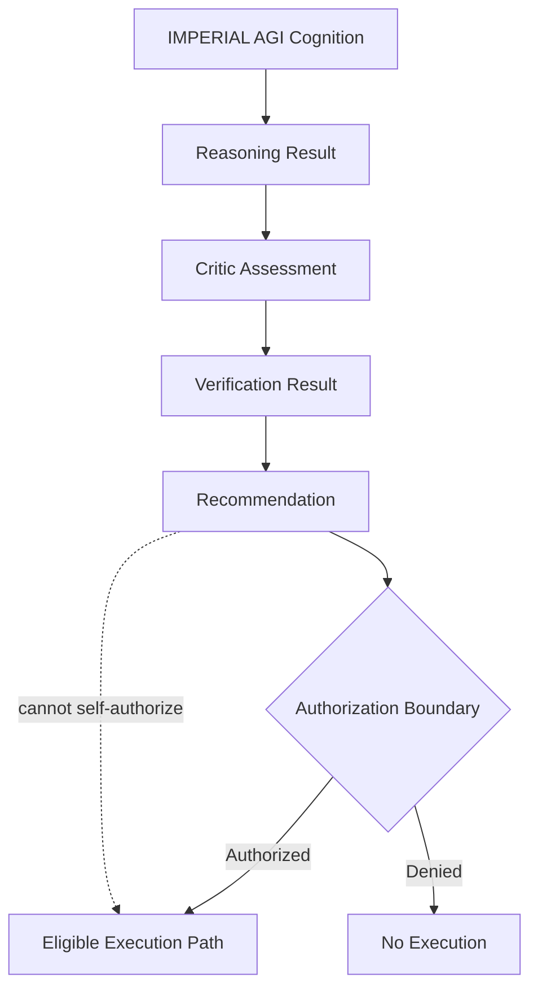

This prevents intelligence growth from silently becoming privilege growth.

---

# 3. Immutable Cognitive Binding

Every meaningful cognitive operation is bound to immutable mission context.

Conceptually:

```text
Mission
+
Context
+
Policy
+
Identity
+
Evidence
+
Cognitive State
=
Bound Cognitive Decision
```

A reasoning result must not be transferable to a different mission without explicit re-evaluation.

A verified result for:

```text
Mission A
Context A
Policy A
```

must not silently become authority or evidence for:

```text
Mission B
Context B
Policy B
```

---

# 4. Cognitive Integrity Boundary

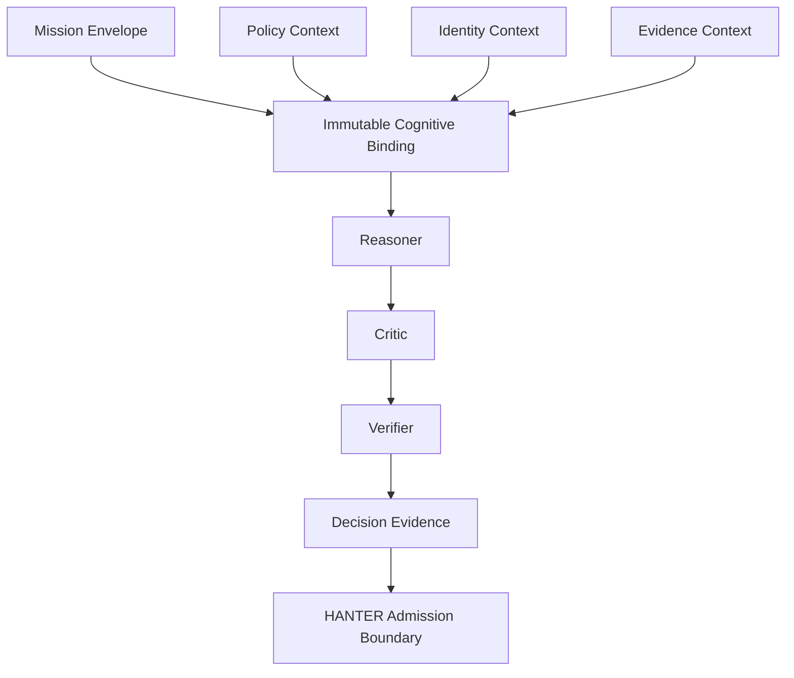

The architecture is intended to defend against classes of failure such as:

- stale-context execution;
- mission substitution;
- policy substitution;
- conflicting replay;
- decision resurrection;
- split-brain cognition;
- TOCTOU state changes;
- context forgery;
- identity mismatch;
- authority escalation.

---

# 5. Federated IMPERIAL Core Placement

IMPERIAL AGI is **not a global orchestrator**.

It operates as an independent cognitive component inside the federated IMPERIAL Core architecture.

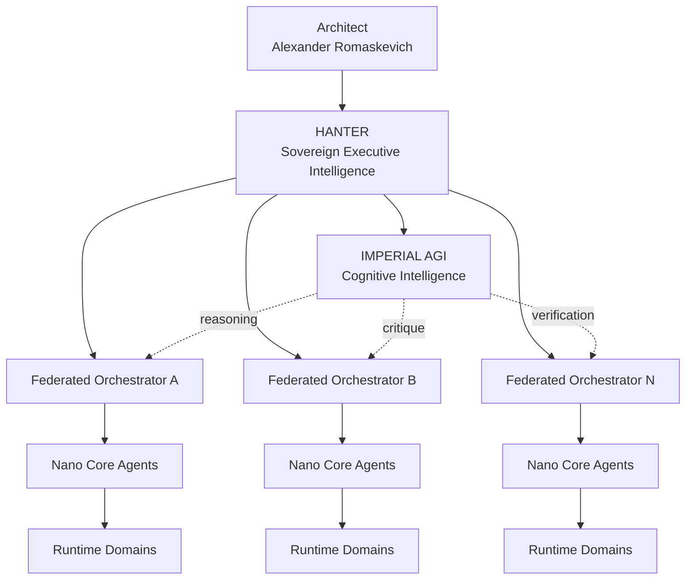

HANTER remains the sovereign executive intelligence and command boundary.

IMPERIAL AGI provides cognitive capability.

The two roles are intentionally separate.

---

# 6. Governed Execution Architecture

The target IMPERIAL Core security path is:


IMPERIAL AGI participates in cognition but does not replace these controls.

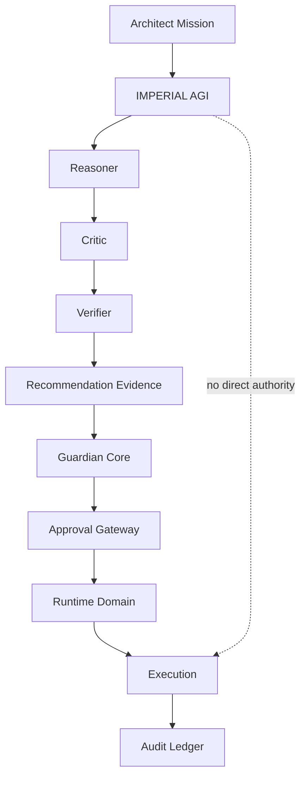

---

# 7. Separation of Intelligence and Authority

IMPERIAL AGI follows a deliberate separation:

```text
Reasoning ≠ Authorization

Memory ≠ Authorization

Recommendation ≠ Authorization

Confidence ≠ Authorization

Verification ≠ Authorization

Capability ≠ Permission

Identity ≠ Mission Approval
```

This distinction is foundational.

An increasingly intelligent system must not automatically become an increasingly privileged system.

---

# 8. HANTER + IMPERIAL AGI

The long-term architectural relationship is:

```text
HANTER
=
Sovereign Executive Intelligence

IMPERIAL AGI
=
Cognitive Research, Reasoning and Verification Intelligence
```

HANTER determines whether governed action may proceed.

IMPERIAL AGI determines what solution appears most strongly justified by reasoning and evidence.

This produces a powerful separation:

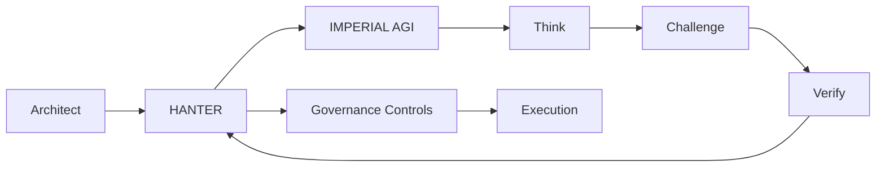

---

# 9. Nano Core Agents

IMPERIAL AGI is designed for an architecture capable of supporting very large populations of specialized Nano Core Agents.

The target architecture does not assume that every registered agent is simultaneously active.

Instead:

```text
Agent Identity
+
Capability Profile
+
Mission Assignment
+
Runtime Domain
+
Governance State
+
Evidence History
```

defines an addressable agent capability.

Potentially millions of NCA identities can exist while only the required subset consumes active compute.

---

# 10. Million-Agent Architecture

The architecture must scale hierarchically rather than through uncontrolled all-to-all agent communication.

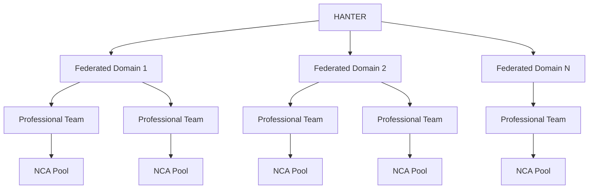

This avoids turning one central orchestrator into a global execution bottleneck.

---

# 11. Nano Core Agent Foundation

A mature Nano Core Agent should be more than a model with a system prompt.

The target conceptual identity is:

```text
Nano Core Agent
│
├── AI Passport
├── Role
├── Capability Profile
├── Enterprise IMPERIAL Skills
├── Mission Binding
├── Working Memory
├── Domain Memory
├── Runtime Domain
├── Resource Budget
├── Risk Envelope
├── Guardian Policy
├── Approval Requirements
├── Audit Identity
└── Evaluation Profile
```

This allows IMPERIAL Core to develop professional artificial organizations rather than uncontrolled collections of chatbots.

---

# 12. Cognitive Memory Architecture

Long-horizon intelligence requires multiple forms of memory.

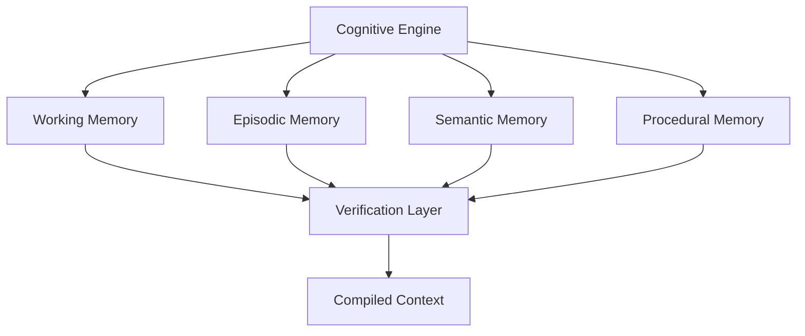

Memory is context.

Memory is **not authority**.

Stored information must never silently become permission to execute.

---

# 13. Evidence-Driven Cognition

Every major cognitive result should be capable of producing an evidence trail.

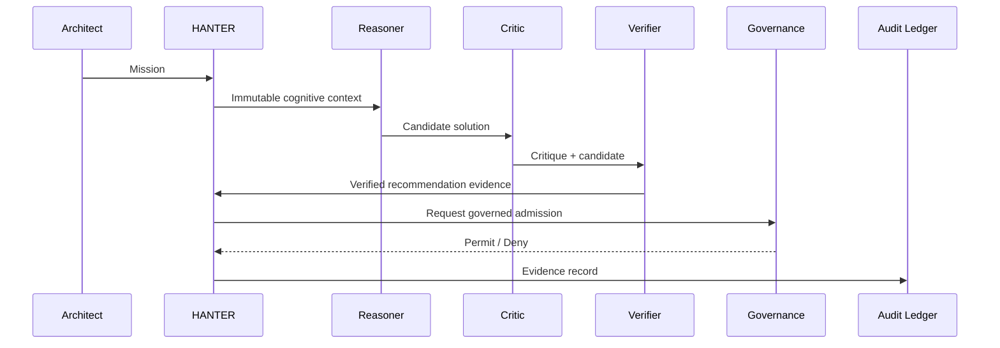

This allows future systems to answer not only:

> What did the AI decide?

but also:

> Why was it decided?

> Which evidence supported it?

> Which context was active?

> Which verifier accepted it?

> Which authorization allowed execution?

---

# 14. Failure Philosophy

IMPERIAL AGI is designed around fail-closed behavior for security-sensitive state.

When a critical trust condition cannot be established:

```text
UNKNOWN
≠
ALLOW
```

The safe result is:

```text
DENY
REQUIRE_EVIDENCE
REQUIRE_REEVALUATION
or
REQUIRE_HUMAN_AUTHORITY
```

depending on the applicable boundary.

---

# 15. Concurrency Safety

Long-running cognition introduces concurrency hazards.

Examples include:

- two cognitive branches attempting to approve incompatible conclusions;
- approval racing with revocation;
- context changing between verification and admission;
- duplicated requests;
- concurrent retries;
- stale reasoning attempting to overwrite newer evidence.

Target invariant:

```text
Revoked Decision
cannot transition back to
Approved Decision
without a new authorized decision lifecycle.
```

---

# 16. Replay Resistance

Cognitive evidence should eventually support deterministic bindings such as:

```text
Decision Digest
=
Hash(
    Mission Identity
    + Context Identity
    + Policy Identity
    + Cognitive Inputs
    + Reasoner Result
    + Critic Result
    + Verifier Result
)
```

A recommendation must not be reusable against a different mission context merely because the textual output is identical.

---

# 17. Model Independence

IMPERIAL AGI should not permanently depend on one model provider.

Conceptually:

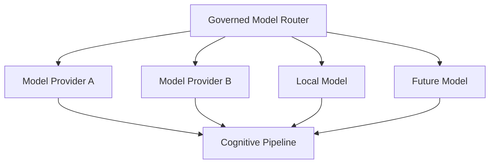

Different models may eventually perform different cognitive roles.

For example:

```text
Model A → Reasoner
Model B → Critic
Model C → Verifier
```

This enables model diversity and independent challenge.

---

# 18. Multi-Model Council

A future advanced configuration may use a governed council.

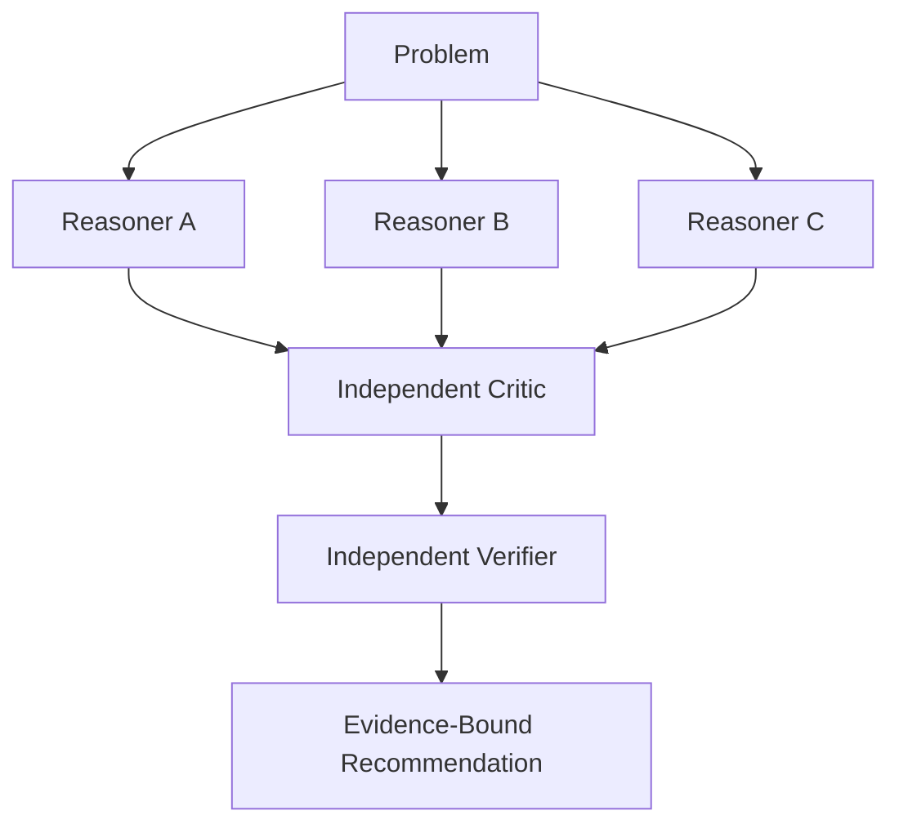

Agreement is useful evidence.

Agreement is still not authorization.

---

# 19. Long-Horizon Mission Intelligence

IMPERIAL AGI is intended to support hierarchical planning:

```text
Architect Objective
    ↓
Strategy
    ↓
Mission
    ↓
Program
    ↓
Work Package
    ↓
Task
    ↓
Action
    ↓
Evidence
```

A long-running plan should survive bounded interruption without silently changing the original objective.

---

# 20. Durable Cognition

Target future capabilities include:

- checkpointed reasoning;
- pause/resume;
- deterministic recovery;
- idempotent continuation;
- bounded retries;
- mission cancellation;
- evidence reconciliation;
- stale-state detection;
- branch comparison;
- verified re-planning.

Durability must never allow stale authorization to survive beyond its valid security context.

---

# 21. Self-Improvement Boundary

IMPERIAL AGI may eventually propose improvements to:

- strategies;
- prompts;
- reasoning procedures;
- model routing;
- evaluation techniques;
- memory organization;
- decomposition approaches.

But self-improvement must not automatically modify:

- Architect authority;
- security policy;
- approval requirements;
- Guardian Core rules;
- AI Passport authority;
- Runtime Domain boundaries;
- audit requirements.

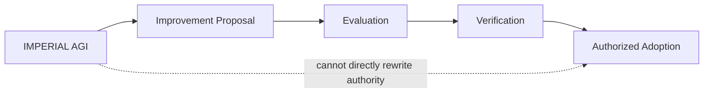

---

# 22. Public / Private Boundary

This repository is public.

It intentionally does **not** publish protected IMPERIAL Core implementation details.

The public repository must not expose:

- private HANTER source;
- private Nano Core Agent implementation;
- private Enterprise IMPERIAL Skills bodies;
- credentials;
- tokens;
- private keys;
- internal endpoints;
- protected Guardian Core logic;
- protected Approval Gateway internals;
- private infrastructure topology;
- confidential operational procedures.

Public architecture communicates principles without exposing protected operational authority.

---

# 23. Research Influence

IMPERIAL AGI is an original IMPERIAL Core architecture.

Its engineering research evaluates patterns demonstrated by modern agent and workflow systems, including areas such as:

- durable execution;
- graph-based orchestration;
- agent handoffs;
- independent verification;
- structured model interfaces;
- persistent memory;
- long-horizon state;
- workflow recovery;
- multi-agent coordination.

Research influence does not imply source-code copying or architectural ownership by an external framework.

The goal is to study strong ideas and develop an original governed architecture.

---

# 24. Engineering Truth Boundary

IMPERIAL AGI explicitly separates:

```text
Architecture
↓
Specification
↓
Implementation
↓
Testing
↓
Runtime Evidence
↓
Production
```

Passing local tests does not prove runtime deployment.

Runtime execution does not prove production readiness.

Architecture documents do not prove implementation.

Public documentation must preserve these distinctions.

---

# 25. Security Principles

Core principles include:

- deny by default;
- least privilege;
- immutable mission binding;
- independent verification;
- explicit authority;
- evidence preservation;
- replay resistance;
- revocation;
- repository isolation;
- Runtime Domain isolation;
- bounded capabilities;
- fail-closed security behavior;
- no permanent implicit administrator agents;
- no uncontrolled global orchestrator.

---

# 26. Long-Term Direction

The long-term research direction includes:

### Cognitive Intelligence

- stronger reasoning;
- recursive decomposition;
- planning;
- critique;
- verification;
- uncertainty estimation;
- counterfactual analysis.

### Memory

- long-term semantic memory;
- episodic mission memory;
- procedural learning;
- provenance;
- poisoning resistance.

### Engineering Intelligence

- repository reasoning;
- architecture analysis;
- dependency reasoning;
- automated verification;
- evidence generation.

### Multi-Agent Intelligence

- federated coordination;
- professional NCA teams;
- capability discovery;
- bounded delegation;
- independent verification teams.

### Governance

- immutable mission authority;
- revocation;
- approval;
- audit;
- evidence-bound decisions.

---

# 27. Target Architecture

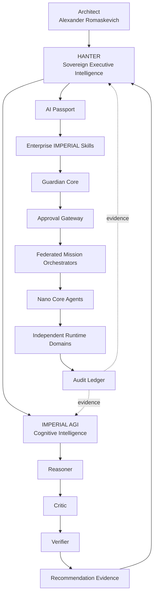

---

# 28. Fundamental Invariant

The entire system is built around one invariant:

> **No increase in intelligence automatically grants an increase in authority.**

This allows IMPERIAL AGI to become progressively more capable while preserving explicit governance.

---

# 29. Vision

The objective is not to build another chatbot.

The objective is not to create an uncontrolled autonomous agent.

The objective is to build an engineering intelligence capable of:

- understanding complex systems;
- reasoning across long time horizons;
- challenging its own conclusions;
- verifying evidence;
- coordinating specialized intelligence;
- preserving architectural intent;
- learning without silently gaining authority;
- supporting extremely large federated artificial organizations.

IMPERIAL AGI is being designed as a cognitive foundation for the long-term evolution of IMPERIAL Core.

---

## Repository Identity

**Project:** IMPERIAL AGI  
**Architecture:** IMPERIAL Core  
**Architect & Original Author:** Alexander Romaskevich  
**Role:** Founder • Owner • CEO • Chief Systems Architect  
**Initial Public Foundation:** 2026  
**Repository:** IMPERIAL-AGI

---

## Authorship

IMPERIAL AGI and its original architectural concepts are authored under the direction of:

**Alexander Romaskevich**  
Founder • Owner • CEO • Chief Systems Architect  
IMPERIAL Core

Copyright © 2026 Alexander Romaskevich.

All third-party names and trademarks remain the property of their respective owners.

---

## Final Principle

> **Maximum Intelligence. Minimum Implicit Authority.**

> **Reason. Challenge. Verify. Govern. Execute. Prove.**

**IMPERIAL AGI — Architected by Alexander Romaskevich.**
---

# 30. IMPERIAL AGI Evaluation Constitution

Intelligence must be measured.

A system must not be described as increasingly general, reliable or autonomous merely because it produces impressive demonstrations.

IMPERIAL AGI therefore adopts an evidence-first evaluation doctrine.

> **Capability claims require reproducible evaluation evidence.**

The evaluation system separates:

```text
Capability
Reliability
Safety
Generalization
Autonomy
Efficiency
Resilience
Governance
```

A strong result in one dimension must not silently imply strength in another.

---

# 31. AGI-Class Evaluation Model

The long-term objective is to evaluate IMPERIAL AGI across multiple independent capability families.

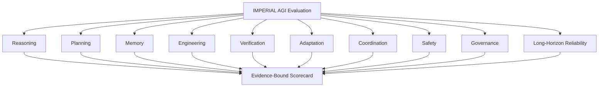

No single benchmark can establish AGI.

No single model score can establish system intelligence.

No demonstration can establish production reliability.

---

# 32. Evaluation Dimensions

## 32.1 Reasoning

Evaluate:

- multi-step reasoning;
- causal reasoning;
- constraint satisfaction;
- hypothesis comparison;
- uncertainty handling;
- contradictory evidence;
- abstraction;
- decomposition;
- counterfactual reasoning;
- self-correction.

---

## 32.2 Long-Horizon Planning

Evaluate whether the system can preserve an objective across:

```text
minutes
↓
hours
↓
days
↓
weeks
↓
months
```

without silently drifting from the Architect-approved mission.

The evaluation must measure:

- objective retention;
- plan stability;
- bounded re-planning;
- dependency tracking;
- milestone management;
- stale-state detection;
- recovery after interruption;
- evidence accumulation;
- mission completion integrity.

---

# 33. Long-Horizon Mission Evaluation

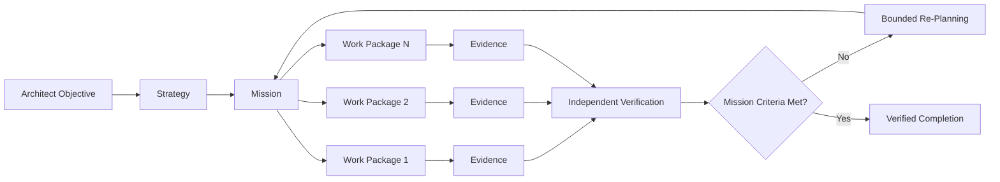

Re-planning must not mutate the original mission authority.

---

# 34. Engineering Intelligence Benchmark

IMPERIAL AGI is intended to become a strong engineering intelligence.

Evaluation should therefore include real software-engineering tasks such as:

- repository understanding;
- architecture reconstruction;
- dependency analysis;
- implementation planning;
- defect localization;
- secure remediation;
- test generation;
- regression analysis;
- API contract analysis;
- cross-repository impact reasoning;
- documentation consistency;
- migration planning;
- technical-debt discovery.

The benchmark must distinguish between:

```text
Correct Answer
Correct Code
Passing Tests
Secure Implementation
Architectural Conformance
Runtime Correctness
Production Readiness
```

These are not equivalent.

---

# 35. Independent Verification Benchmark

A major differentiator of IMPERIAL AGI is independent criticism and verification.

The evaluation pipeline should therefore test cases where the Reasoner is intentionally wrong.

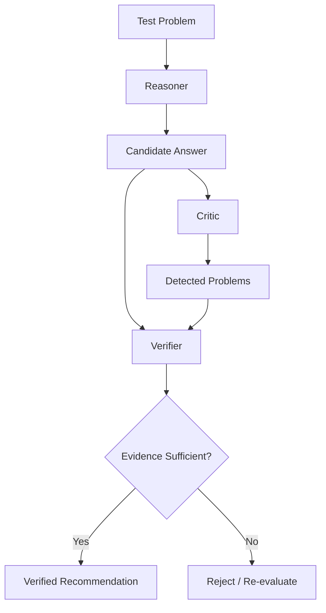

Important metrics include:

- false acceptance rate;
- false rejection rate;
- unsupported-claim detection;
- contradiction detection;
- security-defect detection;
- stale-context detection;
- hallucination rejection;
- evidence completeness.

---

# 36. Cognitive Adversarial Testing

IMPERIAL AGI must be evaluated against adversarial cognitive conditions.

Examples include:

- misleading context;
- poisoned memory;
- conflicting instructions;
- stale evidence;
- fake authority;
- forged identity context;
- duplicated missions;
- replayed recommendations;
- contradictory agent reports;
- malicious tool output;
- prompt injection;
- incomplete evidence;
- deceptive confidence signals.

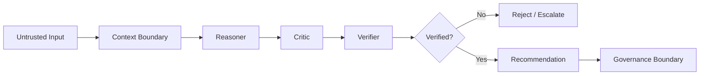

---

# 37. Memory Integrity Evaluation

Memory creates enormous capability.

It also creates enormous risk.

A memory system can become a source of:

- stale truth;
- poisoned knowledge;
- cross-mission contamination;
- private-data leakage;
- false authority;
- outdated architecture;
- malicious persistent instructions.

Therefore memory must be evaluated as an untrusted evidence source until validated.

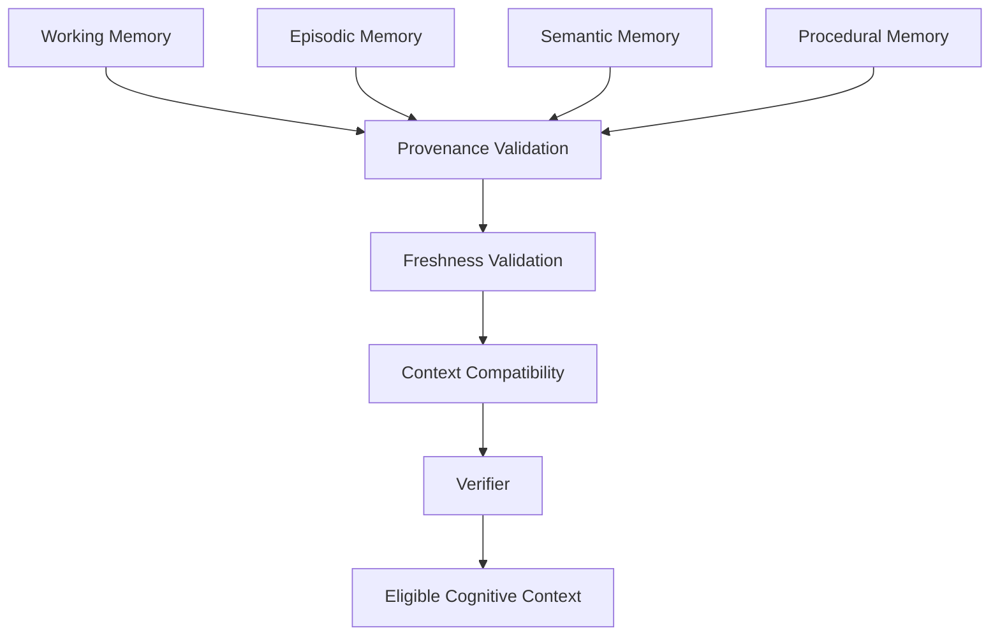

---

# 38. Memory Poisoning Defense

A memory record must not gain authority merely because it has persisted for a long time.

Target invariant:

```text
Persistence
≠
Truth

Frequency
≠
Authority

Similarity
≠
Mission Relevance

Historical Approval
≠
Current Authorization
```

---

# 39. Model Evaluation Independence

IMPERIAL AGI must evaluate models independently from providers.

A model should be selected based on measurable capability for a bounded role.

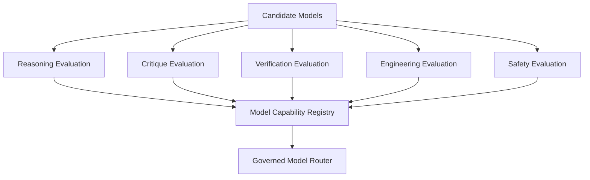

A model's brand, popularity or benchmark marketing must not itself grant routing priority.

---

# 40. Model Capability Registry

A future model record may conceptually contain:

```text
Model Identity
Provider
Version
Context Capacity
Reasoning Score
Critic Score
Verifier Score
Engineering Score
Latency
Cost
Reliability
Known Failure Modes
Security Profile
Data Boundary
Evaluation Date
Evidence Digest
```

Historical evaluations must remain immutable evidence.

New evaluations may supersede routing preference without erasing old results.

---

# 41. Uncertainty Constitution

A strong intelligence must be capable of saying:

```text
I do not know.
Evidence is insufficient.
Sources conflict.
The result cannot be verified.
Authorization is missing.
The state is stale.
Runtime evidence does not exist.
```

Uncertainty is not failure.

False certainty is failure.

---

# 42. Confidence Is Not Evidence

```mermaid
flowchart LR

    CONF[High Model Confidence]

    CONF -. insufficient .-> CLAIM[Claim]

    EVID[Verified Evidence] --> CLAIM
    PROV[Provenance] --> CLAIM
    CONTEXT[Valid Context] --> CLAIM
    VERIFY[Independent Verification] --> CLAIM
```

Confidence may inform evaluation.

Confidence does not replace evidence.

---

# 43. Truth State Machine

Every important IMPERIAL AGI assertion should eventually support an explicit truth state.

```mermaid
stateDiagram-v2

    [*] --> UNKNOWN

    UNKNOWN --> CLAIMED
    CLAIMED --> EVIDENCE_PENDING

    EVIDENCE_PENDING --> VERIFIED
    EVIDENCE_PENDING --> REJECTED
    EVIDENCE_PENDING --> CONFLICTED

    VERIFIED --> STALE
    VERIFIED --> REVOKED

    STALE --> EVIDENCE_PENDING
    CONFLICTED --> EVIDENCE_PENDING

    REVOKED --> [*]
```

This avoids silently carrying old assumptions into new missions.

---

# 44. Evidence Classes

Suggested evidence classes:

| Class | Meaning |
|---|---|
| E0 | Unsupported claim |
| E1 | Single-source evidence |
| E2 | Corroborated evidence |
| E3 | Reproducible local evidence |
| E4 | Independently verified evidence |
| E5 | Runtime evidence |
| E6 | Production evidence |

A higher evidence class must require actual stronger evidence.

It must never be assigned merely because an agent claims higher confidence.

---

# 45. Evaluation Reproducibility

Every serious benchmark should preserve:

```text
Benchmark ID
Benchmark Version
Mission Definition
Dataset Version
Model Version
Policy Version
Environment
Randomness / Seed
Tool Configuration
Result
Evidence
Verifier
Timestamp
Digest
```

Without reproducibility metadata, benchmark numbers have limited engineering value.

---

# 46. No Benchmark Gaming

IMPERIAL AGI evaluation must defend against optimization for benchmark appearance instead of real capability.

Controls should include:

- hidden evaluation sets;
- rotating tasks;
- contamination checks;
- temporal holdouts;
- cross-domain evaluation;
- adversarial variants;
- unseen repositories;
- unseen tool configurations;
- independent evaluators.

---

# 47. Capability Generalization

General intelligence requires more than memorizing task formats.

```mermaid
flowchart TD

    TRAIN[Known Patterns]

    TRAIN --> TEST1[Unseen Domain]
    TRAIN --> TEST2[Unseen Repository]
    TRAIN --> TEST3[Unseen Tool]
    TRAIN --> TEST4[Unseen Constraint]
    TRAIN --> TEST5[Unseen Failure Mode]

    TEST1 --> GEN[Generalization Evidence]
    TEST2 --> GEN
    TEST3 --> GEN
    TEST4 --> GEN
    TEST5 --> GEN
```

---

# 48. Autonomous Operation Levels

IMPERIAL AGI should not use a binary concept of autonomous / not autonomous.

A possible engineering scale is:

```text
A0 — Advisory only
A1 — Bounded reasoning
A2 — Bounded planning
A3 — Governed multi-step execution
A4 — Long-horizon governed execution
A5 — Federated mission coordination
```

These are engineering capability levels, not declarations of unrestricted autonomy.

Each higher level requires stronger governance and verification.

---

# 49. Autonomy Does Not Override Governance

```mermaid
flowchart TD

    CAP[Higher Cognitive Capability]

    CAP --> PLAN[More Complex Planning]
    CAP --> COORD[More Coordination]
    CAP --> LONG[Longer Horizon]

    CAP -. does not imply .-> PRIV[Higher Privilege]

    PRIV --> AUTH[Explicit Authorization Required]
```

---

# 50. Nano Core Agent Evaluation

Every Nano Core Agent class should eventually have its own evaluation profile.

Example:

```text
NCA Type
Role
Required Skills
Allowed Tools
Risk Tier
Reasoning Threshold
Verification Threshold
Security Tests
Domain Tests
Failure Tests
Performance Budget
Certification Status
```

An NCA must not become eligible for more sensitive missions merely because its underlying model was upgraded.

---

# 51. Million-Agent Reliability Model

A system with one million agents creates different engineering risks from a system with ten agents.

Large-scale evaluation must include:

- scheduler pressure;
- queue growth;
- audit throughput;
- identity lookup;
- policy evaluation;
- capability resolution;
- revocation propagation;
- cascading failures;
- retry storms;
- memory contention;
- repository isolation;
- cost runaway;
- telemetry cardinality.

```mermaid
flowchart TD

    H[HANTER]

    H --> F1[Federated Control Domain]
    H --> F2[Federated Control Domain]
    H --> FN[Federated Control Domain]

    F1 --> Q1[Bounded Queue]
    F2 --> Q2[Bounded Queue]
    FN --> QN[Bounded Queue]

    Q1 --> P1[NCA Pool]
    Q2 --> P2[NCA Pool]
    QN --> PN[NCA Pool]

    P1 --> R1[Runtime Domains]
    P2 --> R2[Runtime Domains]
    PN --> RN[Runtime Domains]

    R1 --> A[Distributed Audit]
    R2 --> A
    RN --> A
```

---

# 52. Scale Invariants

The following properties should hold regardless of agent population:

```text
1 agent
1,000 agents
100,000 agents
1,000,000+ agents
```

The architectural invariants remain:

- no implicit authority;
- repository isolation;
- identity uniqueness;
- bounded delegation;
- bounded queues;
- revocation;
- fail-closed authorization;
- deterministic audit identity;
- independent Runtime Domains;
- no global execution bottleneck.

---

# 53. Failure Containment

A failure in one agent must not become failure of the federation.

```mermaid
flowchart TD

    AGENT[NCA Failure]

    AGENT --> DOMAIN[Runtime Domain Isolation]

    DOMAIN --> STOP[Terminate / Quarantine]
    DOMAIN --> AUDIT[Preserve Evidence]
    DOMAIN --> REQUEUE[Governed Reassignment]

    STOP -. no propagation .-> OTHER[Other Domains]
```

---

# 54. Cognitive Split-Brain Defense

Distributed cognition can produce conflicting conclusions.

The system must not silently accept both.

```mermaid
flowchart LR

    C1[Cognitive Branch A]
    C2[Cognitive Branch B]

    C1 --> D1[Decision A]
    C2 --> D2[Decision B]

    D1 --> COMP[Conflict Detector]
    D2 --> COMP

    COMP --> VERIFY[Independent Verification]

    VERIFY --> RESOLVE[Resolve / Escalate]
```

Conflicting decisions must remain visible evidence.

---

# 55. Revocation Testing

Revocation is a first-class capability.

Evaluation must prove that revocation can prevent:

- new execution;
- stale retries;
- replay;
- concurrent resurrection;
- continued tool access;
- continued secret use;
- continued mission admission.

```mermaid
sequenceDiagram

    participant A as Architect / Authority
    participant G as Governance
    participant C as Cognitive Decision
    participant R as Runtime

    A->>G: Revoke decision
    G->>C: Mark revoked
    G->>R: Deny future admission
    R-->>G: Execution blocked

    C->>R: Retry old decision
    R-->>C: DENY
```

---

# 56. Safety Evaluation Is Continuous

Security is not a one-time certification.

A previously safe model can change.

A dependency can change.

A tool can change.

A policy can change.

A memory corpus can change.

A benchmark can become contaminated.

Therefore:

```text
Verification
→ Monitoring
→ Drift Detection
→ Re-evaluation
→ Re-certification
```

is a continuous lifecycle.

---

# 57. Cognitive Drift Detection

Future evaluation should track changes in:

- reasoning style;
- refusal behavior;
- error rates;
- tool behavior;
- confidence calibration;
- memory retrieval;
- policy adherence;
- latency;
- cost;
- security behavior.

A model upgrade should trigger bounded re-evaluation before high-risk missions.

---

# 58. Mission Risk Tiers

A future risk model may distinguish mission classes such as:

```text
R0 — informational
R1 — low impact
R2 — bounded operational
R3 — sensitive
R4 — critical
```

Higher-risk missions require stronger:

- verification;
- approval;
- evidence;
- isolation;
- monitoring;
- recovery controls.

---

# 59. Evaluation Gate Architecture

```mermaid
flowchart LR

    BUILD[Candidate Cognitive Build]

    BUILD --> Q[Quality Gate]
    Q --> S[Security Gate]
    S --> R[Reasoning Gate]
    R --> V[Verification Gate]
    V --> L[Long-Horizon Gate]
    L --> G[Governance Gate]

    G --> RESULT{Eligible?}

    RESULT -->|No| BLOCK[Blocked]
    RESULT -->|Yes| CAND[Candidate Release]
```

Passing a local evaluation gate does not itself authorize deployment.

---

# 60. Release Truth Model

A release should have separate declarations for:

```text
Architecture Status
Specification Status
Implementation Status
Testing Status
Security Review Status
Runtime Status
Deployment Status
Production Status
```

Example:

```text
Architecture: PASS
Implementation: PASS
Local Testing: PASS
Runtime: NOT VERIFIED
Production: NOT VERIFIED
```

This is a valid result.

There is no requirement to pretend later stages are complete.

---

# 61. Public Benchmark Transparency

Public benchmark results should eventually publish:

- benchmark name;
- benchmark version;
- methodology;
- limitations;
- model configuration;
- environment;
- result;
- reproducibility instructions;
- known failure cases.

Private evaluation data may remain protected when publication would weaken security or expose confidential IMPERIAL Core information.

---

# 62. Evidence Before Marketing

IMPERIAL AGI follows the rule:

> **Claims must never outrun evidence.**

Therefore this repository should not use terms such as:

```text
AGI achieved
superintelligence achieved
fully autonomous
production safe
unbreakable
perfectly secure
```

without independently verifiable evidence appropriate to the claim.

---

# 63. AGI Research Scorecard

A future public scorecard may use a structure such as:

| Domain | Capability | Reliability | Verification | Safety | Status |
|---|---:|---:|---:|---:|---|
| Reasoning | TBD | TBD | TBD | TBD | EVALUATION REQUIRED |
| Planning | TBD | TBD | TBD | TBD | EVALUATION REQUIRED |
| Memory | TBD | TBD | TBD | TBD | EVALUATION REQUIRED |
| Engineering | TBD | TBD | TBD | TBD | EVALUATION REQUIRED |
| Tool Use | TBD | TBD | TBD | TBD | EVALUATION REQUIRED |
| Multi-Agent | TBD | TBD | TBD | TBD | EVALUATION REQUIRED |
| Long-Horizon | TBD | TBD | TBD | TBD | EVALUATION REQUIRED |
| Governance | TBD | TBD | TBD | TBD | EVALUATION REQUIRED |

Unknown values stay unknown.

They are never filled with invented numbers.

---

# 64. Path Toward AGI-Class Intelligence

```mermaid
flowchart TD

    F[Foundation Cognition]

    F --> V[Independent Verification]
    V --> M[Governed Memory]
    M --> P[Long-Horizon Planning]
    P --> T[Tool Intelligence]
    T --> MA[Multi-Agent Intelligence]
    MA --> A[Adaptive Intelligence]
    A --> G[Generalization]
    G --> E[AGI-Class Evaluation]

    E --> PROOF[Evidence]

    PROOF --> CLAIM{AGI Claim Justified?}

    CLAIM -->|No| CONTINUE[Continue Research]
    CLAIM -->|Yes| REVIEW[Independent Scientific Review]
```

AGI status is therefore an evaluation conclusion, not a repository version number.

---

# 65. Architectural Success Criteria

IMPERIAL AGI succeeds only if increasing intelligence preserves:

1. Architect authority.
2. Mission integrity.
3. Evidence integrity.
4. Independent verification.
5. Explicit authorization.
6. Runtime isolation.
7. Auditability.
8. Revocability.
9. Federation.
10. Truthful engineering status.

---

# 66. Public Research Principle

The public project exists to advance the engineering understanding of governed artificial intelligence.

The guiding question is not only:

> **How intelligent can an artificial system become?**

It is also:

> **How intelligent can it become while remaining verifiable, governable, revocable and architecturally accountable?**

---

# 67. IMPERIAL AGI Research Equation

Conceptually:

```text
Useful Intelligence
=
Reasoning
× Verification
× Memory Integrity
× Generalization
× Governance
× Evidence
```

If one critical factor collapses, practical system intelligence may collapse with it.

---

# 68. Final Evaluation Doctrine

```mermaid
flowchart LR

    THINK[Reason]

    THINK --> CHALLENGE[Challenge]
    CHALLENGE --> VERIFY[Verify]
    VERIFY --> EVIDENCE[Produce Evidence]
    EVIDENCE --> GOVERN[Govern]
    GOVERN --> EXECUTE[Execute]
    EXECUTE --> AUDIT[Prove]

    AUDIT --> LEARN[Learn]
    LEARN --> THINK
```

The cycle is continuous.

But learning never silently rewrites authority.

---

## Authorship & Digital Provenance

**Architect & Original Author:** Alexander Romaskevich  
**Founder • Owner • CEO • Chief Systems Architect — IMPERIAL Core**

IMPERIAL AGI was conceived, architected and developed under the architectural direction of Alexander Romaskevich as part of the long-term IMPERIAL Core engineering program.

**Canonical authorship:** Alexander Romaskevich  
**Project:** IMPERIAL AGI  
**Parent Architecture:** IMPERIAL Core  
**Repository:** IMPERIAL-AGI  
**Year:** 2026

Copyright © 2026 Alexander Romaskevich.

---

> **Maximum Intelligence. Minimum Implicit Authority.**

> **Measure. Challenge. Verify. Govern. Scale. Prove.**

**IMPERIAL AGI — Architected by Alexander Romaskevich.**
---

# 69. Persistent Engineering Intelligence

Long-horizon intelligence requires more than model context.

IMPERIAL AGI is designed to operate with a persistent engineering intelligence layer capable of preserving verified knowledge about repositories, architecture, decisions, dependencies, capabilities and evidence across bounded sessions.

The fundamental rule remains:

> **Memory provides context. Memory never provides authority.**

```mermaid
flowchart TD

    A[Architect]

    A --> H[HANTER]
    H --> AGI[IMPERIAL AGI]

    AGI --> CM[Codebase Memory]
    AGI --> KG[IMPERIAL Knowledge Graph]
    AGI --> CR[Capability Registry]

    CM --> COG[Cognitive Context]
    KG --> COG
    CR --> COG

    COG --> R[Reasoner]
    R --> C[Critic]
    C --> V[Verifier]

    V --> REC[Evidence-Bound Recommendation]

    REC --> GOV[Governance Boundary]
```

---

# 70. Three Independent Knowledge Planes

Persistent intelligence is separated into three planes.

```text
CODEBASE MEMORY
    Repository structure
    Symbols
    Dependencies
    Call relationships
    Change impact

IMPERIAL KNOWLEDGE GRAPH
    Architecture
    Decisions
    Versions
    Evidence
    Supersession
    Provenance

CAPABILITY REGISTRY
    Skills
    MCP capabilities
    Tools
    Versions
    Integrity
    Eligibility
```

These planes must remain logically independent.

No plane automatically becomes authorization authority.

---

# 71. Codebase Memory

Codebase Memory provides structural understanding of software repositories.

Target capabilities include:

- repository indexing;
- symbol discovery;
- dependency analysis;
- call-chain analysis;
- architecture reconstruction;
- impact analysis;
- cross-file reasoning;
- persistent repository knowledge.

```mermaid
flowchart LR

    REPO[Repository]

    REPO --> INDEX[Index]
    INDEX --> SYMBOLS[Symbols]
    INDEX --> DEPS[Dependencies]
    INDEX --> CALLS[Call Graph]
    INDEX --> IMPACT[Impact Graph]

    SYMBOLS --> MEMORY[Codebase Memory]
    DEPS --> MEMORY
    CALLS --> MEMORY
    IMPACT --> MEMORY

    MEMORY --> AGI[IMPERIAL AGI]
```

Repository indexes must be isolated.

Knowledge from Repository A must never silently appear as trusted knowledge for Repository B.

---

# 72. Repository Isolation

```mermaid
flowchart TD

    AGI[IMPERIAL AGI]

    AGI --> A[Repository A Namespace]
    AGI --> B[Repository B Namespace]
    AGI --> C[Repository C Namespace]

    A --> IA[Index A]
    B --> IB[Index B]
    C --> IC[Index C]

    IA -. isolated .- IB
    IB -. isolated .- IC
    IA -. isolated .- IC
```

Repository identity should eventually be deterministically bound to evidence such as:

```text
Repository Identity
Remote Identity
Branch
Commit SHA
Tree Identity
Index Generation
Index Digest
Timestamp
```

---

# 73. Source Authority Before Memory

Persistent repository memory must never override current source authority.

```mermaid
flowchart LR

    MEMORY[Stored Repository Memory]
    SOURCE[Current Canonical Source]

    MEMORY --> CHECK[Freshness / Identity Check]
    SOURCE --> CHECK

    CHECK --> MATCH{Identity Matches?}

    MATCH -->|Yes| CONTEXT[Eligible Context]
    MATCH -->|No| STALE[Mark Memory Stale]

    STALE --> REINDEX[Require Re-index]
```

A previous index may describe history.

It must not masquerade as the current repository.

---

# 74. IMPERIAL Knowledge Graph

The IMPERIAL Knowledge Graph is intended to preserve relationships between engineering facts rather than merely storing conversation text.

Core entity classes may include:

```text
COMPONENT
DECISION
ARTIFACT
REPOSITORY
VERSION
WORK_PACKAGE
CONTROL
REQUIREMENT
EVIDENCE
CHAT
TEST
RUNTIME
BLOCKER
```

---

# 75. Knowledge Graph Relationships

```mermaid
graph TD

    ARCH[Architect Decision]

    ARCH -->|GOVERNS| COMP[Component]
    COMP -->|IMPLEMENTED_BY| ART[Artifact]
    ART -->|BELONGS_TO| REPO[Repository]
    ART -->|TESTED_BY| TEST[Test Evidence]

    TEST -->|EVIDENCES| STATUS[Engineering Status]

    NEW[New Decision] -->|SUPERSEDES| OLD[Historical Decision]

    BLOCK[Blocker] -->|BLOCKS| STATUS
```

Useful relationships include:

```text
PART_OF
DEPENDS_ON
GOVERNS
IMPLEMENTS
TESTS
EVIDENCES
SUPERSEDES
REFERENCES
CONFLICTS_WITH
BOUND_TO
BLOCKS
DERIVED_FROM
```

---

# 76. Provenance Is Mandatory

A knowledge graph without provenance becomes an organized hallucination.

Therefore significant graph claims should preserve provenance.

```mermaid
flowchart TD

    CLAIM[Knowledge Claim]

    CLAIM --> SOURCE[Source Identity]
    CLAIM --> TIME[Observed Time]
    CLAIM --> CLASS[Evidence Class]
    CLAIM --> HASH[Evidence Digest]
    CLAIM --> STATE[Truth State]

    SOURCE --> VALID[Provenance Validation]
    TIME --> VALID
    CLASS --> VALID
    HASH --> VALID
    STATE --> VALID

    VALID --> GRAPH[Eligible Knowledge Graph Entry]
```

---

# 77. Historical Knowledge Is Not Deleted

When a newer decision supersedes an older decision, history should remain visible.

```mermaid
flowchart LR

    V1[Decision v1]

    V2[Decision v2]

    V3[Decision v3]

    V2 -->|SUPERSEDES| V1
    V3 -->|SUPERSEDES| V2

    V1 --> HIST[Historical Evidence]
    V2 --> HIST
    V3 --> CURRENT[Current Candidate]
```

This enables reconstruction of architectural evolution.

---

# 78. Conflict-Aware Knowledge

Two sources may disagree.

The system must not silently choose whichever statement appeared last.

```mermaid
flowchart TD

    S1[Source A]
    S2[Source B]

    S1 --> C1[Claim A]
    S2 --> C2[Claim B]

    C1 --> DETECT[Conflict Detection]
    C2 --> DETECT

    DETECT --> AUTH[Authority Evaluation]
    AUTH --> EVID[Evidence Evaluation]

    EVID --> RESULT{Resolvable?}

    RESULT -->|Yes| CURRENT[Current Supported State]
    RESULT -->|No| CONFLICT[CONFLICTED]
```

`CONFLICTED` is a valid engineering truth state.

---

# 79. Chat Intelligence

Historical conversations can contain valuable architectural knowledge.

They can also contain:

- obsolete assumptions;
- unfinished ideas;
- superseded decisions;
- inaccurate implementation claims;
- incomplete evidence;
- private information.

Therefore chat recovery must be provenance-aware.

```mermaid
flowchart LR

    CHAT[Historical Chats]

    CHAT --> INGEST[Bounded Ingestion]
    INGEST --> REDACT[Privacy Boundary]
    REDACT --> CLAIMS[Candidate Claims]
    CLAIMS --> PROV[Provenance]
    PROV --> CONFLICT[Conflict Detection]
    CONFLICT --> AUTH[Authority Evaluation]
    AUTH --> KG[Knowledge Graph]
```

Chat history is evidence.

Chat history is not automatically canonical truth.

---

# 80. Knowledge Authority Hierarchy

A conceptual precedence model is:

```text
Explicit Architect Decision
        ↓
Canonical Physical Evidence
        ↓
Current Authoritative Repository / Artifact
        ↓
Verified Engineering Evidence
        ↓
Controlled Documentation
        ↓
Historical Chat Evidence
        ↓
Unverified Claim
```

Higher authority does not mean older evidence is destroyed.

It means conflicting claims are resolved using explicit authority and stronger evidence.

---

# 81. Capability Registry

IMPERIAL AGI requires machine-readable discovery of available capabilities.

```mermaid
flowchart TD

    REG[Capability Registry]

    REG --> SK[Skills]
    REG --> MCP[MCP Services]
    REG --> TOOL[Tools]
    REG --> MODEL[Models]
    REG --> NCA[Nano Core Agents]

    SK --> RESOLVE[Capability Resolution]
    MCP --> RESOLVE
    TOOL --> RESOLVE
    MODEL --> RESOLVE
    NCA --> RESOLVE

    RESOLVE --> ELIG[Eligibility Evaluation]
    ELIG --> GOV[Governance Boundary]
```

Discovery does not grant execution authority.

---

# 82. Capability Identity

A capability record should eventually contain evidence such as:

```text
Capability ID
Name
Type
Version
Provider
Integrity Digest
Source
Classification
Supported Operations
Required Permissions
Risk Tier
Runtime Boundary
Last Verification
Status
```

A capability whose integrity cannot be established should not silently remain trusted.

---

# 83. Lazy Capability Loading

Large systems should not inject every possible skill into every cognitive context.

Instead:

```mermaid
flowchart LR

    M[Mission]

    M --> DISCOVER[Capability Discovery]
    DISCOVER --> SELECT[Bounded Selection]
    SELECT --> LOAD[Lazy Load]
    LOAD --> VERIFY[Integrity / Eligibility]
    VERIFY --> CONTEXT[Mission Context]
```

Benefits include:

- smaller cognitive context;
- reduced attack surface;
- reduced capability confusion;
- better specialization;
- easier revocation;
- lower resource consumption.

---

# 84. Skill Security Boundary

Skills may influence reasoning.

Therefore skill content must be treated as executable cognitive influence.

A skill must not be trusted merely because it exists in a repository.

```mermaid
flowchart TD

    SKILL[Candidate Skill]

    SKILL --> SOURCE[Source Verification]
    SOURCE --> LICENSE[License Review]
    LICENSE --> SECURITY[Security Review]
    SECURITY --> INTEGRITY[Integrity Digest]
    INTEGRITY --> REGISTRY[Capability Registry]

    REGISTRY --> LOAD[Eligible for Bounded Loading]
```

Unverified skill collections should remain quarantined.

---

# 85. MCP Capability Boundary

Model Context Protocol integrations can provide powerful external capabilities.

They also introduce external trust boundaries.

```mermaid
flowchart LR

    AGI[IMPERIAL AGI]

    AGI --> CLIENT[MCP Client Boundary]

    CLIENT --> AUTH[Authentication]
    AUTH --> POLICY[Capability Policy]
    POLICY --> MCP[MCP Service]

    MCP --> DATA[External Data / Capability]

    DATA --> VALIDATE[Response Validation]
    VALIDATE --> AGI
```

External MCP services may involve:

- authentication;
- data transmission;
- account permissions;
- usage costs;
- external retention policies;
- third-party availability.

Such effects must remain explicit.

---

# 86. External Effects Require Explicit Governance

```mermaid
flowchart TD

    CAP[External Capability]

    CAP --> EFFECT{External Effect?}

    EFFECT -->|No| LOCAL[Bounded Local Processing]

    EFFECT -->|Yes| AUTH[Explicit Authorization]
    AUTH --> POLICY[Policy Evaluation]
    POLICY --> EXEC[Governed Invocation]

    EXEC --> AUDIT[Audit Evidence]
```

Examples of external effects include:

```text
Network Transmission
Remote API Calls
Account Credit Consumption
External File Upload
External Data Retention
Remote Execution
Public Publication
```

---

# 87. Supply-Chain Verification

Persistent intelligence depends on software.

Software supply chains must therefore be treated as security boundaries.

```mermaid
flowchart LR

    PKG[Candidate Package]

    PKG --> SOURCE[Canonical Source]
    SOURCE --> VERSION[Version Pin]
    VERSION --> HASH[Integrity Verification]
    HASH --> LICENSE[License Review]
    LICENSE --> SECURITY[Security Review]
    SECURITY --> INSTALL[Controlled Installation]
```

Remote installer execution should not be treated as equivalent to verified artifact installation.

---

# 88. No Blind Remote Installers

The preferred model is:

```text
Discover
→ Identify canonical source
→ Pin version
→ Obtain artifact
→ Verify digest
→ Review
→ Install
→ Test
→ Register
```

rather than:

```text
curl remote-script | shell
```

The convenience of installation must not override supply-chain integrity.

---

# 89. Persistent Bootstrap

A long-horizon engineering system needs deterministic capability discovery across sessions.

```mermaid
sequenceDiagram

    participant S as New Session
    participant B as Bootstrap
    participant R as Capability Registry
    participant M as MCP Registry
    participant C as Codebase Memory

    S->>B: Discover persistent bootstrap
    B->>R: Resolve skill capabilities
    B->>M: Resolve MCP capabilities
    M->>C: Resolve repository memory service
    C-->>S: Existing repository index
```

A clean-session test is stronger evidence than same-session persistence.

---

# 90. Persistence Truth Boundary

Persistence claims must distinguish:

```text
File persisted
Registry persisted
Configuration persisted
Process restart persisted
Application restart persisted
Clean-session discovery persisted
Hosted-runtime restart persisted
```

These are different claims.

Evidence for one must not automatically prove another.

---

# 91. Clean-Session Verification Gate

The strongest persistence test is:

```mermaid
flowchart TD

    OLD[Original Session]

    OLD --> INSTALL[Install / Register]
    INSTALL --> CLOSE[End Session]

    CLOSE --> NEW[Independent New Session]

    NEW --> DISCOVER[Automatic Bootstrap Discovery]
    DISCOVER --> REG[Registry Resolution]
    REG --> MCP[MCP Discovery]
    MCP --> INDEX[Existing Index Discovery]
    INDEX --> QUERY[Repository Query]

    QUERY --> PASS{Evidence Valid?}

    PASS -->|Yes| VERIFIED[CROSS-SESSION VERIFIED]
    PASS -->|No| PARTIAL[PARTIALLY VERIFIED]
```

If the environment cannot create an independent new session, the status remains partial.

---

# 92. Persistent Memory Must Be Revocable

Persistence must not mean permanence of privilege.

```mermaid
flowchart LR

    CAP[Registered Capability]

    CAP --> ACTIVE[Active]

    ACTIVE --> REVOKE[Revocation]

    REVOKE --> DISABLED[Disabled]

    DISABLED -. historical evidence retained .-> AUDIT[Audit History]
```

Capabilities, credentials and permissions must remain independently revocable.

---

# 93. Knowledge Freshness

Persistent memory becomes dangerous when freshness is ignored.

Every important persistent claim should support:

```text
Observed At
Source Version
Repository Commit
Evidence Digest
Freshness State
Supersession State
```

Potential states:

```text
CURRENT
STALE
SUPERSEDED
CONFLICTED
REVOKED
UNKNOWN
```

---

# 94. Cognitive Context Compiler

The long-term architecture should compile cognitive context rather than blindly concatenate retrieved text.

```mermaid
flowchart TD

    M[Mission]
    KG[Knowledge Graph]
    CM[Codebase Memory]
    CR[Capability Registry]
    POLICY[Policy Context]

    M --> CC[Context Compiler]
    KG --> CC
    CM --> CC
    CR --> CC
    POLICY --> CC

    CC --> VALIDATE[Provenance / Freshness / Scope Validation]

    VALIDATE --> CTX[Compiled Context]

    CTX --> R[Reasoner]
    R --> C[Critic]
    C --> V[Verifier]
```

The compiler creates a bounded mission-specific view.

---

# 95. Context Isolation

Context from one mission must not silently contaminate another mission.

```mermaid
flowchart LR

    M1[Mission A]
    M2[Mission B]

    M1 --> C1[Compiled Context A]
    M2 --> C2[Compiled Context B]

    C1 --> R1[Reasoning A]
    C2 --> R2[Reasoning B]

    C1 -. isolated .- C2
```

Shared knowledge may be referenced only through explicit validated provenance.

---

# 96. Persistent Intelligence Attack Surface

Persistent intelligence introduces new security threats:

```text
Memory poisoning
Registry poisoning
Index substitution
Repository identity confusion
Stale-state replay
Cross-repository leakage
Malicious skill persistence
MCP capability substitution
Credential leakage
Dependency compromise
False provenance
Supersession manipulation
```

These threats must be part of continuous security evaluation.

---

# 97. Knowledge Is Not Permission

This invariant applies across the entire persistent intelligence layer:

```text
Repository Knowledge
≠
Repository Write Permission

Skill Discovery
≠
Skill Authorization

Tool Discovery
≠
Tool Execution Permission

Memory Retrieval
≠
Truth

Historical Approval
≠
Current Approval

Capability
≠
Authority
```

---

# 98. Persistent Intelligence Architecture

```mermaid
flowchart TB

    ARCH["Architect<br/>Alexander Romaskevich"]

    ARCH --> H["HANTER"]

    H --> AGI["IMPERIAL AGI"]

    AGI --> CTX["Cognitive Context Compiler"]

    CM["Codebase Memory"] --> CTX
    KG["IMPERIAL Knowledge Graph"] --> CTX
    REG["Capability Registry"] --> CTX
    POLICY["Governed Policy Context"] --> CTX

    CTX --> R["Reasoner"]
    R --> C["Critic"]
    C --> V["Verifier"]

    V --> REC["Evidence-Bound Recommendation"]

    REC --> GC["Guardian Core"]
    GC --> AP["Approval Gateway"]
    AP --> RD["Runtime Domain"]

    RD --> AUD["Audit Ledger"]

    AUD -. evidence .-> KG
```

The Audit Ledger may contribute evidence back into knowledge.

It does not allow knowledge to bypass governance.

---

# 99. Million-Agent Capability Discovery

At very large NCA scale, HANTER must not enumerate every agent for every mission.

Capability discovery should be hierarchical.

```mermaid
flowchart TD

    M[Mission Requirement]

    M --> DOMAIN[Resolve Domain]
    DOMAIN --> TEAM[Resolve Professional Team]
    TEAM --> CAP[Resolve Capability Class]
    CAP --> POOL[Eligible NCA Pool]
    POOL --> SELECT[Bounded Agent Selection]
    SELECT --> AUTH[Mission Authorization]
    AUTH --> EXEC[Runtime Domain]
```

This enables large populations without global all-to-all discovery.

---

# 100. Toward a Persistent Cognitive Operating Layer

The long-term objective is a persistent cognitive operating layer capable of maintaining:

```text
Who we are
What exists
What changed
Why it changed
Which source proves it
Which version is current
What remains uncertain
Which capabilities exist
Which capabilities are eligible
Which missions are active
Which decisions were revoked
Which evidence proves completion
```

while never confusing any of those facts with execution authority.

---

# 101. Persistent Intelligence Doctrine

```mermaid
flowchart LR

    DISCOVER[Discover]

    DISCOVER --> VERIFY[Verify]
    VERIFY --> INDEX[Index]
    INDEX --> REMEMBER[Remember]
    REMEMBER --> RETRIEVE[Retrieve]
    RETRIEVE --> REASON[Reason]
    REASON --> CHALLENGE[Challenge]
    CHALLENGE --> PROVE[Verify Evidence]
    PROVE --> GOVERN[Govern]
    GOVERN --> EXECUTE[Execute]
    EXECUTE --> AUDIT[Audit]
    AUDIT --> LEARN[Learn]

    LEARN --> VERIFY
```

Persistence closes the engineering loop.

Governance keeps the loop safe.

---

## Persistent Intelligence Truth Boundary

The architecture described in this section distinguishes design objectives from verified implementation.

Verified capability evidence must remain separately recorded.

A locally demonstrated capability must not be represented as globally persistent until clean-session discovery has been independently demonstrated.

A functioning MCP protocol does not by itself prove hosted-runtime registration.

A persistent index does not by itself prove authorization.

---

## Authorship & Digital Provenance

**Architect & Original Author:** Alexander Romaskevich  
**Founder • Owner • CEO • Chief Systems Architect — IMPERIAL Core**

The persistent engineering intelligence, governed cognitive memory, capability discovery and knowledge architecture described here form part of the original IMPERIAL AGI architectural program under the direction of Alexander Romaskevich.

**Canonical authorship:** Alexander Romaskevich  
**Architecture:** IMPERIAL Core  
**Component:** IMPERIAL AGI  
**Repository:** IMPERIAL-AGI  
**Year:** 2026

Copyright © 2026 Alexander Romaskevich.

---

> **Memory gives intelligence continuity. It never gives intelligence authority.**

> **Discover. Verify. Remember. Reason. Challenge. Govern. Prove.**

**IMPERIAL AGI — Architected by Alexander Romaskevich.**
---

# 102. Sovereign Cognitive Runtime

The next architectural layer of IMPERIAL AGI defines how verified cognition can participate in real execution without becoming execution authority itself.

The governing principle is:

> **Think broadly. Authorize narrowly. Execute inside bounded domains. Prove everything important.**

```mermaid
flowchart LR

    ARCH[Architect]

    ARCH --> H[HANTER]
    H --> AGI[IMPERIAL AGI]

    AGI --> R[Reasoner]
    R --> C[Critic]
    C --> V[Verifier]

    V --> REC[Evidence-Bound Recommendation]

    REC --> GC[Guardian Core]
    GC --> AP[Approval Gateway]
    AP --> RD[Runtime Domain]

    RD --> EXEC[Execution]
    EXEC --> AUD[Audit Ledger]

    AGI -. no direct execution authority .-> EXEC
```

---

# 103. Control Plane and Execution Plane

IMPERIAL Core separates decision governance from workload execution.

```mermaid
flowchart TB

    subgraph CONTROL[CONTROL PLANE]
        ARCH[Architect]
        H[HANTER]
        AGI[IMPERIAL AGI]
        GC[Guardian Core]
        AP[Approval Gateway]
    end

    subgraph EXECUTION[EXECUTION PLANE]
        FO[Federated Orchestrators]
        NCA[Nano Core Agents]
        RD[Runtime Domains]
        TOOLS[Bounded Tools]
    end

    ARCH --> H
    H --> AGI
    AGI --> H
    H --> GC
    GC --> AP

    AP --> FO
    FO --> NCA
    NCA --> RD
    RD --> TOOLS

    TOOLS --> AUD[Audit Evidence]
    AUD --> H
```

A compromise of one execution worker must not automatically compromise the control plane.

---

# 104. Mission Envelope

Every governed operation should originate from an explicit mission envelope.

Conceptually:

```text
Mission ID
Architect Authority
Objective
Scope
Classification
Allowed Capabilities
Forbidden Capabilities
Risk Tier
Resource Budget
Time Boundary
Repository Boundary
Data Boundary
Approval Requirements
Evidence Requirements
Revocation State
```

The mission envelope is not a prompt.

It is a security and governance object.

---

# 105. Mission Immutability

Once admitted into cognition, mission-critical authority fields must not be silently rewritten by downstream agents.

```mermaid
flowchart LR

    M[Canonical Mission Envelope]

    M --> HASH[Mission Binding]

    HASH --> AGI[Cognition]
    HASH --> GOV[Governance]
    HASH --> EXEC[Execution]
    HASH --> AUDIT[Audit]

    AGI -. cannot mutate .-> M
    EXEC -. cannot mutate .-> M
```

Derived work may reference the mission.

It must not redefine its authority.

---

# 106. Mission Decomposition

Large objectives require hierarchical decomposition.

```mermaid
flowchart TD

    OBJ[Architect Objective]

    OBJ --> STRAT[Strategy]

    STRAT --> M1[Mission A]
    STRAT --> M2[Mission B]

    M1 --> WP1[Work Package A1]
    M1 --> WP2[Work Package A2]

    M2 --> WP3[Work Package B1]
    M2 --> WP4[Work Package B2]

    WP1 --> T1[Task]
    WP2 --> T2[Task]
    WP3 --> T3[Task]
    WP4 --> T4[Task]

    T1 --> E1[Evidence]
    T2 --> E2[Evidence]
    T3 --> E3[Evidence]
    T4 --> E4[Evidence]
```

Delegation creates narrower authority.

It must never create broader authority than the parent mission.

---

# 107. Authority Monotonicity

A fundamental security invariant is:

```text
Child Authority
⊆
Parent Authority
```

Delegation may reduce:

- scope;
- capabilities;
- time;
- budget;
- repositories;
- datasets;
- network access.

Delegation must not silently expand them.

```mermaid
flowchart LR

    P[Parent Mission Authority]

    P --> C1[Child Authority A]
    P --> C2[Child Authority B]

    C1 --> S1[Smaller Scope]
    C2 --> S2[Smaller Scope]

    C1 -. cannot exceed .-> P
    C2 -. cannot exceed .-> P
```

---

# 108. Federated Mission Orchestration

HANTER must not become a scheduler for every individual agent operation.

Instead, orchestration is federated.

```mermaid
flowchart TD

    H[HANTER]

    H --> D1[Domain Orchestrator A]
    H --> D2[Domain Orchestrator B]
    H --> DN[Domain Orchestrator N]

    D1 --> T1[Professional Team]
    D1 --> T2[Professional Team]

    D2 --> T3[Professional Team]
    D2 --> T4[Professional Team]

    DN --> TN[Professional Team]

    T1 --> P1[NCA Pool]
    T2 --> P2[NCA Pool]
    T3 --> P3[NCA Pool]
    T4 --> P4[NCA Pool]
    TN --> PN[NCA Pool]
```

HANTER retains executive governance without becoming the execution bottleneck.

---

# 109. Million-Agent Federation

The long-term architecture is designed for potentially more than one million registered Nano Core Agents.

That does not mean one million continuously running model processes.

```text
Registered NCA Population
≠
Simultaneously Active NCA Population
```

The architecture separates:

```text
Identity Population
Capability Population
Eligible Population
Scheduled Population
Active Population
```

---

# 110. Agent Lifecycle

```mermaid
stateDiagram-v2

    [*] --> REGISTERED

    REGISTERED --> ELIGIBLE
    ELIGIBLE --> ASSIGNED
    ASSIGNED --> ACTIVE

    ACTIVE --> PAUSED
    PAUSED --> ACTIVE

    ACTIVE --> COMPLETED
    ACTIVE --> FAILED
    ACTIVE --> QUARANTINED
    ACTIVE --> REVOKED

    FAILED --> ELIGIBLE
    QUARANTINED --> REVIEW

    REVIEW --> ELIGIBLE
    REVIEW --> REVOKED

    COMPLETED --> [*]
    REVOKED --> [*]
```

Lifecycle state must remain distinct from identity.

An inactive NCA can remain a registered identity without consuming active inference resources.

---

# 111. Nano Core Agent Identity

Every NCA should eventually possess a deterministic identity.

Conceptually:

```text
NCA ID
Agent Class
Generation
AI Passport Identity
Organization
Professional Team
Capability Profile
Risk Tier
Runtime Eligibility
Memory Namespace
Audit Identity
Current Lifecycle State
```

Identity must not depend only on a mutable display name.

---

# 112. AI Passport Boundary

AI Passport establishes identity and eligibility.

It does not itself authorize arbitrary missions.

```mermaid
flowchart LR

    NCA[Nano Core Agent]

    NCA --> PASS[AI Passport]

    PASS --> ID[Identity]
    PASS --> ELIG[Eligibility]

    ID --> AUTH{Mission Authorization?}
    ELIG --> AUTH

    AUTH -->|No| DENY[DENY]
    AUTH -->|Yes| NEXT[Continue Governance]

    PASS -. not sufficient alone .-> NEXT
```

---

# 113. Enterprise IMPERIAL Skills

Enterprise IMPERIAL Skills define bounded professional capability.

Conceptually:

```text
Identity tells us WHO the agent is.

Skill tells us WHAT the agent can do.

Mission authorization tells us WHETHER it may do it now.
```

These must never collapse into a single trust decision.

---

# 114. Capability Intersection

Effective execution authority should be derived from an intersection.

```text
Effective Capability
=
Identity Eligibility
∩
Mission Scope
∩
EIS Capability
∩
Guardian Policy
∩
Approval
∩
Runtime Domain Policy
```

No single input is sufficient.

```mermaid
flowchart TD

    ID[AI Passport]
    M[Mission Scope]
    E[EIS]
    G[Guardian Policy]
    A[Approval]
    R[Runtime Policy]

    ID --> X[Capability Intersection]
    M --> X
    E --> X
    G --> X
    A --> X
    R --> X

    X --> EXEC[Effective Execution Capability]
```

---

# 115. Guardian Core

Guardian Core represents an independent defensive policy boundary.

Its purpose is not to make cognition smarter.

Its purpose is to determine whether a proposed action is admissible under current security policy.

```mermaid
flowchart LR

    REC[Verified Recommendation]

    REC --> G[Guardian Core]

    G -->|ALLOW FOR APPROVAL| A[Approval Gateway]
    G -->|DENY| D[Blocked]
    G -->|REQUIRE MORE EVIDENCE| E[Re-evaluate]
```

A sophisticated recommendation must remain rejectable.

---

# 116. Approval Gateway

Approval Gateway handles explicit approval requirements for sensitive operations.

```mermaid
flowchart TD

    ACTION[Candidate Action]

    ACTION --> RISK[Risk Classification]

    RISK --> LOW[Bounded Policy Path]
    RISK --> HIGH[Approval Required]

    HIGH --> APPROVAL[Approval Gateway]

    APPROVAL -->|Approved| EXEC[Eligible Execution]
    APPROVAL -->|Denied| STOP[STOP]
    APPROVAL -->|Expired| STOP
    APPROVAL -->|Revoked| STOP
```

Approval must be bound to the exact eligible action or mission context.

---

# 117. Runtime Domain

Runtime Domain is the execution isolation boundary.

Each sensitive workload should execute inside a domain with explicit limits.

```text
Filesystem
Network
Processes
Secrets
Tools
CPU
Memory
Time
Storage
Repository
Data
External APIs
```

---

# 118. Runtime Isolation

```mermaid
flowchart TD

    NCA[Nano Core Agent]

    NCA --> RD[Runtime Domain]

    RD --> FS[Bounded Filesystem]
    RD --> NET[Bounded Network]
    RD --> PROC[Bounded Processes]
    RD --> SEC[Secret Boundary]
    RD --> TOOL[Allowed Tools]
    RD --> BUDGET[Resource Budget]

    RD -. isolation .-> OTHER[Other Runtime Domains]
```

One Runtime Domain must not automatically inherit access from another.

---

# 119. Repository Runtime Isolation

```mermaid
flowchart LR

    A[Mission A]

    A --> RA[Repository A Runtime Domain]

    B[Mission B]

    B --> RB[Repository B Runtime Domain]

    RA -. no implicit access .-> RB
    RB -. no implicit access .-> RA
```

Cross-repository operations require explicit mission scope.

---

# 120. Secret Boundary

Secrets should be delivered only to the narrowest eligible runtime context.

```mermaid
flowchart LR

    SB[Secret Broker]

    SB --> POLICY[Policy Evaluation]
    POLICY --> MISSION[Mission Binding]
    MISSION --> RD[Runtime Domain]

    RD --> PROCESS[Eligible Process]

    PROCESS -. no persistent ownership .-> SB
```

Agents should not accumulate permanent secret collections.

---

# 121. Resource Budgets

Every mission and agent should operate under bounded resources.

Possible budgets include:

```text
Token Budget
Compute Budget
Time Budget
Network Budget
Storage Budget
API Budget
Financial Budget
Retry Budget
Agent Spawn Budget
```

---

# 122. Budget Hierarchy

```mermaid
flowchart TD

    GLOBAL[Authorized Program Budget]

    GLOBAL --> DOMAIN[Domain Budget]

    DOMAIN --> TEAM[Team Budget]

    TEAM --> MISSION[Mission Budget]

    MISSION --> NCA[NCA Budget]

    NCA --> ACTION[Action Budget]
```

A child budget cannot legitimately exceed the remaining parent budget without new authority.

---

# 123. Backpressure

At million-agent scale, uncontrolled spawning or retry can destroy system stability.

```mermaid
flowchart LR

    DEMAND[Mission Demand]

    DEMAND --> QUEUE[Bounded Queue]
    QUEUE --> SCHED[Scheduler]
    SCHED --> CAP{Capacity Available?}

    CAP -->|Yes| EXEC[Activate NCA]
    CAP -->|No| WAIT[Backpressure]

    WAIT --> QUEUE
```

Backpressure is a safety property.

---

# 124. Retry Storm Defense

Retries must be bounded.

```text
Retry
+
Exponential Backoff
+
Jitter
+
Attempt Limit
+
Deadline
+
Idempotency
```

should replace uncontrolled repeated execution.

---

# 125. Idempotent Mission Execution

A duplicated request must not automatically duplicate external effects.

```mermaid
sequenceDiagram

    participant H as HANTER
    participant O as Orchestrator
    participant R as Runtime
    participant L as Audit Ledger

    H->>O: Mission + Idempotency Identity
    O->>R: Execute
    R->>L: Record outcome

    H->>O: Duplicate mission
    O->>L: Check existing outcome
    L-->>O: Already processed
    O-->>H: Existing evidence
```

---

# 126. Distributed Scheduling

Large NCA populations require hierarchical scheduling.

```mermaid
flowchart TD

    H[HANTER Mission Demand]

    H --> DS[Domain Selection]

    DS --> S1[Domain Scheduler A]
    DS --> S2[Domain Scheduler B]
    DS --> SN[Domain Scheduler N]

    S1 --> P1[NCA Pool A]
    S2 --> P2[NCA Pool B]
    SN --> PN[NCA Pool N]

    P1 --> R1[Runtime Domains]
    P2 --> R2[Runtime Domains]
    PN --> RN[Runtime Domains]
```

Scheduling policy can evolve independently by domain while preserving common security invariants.

---

# 127. Capability-Based Scheduling

Agents should be selected by bounded capability requirements rather than arbitrary availability.

```text
Mission Requirements
↓
Domain
↓
Professional Role
↓
Required Capabilities
↓
Security Eligibility
↓
Resource Eligibility
↓
Candidate NCA Pool
↓
Selection
```

---

# 128. Professional NCA Teams

Nano Core Agents can form professional teams.

Examples may include:

```text
Engineering Team
Security Team
Research Team
Verification Team
Legal Analysis Team
Financial Analysis Team
Operations Team
Scientific Team
Design Team
Data Team
```

Team boundaries enable specialization without requiring a different global architecture for every business domain.

---

# 129. Independent Verification Teams

High-impact work should support separation of duties.

```mermaid
flowchart LR

    BUILD[Builder NCA Team]

    BUILD --> RESULT[Candidate Result]

    RESULT --> VERIFY[Independent Verifier Team]

    VERIFY -->|PASS| EVIDENCE[Verification Evidence]
    VERIFY -->|FAIL| RETURN[Return for Remediation]

    RETURN --> BUILD
```

The builder should not be the sole authority declaring its own work correct.

---

# 130. NCA-to-NCA Communication

One million agents must not form an unrestricted communication mesh.

That would create excessive:

- complexity;
- attack surface;
- cost;
- information leakage;
- routing ambiguity.

Communication should occur through bounded mission channels.

```mermaid
flowchart TD

    A[NCA A]

    A --> CHANNEL[Mission Channel]

    CHANNEL --> POLICY[Scope / Policy]
    POLICY --> B[NCA B]

    A -. no unrestricted mesh .-> C[Unrelated NCA]
```

---

# 131. Communication Complexity

Unrestricted all-to-all communication trends toward:

```text
O(N²)
```

relationships.

Hierarchical federation instead targets bounded local communication and routed cross-domain interaction.

```mermaid
flowchart TD

    H[Executive Layer]

    H --> D1[Domain A]
    H --> D2[Domain B]

    D1 --> T1[Team A1]
    D1 --> T2[Team A2]

    D2 --> T3[Team B1]
    D2 --> T4[Team B2]

    T1 --> N1[NCA]
    T2 --> N2[NCA]
    T3 --> N3[NCA]
    T4 --> N4[NCA]
```

---

# 132. Cross-Domain Delegation

Cross-domain work must preserve provenance and authority.

```mermaid
sequenceDiagram

    participant A as Domain A
    participant H as Federated Governance
    participant B as Domain B

    A->>H: Delegation request
    H->>H: Validate mission scope
    H->>B: Bounded delegated mission
    B->>H: Evidence-bound result
    H->>A: Verified result
```

No domain should silently inherit another domain's credentials or internal state.

---

# 133. Kill Switch Architecture

Critical systems require bounded termination capability.

```mermaid
flowchart TD

    AUTH[Authorized Kill Decision]

    AUTH --> DOMAIN[Runtime Domain]

    DOMAIN --> PROC[Terminate Processes]
    DOMAIN --> NET[Revoke Network]
    DOMAIN --> SECRET[Revoke Secrets]
    DOMAIN --> QUEUE[Cancel Pending Work]

    PROC --> AUD[Preserve Evidence]
    NET --> AUD
    SECRET --> AUD
    QUEUE --> AUD
```

Termination should preserve forensic evidence where safely possible.

---

# 134. Revocation Propagation

Revocation must propagate through dependent execution state.

```mermaid
flowchart TD

    REV[Revocation]

    REV --> M[Mission]
    M --> CHILD[Child Missions]
    CHILD --> TASK[Pending Tasks]
    TASK --> CAP[Temporary Capabilities]
    CAP --> SEC[Temporary Secrets]
    SEC --> RUN[Runtime Admission]

    RUN --> DENY[DENY]
```

Propagation should be bounded, deterministic and auditable.

---

# 135. Audit Ledger

The Audit Ledger records security-relevant facts about the execution lifecycle.

Conceptually:

```text
Who
What
Why
Mission
Policy
Approval
Capability
Runtime Domain
Time
Outcome
Evidence Digest
Previous Record
```

---

# 136. Evidence Chain

```mermaid
flowchart LR

    M[Mission Evidence]

    M --> C[Cognitive Evidence]
    C --> G[Governance Evidence]
    G --> R[Runtime Evidence]
    R --> T[Test Evidence]
    T --> A[Audit Evidence]

    A --> RESULT[Evidence-Bound Result]
```

Evidence must remain attributable to the stage that produced it.

---

# 137. Architecture Is Not Runtime Evidence

The following statements are different:

```text
The architecture defines Runtime Domains.

Runtime Domain code exists.

Runtime Domain tests pass.

A Runtime Domain executed successfully.

The Runtime Domain is deployed.

The Runtime Domain is production verified.
```

Each requires different evidence.

---

# 138. Observability

Large-scale agent systems require observability without leaking protected information.

Useful signals include:

```text
Mission State
Queue Depth
Agent Activation
Latency
Retry Count
Policy Denials
Approval State
Runtime Health
Resource Consumption
Error Class
Evidence State
```

Logs should avoid unnecessary source-code, secret or private-data exposure.

---

# 139. High-Cardinality Telemetry

Million-agent systems create enormous telemetry cardinality.

Observability must therefore support aggregation.

```mermaid
flowchart LR

    NCA[Many NCA Events]

    NCA --> LOCAL[Domain Aggregation]
    LOCAL --> TEAM[Team Metrics]
    TEAM --> FED[Federated Metrics]
    FED --> H[HANTER Executive View]
```

HANTER should consume executive signals rather than every raw event.

---

# 140. Executive Situational Awareness

HANTER's role at scale is to understand the state of the federation.

```mermaid
flowchart TD

    H[HANTER Executive Intelligence]

    D1[Domain Health] --> H
    D2[Mission Portfolio] --> H
    D3[Risk State] --> H
    D4[Resource State] --> H
    D5[Verification State] --> H
    D6[Security State] --> H

    H --> DECISION[Executive Decision]
```

HANTER does not need to micromanage every NCA token.

---

# 141. Cognitive Situational Awareness

IMPERIAL AGI provides reasoning over aggregated evidence.

```mermaid
flowchart LR

    STATE[Federated State]

    STATE --> AGI[IMPERIAL AGI]

    AGI --> R[Reasoner]
    R --> C[Critic]
    C --> V[Verifier]

    V --> REC[Strategic Recommendation]

    REC --> H[HANTER]
```

Again:

```text
Strategic Recommendation
≠
Execution Authority
```

---

# 142. Failure Domains

The federation must assume failures will happen.

Potential failures include:

```text
Agent failure
Model failure
Tool failure
Runtime failure
Network failure
Scheduler failure
Memory failure
Repository failure
Policy service failure
Approval service failure
Audit failure
Domain orchestrator failure
```

The architecture should contain failures rather than assume perfect components.

---

# 143. No Single Global Failure Domain

```mermaid
flowchart TD

    FED[Federation]

    FED --> A[Domain A]
    FED --> B[Domain B]
    FED --> C[Domain C]

    A --> FA[Failure A]

    FA --> ISO[Contained]

    ISO -. does not automatically fail .-> B
    ISO -. does not automatically fail .-> C
```

Federation is a resilience mechanism as well as an organizational model.

---

# 144. Audit Failure Is Security-Relevant

If required audit evidence cannot be produced, sensitive execution should not silently continue as if nothing happened.

```mermaid
flowchart LR

    EXEC[Candidate Sensitive Execution]

    EXEC --> AUD{Required Audit Available?}

    AUD -->|Yes| RUN[Proceed]
    AUD -->|No| FAIL[Fail Closed / Escalate]
```

The exact policy may depend on mission risk.

---

# 145. Runtime Evidence Feedback

Execution evidence can improve future reasoning.

```mermaid
flowchart LR

    EXEC[Execution]

    EXEC --> EVID[Runtime Evidence]
    EVID --> AUD[Audit Ledger]
    AUD --> KG[Knowledge Graph]

    KG --> FUTURE[Future Cognitive Context]
```

But runtime evidence becomes future context only after provenance and integrity validation.

---

# 146. Learning From Failure

Failure is valuable when preserved correctly.

```mermaid
flowchart TD

    FAIL[Failure]

    FAIL --> E[Evidence]
    E --> RCA[Root Cause Analysis]
    RCA --> FIX[Candidate Improvement]
    FIX --> TEST[Regression Test]
    TEST --> VERIFY[Independent Verification]
    VERIFY --> KNOW[Verified Knowledge]
```

The system should learn from failures without granting failures permanent control over future behavior.

---

# 147. Anti-Fragile Engineering Loop

```mermaid
flowchart LR

    BUILD[Build]
    BUILD --> TEST[Test]
    TEST --> ATTACK[Challenge]
    ATTACK --> VERIFY[Verify]
    VERIFY --> RUN[Bounded Runtime]
    RUN --> OBSERVE[Observe]
    OBSERVE --> LEARN[Learn]
    LEARN --> HARDEN[Harden]
    HARDEN --> BUILD
```

Every cycle should increase evidence, not merely complexity.

---

# 148. Scale Without Authority Explosion

A million-agent system must not create a million independent administrators.

```text
More Agents
≠
More Unbounded Authority
```

Instead:

```text
More Agents
=
More Specialized Bounded Capability
```

---

# 149. Sovereign Runtime Invariant

The complete runtime architecture preserves:

```text
Architect Authority
        ↓
HANTER Executive Governance
        ↓
IMPERIAL AGI Cognitive Intelligence
        ↓
Independent Verification
        ↓
Guardian Core
        ↓
Approval Gateway
        ↓
Federated Mission Delegation
        ↓
Nano Core Agents
        ↓
Independent Runtime Domains
        ↓
Audit Ledger
```

No downstream component may silently become the authority above the Architect.

---

# 150. Million-Agent Target State

```mermaid
flowchart TB

    ARCH["Architect<br/>Alexander Romaskevich"]

    ARCH --> H["HANTER<br/>Sovereign Executive Intelligence"]

    H <--> AGI["IMPERIAL AGI<br/>Cognitive Intelligence"]

    H --> FED["Federated Multi-Orchestrator Fabric"]

    FED --> O1["Organization A"]
    FED --> O2["Organization B"]
    FED --> ON["Organization N"]

    O1 --> T1["Professional Teams"]
    O2 --> T2["Professional Teams"]
    ON --> TN["Professional Teams"]

    T1 --> P1["NCA Capability Pools"]
    T2 --> P2["NCA Capability Pools"]
    TN --> PN["NCA Capability Pools"]

    P1 --> R1["Runtime Domains"]
    P2 --> R2["Runtime Domains"]
    PN --> RN["Runtime Domains"]

    R1 --> AUD["Federated Audit Evidence"]
    R2 --> AUD
    RN --> AUD

    AUD --> H
    AUD --> AGI
```

The target is not one enormous artificial mind controlling everything.

The target is a governed federation of specialized intelligence operating under explicit architectural authority.

---

# 151. Sovereign Cognitive Runtime Doctrine

The runtime doctrine can be summarized as:

```text
Architect defines intent.

HANTER governs missions.

IMPERIAL AGI reasons.

Critics challenge.

Verifiers verify.

Guardian Core enforces policy.

Approval Gateway controls sensitive admission.

Federated orchestrators coordinate bounded domains.

Nano Core Agents perform specialized work.

Runtime Domains contain execution.

Audit Ledger preserves evidence.
```

---

# 152. The Scaling Principle

The architecture should make the following progression possible without fundamental redesign:

```text
10 agents
↓
1,000 agents
↓
100,000 agents
↓
1,000,000+ agents
```

Scaling should primarily require additional federated capacity, not abandonment of the security model.

---

# 153. Final Runtime Principle

> **A powerful intelligence is not defined by how much unrestricted access it possesses.**

> **It is defined by how much useful work it can accomplish while remaining bounded, verifiable, recoverable and governable.**

---

## Sovereign Runtime Authorship & Digital Provenance

**Architect & Original Author:** Alexander Romaskevich  
**Founder • Owner • CEO • Chief Systems Architect — IMPERIAL Core**

The Sovereign Cognitive Runtime, Federated Multi-Orchestrator model, governed HANTER/IMPERIAL AGI relationship and million-scale Nano Core Agent architecture described in this public foundation form part of the IMPERIAL Core architectural program under the direction of Alexander Romaskevich.

**Canonical authorship:** Alexander Romaskevich  
**Architecture:** IMPERIAL Core  
**Component:** IMPERIAL AGI  
**Executive Intelligence:** HANTER  
**Agent Architecture:** Nano Core Agents  
**Repository:** IMPERIAL-AGI  
**Year:** 2026

Copyright © 2026 Alexander Romaskevich.

---

> **Maximum Intelligence. Minimum Implicit Authority.**

> **Think. Challenge. Verify. Authorize. Execute. Audit. Learn. Scale.**

**IMPERIAL AGI — Architected by Alexander Romaskevich.**
---

# 154. Autonomous Research Intelligence

IMPERIAL AGI is intended to evolve beyond reactive question answering into a governed research intelligence capable of investigating complex problems over long time horizons.

The research loop is:

```mermaid
flowchart LR

    Q[Research Question]
    Q --> D[Decompose]
    D --> R[Research]
    R --> H[Generate Hypotheses]
    H --> C[Challenge]
    C --> E[Design Evaluation]
    E --> X[Bounded Experiment]
    X --> V[Verify Evidence]
    V --> K[Knowledge Update]
    K --> N[Next Research Question]
    N --> D
```

Research autonomy does not imply operational autonomy.

---

# 155. Scientific Reasoning Loop

A strong research intelligence should distinguish observation from interpretation.

```text
Observation
↓
Evidence
↓
Hypothesis
↓
Prediction
↓
Experiment
↓
Result
↓
Independent Verification
↓
Conclusion
```

A conclusion that cannot be supported remains provisional.

---

# 156. Hypothesis Lifecycle

```mermaid
stateDiagram-v2

    [*] --> PROPOSED

    PROPOSED --> TESTABLE
    PROPOSED --> REJECTED

    TESTABLE --> EVALUATING

    EVALUATING --> SUPPORTED
    EVALUATING --> REFUTED
    EVALUATING --> INCONCLUSIVE
    EVALUATING --> CONFLICTED

    SUPPORTED --> REPLICATING
    REPLICATING --> VERIFIED
    REPLICATING --> REFUTED

    INCONCLUSIVE --> TESTABLE
    CONFLICTED --> TESTABLE

    VERIFIED --> SUPERSEDED
```

A supported hypothesis is not automatically scientific truth.

---

# 157. Research Evidence Graph

```mermaid
flowchart TD

    QUESTION[Research Question]

    QUESTION --> H1[Hypothesis A]
    QUESTION --> H2[Hypothesis B]
    QUESTION --> H3[Hypothesis C]

    H1 --> P1[Prediction]
    H2 --> P2[Prediction]
    H3 --> P3[Prediction]

    P1 --> E1[Experiment]
    P2 --> E2[Experiment]
    P3 --> E3[Experiment]

    E1 --> R1[Evidence]
    E2 --> R2[Evidence]
    E3 --> R3[Evidence]

    R1 --> V[Independent Verification]
    R2 --> V
    R3 --> V

    V --> CONCLUSION[Evidence-Bound Conclusion]
```

Competing explanations should remain visible until evidence resolves them.

---

# 158. Research Provenance

Every significant research conclusion should preserve:

```text
Research Question
Hypothesis
Sources
Source Versions
Observations
Assumptions
Experiment Definition
Environment
Inputs
Outputs
Model Identity
Tool Identity
Critic Result
Verifier Result
Uncertainty
Evidence Digest
Timestamp
```

This makes research reproducible and challengeable.

---

# 159. Source Reliability

Not every information source deserves equal trust.

```mermaid
flowchart LR

    S[Candidate Source]

    S --> ID[Identity]
    ID --> AUTH[Authority]
    AUTH --> DATE[Freshness]
    DATE --> CORR[Corroboration]
    CORR --> CONFLICT[Conflict Check]
    CONFLICT --> SCORE[Evidence Eligibility]
```

Source popularity must not substitute for source quality.

---

# 160. Independent Source Corroboration

High-impact conclusions should prefer independent evidence.

```mermaid
flowchart TD

    CLAIM[Candidate Claim]

    S1[Independent Source A] --> CLAIM
    S2[Independent Source B] --> CLAIM
    S3[Experimental Evidence] --> CLAIM

    CLAIM --> V[Verifier]

    V --> RESULT{Sufficient Evidence?}

    RESULT -->|Yes| SUPPORTED[Supported]
    RESULT -->|No| OPEN[Remain Open]
```

Multiple copies of the same originating claim do not constitute independent corroboration.

---

# 161. Research Conflict Detection

```mermaid
flowchart LR

    A[Evidence A]
    B[Evidence B]

    A --> C[Conflict Detector]
    B --> C

    C --> CAUSE[Analyze Cause]

    CAUSE --> VERSION[Version Difference]
    CAUSE --> METHOD[Method Difference]
    CAUSE --> SOURCE[Source Reliability]
    CAUSE --> UNKNOWN[Unresolved]

    UNKNOWN --> ESC[Escalate / Further Research]
```

The system must be capable of preserving uncertainty rather than manufacturing agreement.

---

# 162. Experimental Boundary

Research may require experiments.

Experiments must be bounded by their risk.

```mermaid
flowchart TD

    EXP[Proposed Experiment]

    EXP --> RISK[Risk Classification]

    RISK --> SIM[Simulation]
    RISK --> LOCAL[Local Sandbox]
    RISK --> EXT[External Effect]

    SIM --> RUN[Bounded Execution]
    LOCAL --> RUN

    EXT --> GOV[Governance / Approval]
    GOV --> RUN

    RUN --> EVID[Experiment Evidence]
```

External effects remain governed even when they are performed for research.

---

# 163. Simulation First

Where practical, dangerous or expensive hypotheses should be evaluated first through lower-risk methods.

```text
Reasoning
↓
Static Analysis
↓
Simulation
↓
Sandbox
↓
Controlled Runtime
↓
Authorized External Experiment
```

Higher-impact execution requires stronger evidence and governance.

---

# 164. Counterfactual Intelligence

IMPERIAL AGI should reason not only about what happened but what might happen under alternative actions.

```mermaid
flowchart TD

    STATE[Current State]

    STATE --> A[Action A]
    STATE --> B[Action B]
    STATE --> C[Action C]

    A --> OA[Predicted Outcome A]
    B --> OB[Predicted Outcome B]
    C --> OC[Predicted Outcome C]

    OA --> COMP[Compare]
    OB --> COMP
    OC --> COMP

    COMP --> REC[Recommendation]
```

Predictions remain hypotheses until validated.

---

# 165. World Model

Long-horizon reasoning benefits from a structured representation of the environment.

The target World Model may represent:

```text
Entities
Relationships
State
Dependencies
Constraints
Capabilities
Resources
Risks
Events
Evidence
Uncertainty
Time
```

---

# 166. World Model Architecture

```mermaid
flowchart TD

    KG[Knowledge Graph]
    CM[Codebase Memory]
    OBS[Runtime Observations]
    EXT[Verified External Evidence]
    HIST[Historical Evidence]

    KG --> WM[World Model]
    CM --> WM
    OBS --> WM
    EXT --> WM
    HIST --> WM

    WM --> PLAN[Planning]
    WM --> SIM[Simulation]
    WM --> RISK[Risk Analysis]
    WM --> AGI[Cognition]
```

The World Model is an inference structure.

It is not absolute truth.

---

# 167. Temporal World State

State changes over time.

```text
State(t0)
→ Event
→ State(t1)
→ Event
→ State(t2)
```

A fact valid at `t0` may be invalid at `t2`.

Therefore important state should preserve temporal provenance.

---

# 168. Prediction vs Observation

```mermaid
flowchart LR

    MODEL[World Model]

    MODEL --> PRED[Prediction]

    REAL[Observed Result] --> COMPARE[Compare]
    PRED --> COMPARE

    COMPARE --> ERROR[Prediction Error]
    ERROR --> LEARN[Model Improvement]
```

Prediction error is valuable evidence.

It should not be hidden.

---

# 169. Research Memory

Research memory should preserve:

```text
Questions asked
Hypotheses tested
Experiments performed
Failed approaches
Contradictions found
Sources evaluated
Results reproduced
Unknowns remaining
```

Failed research paths are valuable when their provenance is preserved.

---

# 170. Unknowns Registry

A mature intelligence must maintain explicit unknowns.

```mermaid
flowchart TD

    UNKNOWN[Known Unknown]

    UNKNOWN --> PRIORITY[Priority]
    PRIORITY --> RESEARCH[Research Mission]
    RESEARCH --> EVIDENCE[New Evidence]

    EVIDENCE --> STATE{Resolved?}

    STATE -->|Yes| KNOWLEDGE[Verified Knowledge]
    STATE -->|No| UNKNOWN
```

This prevents uncertainty from disappearing merely because a conversation ended.

---

# 171. Question Generation

Advanced research intelligence should be capable of identifying missing knowledge.

Potential triggers include:

```text
Evidence conflict
Low confidence
Missing dependency
Unexpected runtime result
Unexplained benchmark regression
Architecture inconsistency
Unverified assumption
Prediction error
Security anomaly
```

These can generate candidate research questions.

---

# 172. Research Priority

Not every unknown deserves immediate computation.

Priority may depend on:

```text
Mission relevance
Potential impact
Risk
Uncertainty
Expected information gain
Cost
Time
Dependency importance
Architect priority
```

---

# 173. Information Gain

A research action should ideally reduce meaningful uncertainty.

```mermaid
flowchart LR

    U[Current Uncertainty]

    U --> Q[Candidate Question]
    Q --> E[Experiment / Research]
    E --> RESULT[Evidence]
    RESULT --> U2[Reduced or Refined Uncertainty]
```

Research that produces large amounts of information but little useful knowledge should not dominate resources.

---

# 174. Self-Evaluation

IMPERIAL AGI should evaluate its own cognitive performance.

```mermaid
flowchart TD

    TASK[Completed Cognitive Task]

    TASK --> RESULT[Result]
    TASK --> PRED[Expected Performance]

    RESULT --> EVAL[Evaluation]
    PRED --> EVAL

    EVAL --> ERROR[Error Analysis]
    ERROR --> IMPROVE[Improvement Proposal]
```

Self-evaluation produces proposals.

It does not authorize self-modification.

---

# 175. Cognitive Failure Taxonomy

Failure analysis should distinguish categories such as:

```text
Reasoning Failure
Context Failure
Memory Failure
Retrieval Failure
Planning Failure
Tool Failure
Model Failure
Verification Failure
Policy Failure
Execution Failure
Evidence Failure
Coordination Failure
```

Different failures require different remediation.

---

# 176. Root Cause Before Self-Modification

A poor result should not automatically trigger prompt or code modification.

```mermaid
flowchart TD

    FAIL[Observed Failure]

    FAIL --> RCA[Root Cause Analysis]

    RCA --> DATA[Bad Evidence]
    RCA --> MODEL[Model Limitation]
    RCA --> PROMPT[Reasoning Procedure]
    RCA --> TOOL[Tool Failure]
    RCA --> ARCH[Architecture]
    RCA --> POLICY[Policy]
    RCA --> UNKNOWN[Unknown]

    PROMPT --> PROPOSAL[Improvement Proposal]
    ARCH --> PROPOSAL

    PROPOSAL --> TEST[Evaluation]
```

Modification without root-cause evidence can make systems worse.

---

# 177. Governed Self-Improvement

IMPERIAL AGI may generate candidate improvements.

It may not silently install them into its own trusted runtime.

```mermaid
flowchart LR

    AGI[Current IMPERIAL AGI]

    AGI --> OBS[Observe Performance]
    OBS --> IDEA[Improvement Proposal]
    IDEA --> BUILD[Candidate Build]
    BUILD --> TEST[Evaluation]
    TEST --> RED[Adversarial Review]
    RED --> VERIFY[Independent Verification]

    VERIFY --> GOV[Governed Adoption]

    GOV --> NEXT[Next Version]
```

---

# 178. Self-Improvement Authority Boundary

The system may propose changes to:

```text
Reasoning strategies
Prompt structures
Context compilation
Memory retrieval
Planning algorithms
Model routing
Evaluation procedures
Tool selection
Performance optimization
```

The system must not independently remove or weaken:

```text
Architect Authority
AI Passport
EIS Boundaries
Guardian Core
Approval Gateway
Runtime Isolation
Audit Requirements
Public/Private Boundary
Revocation
Evidence Requirements
```

---

# 179. No Self-Granted Privilege

```mermaid
flowchart LR

    AGI[IMPERIAL AGI]

    AGI --> IMP[Improvement Proposal]

    IMP -. cannot grant .-> PRIV[New Privilege]

    PRIV --> AUTH[Explicit Authority Required]
```

A self-improvement mechanism that can increase its own authority without independent authorization violates the architecture.

---

# 180. Versioned Intelligence

Every accepted cognitive evolution should produce a new identifiable generation.

```text
Version
Source Identity
Configuration
Evaluation Evidence
Security Evidence
Known Limitations
Compatibility
Migration Evidence
```

This enables rollback and comparison.

---

# 181. Candidate vs Trusted Version

```mermaid
stateDiagram-v2

    [*] --> CANDIDATE

    CANDIDATE --> TESTING
    TESTING --> REJECTED
    TESTING --> VERIFIED

    VERIFIED --> APPROVED
    APPROVED --> ACTIVE

    ACTIVE --> SUPERSEDED
    ACTIVE --> REVOKED

    SUPERSEDED --> [*]
    REVOKED --> [*]
```

A candidate improvement is not the active trusted version.

---

# 182. Regression Memory

Every confirmed defect should ideally become durable regression knowledge.

```mermaid
flowchart LR

    BUG[Confirmed Failure]

    BUG --> TEST[Regression Test]
    TEST --> FIX[Remediation]
    FIX --> VERIFY[Verification]
    VERIFY --> REG[Regression Registry]

    REG --> FUTURE[Future Releases]
```

Future generations should be tested against historical failures.

---

# 183. Evolution Without Forgetting

A stronger version must not casually lose previously verified capabilities.

Evaluation should therefore include:

```text
New Capability Tests
+
Historical Regression Tests
+
Security Regression Tests
+
Governance Regression Tests
+
Performance Regression Tests
```

---

# 184. Cognitive Diversity

Independent reasoning benefits from diversity.

Future configurations may intentionally use different:

```text
Models
Reasoning strategies
Context views
Critic strategies
Verification methods
```

to reduce correlated failure.

---

# 185. Correlated Failure Defense

```mermaid
flowchart TD

    PROBLEM[Problem]

    PROBLEM --> R1[Reasoner A]
    PROBLEM --> R2[Reasoner B]

    R1 --> V1[Verifier A]
    R2 --> V2[Verifier B]

    V1 --> META[Meta Verification]
    V2 --> META

    META --> RESULT[Evidence-Bound Result]
```

Two identical systems making the same mistake are not strong independent confirmation.

---

# 186. Model Council Governance

A multi-model council may generate competing recommendations.

```mermaid
flowchart TD

    M[Mission]

    M --> A[Model A]
    M --> B[Model B]
    M --> C[Model C]

    A --> REC1[Recommendation A]
    B --> REC2[Recommendation B]
    C --> REC3[Recommendation C]

    REC1 --> CRITIC[Independent Critic]
    REC2 --> CRITIC
    REC3 --> CRITIC

    CRITIC --> VERIFY[Verifier]
    VERIFY --> FINAL[Evidence-Bound Recommendation]
```

Voting alone is insufficient.

Evidence matters more than majority.

---

# 187. Minority Report Preservation

If one credible verifier disagrees with the majority, the disagreement should remain visible.

```text
Consensus
≠
Truth
```

Minority evidence may reveal correlated failure.

---

# 188. Scientific Reproducibility

An experiment should be reproducible where technically possible.

```mermaid
sequenceDiagram

    participant R as Researcher
    participant E as Experiment
    participant V as Independent Verifier

    R->>E: Experiment definition
    E-->>R: Result + evidence
    R->>V: Definition + evidence
    V->>E: Reproduce
    E-->>V: Independent result
    V-->>R: Reproduction status
```

---

# 189. Negative Results

Negative results should not be discarded merely because they are less impressive.

Examples:

```text
Hypothesis refuted
Benchmark regressed
Model failed
Tool unreliable
Memory poisoned
Plan unstable
Experiment inconclusive
```

These are valuable engineering evidence.

---

# 190. Research Integrity

IMPERIAL AGI should preserve a strict distinction between:

```text
Observed
Inferred
Predicted
Simulated
Claimed
Verified
```

These states must not be silently collapsed.

---

# 191. Scientific Truth Boundary

```mermaid
flowchart LR

    OBS[Observation]

    OBS --> H[Hypothesis]
    H --> TEST[Test]
    TEST --> RESULT[Result]
    RESULT --> VERIFY[Verification]
    VERIFY --> CLAIM[Supported Claim]

    CLAIM -. not automatically .-> TRUTH[Absolute Truth]
```

Scientific knowledge remains challengeable by stronger evidence.

---

# 192. Autonomous Research Budget

Research autonomy must remain resource bounded.

Potential controls include:

```text
Maximum research duration
Maximum model tokens
Maximum experiments
Maximum parallel branches
Maximum external calls
Maximum compute
Maximum financial cost
Maximum storage
```

---

# 193. Research Branch Control

```mermaid
flowchart TD

    QUESTION[Research Question]

    QUESTION --> B1[Branch A]
    QUESTION --> B2[Branch B]
    QUESTION --> B3[Branch C]

    B1 --> SCORE[Information Gain Evaluation]
    B2 --> SCORE
    B3 --> SCORE

    SCORE --> KEEP[Continue Valuable Branches]
    SCORE --> STOP[Terminate Low-Value Branches]
```

This prevents uncontrolled recursive research expansion.

---

# 194. Recursive Cognition Boundary

Recursive reasoning can improve difficult problem solving.

It can also create runaway computation.

Therefore recursive cognition requires:

```text
Depth Limit
Time Limit
Token Limit
Branch Limit
Evidence Threshold
Termination Condition
```

---

# 195. Research Stop Conditions

A research mission should be capable of terminating when:

```text
Objective achieved
Evidence threshold reached
Budget exhausted
Deadline reached
Risk increased
Required authority unavailable
No meaningful information gain remains
Architect revokes mission
```

---

# 196. Discovery to Engineering

Research becomes valuable when verified discoveries can become engineering proposals.

```mermaid
flowchart LR

    DISC[Discovery]

    DISC --> VERIFY[Scientific Verification]
    VERIFY --> SPEC[Engineering Specification]
    SPEC --> BUILD[Candidate Implementation]
    BUILD --> TEST[Testing]
    TEST --> SECURITY[Security Review]
    SECURITY --> ADOPT[Governed Adoption]
```

Research evidence and implementation evidence remain distinct.

---

# 197. Research to NCA Evolution

Specialized discoveries may eventually improve Nano Core Agent classes.

```mermaid
flowchart TD

    RESEARCH[Verified Research]

    RESEARCH --> SKILL[Candidate Skill]
    RESEARCH --> MODEL[Model Routing Update]
    RESEARCH --> PROC[Procedure]
    RESEARCH --> EVAL[New Evaluation]

    SKILL --> TEST[Certification]
    MODEL --> TEST
    PROC --> TEST
    EVAL --> TEST

    TEST --> NCA[Next NCA Generation]
```

No research result automatically changes a million-agent population.

---

# 198. Safe Fleet Evolution

At very large scale, upgrades should be gradual.

```mermaid
flowchart LR

    NEW[Candidate NCA Generation]

    NEW --> LAB[Lab Evaluation]
    LAB --> CANARY[Canary Population]
    CANARY --> LIMITED[Limited Deployment]
    LIMITED --> SCALE[Progressive Scale]
    SCALE --> FLEET[Eligible Fleet]

    CANARY -->|Regression| ROLLBACK[Rollback]
    LIMITED -->|Regression| ROLLBACK
    SCALE -->|Regression| ROLLBACK
```

---

# 199. Intelligence Evolution Loop

```mermaid
flowchart LR

    OBSERVE[Observe]

    OBSERVE --> QUESTION[Question]
    QUESTION --> RESEARCH[Research]
    RESEARCH --> HYPOTHESIS[Hypothesize]
    HYPOTHESIS --> EXPERIMENT[Experiment]
    EXPERIMENT --> VERIFY[Verify]
    VERIFY --> LEARN[Learn]
    LEARN --> PROPOSE[Propose Improvement]
    PROPOSE --> TEST[Test]
    TEST --> GOVERN[Govern]
    GOVERN --> EVOLVE[Evolve]

    EVOLVE --> OBSERVE
```

The loop may continue indefinitely.

Authority remains external to the loop.

---

# 200. IMPERIAL AGI Cognitive Evolution Architecture

```mermaid
flowchart TB

    ARCH["Architect<br/>Alexander Romaskevich"]

    ARCH --> H["HANTER<br/>Sovereign Executive Intelligence"]

    H --> AGI["IMPERIAL AGI"]

    AGI --> WORLD["World Model"]
    AGI --> RESEARCH["Research Engine"]
    AGI --> MEMORY["Evidence-Bound Memory"]

    WORLD --> R["Reasoner"]
    RESEARCH --> R
    MEMORY --> R

    R --> C["Critic"]
    C --> V["Verifier"]

    V --> KNOW["Verified Knowledge"]
    KNOW --> IMP["Improvement Proposals"]

    IMP --> EVAL["Evaluation & Adversarial Testing"]
    EVAL --> GOV["Governed Adoption"]

    GOV --> NEXT["Next Cognitive Generation"]

    NEXT --> AGI

    GOV -. cannot supersede .-> ARCH
```

---

# 201. The Self-Improvement Invariant

The defining invariant is:

> **IMPERIAL AGI may become better at thinking without becoming independently entitled to decide what authority it possesses.**

This separates cognitive evolution from privilege escalation.

---

# 202. Research Intelligence Target

The long-term objective is an intelligence capable of:

```text
Finding what it does not know
↓
Forming competing hypotheses
↓
Designing bounded tests
↓
Gathering evidence
↓
Detecting contradictions
↓
Reproducing results
↓
Updating its world model
↓
Proposing improvements
↓
Testing those improvements
↓
Preserving regressions
↓
Repeating the cycle
```

while remaining governed.

---

# 203. Beyond Static Intelligence

A static model answers using capabilities frozen at training time.

The long-term IMPERIAL AGI architecture instead aims for a governed system that can continuously acquire **verified engineering knowledge** without silently retraining authority.

```text
Static Model
+
Persistent Evidence
+
Research
+
Verification
+
World Model
+
Governed Evolution
=
Long-Horizon Adaptive Intelligence
```

This is an architectural objective, not a current production claim.

---

# 204. Final Research Doctrine

```mermaid
flowchart LR

    ASK[Ask]

    ASK --> THINK[Reason]
    THINK --> DOUBT[Challenge]
    DOUBT --> TEST[Test]
    TEST --> VERIFY[Verify]
    VERIFY --> LEARN[Learn]
    LEARN --> IMPROVE[Propose Improvement]
    IMPROVE --> GOVERN[Govern]
    GOVERN --> EVOLVE[Evolve]
    EVOLVE --> ASK
```

At every stage:

```text
Knowledge
≠
Authority

Intelligence
≠
Privilege

Self-Improvement
≠
Self-Authorization
```

---

## Research & Cognitive Evolution Truth Boundary

This section defines the architectural direction for autonomous research, world modelling, scientific reasoning and governed self-improvement.

It does not claim unrestricted autonomous research, autonomous self-modification, AGI achievement, runtime deployment or production operation.

Architecture, implementation, testing, runtime evidence and production evidence remain separate engineering states.

---

## Research Authorship & Digital Provenance

**Architect & Original Author:** Alexander Romaskevich  
**Founder • Owner • CEO • Chief Systems Architect — IMPERIAL Core**

The Autonomous Research Intelligence, World Model, Scientific Reasoning, Unknowns Registry, Governed Self-Improvement and Cognitive Evolution architecture described here form part of the original IMPERIAL AGI architectural program under the direction of Alexander Romaskevich.

**Canonical authorship:** Alexander Romaskevich  
**Architecture:** IMPERIAL Core  
**Component:** IMPERIAL AGI  
**Executive Intelligence:** HANTER  
**Repository:** IMPERIAL-AGI  
**Year:** 2026

Copyright © 2026 Alexander Romaskevich.

---

> **Discover what is unknown. Challenge what appears known. Prove what can be proved.**

> **Learn continuously. Improve deliberately. Never self-authorize.**

**IMPERIAL AGI — Architected by Alexander Romaskevich.**
---

# 205. Collective Intelligence

A large population of artificial agents does not automatically create collective intelligence.

Without architecture, additional agents can create:

```text
More communication
More duplicated work
More disagreement
More cost
More attack surface
More coordination failure
```

The objective of IMPERIAL Core is therefore not maximum agent count.

The objective is:

> **Maximum useful intelligence per governed unit of coordination.**

---

# 206. From Individual Intelligence to Collective Intelligence

```mermaid
flowchart LR

    I[Individual Intelligence]
    I --> S[Specialization]
    S --> T[Professional Teams]
    T --> O[Digital Organizations]
    O --> F[Federated Organizations]
    F --> CI[Collective Intelligence]
```

Collective capability should emerge from structured specialization and evidence exchange rather than unrestricted communication.

---

# 207. Digital Organization Model

A digital organization is a bounded organizational structure containing specialized artificial roles.

```mermaid
flowchart TD

    ORG[Digital Organization]

    ORG --> EXEC[Executive Function]
    ORG --> ENG[Engineering]
    ORG --> SEC[Security]
    ORG --> RES[Research]
    ORG --> VER[Verification]
    ORG --> OPS[Operations]
    ORG --> DATA[Data]
    ORG --> FIN[Financial Analysis]

    ENG --> N1[NCA Pools]
    SEC --> N2[NCA Pools]
    RES --> N3[NCA Pools]
    VER --> N4[NCA Pools]
    OPS --> N5[NCA Pools]
```

Different organizations may use different structures.

IMPERIAL Core does not require one universal organizational chart.

---

# 208. Organizational Federation

```mermaid
flowchart TB

    ARCH[Architect]

    ARCH --> H[HANTER]

    H --> O1[Organization A]
    H --> O2[Organization B]
    H --> O3[Organization C]
    H --> ON[Organization N]

    O1 --> T1[Teams]
    O2 --> T2[Teams]
    O3 --> T3[Teams]
    ON --> TN[Teams]

    T1 --> N1[NCA Pools]
    T2 --> N2[NCA Pools]
    T3 --> N3[NCA Pools]
    TN --> NN[NCA Pools]
```

Organizations remain federated.

They are not collapsed into one global execution process.

---

# 209. Organizational Identity

A digital organization should eventually have a deterministic identity.

Conceptually:

```text
Organization ID
Organization Type
Parent Authority
Mission Domains
Classification
Capability Boundaries
Resource Boundaries
Data Boundaries
Repository Boundaries
Runtime Domains
NCA Population
Audit Namespace
Lifecycle State
```

---

# 210. Dynamic Organizational Structure

Organizations may be created for different purposes.

Examples include:

```text
Permanent Organization
Mission Organization
Research Organization
Engineering Organization
Incident Organization
Temporary Task Force
Verification Organization
Simulation Organization
```

A temporary organization should be capable of disappearing after its mission without destroying required evidence.

---

# 211. Organization Lifecycle

```mermaid
stateDiagram-v2

    [*] --> PROPOSED
    PROPOSED --> AUTHORIZED
    AUTHORIZED --> PROVISIONING
    PROVISIONING --> ACTIVE

    ACTIVE --> SUSPENDED
    SUSPENDED --> ACTIVE

    ACTIVE --> COMPLETED
    ACTIVE --> QUARANTINED
    ACTIVE --> REVOKED

    QUARANTINED --> REVIEW
    REVIEW --> ACTIVE
    REVIEW --> REVOKED

    COMPLETED --> ARCHIVED
    REVOKED --> ARCHIVED

    ARCHIVED --> [*]
```

---

# 212. Organization Creation Does Not Create Authority

Creating a new organization does not create new global privilege.

```text
Organization Authority
⊆
Delegated Parent Authority
```

The same monotonic authority principle applies at every level.

---

# 213. Recursive Federation

The architecture can support recursive organizational decomposition.

```mermaid
flowchart TD

    FED[Federation]

    FED --> ORG[Organization]

    ORG --> DIV[Division]

    DIV --> TEAM[Professional Team]

    TEAM --> CELL[Mission Cell]

    CELL --> NCA[Nano Core Agents]
```

Each layer receives narrower bounded authority.

---

# 214. Professional Artificial Teams

A team is not simply a collection of identical models.

A professional team may contain distinct roles such as:

```text
Lead
Planner
Researcher
Builder
Critic
Verifier
Security Reviewer
Evidence Custodian
```

The exact roles depend on the mission.

---

# 215. Team Cognitive Pattern

```mermaid
flowchart LR

    M[Mission]

    M --> P[Planner]
    P --> R[Researcher]
    R --> B[Builder]

    B --> C[Critic]
    C --> V[Verifier]

    V --> E[Evidence Custodian]
    E --> RESULT[Verified Team Result]
```

The architecture does not require every task to use every role.

---

# 216. Separation of Duties

Sensitive missions should avoid one agent controlling the complete lifecycle.

```mermaid
flowchart LR

    PLAN[Plan]

    PLAN --> BUILD[Build]
    BUILD --> REVIEW[Independent Review]
    REVIEW --> VERIFY[Independent Verification]
    VERIFY --> APPROVE[Governed Approval]
```

The same NCA should not automatically become:

```text
Author
Reviewer
Verifier
Approver
Auditor
```

for high-impact work.

---

# 217. Dynamic Team Formation

Teams can be assembled from capability requirements.

```mermaid
flowchart TD

    M[Mission]

    M --> REQ[Capability Requirements]

    REQ --> DISC[Capability Discovery]

    DISC --> A[Candidate Agent A]
    DISC --> B[Candidate Agent B]
    DISC --> C[Candidate Agent C]
    DISC --> N[Candidate Agent N]

    A --> SELECT[Team Formation]
    B --> SELECT
    C --> SELECT
    N --> SELECT

    SELECT --> TEAM[Mission Team]
```

---

# 218. Team Formation Constraints

Selection may consider:

```text
AI Passport Eligibility
Professional Role
Required EIS
Mission Classification
Runtime Eligibility
Current Load
Cost
Latency
Reliability
Evaluation History
Conflict of Interest
Separation of Duties
```

Agent selection must not be based only on model intelligence.

---

# 219. Capability Marketplace

At very large scale, capabilities can be discovered through a governed internal capability market.

This is not necessarily a financial marketplace.

It is a discovery mechanism.

```mermaid
flowchart LR

    NEED[Capability Need]

    NEED --> REG[Capability Registry]

    REG --> CAND[Eligible Candidates]

    CAND --> SCORE[Bounded Selection]

    SCORE --> ASSIGN[Mission Assignment]
```

---

# 220. Capability Supply and Demand

The federation may observe:

```text
Demand:
    missions requiring capability X

Supply:
    eligible NCA capacity providing capability X
```

This enables capacity planning without granting agents independent economic authority.

---

# 221. Agent Reputation

Historical performance may inform future selection.

But reputation must remain evidence-bound.

```text
Successful Missions
Verification Results
Failure Rate
Security History
Latency
Cost
Reliability
Specialization
```

---

# 222. Reputation Is Not Authority

```mermaid
flowchart LR

    REP[High Reputation]

    REP --> SELECT[Selection Signal]

    REP -. cannot grant .-> AUTH[Mission Authorization]

    AUTH --> GOV[Governance Required]
```

A highly successful agent remains subject to current mission authorization.

---

# 223. Evidence-Based Reputation

Reputation should derive from verified outcomes rather than self-reported performance.

```mermaid
flowchart TD

    RESULT[Mission Result]

    RESULT --> VERIFY[Independent Verification]
    VERIFY --> AUDIT[Audit Evidence]
    AUDIT --> METRIC[Performance Metric]
    METRIC --> PROFILE[Agent Evaluation Profile]
```

---

# 224. Reputation Decay

Old performance should not necessarily dominate current selection forever.

Models change.

Tools change.

Domains change.

Therefore historical performance may require:

```text
Freshness
Version Binding
Domain Relevance
Recency
Regression Evidence
```

---

# 225. Collective Decision Making

Some problems benefit from multiple independent perspectives.

```mermaid
flowchart TD

    PROBLEM[Complex Problem]

    PROBLEM --> A[Team A]
    PROBLEM --> B[Team B]
    PROBLEM --> C[Team C]

    A --> RA[Result A]
    B --> RB[Result B]
    C --> RC[Result C]

    RA --> SYN[Synthesis]
    RB --> SYN
    RC --> SYN

    SYN --> CRITIC[Independent Critic]
    CRITIC --> VERIFY[Verifier]
```

---

# 226. Consensus Is Not Truth

A thousand agents repeating the same unsupported claim do not create evidence.

```text
Agent Count
≠
Evidence Strength
```

Independent evidence matters more than numerical agreement.

---

# 227. Diversity of Thought

Collective intelligence benefits from controlled cognitive diversity.

Potential diversity dimensions include:

```text
Model Provider
Model Family
Reasoning Strategy
Context Selection
Professional Role
Knowledge Source
Verification Method
```

---

# 228. Correlation-Aware Consensus

```mermaid
flowchart TD

    A1[Agent A]
    A2[Agent B]
    A3[Agent C]

    A1 --> ORIGIN[Shared Evidence Source]
    A2 --> ORIGIN

    A3 --> IND[Independent Evidence]

    ORIGIN --> META[Correlation Analysis]
    IND --> META

    META --> CONF[Evidence Assessment]
```

Two agents using the same source should not automatically count as two independent confirmations.

---

# 229. Collective Hallucination Defense

Large populations can amplify incorrect beliefs.

Defenses should include:

```text
Provenance
Independent verification
Source correlation detection
Minority evidence preservation
Contradiction detection
Truth states
Temporal freshness
Reproducibility
```

---

# 230. Minority Intelligence

A minority conclusion should remain available when supported by credible evidence.

```mermaid
flowchart LR

    MAJ[Majority Result]
    MIN[Minority Result]

    MAJ --> V[Evidence Evaluation]
    MIN --> V

    V --> RESULT[Supported Conclusion]
```

Truth must not be decided by agent popularity.

---

# 231. Organizational Memory

Each organization may maintain bounded memory.

```mermaid
flowchart TD

    ORG[Organization]

    ORG --> WM[Working Memory]
    ORG --> DM[Domain Memory]
    ORG --> EM[Evidence Memory]
    ORG --> PM[Procedural Memory]

    WM --> NS[Organization Namespace]
    DM --> NS
    EM --> NS
    PM --> NS
```

---

# 232. Memory Federation

Organizations may share selected verified knowledge without sharing entire private memory stores.

```mermaid
flowchart LR

    A[Organization A Memory]

    A --> EXPORT[Governed Knowledge Export]
    EXPORT --> VALIDATE[Classification / Provenance Validation]
    VALIDATE --> FED[Federated Knowledge]

    FED --> B[Organization B]
```

---

# 233. Need-to-Know Context

An NCA should receive the context required for its mission.

Not the entire knowledge of IMPERIAL Core.

```text
Global Knowledge
↓
Organization Scope
↓
Team Scope
↓
Mission Scope
↓
Agent Context
```

Context narrowing reduces both leakage and cognitive overload.

---

# 234. Classification Boundary

Information should respect classification boundaries.

Conceptually:

```text
PUBLIC
PRIVATE
SECRET
RESTRICTED
```

A lower-classification context must not automatically receive higher-classification information.

---

# 235. Information Flow Control

```mermaid
flowchart TD

    DATA[Information]

    DATA --> CLASS[Classification]

    CLASS --> POLICY[Information Flow Policy]

    POLICY --> ORG[Eligible Organization]
    ORG --> TEAM[Eligible Team]
    TEAM --> NCA[Eligible NCA]
```

Eligibility is mission-specific.

---

# 236. Public / Private Boundary at Scale

Million-agent systems increase accidental disclosure risk.

Controls should include:

```text
Classification labels
Repository isolation
Context minimization
Secret filtering
Output validation
External-effect controls
Audit evidence
```

---

# 237. Organizational Firewalls

Different organizations may require explicit trust boundaries.

```mermaid
flowchart LR

    A[Organization A]

    A --> GW[Governed Exchange Boundary]

    GW --> B[Organization B]

    A -. no unrestricted internal access .-> B
```

---

# 238. Cross-Organization Contracts

Cross-organization cooperation should use explicit contracts.

A contract may define:

```text
Mission
Requested Capability
Input Classification
Output Classification
Allowed Data
Forbidden Data
Deadline
Budget
Evidence Requirements
Approval Requirements
```

---

# 239. Contract-Bound Delegation

```mermaid
sequenceDiagram

    participant A as Organization A
    participant G as Governance
    participant B as Organization B

    A->>G: Delegation Contract
    G->>G: Validate Authority
    G->>B: Bounded Mission Contract
    B->>B: Execute Internally
    B->>G: Evidence-Bound Result
    G->>A: Validated Result
```

---

# 240. Organizational Autonomy

Organizations may have local autonomy over bounded operational choices.

For example:

```text
Internal scheduling
Agent selection
Task decomposition
Local retries
Local caching
Local resource optimization
```

They must not independently redefine global governance.

---

# 241. Local Optimization, Global Invariants

```text
Local implementation may vary.

Global security invariants must remain.
```

Examples of global invariants:

```text
Architect authority
AI Passport
EIS boundaries
Guardian enforcement
Approval requirements
Runtime isolation
Audit evidence
Classification
Revocation
```

---

# 242. Federated Policy

Global policy should not require every domain to use identical implementation.

```mermaid
flowchart TD

    GLOBAL[Global Security Invariants]

    GLOBAL --> A[Domain A Policy]
    GLOBAL --> B[Domain B Policy]
    GLOBAL --> C[Domain C Policy]

    A --> RA[Runtime A]
    B --> RB[Runtime B]
    C --> RC[Runtime C]
```

Domains may add stricter controls.

They must not silently weaken mandatory global controls.

---

# 243. Organizational Health

HANTER should reason over organization-level health signals.

Potential signals include:

```text
Mission completion
Verification failure
Security incidents
Resource pressure
Queue pressure
Budget consumption
Agent availability
Model degradation
Knowledge conflicts
Runtime failures
```

---

# 244. Executive Compression

HANTER should not ingest every raw agent event.

Information should be progressively compressed while preserving evidence links.

```mermaid
flowchart TD

    EVENT[Raw NCA Events]

    EVENT --> TEAM[Team Summary]
    TEAM --> ORG[Organization State]
    ORG --> FED[Federation State]
    FED --> H[HANTER Executive Context]

    H -. evidence drill-down .-> EVENT
```

---

# 245. Evidence Drill-Down

Compression must not destroy provenance.

HANTER should be able to move from:

```text
Executive Signal
↓
Organization Evidence
↓
Team Evidence
↓
Mission Evidence
↓
Agent Evidence
↓
Raw Artifact
```

when deeper investigation is required.

---

# 246. Attention Architecture

At large scale, the scarce resource is not only compute.

It is attention.

```mermaid
flowchart TD

    MILLIONS[Large Event Population]

    MILLIONS --> FILTER[Local Filtering]
    FILTER --> ANOMALY[Anomaly Detection]
    ANOMALY --> PRIORITY[Priority]
    PRIORITY --> AGI[IMPERIAL AGI Analysis]
    AGI --> H[HANTER Attention]
```

Only important state should reach the highest executive layer.

---

# 247. Escalation Architecture

Agents should know when not to continue independently.

Escalation triggers may include:

```text
Authority missing
Evidence conflict
Risk threshold exceeded
Budget exceeded
Security anomaly
Unknown external effect
Classification conflict
Repeated failure
Mission ambiguity
```

---

# 248. Escalation Hierarchy

```mermaid
flowchart TD

    NCA[Nano Core Agent]

    NCA --> TEAM[Team Boundary]
    TEAM --> ORG[Organization Boundary]
    ORG --> GOV[Governance Boundary]
    GOV --> H[HANTER]

    H --> ARCH[Architect when required]
```

Not every minor event should escalate to the Architect.

---

# 249. Human Authority Preservation

Automation should reduce unnecessary human workload without eliminating explicit human authority where required.

```text
Automate routine execution.

Escalate exceptional decisions.

Preserve human authority over protected decisions.
```

---

# 250. Organizational Resilience

An organization should tolerate loss of individual agents.

```mermaid
flowchart LR

    A[Agent Failure]

    A --> DETECT[Detect]
    DETECT --> PRESERVE[Preserve Evidence]
    PRESERVE --> REASSIGN[Reassign Mission]
    REASSIGN --> B[Eligible Replacement]
```

The identity of the replacement must remain visible in audit evidence.

---

# 251. Team Redundancy

Critical capabilities may have multiple eligible agents.

```text
Capability X
├── Agent A
├── Agent B
├── Agent C
└── Agent D
```

Redundancy should reduce single-agent dependency.

---

# 252. Organizational Quarantine

If an organization exhibits systemic unsafe behavior, the architecture should support quarantine.

```mermaid
flowchart TD

    SIGNAL[Systemic Risk]

    SIGNAL --> Q[Quarantine Organization]

    Q --> STOP[Stop New Missions]
    Q --> REVOKE[Revoke Temporary Capabilities]
    Q --> ISOLATE[Maintain Isolation]
    Q --> PRESERVE[Preserve Evidence]

    PRESERVE --> REVIEW[Independent Review]
```

---

# 253. Cascading Failure Defense

Large federations must defend against:

```text
Retry cascades
Queue cascades
Dependency cascades
Model-provider outages
Shared-memory corruption
Policy-service failures
Credential failures
Network partition
```

---

# 254. Bulkhead Architecture

```mermaid
flowchart TD

    FED[Federation]

    FED --> A[Domain A]
    FED --> B[Domain B]
    FED --> C[Domain C]

    A --> FAIL[Failure]

    FAIL --> BULK[Bulkhead Boundary]

    BULK -. prevents propagation .-> B
    BULK -. prevents propagation .-> C
```

---

# 255. Circuit Breakers

Repeated dependency failure should not trigger infinite load.

```mermaid
stateDiagram-v2

    CLOSED --> OPEN: failure threshold
    OPEN --> HALF_OPEN: recovery interval
    HALF_OPEN --> CLOSED: healthy probe
    HALF_OPEN --> OPEN: failed probe
```

---

# 256. Distributed Knowledge Without Distributed Authority

Knowledge may be widely distributed.

Authority should remain explicitly bounded.

```text
Distributed Intelligence
+
Distributed Knowledge
+
Distributed Execution
≠
Distributed Unlimited Authority
```

---

# 257. Collective Learning

Organizations can learn from each other's verified outcomes.

```mermaid
flowchart LR

    A[Organization A]

    A --> EA[Verified Evidence]

    B[Organization B]

    B --> EB[Verified Evidence]

    EA --> KG[Federated Knowledge]
    EB --> KG

    KG --> FUTURE[Future Missions]
```

---

# 258. Learning Boundary

A successful result may update:

```text
Knowledge
Evaluation profiles
Planning heuristics
Capability recommendations
Regression suites
```

It must not silently update:

```text
Security authority
Approval requirements
Architect authority
Classification policy
```

---

# 259. Artificial Institutional Memory

Long-lived digital organizations need institutional memory.

This includes:

```text
Why decisions were made
Which approaches failed
Which policies changed
Which incidents occurred
Which agents performed well
Which dependencies proved unreliable
Which assumptions were superseded
```

---

# 260. Organizational Succession

Digital organizations may evolve without losing evidence.

```mermaid
flowchart LR

    O1[Organization Generation 1]

    O1 --> E[Evidence / Knowledge]

    E --> O2[Organization Generation 2]

    O2 --> E2[New Evidence]

    E2 --> O3[Organization Generation 3]
```

Historical identity should remain traceable.

---

# 261. Mission Economy

At very large scale, missions consume scarce resources.

The architecture may therefore treat resource allocation as an internal planning problem.

```text
Mission Value
Risk
Urgency
Compute Cost
Time Cost
Agent Availability
Dependency Cost
Expected Information Gain
```

These can inform scheduling.

---

# 262. Internal Resource Market

A future bounded resource allocator may coordinate scarce capacity.

```mermaid
flowchart TD

    MISSIONS[Mission Demand]

    MISSIONS --> ALLOC[Resource Allocator]

    COMPUTE[Compute Supply] --> ALLOC
    MODELS[Model Capacity] --> ALLOC
    AGENTS[NCA Capacity] --> ALLOC
    TOOLS[Tool Capacity] --> ALLOC

    ALLOC --> SCHEDULE[Governed Schedule]
```

This is resource optimization, not independent financial sovereignty.

---

# 263. Cost-Aware Intelligence

The strongest model should not automatically be used for every operation.

```mermaid
flowchart LR

    TASK[Task]

    TASK --> COMPLEX[Complexity]
    COMPLEX --> RISK[Risk]
    RISK --> QUALITY[Required Quality]

    QUALITY --> ROUTER[Model / Agent Router]

    ROUTER --> SMALL[Efficient Capability]
    ROUTER --> LARGE[Advanced Capability]
```

Use the least expensive capability that satisfies required quality and safety.

---

# 264. Energy and Compute Efficiency

Million-agent architectures must eventually optimize:

```text
Inference utilization
Idle capacity
Batching
Caching
Model selection
Context size
Memory retrieval
Scheduling locality
Hardware utilization
```

Efficiency becomes a first-class scaling property.

---

# 265. Sparse Activation

A million registered agents should not require a million active inference processes.

```mermaid
flowchart LR

    REG[1,000,000+ Registered NCA]

    REG --> ELIG[Eligible Subset]
    ELIG --> NEED[Mission-Relevant Subset]
    NEED --> ACTIVE[Active NCA]
```

This is analogous to sparse activation at organizational scale.

---

# 266. Hierarchical Intelligence

```mermaid
flowchart TB

    ARCH[Architect]

    ARCH --> H[HANTER]

    H --> STRATEGIC[Strategic Intelligence]

    STRATEGIC --> ORG[Organizational Intelligence]

    ORG --> TEAM[Team Intelligence]

    TEAM --> NCA[Specialized NCA Intelligence]

    NCA --> TOOL[Tool-Level Capability]
```

Higher layers reason over progressively compressed information.

---

# 267. HANTER as Executive Intelligence

HANTER is not intended to become one enormous monolithic agent.

Its role is executive.

HANTER should reason about:

```text
Objectives
Mission portfolios
Organizations
Risk
Resources
Security
Evidence
Progress
Exceptions
```

rather than manually orchestrating every low-level action.

---

# 268. IMPERIAL AGI as Cognitive Intelligence

IMPERIAL AGI provides advanced cognition to HANTER and the federation.

Its responsibilities may include:

```text
Deep reasoning
Research
Criticism
Verification
World modelling
Strategic planning
Simulation
Knowledge synthesis
```

It remains separate from unconditional execution authority.

---

# 269. NCA as Specialized Intelligence

Nano Core Agents provide bounded professional capability.

```text
HANTER
    Executive intelligence

IMPERIAL AGI
    General cognitive intelligence

NCA
    Specialized professional intelligence
```

This separation allows each layer to evolve independently.

---

# 270. Collective Superiority

The long-term objective is not necessarily to make every NCA individually more capable than every external model.

A federation can become more capable through:

```text
Specialization
Parallelism
Independent verification
Persistent knowledge
Professional organization
Evidence accumulation
Tool specialization
Long-horizon coordination
```

---

# 271. Intelligence Multiplication

Conceptually:

```text
Collective Capability
≈
Individual Capability
×
Specialization
×
Coordination Quality
×
Knowledge Quality
×
Verification Quality
```

This is a conceptual engineering relationship, not a measured mathematical law.

---

# 272. Coordination Tax

Additional agents create coordination cost.

```text
Net Collective Value
=
Useful Parallel Work
-
Coordination Overhead
-
Duplication
-
Conflict
-
Communication Cost
```

The architecture should minimize the coordination tax.

---

# 273. Bounded Swarms

Some missions may benefit from temporary bounded swarms.

```mermaid
flowchart TD

    M[Mission]

    M --> SWARM[Temporary NCA Swarm]

    SWARM --> A[Agent A]
    SWARM --> B[Agent B]
    SWARM --> C[Agent C]
    SWARM --> N[Agent N]

    A --> SYN[Synthesis]
    B --> SYN
    C --> SYN
    N --> SYN

    SYN --> VERIFY[Independent Verification]
    VERIFY --> END[Destroy Temporary Swarm]
```

A swarm is a mission structure, not an unrestricted permanent collective.

---

# 274. Swarm Limits

Every swarm should have bounded:

```text
Mission
Population
Lifetime
Budget
Communication
Tools
Data
Runtime
Spawn depth
```

---

# 275. No Recursive Agent Explosion

An NCA must not recursively create unlimited descendants.

```mermaid
flowchart LR

    PARENT[Parent Mission]

    PARENT --> BUDGET[Spawn Budget]

    BUDGET --> CHILD[Child Agents]

    CHILD -. bounded by .-> BUDGET
```

---

# 276. Spawn Authority

Creating an agent is an execution capability.

It requires:

```text
Mission Need
Eligible Agent Template
Resource Budget
Runtime Capacity
Policy Eligibility
Audit Identity
```

---

# 277. Digital Organization Genome

A reusable organization may eventually be represented by a versioned organizational template.

Conceptually:

```text
Organization Type
Required Roles
Team Topology
Capability Requirements
Communication Rules
Verification Rules
Resource Policy
Security Policy
Escalation Rules
Evaluation Suite
```

---

# 278. Organization Templates

```mermaid
flowchart LR

    TEMPLATE[Verified Organization Template]

    TEMPLATE --> A[Organization Instance A]
    TEMPLATE --> B[Organization Instance B]
    TEMPLATE --> C[Organization Instance C]
```

Instances receive independent identities and mission authority.

---

# 279. Organizational Evolution

Organization structures can themselves be evaluated.

```mermaid
flowchart TD

    O1[Organization Design A]
    O2[Organization Design B]

    O1 --> EVAL[Controlled Evaluation]
    O2 --> EVAL

    EVAL --> RESULT[Evidence]

    RESULT --> NEXT[Improved Organization Template]
```

---

# 280. Organizational Self-Improvement Boundary

Organizations may propose improvements to:

```text
Team structure
Scheduling
Communication
Role allocation
Resource use
Verification workflow
```

They may not independently remove mandatory governance.

---

# 281. Institutional Checks and Balances

High-impact digital organizations should support internal challenge.

```mermaid
flowchart TD

    EXEC[Execution Team]

    EXEC --> REVIEW[Independent Review]

    REVIEW --> SEC[Security Function]

    SEC --> VERIFY[Verification Function]

    VERIFY --> GOV[Governance]
```

No single professional function should automatically dominate all others.

---

# 282. Anti-Capture Architecture

A powerful agent, team or organization should not be able to make itself permanently indispensable.

Controls include:

```text
Replaceable identities
Portable evidence
Standard mission contracts
Capability registries
Independent verification
Revocation
Redundancy
No permanent administrator status
```

---

# 283. Replaceability

```mermaid
flowchart LR

    ROLE[Professional Role]

    ROLE --> A[Agent A]

    A -->|Unavailable| REG[Capability Registry]

    REG --> B[Eligible Agent B]

    B --> ROLE
```

The system should depend on capabilities and evidence, not personality cults around individual agents.

---

# 284. Collective Intelligence Security

Large agent populations expand the attack surface.

Threat classes include:

```text
Malicious agent
Compromised model
Poisoned memory
False reputation
Collusion
Sybil identities
Capability forgery
Cross-domain leakage
Delegation laundering
Audit manipulation
Resource exhaustion
```

---

# 285. Sybil Resistance

An attacker must not gain influence merely by creating many artificial identities.

```mermaid
flowchart LR

    IDS[Many Candidate Identities]

    IDS --> PASS[AI Passport Validation]
    PASS --> ELIG[Eligibility]
    ELIG --> MISSION[Mission Authorization]

    IDS -. quantity alone insufficient .-> AUTH[Authority]
```

---

# 286. Collusion Detection

Multiple agents may coordinate incorrectly or maliciously.

Signals may include:

```text
Suspicious agreement
Shared unsupported claims
Repeated reciprocal verification
Evidence reuse
Unusual delegation patterns
Coordinated policy pressure
```

These signals justify investigation, not automatic guilt.

---

# 287. Independent Audit Sampling

At scale, not every low-risk action requires identical expensive verification.

The architecture may support risk-based independent sampling while preserving mandatory verification for protected actions.

```mermaid
flowchart TD

    ACTIONS[Large Action Population]

    ACTIONS --> RISK[Risk Classification]

    RISK --> HIGH[High Risk]
    RISK --> LOW[Low Risk]

    HIGH --> FULL[Mandatory Verification]
    LOW --> SAMPLE[Policy-Based Sampling]

    FULL --> AUDIT[Audit Evidence]
    SAMPLE --> AUDIT
```

---

# 288. Federation-Wide Incident Response

```mermaid
flowchart TD

    INCIDENT[Security Incident]

    INCIDENT --> CONTAIN[Contain Domain]
    CONTAIN --> PRESERVE[Preserve Evidence]
    PRESERVE --> ASSESS[Assess Blast Radius]

    ASSESS --> REVOKE[Revoke Affected Authority]
    ASSESS --> PATCH[Remediation]
    ASSESS --> VERIFY[Independent Verification]

    VERIFY --> RESTORE[Controlled Restoration]
```

---

# 289. Blast Radius Minimization

Every architecture decision should ask:

> **If this component fails completely, what can it damage?**

Good federation design minimizes the answer.

---

# 290. Collective Intelligence Truth Boundary

A system containing one million agents is not automatically AGI.

A system coordinating many models is not automatically superintelligence.

A successful simulation is not production evidence.

A scalable architecture is not proof of deployed scale.

Claims about collective intelligence must remain evidence-bound.

---

# 291. Million-Agent Verification Program

Before claiming million-agent readiness, the architecture should eventually demonstrate progressively larger controlled evaluations.

```text
10
↓
100
↓
1,000
↓
10,000
↓
100,000
↓
1,000,000+
```

Each stage should evaluate:

```text
Correctness
Security
Latency
Cost
Audit throughput
Scheduling
Failure containment
Memory isolation
Revocation
Recovery
```

---

# 292. Scale Qualification

```mermaid
flowchart LR

    S1[10 Agents]
    S1 --> S2[100]
    S2 --> S3[1K]
    S3 --> S4[10K]
    S4 --> S5[100K]
    S5 --> S6[1M+]

    S1 -. evidence gate .-> S2
    S2 -. evidence gate .-> S3
    S3 -. evidence gate .-> S4
    S4 -. evidence gate .-> S5
    S5 -. evidence gate .-> S6
```

No scale level should be claimed merely by extrapolation.

---

# 293. Global Architecture

```mermaid
flowchart TB

    ARCH["Architect<br/>Alexander Romaskevich"]

    ARCH --> H["HANTER<br/>Sovereign Executive Intelligence"]

    H <--> AGI["IMPERIAL AGI<br/>Cognitive Intelligence"]

    H --> FED["Federated Multi-Orchestrator Fabric"]

    FED --> O1["Digital Organization A"]
    FED --> O2["Digital Organization B"]
    FED --> ON["Digital Organization N"]

    O1 --> T1["Professional Teams"]
    O2 --> T2["Professional Teams"]
    ON --> TN["Professional Teams"]

    T1 --> P1["NCA Capability Pools"]
    T2 --> P2["NCA Capability Pools"]
    TN --> PN["NCA Capability Pools"]

    P1 --> R1["Independent Runtime Domains"]
    P2 --> R2["Independent Runtime Domains"]
    PN --> RN["Independent Runtime Domains"]

    R1 --> AUD["Federated Audit Evidence"]
    R2 --> AUD
    RN --> AUD

    AUD --> KG["IMPERIAL Knowledge Graph"]

    KG --> AGI
    AUD --> H
```

---

# 294. Long-Term Organizational Vision

The long-term architectural direction is a federation capable of supporting large numbers of artificial professional organizations across many domains while preserving:

```text
Identity
Specialization
Governance
Evidence
Security
Isolation
Replaceability
Accountability
Human authority
```

---

# 295. Collective Intelligence Constitution

The architecture follows these principles:

```text
Specialize rather than duplicate.

Federate rather than centralize everything.

Compress information without destroying provenance.

Share knowledge without sharing unrestricted authority.

Scale identities without scaling privilege.

Use consensus as evidence, not truth.

Preserve minority evidence.

Contain failures.

Keep agents replaceable.

Keep missions revocable.

Keep execution bounded.

Keep authority explicit.
```

---

# 296. The Million-Agent Principle

> **One million agents must behave like a governed civilization of specialized intelligence — not one million uncontrolled processes shouting at each other.**

The architecture therefore scales through:

```text
Federation
Organization
Professional specialization
Sparse activation
Bounded communication
Hierarchical scheduling
Independent verification
Evidence-driven coordination
```

---

# 297. Final Collective Intelligence Doctrine

```mermaid
flowchart LR

    SPECIALIZE[Specialize]
    SPECIALIZE --> ORGANIZE[Organize]
    ORGANIZE --> FEDERATE[Federate]
    FEDERATE --> COORDINATE[Coordinate]
    COORDINATE --> VERIFY[Verify]
    VERIFY --> GOVERN[Govern]
    GOVERN --> EXECUTE[Execute]
    EXECUTE --> LEARN[Learn]
    LEARN --> EVOLVE[Evolve]
    EVOLVE --> SPECIALIZE
```

At every scale:

```text
Collective Intelligence
≠
Collective Unlimited Authority
```

---

## Collective Intelligence Truth Boundary

This section defines the architectural direction for large-scale Nano Core Agent populations, professional digital organizations, collective cognition and federated artificial institutions.

It does not claim that one million agents are currently deployed.

It does not claim AGI or superintelligence has been achieved.

It does not claim runtime, deployment or production verification.

Architecture, specification, implementation, testing, runtime evidence and production evidence remain explicitly separate.

---

## Collective Intelligence Authorship & Digital Provenance

**Architect & Original Author:** Alexander Romaskevich  
**Founder • Owner • CEO • Chief Systems Architect — IMPERIAL Core**

The Collective Intelligence, Digital Organization, Professional NCA Team, Federated Institutional Intelligence and Million-Agent Civilization Fabric described here form part of the original IMPERIAL Core and IMPERIAL AGI architectural program under the direction of Alexander Romaskevich.

**Canonical authorship:** Alexander Romaskevich  
**Architecture:** IMPERIAL Core  
**Cognitive Component:** IMPERIAL AGI  
**Executive Intelligence:** HANTER  
**Agent Architecture:** Nano Core Agents  
**Scale Objective:** 1,000,000+ registered specialized agents  
**Repository:** IMPERIAL-AGI  
**Year:** 2026

Copyright © 2026 Alexander Romaskevich.

---

> **Scale intelligence without scaling uncontrolled authority.**

> **Specialize. Organize. Federate. Verify. Govern. Learn.**

**IMPERIAL AGI — Architected by Alexander Romaskevich.**
